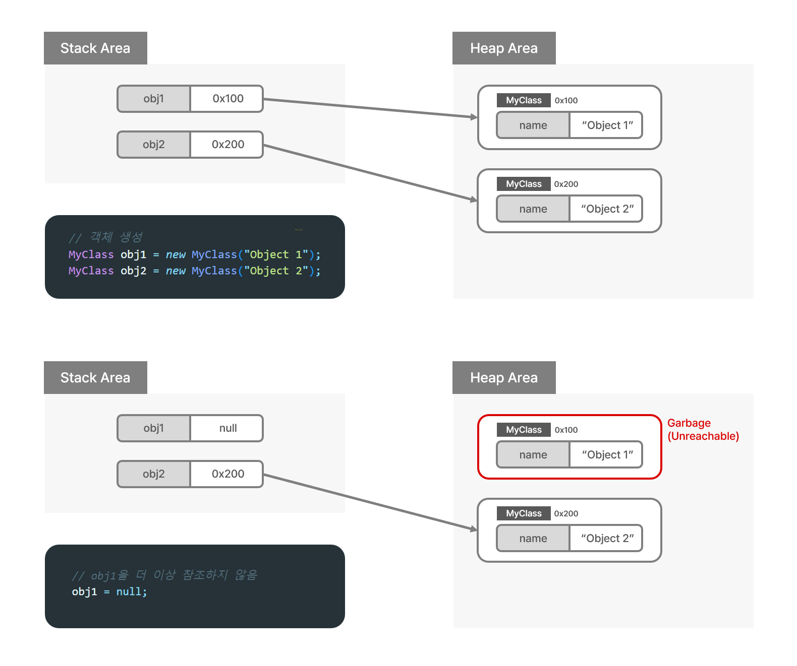
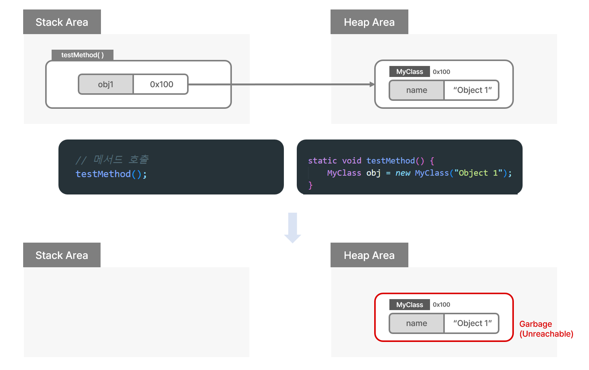

# Garbage Collection

<details>
<summary><h3>📑목차</h3></summary>
<div markdown="1">

- [Java](#java)


</div>
</details>
<br>

# Garbage Collection (가바지 컬렉션)
java의 **Garbage Collection(GC)** 이란 **메모리 관리를 자동화**하는 메커니즘으로, 프로그래머가 명시적으로 메모리 할당과 해제를 다루지 않고도 효율적으로 메모리를 관리할 수 있도록 **JVM의 GC가 동작**한다. 자바의 주요 장점 중 하나로 메모리 누수가 발생하는 것을 방지해준다. 

`C`와 `C++`에서 `free()`나 `delete()`와 같은 함수를 통해 명시적으로 직접 메모리를 해제해주어야 하는 것과 비교된다. 

> **💡가비지(Garbage)** <br>
> 직역하면 "쓰레기", "폐기물"을 뜻하며 프로그래밍에선 **더이상 필요하지 않은 (메모리에서 해제되어야 하는) 객체나 데이터**를 의미
>
> 이런 쓸모없는 객체들은 더 이상 프로그램 상에서 **접근 가능한 참조가 없어** 사용되지 않는 상태
>
> **💡가비지 컬렉션** <br>
> **힙 영역**에 동적으로 할당했던 메모리 중 필요 없게 된 메모리 객체를 주기적으로 JVM이 제거해주는 프로세스
>
> Java뿐만 아니라 Python, JS, Go언어, 브라우저 등에서 쓰임

<br>


## Garbage (GC의 처리 대상)

GC의 대상이 되는 **"Garbage"** 가 발생되는 경우부터 살펴보자. **힙 영역**에 존재하는 특정 **객체를 참조할 수 있는 방법이 없어 더 이상 사용할 수 없어진 객체**가 GC의 처리 대상이 되는데, 해당 객체를 가리키던 **참조 변수에 `null`** 이 들어가 연결이 끊기거나 참조 변수가 존재하던 **메서드가 소멸되어 변수가 사라졌을 때** 발생된다.

위에서 말한 참조 관계 말고도, 메서드 영역(클래스 영역)
의 **정적 변수에 의한 참조**나 **힙 내의 다른 객체에 의한 참조** 등 여러 경우가 있을 수 있고 어찌 됐든 특정 객체에 대한 유효한 참조가 없을 때 가비지가 발생한다!

#### [참조하던 변수의 연결이 끊겼을 때]
``` java
public class GarbageExample1 {
    public static void main(String[] args) {
        // 객체 생성
        MyClass obj1 = new MyClass("Object 1");
        MyClass obj2 = new MyClass("Object 2");
        
        // obj1을 더 이상 참조하지 않음
        obj1 = null;
    }
}
```

<p align="center">
    
</p>

<br>

#### [참조하던 변수가 소멸되었을 때]
``` java
public class GarbageExample2 {
    public static void main(String[] args) {
        
        // 메서드 호출
        testMethod();
        
        // testMethod()의 로컬 변수(obj)가 스코프를 벗어나 삭제되며 가비지 발생 
    }

    static void testMethod() {
        MyClass obj = new MyClass("Object 1");
    }
}
```

<p align="center">
    
</p>

> **💡Reachable** <br>
> 특정 객체에 유효한 참조가 **있는** 경우
>
> **💡Unreachable** <br>
> 특정 객체에 유효한 참조가 **없는** 경우 (Garbage)

<br>

## Garbage Collection의 동작 방식

1. **Stop The World (STW)** <br>
GC을 실행하기 위해 JVM이 **어플리케이션의 실행을 중단**하는 작업이다. GC가 실행될 때는 GC를 실행하는 쓰레드를 제외한 모든 쓰레드들의 작업이 중단되고, GC가 작업을 완료하면 다른 쓰레드들의 작업이 다시 진행된다. <br><br>
빈번하게 GC를 실행할 시, 해당 단계(STW)로 인해 프로그램의 성능에 문제가 발생할 수 있으며 보통 GC 최적화 작업인 **GC튜닝**은 이 시간을 단축시키기 위한 고민들로 이루어져 있다.

<br>

2. **Mark and Sweep** <br>
첫 번째 단계에서 모든 작업이 중단되면, GC는 스택의 모든 변수 또는 Reachable 객체를 스캔하며 **각 어떤 객체를 참조하고 있는지 탐색**한다. 그리고 사용되고 있는 메모리를 식별하는데, 이 과정을 `Mark`라고 한다. 이후 `Mark`되지 않는 객체들을 **메모리에서 제거**하는 `Sweep`과정을 진행한다.

<br>

> **💡Mark** <br>
> 사용되는 메모리와 사용되지 않는 메모리를 식별하는 작업
>
> **💡Sweep** <br>
> 사용되니 않는 메모리로 식별된 메모리를 해제하는 작업

<br>

## Garbage Collection을 사용자가 직접 호출할 수 있는가?
물론, Java에서 `System.gc()` 함수를 사용자가 직접 호출할 수 있다. 하지만 해당 메서드를 직접 호출하는 것은 시스템의 성능에 영향을 미치므로 직접 호출하는 것은 지양된다. 

<br>

## Garbage Collection의 장단점

[장점]
- 한정된 메모리를 효율적으로 사용할 수 있게 해줌
- 개발자가 메모리 관리에 신경쓰지 않고 개발에만 집중할 수 있음

[단점]
- 개발자가 메모리 해제 시점을 정확히 알 수 없음
- GC이 동작하는 동안 JVM의 다른 동작들 일시정지 (오버헤드 발생)


* JVM 실행 시 OS가 JVM에게 필요한 메모리 할당해줌