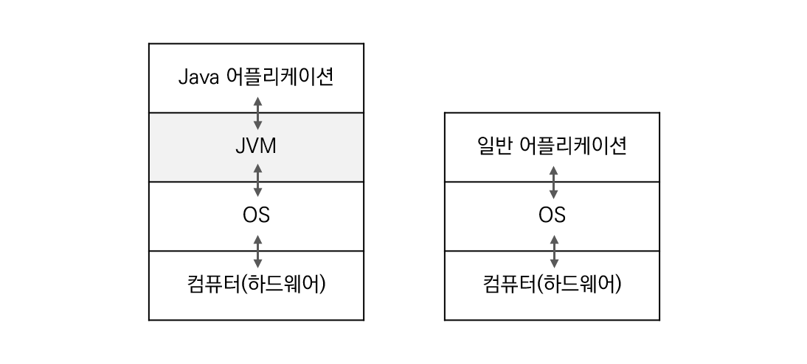

# JVM

<h3>📑목차</h3>

- [선형 자료 구조](#선형-자료-구조)

 

## JVM(Java Virtual Machine)
JVM은 직역하면 자바를 실행하기 위한 가상 기계라고 할 수 있는데, 자바를 실행하기 위한 **가상 컴퓨터**라고 이해하면 좋다. 

여기서 Virtual Machine(가상 컴퓨터)의 의미는 **소프트웨어로 구현된 하드웨어**를 뜻하는 넓은 의미의 용어이다.**자바로 작성된 어플리케이션은 모두 JVM에서만 실행**된다. 

    

일반 다른 어플리케이션 코드는 OS만 거치고(OS종속적) 하드웨어로 전달되는데, Java는 JVM을 한 번 거치기 때문에 운영체제에 독립적이라는 특징을 가지고 있다. 따라서 다른 어플리케이션은 해당 OS에 맞게 변경해야하지만, Java 어플리케이션은 JVM하고만 상호작용을 하기 때문에 다른 OS에서도 프로그램의 변경 없이 실행이 가능하다. 단, JVM은 OS에 종속적이기 때문에 해당 OS에서 실행 가능한 JVM이 필요하다. (주 OS용 JVM 제공) 

"Write once, run anywhere"

하드웨어에 맞게 완전히 컴파일된 상태가 아니고 실행 시에 해석(interpret)되기 때문에 속도가 느리다는 단점 가지고 있다. 하지만 요즘엔 바이트 코드를 하드웨어의 기계로 바로 변환해주는 JIT컴파일러와 향상된 최적화 기술이 적용되어 속도 격차를 많이 줄였다. 

---

## 자바의 컴파일 과정

    

    

1. 자바 소스 코드 `.java` 작성
2. 자바 소스 코드 컴파일 -> 바이트 코드 `.class` 생성
3. JVM 클래스 로더에 바이트 코드 전달
4. 클래스 로더, 동적 로딩 통해 JVM 메모리에 적재
5. 실행 엔진, JVM 메모리에 올라온 바이트 코드 명령어 단위로 실행

 

#### 1. 자바 소스 코드 `.java` 작성
프로그래머가 `.java` 확장자를 가진 자바 소스 코드를 작성함

 

#### 2. 자바 소스 코드 컴파일 → 바이트 코드 `.class` 생성
컴파일러가 작성된 자바 소스 코드를 컴파일한다. 이때 `.class`의 확장자를 가진 바이트 코드 파일이 생성된다. 바이트 코드는 JVM은 이해할 수 있지만, 아직 컴퓨터가 읽을 수 없는 코드이다. 바이트 코드의 각 명령어는 1바이트 크기의 Opcode(명령코드)와 추가 피연산자로 이루어져 있다. 

> **바이트 코드**  
> "특정 하드웨어가 아닌 가상 컴퓨터에서 돌아가는 실행 프로그램을 위한 이진 표현법" - 위키백과  
> -고급 언어로 작성된 소스 코드를 가상 머신이 이해할 수 있는 중간 코드로 컴파일한 것.  
> -가상머신은 바이트 코드를 각 하드웨어 아키텍처에 맞는 기계어로 다시 컴파일 함. 
> -바이트 코드 자체는 인터프리터 언어로 해석될 때는 인터프리터 방식으로 해석한다.  (바이트 코드를 생성하는 것까지가 컴파일)

 

#### 3. JVM 클래스 로더에 바이트 코드 전달
컴파일된 바이트 코드를 JVM의 클래스 로더에게 전달한다.

 

#### 4. 클래스 로더, 동적 로딩 통해 JVM 메모리에 적재
JVM의 클래스 로더는 동적 로딩을 통해 필요한 클래스들을 로딩 및 링크하여 런타임 데이터 영역이라는 JVM의 메모리에 적재한다. 

**[클래스 로더 세부 동작]**
- **로드**: 클래스 파일(바이트 코드)을 가져와 JVM의 메모리에 로드
- **검증**: 자바 언어 명세 및 JVM 명세에 명시된 대로 구성되어 있는지 검사
- **준비**: 클래스가 필요로 하는 메모리를 할당
- **분석**: 클래스의 상수 풀 내 모든 심볼릭 레퍼런스를 다이렉트 레퍼런스로 변경
- **초기화**: 클래스 변수들 적절한 값으로 초기화 (static 필드)

 

#### 5. 실행 엔진, JVM 메모리에 올라온 바이트 코드 명령어 단위로 실행

실행 엔진은 JVM 메모리에 올라온 바이트 코드들을 명령어 단위로 하나씩 가져와 실행한다. 이때 2가지 실행 방식이 있다. 

1. **인터프리터**: 바이트 코드 명령어를 하나씩 읽어 해석하고 실행한다. 하나하나의 실행은 빠르나, 전체적인 실행 속도가 느리다는 단점이 있다. 

2. **Jit 컴파일러**(Just-In-Time Compiler): 느린 인터프리터 방식을 보완하기 위해 도입된 방식으로 바이트 코드 전체를 컴파일하여 기계어로 변경하고 이후에는 해당 메서드를 더이상 인터프리팅하지 않고 기계어로 직접 실행하는 방식이다. 하나씩 인터프리팅하여 실행하지 않고 바이트 코드 전체가 컴파일된 바이너리 코드를 실행하기 때문에 전체적인 실행속도가 빨라진다.

