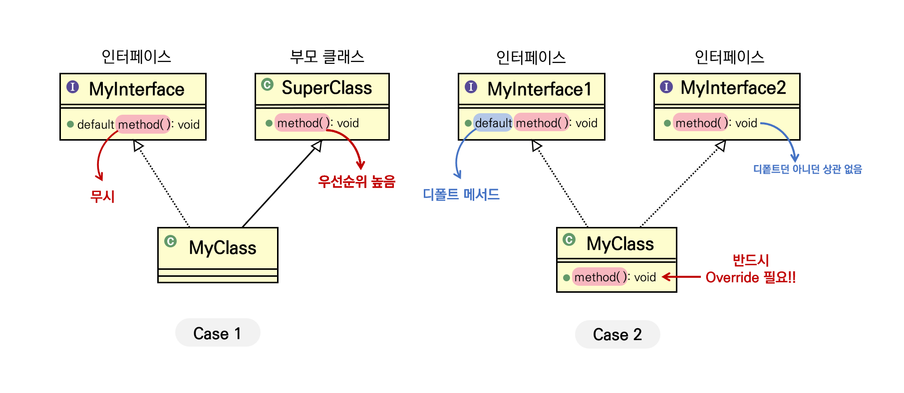

# Abstract, Interface, Generic
<details>
<summary><h3>📑목차</h3></summary>
<div markdown="1">

- [추상클래스 (Abstract)](#추상클래스-abstract)
- [인터페이스 (Interface)](#인터페이스-interface)
    - [인터페이스의 추가적 기능](#인터페이스의-추가적-기능)
        - [default method](#default-method)
            - [메서드 우선순위](#메서드-우선순위)
        - [static method](#static-method)
- [제네릭 (Generics)](#제네릭-generics)
    - [타입 파라미터](#타입-파라미터)

</div>
</details>
<br>

## 추상클래스 (Abstract)
추상 클래스는 **상속 전용 클래스**로, 다른 클래스들이 상속받아 사용할 수 있는 베이스 클래스를 말한다. 추상 클래스는 하나 이상의 **추상 메서드**를 포함하고 있는데, 추상 메서드는 **선언부만 존재**하고 **구현은 존재하지 않는** 메서드이다. 따라서 추상 메서드를 상속받는 **하위 클래스에서 반드시 구현**되어야 한다.

추상 클래스는 구현이 존재하지 않는 메서드가 포함되어 있기 때문에 **직접 객체를 생성할 수 없다**. 하지만 상위 클래스 타입으로 **자식 참조는 가능**하다. 따라서 자식 클래스에게 구현을 강제하게 되는데, 추상 클래스를 상속받은 자식 클래스가 추상 메서드를 재정의하지 않은 경우 해당 자식클래스 또한 추상 클래스로 선언해야 한다.

추상 클래스를 사용하는 이유는 공통된 기능을 상속받는 자식 클래스들에게 일반화하여 제공하기 위함이다. 구현의 강제로 통해 프로그램의 안정성 또한 올라가게 된다. 


**[요약]**
- `abstract` 키워드 사용
- UML상 *이탤릭체*로 표현
- 상속 전용 클래스
- 추상 메서드 존재
- 추상 메서드는 선언부만 존재 (구현부 X)
- 직접 객체 생성 불가
- 일반화된 공통 기능을 상속받는 클래스들에게 제공
- 하위 클래스에게 구현 강제시킴
- 코드 재사용 및 유지 보수성 향상 


<!-- 추상클래스를 사용하지 않은 경우
```java

```

추상클래스를 사용한 경우
```java

```

추상클래스 객체 생성은 못하지만, 참조는 가능
```java

``` -->

<br>

## 인터페이스 (Interface)
추상화된 메서드의 집합을 정의한 것으로 클래스와 달리 다중 상속을 지원한다. 인터페이스틑 최고 수준의 추상화 단계를 가지고 있으며 인터페이스에 속한 일반 메서드는 모두 `abstract` 형태로 구현부 없는 추상 메서드이다. 인터페이스는 클래스가 아니고, 모든 메서드가 추상 메서드로 존재하기 때문에 다중 상속 시 다이아몬드 문제와 같이 모호성 문제가 발생하지 않는다. 

인터페이스의 존재하는 메서드를 다른 클래스에서 사용하기 위해선, `implements` 키워드를 통해 구현할 수 있다. 다중 상속이 가능하기 때문에 한 클래스에서 여러 인터페이스를 구현할 수 있다. 

추상 클래스와 마찬가지로 구현의 강제로 인해 표준화 처리를 할 수 있다. (`abstract` 메서드 사용) 또한 서로 상속 관계 없는 클래스들에게 인터페이스를 통해 관계를 부여하여 다형성을 확장할 수 있다. 

`interface`키워드를 통해 선언하며 클래스가 아니기 때문에 Object 클래스를 상속받지 않고 객체를 생성할 수 없다. 

모든 멤버 변수는 `public static final` 제한자가 붙으며 생략 가능하다. 이는 변하지 않는 상수 값을 가질 수 있다는 의미이다. 모든 멤버 함수는 `public abstract` 제한자가 붙으며 생략 가능하다. 

**[요약]**
- 클래스가 아님
    - Object 상속받지 않음
    - 객체 생성 불가
    - 조상 인터페이스로 구현 객체 참조 가능
- UML상 **점선 화살표**로 표기
- `interface` 키워드 사용해 생성
- `implements` 키워드 사용해 상속 받아 구현 가능
- 다중 상속 지원
- 모든 멤버 변수 → `public static final` (상수 필드)
- 모든 멤버 함수 → `public abstract` (추상 메서드)

<br>

### 인터페이스의 추가적 기능
#### default method
인터페이스에 선언된 구현부가 있는 일반메서드로 추상 메서드가 아니므로 반드시 구현할 필요가 없다. 메서드 선언부어 `default` 제어가 추가 후 구현부 작성 (접근 제한자는 `public`으로 한정)

기본에 인터페이스 기반으로 동작하는 라이브러리에 새로운 인터페이스를 추가할 때, 기존 방식대로 추상 메서드 형태로 추가하게 되면 해당 인터페이스의 모든 구현체들이 새 메서드를 다시 오버라이드 해야한다는 번거로움이 존재했다. 이런 불편함을 방지하고자 Java8 버전 이후부터 `default`메서드(반드시 구현X)를 사용할 수 있게 되었다.

이와 같은 변화로 인해 사실상 일반 메서드와 추상 메서드가 함께 존재하는 추상클래스와 거의 같은 기능을 제공하게 된 셈이다. 

또한 Java7 버전까지는 인터페이스의 모든 메서드가 추상 메서드였기 때문에 여러 인터페이스를 구현해도 메서드 간 충돌이 일어나지 않았는데, default 메서드 도입 후 동일한 이름을 갖는 구현부 있는 메서드끼리 충돌이 일어날 수 있다. 따라서 충돌시 해결할 수 있는 우선순위가 필요하게 됐다.

#### 메서드 우선순위

<p align="center">
    
</p>

**[super class 메서드 VS 인터페이스 default 메서드]** <br>
→ `super class 메서드`가 우선 <br>
→ `default 메서드` 무시

**[인터페이스 간 충돌]** <br>
→ 하나의 인터페이스에서 `default 메서드` 제공 <br>
→ 다른 인터페이스에서도 같은 이름 메서드 존재 (`default` 상관없이) <br>
→ **반드시 오버라이드해서 충돌 해결!**


<br>

#### static method
일반 static 메서드와 마찬가지로 메모리에 미리 올라가 별도의 객체가 필요 없는 메서드를 말하는데, Java8 버전부터 인터페이스에서 사용할 수 있게 되었다. 구현체 클래스에서 오버라이드할 필요 없이 인터페이스 이름으로 메서드에 접근할 수 있다. 

```java
interface MyInterface{
    static void staticMethod(){
        System.out.prinln("Static 메서드");
    }
}

public class Test{
    public static void main(String[] args){
        //인터페이스 이름으로 바로 접근 가능
        MyInterface.staticMethod();
    }
}
```

<br>

### 제네릭 (Generics)
자바에서 **컴파일 시간에** 타입을 안정적으로 체크하고 타입 안정성을 확보하는 기능을 말한다. 제네릭을 사용하면 클래스 또는 인터페이스 선언 시 `<>`에 타입 파라미터를 적어 미리 사용할 타입을 명시할 수 있다. 이로 인해 형 변환이 필요 없어 객체 타입의 안전성 향상 및 번거로움이 감소된다.
 
일반적으로 타입에 대한 체크를 런타임시 진행하는데, **제네릭을 사용하면** 다양한 타입의 객체를 다루는 메서드나 컬레션 클래스에서 **컴파일시 (런타임보다 빠르게) 체크할 수 있다**. `<T>`와 같이 타입 파라미터 라벨을 달아준다.

```java
public class ClassName {}               // Raw Type 클래스
public class ClassName<T> {}            // Generic Type 클래스
public interface InterfaceName<T> {}    // Generic Type 인터페이스
```

<br>

예를 들어 아래 `GenericBox`라는 클래스를 제네릭 타입으로 선언했다고 가정하자. 이때 `<>` 안에 있는 `T`는 어떤 특정 타입을 말한다. 따라서 `GenericBox`를 생성할 때, `GenericBox<Integer>`라고 작성하면 `GenericBox`안에 있는 `some`의 타입은 `Integer`로 지정되며 `getSome()`, `setSome()` 함수에서 각 반환값과 매개변수 타입이 `Integer`로 설정된다. 

```java 
// Generic Type의 클래스 선언
// 여기서 T는 "어떤" 타입을 의미한다.
class GenericBox<T> {
    private T some;

    public T getSome(){
        return some;
    }

    public void setSome(T some){
        this.some = some;
    }
}
```

#### 타입 파라미터
제네릭 타입의 클래스나 인터페이스 또는 메서드를 정의할 때 `<>` 안에 임의의 타입을 적어 넣는데, 실제 사용될 타입에 대한 자리 표시자 역할을 한다. 변수 이름과 같이 아무거나 적어도 되는데, 보통 관례적으로 특정 대문자 하나가 사용된다. 각 대문자가 의미하는 바는 아래와 같다.

`T` : reference **T**ype <br>
`E` : **E**lement <br>
`K` : **K**ey <br>
`V` : **V**alue <br>


