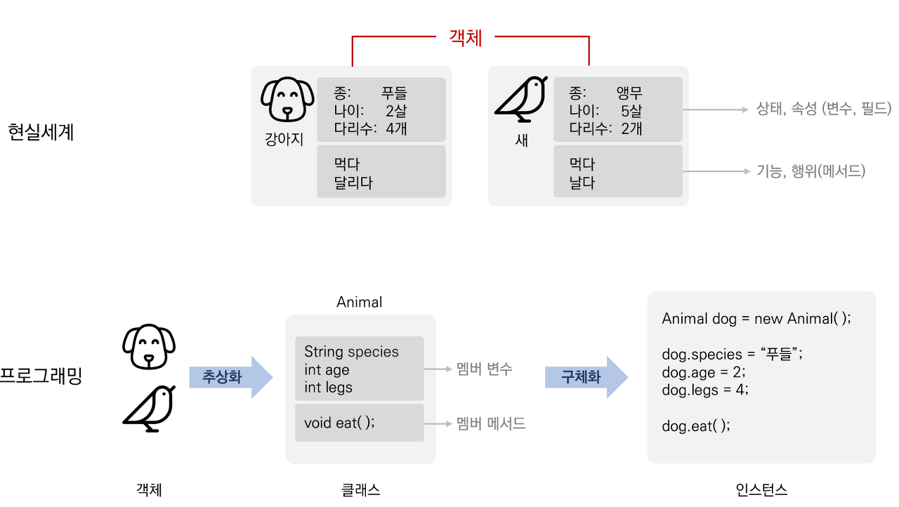
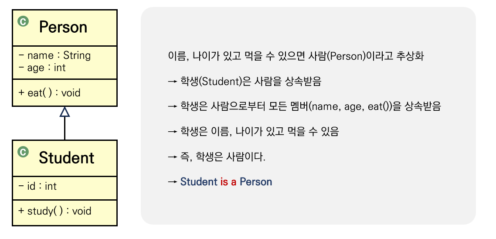
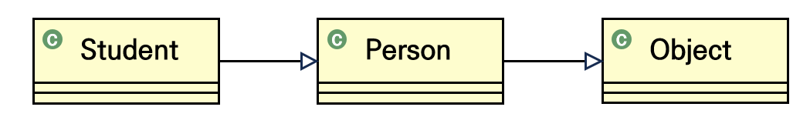

# 객체지향의 특징과 원칙
<details>
<summary><h3>📑목차</h3></summary>
<div markdown="1">

- [객체란?](#객체란)
- [객체 지향 프로그래밍](#객체-지향-프로그래밍-object-oriented-programming-oop)
    - [객체 지향 언어의 장점](#객체-지향-언어의-장점)
- [객체 지향 프로그래밍의 특징](#객체-지향-프로그래밍의-특징-oop-is-a-pie)
    - [1️⃣ 추상화](#1️⃣-추상화abstraction)
    - [2️⃣ 상속](#2️⃣-상속-inheritance)
    - [3️⃣ 다형성](#3️⃣-다형성-polymorphism)
    - [4️⃣ 캡슐화, 데이터 은닉과 보호](#4️⃣-캡슐화-데이터-은닉과-보호-encapsulation)
- [객체 지향의 원칙](#객체-지향의-원칙-solid)
    - [1️⃣ 단일 책임 원칙](#1️⃣-단일-책임-원칙-srp-single-responsibility-principle)
    - [2️⃣ 개방-폐쇄 원칙](#2️⃣-개방-폐쇄-원칙ocp-open-closed-principle)
    - [3️⃣ 리스코프 치환 원칙](#3️⃣-리스코프-치환-원칙-lsp-liskov-substitution-principle)
    - [4️⃣ 인터페이스 분리 원칙](#4️⃣-인터페이스-분리-원칙-isp-interface-segregation-principle)
    - [5️⃣ 의존 역전 원칙](#5️⃣-의존-역전-원칙-dip-dependency-inversion-principle)


</div>
</details>
<br>

## 객체란?
객체 지향에 대해 알아보기 전에 **"객체"** 에 대해 알아보자. 객체(客體)라는 단어를 한자로 풀어보면 손 객(客) 자를 쓰며 '손님'이라는 뜻을 가지고 있다. 반대말은 주인 주(主) 한자를 쓰는 **"주체"** 라는 단어인데, 객체는 주체가 아닌 것을 의미하며 **주체가 활용하는 대상**이라는 의미다. **실제 세계에 존재하는 모든 사물**이 객체가 될 수 있고 이 **객체는 프로그래밍의 대상**이 된다.

<br>

## 객체 지향 프로그래밍 (Object-Oriented Programming, OOP)
객체 지향 이론의 기본 개념은 **"실제 세계는 사물(객체)로 이루어져 있으며, 발생하는 모든 사건들은 사물 간의 상호작용이다."**라고 표현할 수 있는데, 객체 지향 프로그래밍은 이런 기본 개념을 바탕으로 **실제 세계를 컴퓨터 속에 옮겨 구현하는 것**을 말한다. 즉, 실제 세계의 모든 것들을 객체화하여 컴퓨터 속에 프로그래밍하는 것을 말한다. 블록 형태의 모듈화 된 프로그래밍을 통해 코드 간에 서로 관계를 맺어 보다 유기적으로 프로그램을 구성할 수 있다.


### 객체 지향 언어의 장점
**✅ 코드 재사용성 높음** <br>
새로운 코드를 작성할 때 기존의 코드 이용하여 쉽게 작성할 수 있음

**✅ 코드의 관리가 용이** <br>
코드 간의 관계를 이용해 적은 노력으로 쉽게 코드를 변경 가능

**✅ 신뢰성 높은 프로그래밍 가능** <br>
제어자와 메서드를 이용해 데이터 보호하고 코드의 중복을 제거하여 코드 불일치로 인한 오동작 방지
 
<br>

## 객체 지향 프로그래밍의 특징 (OOP is A PIE)
객체 지향 프로그래밍은 4가지 특징을 가지고 있는데 각 특징의 앞 글자를 따서 `OOP is A PIE`라고 줄여 부르기도 한다.

<p align="center">
    
</p>

<br>

### 1️⃣ 추상화(Abstraction)

>**추상** <br>
> 여러 가지 사물이나 개념에서 **공통되는 특성이나 속성 따위를 추출하여 파악**하는 작용.
 

'추상'이란 단어의 사전적 의미는 위와 같은데, 프로그래밍적으로 생각해보면 **실제로 존재하는 사물(객체)의 공통된 특징을 묶어 하나의 클래스로 정의**하는 것을 추상화라고 한다. 아래 그림의 예시처럼 현실 세계에 강아지와 새라는 객체가 존재할 때, 이들의 공통적인 특징이나 행동들을 추출하여 `Animal`이라는 클래스로 정의하는 것이 추상화 과정이다. 이렇게 정의된 클래스는 **구체화 과정**을 거쳐 프로그램의 `객체(instance)`가 되어 활용된다. 추상화에서 객체의 공통된 상태와 기능을 추출하는 과정은 프로그램의 특성에 맞게 불필요한 정보는 숨기고 중요한 정보만 가져와 정의한다.

<p align="center">
    
    <br>
    <small>현실세계의 객체를 추상화, 구체화하여 프로그래밍의 인스턴스로 만드는 과정</small>
</p>

<br>

### 2️⃣ 상속 (Inheritance)
**기존의 클래스를 재사용하여 새로운 클래스를 정의**하는 것을 말한다. 상속을 이용하면 코드의 **재사용성을 높이고 코드를 공통으로 관리**할 수 있기 때문에 코드의 추가 및 변경이 용이하다. 자바에서는 `extneds` 키워드를 사용해 상속을 구현하며 두 클래스가 서로 상속 관계에 있을 때 상속해 주는 클래스를 **조상 클래스(부모클래스)**라고 하며 상속받는 클래스를 **자손 클래스(자식 클래스)**라고 한다. 상속 관계는 UML 표현으로 속이 빈 실선 화살표를 사용한다. 상속 관계는 `is a 관계`라고도 표현하는데, 부모의 모든 멤버를 자식이 가지고 있으므로 **"자식 is a 부모"** 라고 나타낼 수 있다.


<p align="center">
    
    <br>
    <small>학생과 사람은 상속관계</small>
</p>

<br>

### 3️⃣ 다형성 (Polymorphism)
**하나의 객체가 여러 형태(타입)를 가질 수 있는 성질**을 말한다. 자바에서는 **한 타입의 참조변수로 여러 타입의 객체를 참조**할 수 있도록 하여 다형성을 구현하였다. 즉, 상속 관계에 있을 때 **조상 클래스의 참조변수로 자식 클래스 객체를 참조**할 수 있다. 이런 성질을 이용하면 여러 종류의 객체를 하나의 배열로 다룰 수 있고, 메서드의 매개변수로 여러 타입의 객체를 받아 올 수 있다. 이뿐만 아니라 **메서드의 오버로딩, 오버라이딩을 통해 같은 모양의 메서드가 여러 다른 기능을 하는 것도 다형성의 예시**로 들 수 있다.

<p align="center">
    
    <br>
    <small>Student는 Person을 상속받고 Person은 Object를 상속받는 관계</small>
</p>

```java
Student student = new Student();    //객체 생성

Student s = student;            // 같은 타입 클래스로 객체 참조 가능
Person p = student;            // 부모 타입 클래스로 객체 참조 가능
Object o = student;            // 조상 타입 클래스로 객체 참조 가능
```

<br>

### 4️⃣ 캡슐화, 데이터 은닉과 보호 (Encapsulation)
클래스 내부의 **멤버 변수와 메서드를 하나의 캡슐**로 만들어 **외부로부터 보호**하는 것을 말한다. 내부의 정보를 외부로부터 보호하는 이유는 외부에 노출되어선 안 되거나 불필요한 정보들을 내부적으로만 사용하게 하여 정보를 은닉하기 위함이다. 자바에선 **접근 제어자**를 이용해 외부로부터의 접근을 필요에 따라 차단한다.

예를 들어, 한 클래스에 있는 멤버 변수를 외부에서 함부로 수정할 수 없도록 하고 싶다면, 해당 변수를 `private`으로 설정하여 접근을 클래스 내부에서만 가능하게 만든다. 그런 후 외부에서 정보의 수정이나 조회가 필요하다면 공개된 특정 메서드(ex. `setter`, `getter`)를 통해서만 가능하게 하여 무분별한 접근이 불가하도록 정보를 보호한다.


 *참고: Java의 정석

 <br>

## 객체 지향의 원칙 (SOLID)
객체지향 프로그래밍을 설계할 때 지켜야 하는 5대 원칙(**SOLID 원칙**)은 `SRP`(단일 책임 원칙), `OCP`(개방-폐쇄 원칙), `LSP`(리스코프 치환 원칙), `ISP`(인터페이스 분리 원칙), `DIP`(의존 역전 원칙)로 이루어져 있다. SOLID 원칙을 철저히 지키면 **코드의 변경, 유지보수, 확장**이 용이한 소프트웨어를 개발할 수 있다. 

<p align="center">
    
</p>


<br>

### 1️⃣ 단일 책임 원칙 (SRP: Single Responsibility Principle)
<p align="center"><b>"객체는 오직 하나의 책임을 가져야 한다"</b></p>

모든 클래스는 각각 **하나의 책임만** 가져야 하며, 각 클래스는 그 책임을 **완전히 캡슐화**해야 한다. 즉, **클래스가 수정되는 이유는 단 하나**여야 한다는 것을 의미한다. 단일 책임 원칙은 클래스의 목적을 명확히 함으로써 구조가 난잡해지거나 수정 사항이 불필요하게 넓어지는 것을 예방하고 기능을 명확히 분리할 수 있다. 

> 사칙 연산 함수를 가지고 있는 **"계산 클래스"** 는 오직 **사칙 연산에 대한 책임**만 갖는다. 수정이 필요한 경우는 오직 사칙 연산 함수와 관련된 문제일 뿐, 다른 목적의 로직으로 인해 이 클래스가 수정될 이유는 없어야 한다.

<br>

### 2️⃣ 개방-폐쇄 원칙(OCP: Open-Closed Principle)
<p align="center"><b>"객체는 확장에 대해선 개방적이고, 수정에 대해선 폐쇄적이어야 한다"</b></p>

기존의 코드를 변경하지 않으면서(closed), 기능을 추가할 수 있도록(Open) 설계되어야 한다는 원칙을 말한다.

<br>

### 3️⃣ 리스코프 치환 원칙 (LSP: Liskov Substitution Principle)
<p align="center"><b>"자식 클래스는 언제나 자신의 부모 클래스를 대체할 수 있다"</b></p>

즉, 부모 클래스가 들어갈 자리에 자식 클래스가 와도 계획대로 잘 작동해야 한다. **상속**의 본질인데, 이를 지키지 않으면 부모 클래스 본래의 의미가 변해 `is-a`관계가 망가져 다형성을 지킬 수 없게 된다.

자식클래스는 부모 클래스의 책임을 무시하거나 재정의하지 않고 확장만 수행하도록 해야 LSP를 만족한다.

<br>

### 4️⃣ 인터페이스 분리 원칙 (ISP: Interface Segregation Principle)
<p align="center"><b>"클라이언트에서 사용하지 않는 인터페이스에 의존하지 않아야 한다"</b></p>

한 클래스는 자신이 사용하지 않는 인터페이스는 구현하지 말아야 한다. 즉, 인터페이스는 클라이언트가 필요한 기능만 제공해야 하며, 하나의 일반적인 인터페이스보다 여러개의 구체적인 인터페이스가 낫다. 

<br>

### 5️⃣ 의존 역전 원칙 (DIP: Dependency Inversion Principle)
<p align="center"><b>"추상성이 높은 고수준의 클래스는 구체적인 저수준의 클래스에 의존해선 안 된다"</b></p>

의존 관계를 맺을 때 변화하기 쉬운 것 또는 자주 변화하는 것보다 변화하기 어려운(거의 변화가 없는) 것에 의존한다는 원칙이다. 구체적인 클래스보단 인터페이스나 추상 클래스와 관계를 맺는 것이 좋다. 

> **고수준 클래스(고수준 모듈)** <br>
> 추상성이 높고 안정적인 모듈로 시스템의 핵심 비즈니스 로직이나 기능을 구현하는 모듈을 말한다. 구체적인 세부 사항에 직접적으로 의존하지 않아야 하며 추상화된 인터페이스나 추상 클래스에 의존해야 한다. 
>
> **저수준 클래스(저수준 모듈)** <br>
> 구체적이고 안정성이 떨어지는 모듈로 시스템의 세부 구현을 담단한다. 데이터베이스 엑세스, 파일 입출력, 네트워크 통신 등과 같은 세부 사항을 처리한다. 이 모듈을 고수준 모듈의 요구 사항에 따라 구체적인 방식으로 동작한다.