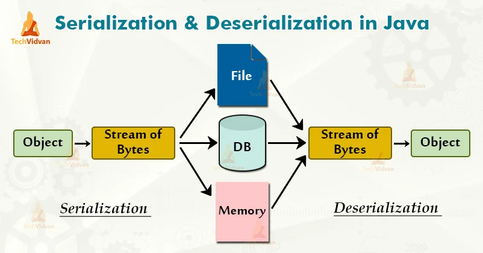

# Serialization & Deserialization

## 직렬화 Serialization

직렬화란 자바 시스템 내부에서 사용되는 객체 또는 데이터를 외부의 자바 시스템에도 사용할 수 있도록 byte 형태로 데이터를 변환하는 기술입니다. <br>
각 PC는 OS마다 서로 다른 가상 메모리 주소 공간을 갖기 때문에 Reference Type의 데이터들은 인스턴스를 전달 할 수 없습니다. <br>
따라서 이런 문제를 해결하기 위해 주소값이 아닌 Byte 형태로 직렬화된 객체 데이터를 전달해야 합니다. <br>
<br>
직렬화된 데이터들은 모두 Primitive Type이 되고, 이는 파일 저장이나 네트워크 전송 시 파싱이 가능한 유의미한 데이터가 됩니다. <br>
따라서 전송 및 저장이 가능한 데이터로 만들어주는 것이 바로 직렬화입니다. <br>
<br>
`java.io.Serializable` 인터페이스 구현으로 직렬화, 역직렬화가 가능합니다. <br>
ex. JVM에 상주하는 객체 데이터를 영속화할 때, Servlet Session, Cache, Java RMI(Remote Method Ivocation)

```java
@Entity
@AllArgsConstructor
@toString
public class Post implements Serializable {
private static final long serialVersionUID = 1L;

private String title;
private String content;

Post post = new Post("제목", "내용");
byte[] serializedPost;
try (ByteArrayOutputStream baos = new ByteArrayOutputStream()) {
    try (ObjectOutputStream oos = new ObjectOutputStream(baos)) {
        oos.writeObject(post);

        serializedPost = baos.toByteArray();
    }
}
```

`ObjectOutputStream`을 통해 직렬화하여 Byte로 변환된 값을 저장합니다. <br>

```
💡 serialVersionUID를 직접 설정하는 이유
serialVersionUID는 선언하지 않아도 자동으로 해시값이 할당됩니다.
직접 설정한 이유는 클래스 멤버 변수가 변경되면 serialVersionUID 값 또한 변경되기 때문에, 역직렬화 시 Exception이 발생할 수 있기 때문입니다.
따라서 개발자가 직접 관리해야 클래스의 변수가 변경되어도 직렬화에 문제가 발생하지 않게 됩니다.
```

## 역직렬화 Deserialization

역직렬화란 직렬화된 데이터를 받는 쪽에서 다시 객체 데이터로 변환하기 위한 작업을 말합니다. <br>
직렬화된 바이트 형태의 데이터를 객체로 변환해서 JVM으로 상주시키는 형태의 기술입니다. <br>
직렬화 대상이 된 객체의 클래스가 class path에 존재해야 하고 `import` 되어 있어야 합니다. <br>
자바 직렬화 대상 객체와 동일한 serialVersionUID를 가지고 있어야 합니다. <br>

```java
try (ByteArrayInputStream bais = new ByteArrayInputStream(serializedPost)) {
    try (ObjectInputStream ois = new ObjectInputStream(bais)) {

        Object objectPost = ois.readObject();
        Post post = (Post) objectPost;
    }
}
```

`ObjectOutputStream`으로 Byte의 값을 다시 객체에 저장하여 역직렬화를 진행합니다. <br>
