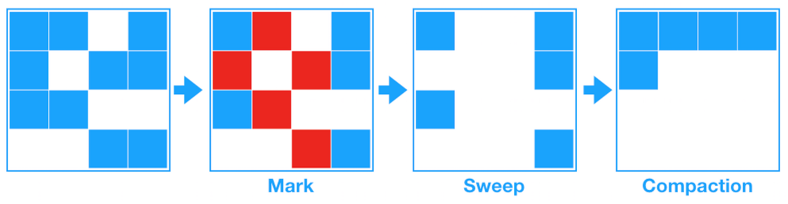

## Garbage Collection

Java는 C, C++ 언어와 달리 개발자가 명시적으로 객체를 해제할 필요가 없습니다.<br>
Java에서는 JVM(Java Virtual Machine)이 구성된 JRE(Java Runtime Environment)가 제공됩니다. <br>
JVM에서 Garbage Collection을 수행하여 사용하지 않는 객체를 메모리에서 삭제하는 작업을 하게 됩니다. <br>

```
💡 stop-the-world
GC를 실행하기 위해 JVM이 애플리케이션 실행을 멈추는 것입니다.
어떤 GC 알고리즘을 사용하더라도 이는 발생하게 되는데, 대개의 경우 GC 튜닝은 이 시간을 줄이는 것이 중요합니다.
```

다음과 같은 경우에 GC의 대상이 됩니다.

1. 객체가 Null인 경우
2. 블럭 실행 종료 후, 블럭 안에서 생성된 객체
3. 부모 객체가 Null인 경우, 포함하는 자식 객체

```
💡 GC 메모리 해제 과정
1. Marking: 프로세스는 마킹을 호출하여 메모리가 사용되는지 아닌지 찾아냅니다. 모든 오브젝트가 스캔되기 때문에 많은 시간이 소모됩니다.
2. Mormal Deletion: 참조되지 않는 객체를 제거하고 메모리를 반환합니다. 메모리 Allocator는 반환되어 비어진 블럭의 참조 위치를 저장해 두었다가 새로운 오브젝트가 선언되면 할당되도록 합니다.
3. Compacting: 퍼포먼스 향상을 위해 참조되지 않는 객체를 제거하고 남은 객체들을 묶음으로서 새로운 메모리 할당 시 더 쉽게 빠르게 진행될 수 있도록 합니다.
```

### Weak Generational Hypothesis

위 GC 메모리 해제 과정과 같이 모든 객체를 Mark & Compack 하는 JVM은 비효율적입니다. <br>
아래 그래프에서 Y축은 할당된 바이트의 수, X축은 바이트가 할당될 때의 시간을 나타냅니다. <br>
<br>
위 그래프와 같이 시간이 갈수록 적은 객체만 남는 다는 것이 약한 세대 가설입니다. <br><br>

신규로 생성한 객체의 대부분은 금방 사용하지 않는 상태가 되고, 오래된 객체에서 신규 객체로의 참조는 매우 적게 존재한다는 가설입니다. <br>
이 가설에 기반하여 자바는 Young 영역과 Old 영역으로 메모리를 분할하여<br>
신규로 생성되는 객체는 Young 영역에, 오랫동안 살아남은 객체는 Old 영역에 보관합니다. <br>

### Generational Gabage Collection

JVM의 메모리는 총 class, stack, heap, native method, PC, 5가지 영역으로 나뉘는데, GC는 힙 메모리만 다룹니다. <br><br>
<br>

1. Young Generation 영역 <br>
   새롭게 생성한 객체가 위치하는 곳으로 많은 객체가 생성되었다가 사라지는 영역입니다. <br>
   이 영역에서 객체가 사라질 때 Minor GC가 발생한다고 말합니다. <br>
2. Old Generation 영역 <br>
   접근 불가능 상태로 되지 않고 Young 영역에서 살아남은 객체가 여기로 복사됩니다. <br>
   Young 영역보다 크게 할당하며 크기가 큰 만큼 GC는 적게 발생합니다. <br>
   이 영역에서 객체가 사라질 때 Major GC 또는 Full GC가 발생한다고 말합니다. <br>
3. Permanent 영역<br>
   Methods Area라고도 하며, JVM이 클래스들과 메소드들을 설명하기 위해 필요한 메타 데이터들을 포함하는 영역입니다. <br>
   JDK8부터는 Meta Space로 교체됩니다. <br>

```
✅ Generational Gabage Collection 과정
1. 새로운 객체가 들어오면 Eden Space에 할당합니다.
2. Eden Space가 가득차면 Minor Garbage Collection이 시작됩니다.
3. 참조중인 객체는 Survivor1 영역으로, 비 참조 객체는 Eden Spacerk Clear될 때 반환됩니다.
4. 다음 Minor GC 때 참조 객체는 Survivor2 영역으로 이동합니다. 참조 객체들이 모두 Survivor2 영역으로 이동하게 되면 Eden Space와 Survivor1 영역은 Clear 됩니다. 주의할 점은 다른 age를 가진 객체들을 한 공간에 가지게 되었다는 것입니다.
5. 다음 Minor GC 에서는 참조 객체들이 Survivor1 영역으로 이동합니다. 이렇게 계속 두 공간을 번갈아가며 사용합니다.
6. Minor GC 후 Survivor 영역이 가득차거나 또는 객체들이 일정한 age threshold를 넘게 되면 Old 영역으로 Promition 됩니다.
7. Major Gsms Old Generation에서 실행 후 Clear 되고 공간이 Compact 됩니다.
```

### [GC의 종류](<https://memostack.tistory.com/229#article-3-1--serial-gc-(-xx:+useserialgc)>)

#### Serial GC (-XX:+UseSerialGC)

가장 단순한 방식의 GC로 싱글 스레드로 동작하기 때문에 그만큼 stop-the-world 시간이 깁니다.<br>
Mark & Sweep & Compact 알고리즘을 사용합니다. <br>

#### ParallelGC (-XX:+UseParallelGC)

Java 8의 default GC로, Young 영역의 GC를 멀티 스레드 방식으로 사용하기 때문에 Serial GC보다 stop-the-world 가 짧습니다. <br>
Old Generation 영역에서만 Full GC(공간 재확보 및 조각 모음) 수행합니다. <br>

#### Parallel Old GC (-XX:+UseParallelOldGC / -XX:+ParallelGCThreads=n)

Old 영역까지 멀티 스레드 방식을 사용하는 것으로 -XX:+ParallelGCThreads=n 옵션을 통해 멀티 스레드 개수를 지정할 수 있습니다. <br>

#### CMS GC(Concurrent Mark Sweep GC)

Stop The World로 Java Application이 멈추는 현상을 줄이고자 만든 GC로, <br>
4 단계로 나누어 Reacable 한 객체를 한번에 찾지 않고 나눠서 찾는 방식을 사용합니다. <br>

1. Initial Mark: GC Root가 참조하는 객체만 마킹합니다. (stop-the-world 발생)
2. Concurrent Mark: 참조하는 객체를 따라가며, 지속적으로 마킹합니다. (stop-the-world 없이 수행)
3. Remark: concurrent mark 과정에서 변경된 사항이 없는지 다시 한번 마킹하며 확정하는 과정을 진행합니다. (stop-the-world 발생)
4. Concurrent Sweep: 접근할 수 없는 객체를 제거하는 과정을 진행합니다. (stop-the-world 없이 수행)

CMS는 Old Generation의 조각 모음(Compaction)을 하지 않으므로 Full GC 시간이 길어지는 문제가 발생합니다. <br>

#### G1 GC (Garbage Frist GC) (-XX:+UseG1GC)

Java 9 이상의 버전에서 default GC로, 현재 GC 중 stop-the-world의 시간이 제일 짧습니다. <br>
CMS GC 를 개선하여 만든 GC로 다른 GC와 다르게 전체 힙 공간을 체스판처럼 `Region` 이라는 영역으로 나누어 관리합니다. <br>
<br>
전체 Heap에 대해서 탐색하지 않고 부분적으로 Region 단위로 탐색하여, 각각의 Region에만 GC가 발생합니다. <br>
Young과 Old 영역의 구분이 없으며, 영역의 참조를 관리할 목적으로 Remember Set을 만들어 사용합니다. (전체 힙의 5% 미만의 크기) <br>
큰 메모리를 가진 멀티 프로세스 시스템에 적합합니다. <br><br>

```
💡 G1 GC 동작 과정
Young 영역(Eden, Survivor)에서는 Young GC가 수행되며 Eden, Survivor 영역 이동
옮기면서 비워진 영역은 사용 가능한 빈 영역으로 되돌림

✅ Full GC 수행 단계
Initial Mark -> Root Region Scan -> Concurrent Mark -> Remark -> Cleanup -> Copy

- Initial Mark
  Old 지역에 존재하는 객체가 참조하는 Survivor 영역 탐색
  STW 발생

- Root Region Scan
  이전 단계에서 찾은 영역에 대한 GC 대상 객체 스캔

- Concurrent Mark
  전체 힙 영역 스캔
  GC 대상 객체가 없는 영역은 이후 단계에서 제외

- Remark
  STW가 발생하며 최종으로 GC 대상에서 제외할 객체 식별

- Cleanup
  STW가 발생하며 제거할 객체가 가장 많은 지역에서 GC 수행
  완료 후, 완전히 비워진 영역을 재사용하기 위해 Freelist에 추가

- Copy
  GC 대상이었지만 Cleanup 단계에서 완전히 비워지지 않은 지역의 남은 객체를 새로운 영역에 복사하여 조각 모음(Compaction) 작업 수행
```
