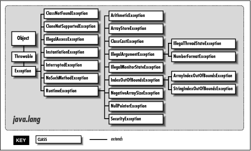

# [Error vs Exception](https://toneyparky.tistory.com/40)

`오류`란 시스템이 종료되어야 할 수준의 상황과 같이 수습할 수 없는 심각한 문제를 의미합니다. <br>
개발자가 미리 예측하여 방지할 수 없습니다. <br><br>
`예외`는 개발자가 구현한 로직에서 발생한 실수나 사용자의 영향에 의해 발생합니다. <br>
오류와 달리 개발자가 미리 예측하여 방지 할 수 있기 때문에 상황에 맞는 예외 처리(Exception Handle)을 해야합니다.<br>

<br>

```java
💡 Throwable
Error와 Exception 모두 자바의 최상위 클래스인 Object를 상속 받습니다.
그리고 그 사이 Throwable이라는 클래스는 이 클래스의 객체에 오류나 예외에 대한 메시지를 담거나,
예외가 연결될 때(Chained Exception) 연결된 예외의 정보들을 기록하는 역할을 수행합니다.
이 Throwable 객체가 가진 정보와 할 수 있는 행위는 getMessage()와 printStackTrace()가 있습니다.
```

## Error

에러(Error)란 컴퓨터 하드웨어의 오동작 또는 고장으로 인해 응용프로그램에 이상이 생겼거나 JVM 실행에 문제가 생겼을 경우 발생하는 것입니다. <br>
시스템 레벨에서 발생하기 때문에 개발자가 미리 예측하여 처리할 수 없기 때문에, 애플리케이션에서 오류에 대한 처리를 신경 쓰지 않아도 됩니다. <br>

<br>

- `StackOverflowError`: 호출의 깊이가 깊어지거나 재귀가 지속되어 stack overflow 발생 시 던져지는 오류입니다.
- `OutOfMemoryError`: JVM이 할당된 메모리의 부족으로 더 이상 객체를 할당할 수 없을 때 던져지는 오류입니다. Garbage Collector에 의해 추가적인 메모리가 확보되지 못하는 상황이기도 합니다.

## Exception

예외(Exception)란 개발자가 구현한 로직에서 발생한 실수나 사용자의 영향에 의해 발생합니다. <br>
컴파일 시 발생할 수 있는 일반 예외 Exception와 실행 중에 발생하는 런타임 예외 RuntimeException로 구분됩니다. <br><br>

<br>

일반 예외는 소스코드를 `.class` 파일로 컴파일하는 과정에서 JVM이 던지는 에러로, 대부분 소스코드 자체의 문법적 오류로 인해 발생합니다. <br>
프로그램 자체에서 처리할 수 있는 방법은 없습니다. <br>
일반 예외의 예로는 `ClassNotFoundException`, `IllegalAccessException`, `NoSuchMethodException`등이 있습니다. <br><br>

- `IllegalArgumentException`: 메서드가 허가되지 않거나 부적절한 argument를 받았을 경우에 던져지는/던질 수 있는 예외입니다.<br>

런타임 예외는 문법적인 오류가 없어 컴파일 시에는 정상적으로 컴파일됐지만 프로그램을 실행하는 과정에서 발생하는 에러를 말합니다. <br>
이는 개발자가 직접 오류를 확인하여 처리해야 합니다. <br>
런타임 예외의 예로는 `NullPointerException`, `ArithmeticException`, `IndexOutOfBoundsException` 등이 있습니다.<br>

- `NullPointerException`: 객체가 필요한 경우인데 응용프로그램이 null을 사용하려고 시도할 경우 던져지는/던질 수 있는 예외입니다.<br>

예외는 오류와 달리 개발자가 미리 예측하여 방지할 수 있기 때문에 상황에 맞는 예외처리가 필요합니다. <br>

## [예외 처리](https://reakwon.tistory.com/155) Exception Handle

### try... catch... finally

예외가 발생했을 때 `try`... `catch`... `finally` 라는 키워드로 예외를 처리하거나 메소드를 호출한 곳으로 던질 수 있습니다. <br>

- `try`: 예외가 발생한 만한 코드가 작성됩니다.
- `catch`: 예외가 발생되었을 때 처리하는 동작을 명시합니다. catch 블록은 여러 개가 있을 수 있습니다.
- `finally`: 예외 발생 유무와 상관 없이 공통으로 수행되어야 할 임시 파일의 삭제 등 뒷정리 코드가 작성됩니다.

```java
try {
	// 예외가 발생될만한 코드
} catch(FileNotFoundException e) { // FileNotFoundException이 발생했다면

} catch(IOException e) { // IOException이 발생했다면

} catch(Exception e) { // Exception이 발생했다면

} finally {
	// 어떤 예외가 발생하던 말던 무조건 실행
}
```

### throws

예외를 바로 처리하지 않고 예외를 던져서 어떤 예외가 발생했는지 알리는 용도로 사용합니다. <br>

```java
public static void divide(int a,int b) throws ArithmeticException {
	if(b==0) throw new ArithmeticException("0으로 나눌 수는 없다니까?");
	int c=a/b;
	System.out.println(c);
}
public static void main(String[] ar){
	int a=10;
	int b=0;

	divide(a,b);
}
```

```java
✅ throw vs throws
💡 throw
메서드 내에서 예외를 발생시키는 데 사용됩니다.
throw new FoolException()

💡 thorws
메서드 선언부에서 사용되며, 해당 메서드가 처리하지 않은 예외를 호출자에게 전달함을 나타냅니다.
public void sayNick(String nick) throws FoolException
```
