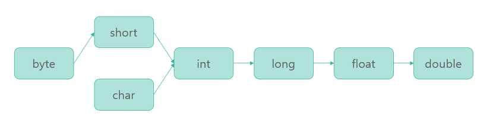

# Promotion & casting

변수의 데이터 타입을 바꿔주는 타입변환의 방식에는 자동 형변환(Promotion)과 강제 형변환(Casting)이 있습니다. <br>
자동 형변환은 묵시적 타입 변환, 강제 형변환은 명시적 타입 변환이라고도 합니다. <br>

## Promotion 묵시적 형변환(자동 형변환)

프로그램 실행 도중에 자동적으로 형변환이 일어나는 것으로(JVM),<br>
아래 코드와 같이 작은 메모리의 크기의 데이터 타입을 큰 메모리 크기의 데이터 타입으로 변환하는 행위를 말합니다. <br>

```java
byte a = 10;
int b = a;
```

자동 형변환이 일어나는 순서는 다음과 같습니다. <br>
<br>
주의할 점은 메모리 크기가 큰 데이터 타입이라도, 타입 범위를 포함하지 못한다면 자동 형변환이 불가능합니다.<br>
특히 long 데이터 타입(8byte)에서 float 데이터 타입(4byte)으로 자동 형변환(Promotion)이 가능합니다. <br>
표현할 수 있는 값의 범위가 float가 더 크기 때문입니다.<br>

## Casting 명시적 타입 변환(강제 형변환)

특정 조건을 갖추지 못했지만 강제로 형변환을 하고 싶을 때 사용하는 방법입니다. <br>

```java
int intValue = 1;
byte byteValue = (byte) intValue;
```

위 코드와 같이 int 데이터 타입(4byte)을 byte 데이터 타입으로 변환하려고 할 때, 아래 그림처럼 앞에 3byte의 공간을 삭제하게 됩니다. <br>
<br>
임의로 공간을 삭제하게 된다면 정상적이지 않을 값이 나올 수 있기 때문에 자동 형변환을 하려고 하면 컴파일 에러가 발생합니다. <br>
프로그래머 책임 하에 값이 정상적일 것이라고 판단하는 경우, 명시적으로 데이터 타입을 표기하여 강제 형변환을 수행할 수 있습니다. <br>

## 형변환 연산

기본적인 사칙연산은 피연산자들의 타입이 같을 경우에만 수행되기 때문에, 서로 데이터 타입이 다를 경우 두 피연산자 중 크기가 큰 타입으로 자동 형변환된 후 연산이 수행됩니다. <br>
크기가 작은 타입의 연산 결과를 얻고 싶을 경우 강제 형변환을 통해 구현할 수 있습니다.<br>
