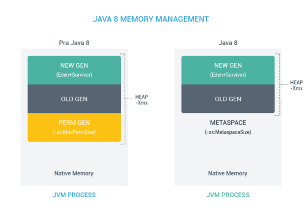

# Java 버전별 특징

| 버전      | 출시년월 | 특징                                                                                 |
| --------- | -------- | ------------------------------------------------------------------------------------ |
| JDK 1.0a2 | 1995.05  | 언어 자체가 정식적으로 발표된 날이며, Oak라는 명칭으로 불리었습니다.                 |
| JDK 1.0   | 1996.01  | 안정화 작업을 거친 1.0.2 버전에서 Java로 이름이 바뀌었습니다.                        |
| JDK 1.1   | 1997.02  | Inner Class, JavaBeans, RMI, Reflection, Claendar 유니코드 지원 등이 추가되었습니다. |

```
💡 JavaBeans 란?
JavaBeans는 자바로 작성된 소프트웨어 컴포넌트를 지칭합니다.

💡 Beans 규약
  1. 기본 생성자가 반드시 존재해야 한다.
  2. 모든 속성은 비공개이다.
  3. 속성에 접근하고 꺼내올 수 있는 getter, setter 메서드를 구성한다.
  4. Serializable을 구현한다.

💡 RMI 란?
Remote Method Invocation의 약자로 분산 애플리케이션을 구축하는 데 사용됩니다.
한 시스템(JVM)에 상주하는 객체가 다른 JVM에서 실행 중인 객체에 액세스, 호출할 수 있도록 도와주는 메커니즘으로, 코드에서는 java.rmi 패키지를 통하여 제공됩니다.
```

| 버전      | 출시년월 | 특징                                                                                                                                         |
| --------- | -------- | -------------------------------------------------------------------------------------------------------------------------------------------- |
| J2SE 1.2  | 1998.12  | Swing GUI, JIT, Collection Framework 등이 추가되었습니다.<br> Java 2 Standard Edition의 약칭으로 J2SE로 표기하며 이 표기는 5까지 사용됩니다. |
| J2SE 1.3  | 2000.03  | HotSpot JVM, JNDI, JPDA, JavaSound 등이 추가되었습니다.                                                                                      |
| J2SE 1.4  | 2002.02  | assert, 정규표현식, JPv6, XML API, JCE, JSSE, JAAS, Java web Start 등이 추가되었습니다.                                                      |
| J2SE 5    | 2004.09  | 버전 앞의 1을 빼고 표기하기 시작했습니다. <br>Generic, Annotation, Comcurrentcy API, Enumeration, Auto Boxing/Unbloxing 등이 추가되었습니다. |
| Java SE 6 | 2006.12  | J2SE에서 Java SE로 표기가 바뀌었습니다. <br> 가비지 컬렉터 G1(Garbage First) GC를 테스트용으로만 사용하도록 추가하였습니다.                  |

```
✅ Garbage Collection
Heap 영역 내에서 unreachable object를 찾아 회수함으로써 메모리 관리 역할을 수행합니다.
```

| 버전      | 출시년월 | 특징                                                                                                                                                                                                                                                                                 |
| --------- | -------- | ------------------------------------------------------------------------------------------------------------------------------------------------------------------------------------------------------------------------------------------------------------------------------------ |
| Java SE 7 | 2011.07  | Diamond Operator <>, switch문에서 String 사용 등이 추가되었습니다.                                                                                                                                                                                                                   |
| Java SE 8 | 2014.03  | 오라클 인수 후 첫 번째 버전으로, Oracle JDK, OpenJDK 2개 버전으로 나뉩니다. <br> Lambda Expression, Method Referense, Interface의 Default Methods, Null 처리 Optional, <br>Clock, ZoneId, LocalDate 등의 날짜와 시간 API, Stream API 등이 추가되었고, PermGen Area가 제거되었습니다. |

```java
💡 Lambda Expression
메소드를 지칭하는 명칭 없이 구현부를 선언하는 익명 메소드 생성 문법으로,
별도의 익명 클래스를 만들어서 선언하던 방식을 람다를 통해 대폭 간소화할 수 있습니다.
함수형 프로그래밍, 스트림 API 그리고 컬럭션 프레임워크의 개선 등에 영향을 주었습니다.
List<List<Integer>> resultList = intList.stream().map(Arrays::asList).collect(Collectors.toList());

💡 Method Reference
특정 메서드만을 호출하는 람다의 축약형으로, 하나의 메서드를 참조하는 람다를 편하게 표현할 수 있는 문법입니다.
(Soccer s) -> s.getGoal() // Lambda
Soccer::getGoal //Method Reference
() -> Thread.currentThread().dumpStack() // Lambda
Thread.currentThread()::dumpStack // Method Reference
(String s) -> System.out.println(s)	 // Lambda
System.out::println // Method Reference

💡 Optional
Optional이라는 구조체를 제공해서 이전보다 간편하게 NPE(Null Pointer Exception) 이슈에 대응할 수 있습니다.
// java8 Optional 이전까지의 null 대응
String value = null;
String result = "";
try {
	result = value.toUpperCase();
} catch (NullPointerException exception) {
	throw new Exception();
}

// java8 Optional 이후의 null 대응
String value = null;
Optional<String> valueOpt = Optional.ofNullable(value);
String result = valueOpt.orElseThrow(Exception::new).toUpperCase();
```

```
✅ Stream API
순차/병렬 작업을 지원하는 어떠한 순차적인 요소입니다.
쉽게 스트림을 데이터 컬렉션 반복을 처리하는 기능입니다.
람다 표현식, 함수형 인터페이스 그리고 메서드 참조를 이용한 최종 산출물입니다.
기존 컬렉션 프레임워크를 이용할 때보다 간결하게 코드 작성이 가능합니다.
병렬처리, 스트림 파이프라인 등을 통해 하나의 문장으로 다양한 처리 기능을 구현 가능합니다.
```



```
💡 PermGen Area 제거
Java8 이전에는 초기 설정 시 PermSize와 MaxPermSize를 설정해주어야 했으나,
Java8부터는 Permanent Generation이 Metaspace로 대체되었습니다.
Metaspace는 런타임 시 메모리 요구 사항에 따라 자체 크기를 조정하며,
필요하다면 MaxMetaspaceSize 매개변수를 설정하여 Metaspace의 양을 조절할 수 있습니다.

📝 Permanent Generation
- Permanent Generation은 Class 혹은 Method Code가 저장되는 영역
- PermGen은 Heap 영역에 속함
- Default로 제한된 크기를 가지고 있음

📝 Metaspace
- Metaspace는 Java 클래스 로더가 현재까지 로드한 Class들의 메타데이터가 저장되는 공간
- JVM에 의해 관리되는 Heap 영역이 아니라 OS 레벨에서 관리되는 Native 메모리 영역에 위치
- Default로 제한된 크기를 가지고 있지 않고, 필요한 만큼 늘어남
```

| 버전       | 출시년월 | 특징                                                                                                                                                                                                           |
| ---------- | -------- | -------------------------------------------------------------------------------------------------------------------------------------------------------------------------------------------------------------- |
| Java SE 9  | 2017.09  | 모듈 시스템 jigsaw, java.net.http Package, Jshell, java.lang.ProcessHandle Package 추가, <br> Diamond Operator 익명 클래스 확장, Interface Private Method, Optional to Stream 기능이 제공됩니다.               |
| Java SE 10 | 2018.03  | Local-Variable Type Interface, Garbage Collector Interface, Thread-Local Handshakes, Root Certificates                                                                                                         |
| Java SE 11 | 2018.09  | Oracle JDK와 OpenJDK가 통합되었으며 Oracle JDK가 유료 모델로 전환되었습니다. <br> HTTP 클라이언트(JEP 321), String 메서드 추가(strip(), isBlank(), lines(), repeat(n)), Lambda 파라미터로 var 사용             |
| Java SE 12 | 2019.03  | switch 문 확장, 가비지 컬렉터 개선, 마이크로 벤치마크 툴 추가, 성능 개선 등의 변경점이 있습니다.                                                                                                               |
| Java SE 13 | 2019.09  | switch문 개선을 위한 yield라는 예약어 추가, Text Block                                                                                                                                                         |
| Java SE 14 | 2020.03  | preview였던 스위치 표현식이 표준화되었으며, record 기능이 preview로 제공됩니다. <br> NullPointerExpceptions은 정확인 어떤 변수가 null인지 설명합니다.                                                          |
| Java SE 15 | 2020.09  | Text-Blocks, Multiline Strings 프로덕션 준비 완료 및 Sealed Classes - preview                                                                                                                                  |
| Java SE 16 | 2021.03  | OpenJDK의 버전 관리가 Mercurial에서 Git으로 바뀌어 OpenJDK 소스를 [GitHub](https://github.com/openjdk/)에서 볼 수 있습니다. <br> Unix-Domation Socket Channels이 지원됩니다. (macOS 및 Windows 10+에서도 지원) |
| Java SE 17 | 2021.09  | RandomGenerator(의사 난수 생성기)를 통해 예측하기 어려운 난수를 생성하는 API가 출시되었습니다.                                                                                                                 |
