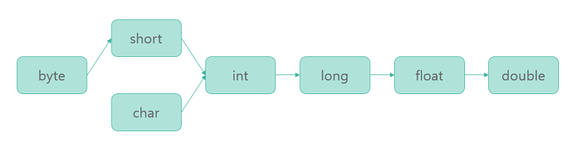
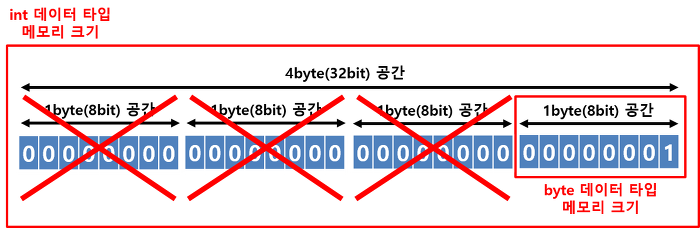
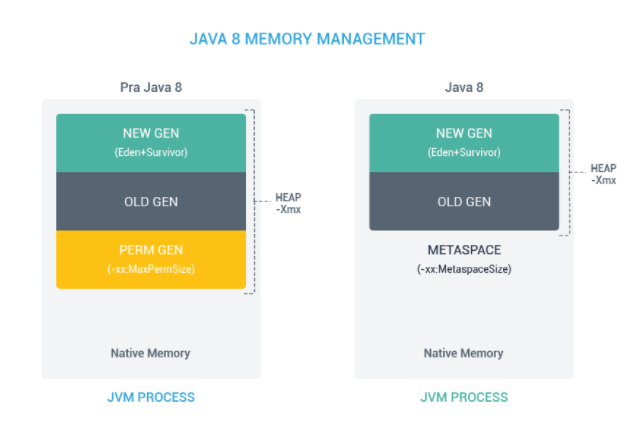

# Java

## 객체 지향 프로그래밍

객체란 현실 세계의 실체 및 개념을 반영하는 상태와 행위를 정의한 데이터의 집합을 의미합니다. <br>
객체 지향 프로그래밍이란 각자의 역할을 지닌 객체들끼리 서로 메시지를 주고받으며 동작할 수 있도록 프로그래밍하는 것을 뜻합니다. <br>
객체를 중심으로 프로그래밍하기 때문에 사람의 관점에서 프로그램을 이해하고 파악하기 쉬우며 재사용성과 확장성, 융통성이 높습니다. <br>
하지만 객체 간의 정보 교환이 메시지 교환으로 일어나기 때무에 많은 오버헤드가 발생할 수 있고 객체의 상태에 따른 예상치 못한 부작용이 발생할 수 있습니다. <br>

### 객체 지향 프로그래밍 5대 설계 원칙: SOLID

1. SRP(Single Responsibility Principle): 단일 책임 원칙으로, 한 클래스에 단 하나의 책임, 기능만 가져야 한다는 원칙입니다.
2. OCP(Open-Closed Principle): 개방-폐쇄 원칙으로, 기존의 코드를 변경하지 않으면서 기능을 추가할 수 있도록 설계해야 한다는 원칙입니다. 확장에 대해서는 개방적(open)이고, 수정에 대해서는 폐쇄적(closed)이어야 한다는 의미를 가집니다.
3. LSP(Liskov Substituition Principle): 리스코프 치환 원칙으로, 자식 클래스는 최소한 부모 클래스의 기능은 수행할 수 있어야 한다는 원칙입니다. 프로그램의 최신 버전에서도 구버전에서 작성한 프로그램을 열 수 있도록 해야한다는 의미를 가집니다.
4. ISP(Interface Segregation Principle): 인터페이스 분리 원칙으로, 인터페이스는 그 인터페이스를 사용하는 클라이언트를 기준으로 분리해야 한다는 원칙입니다.
5. DIP(Dependency Inversion Principle): 의존 역전 원칙으로, 의존 관계 성립 시 추상성이 높은 클래스와 의존 관계를 맺어야 한다는 원칙입니다. 고수준 모듈은 저수준 모듈의 구현에 의존해서는 안된다는 의미로, 예를 들어 사자가 아닌 동물과 의존 관계를 맺어야 한다는 의미를 가집니다.

### 객체 지향의 특징

1. 추상화 Abstraction: 현실의 객체를 추상화하여 클래스를 구성하는 것으로, 객체에서 공통된 속성이나 기능을 추출하는 것을 의미합니다. 중요한 것, 관심 대상인 것만을 강조해서 추출함으로써 프로그램의 복잡도를 관리할 수 있으며, 관점에 따라 추상화의 결과가 달라질 수 있습니다.
2. 캡슐화 Encapsulation: 데이터 은닉과 보호를 위해 데이터를 외부에 직접 노출시키지 않고 메서드를 이용해 보호하는 특징을 말합니다. 내부의 데이터나 함수를 외부에서 참조하지 못하도록 차단하는 개념을 정보 은닉(Information Hiding)이라 하고, 이를 위해 관심있는 데이터와 기능을 모아 패킹한 것을 캡슐화라고 합니다.
3. 다형성 Polymorphism: 하나의 객체를 여러 가지 타입으로 참조할 수 있는 특징입니다. 같은 코드라하더라도 상항에 따라 다른 방식으로 동작하는 성질로 Java에서 대표적으로 Overriding과 Overloading이 있습니다.

```java
✅ Overriding
임의의 클래스가 다른 클래스를 상속 받거나 인터페이스를 구현했을 때, 상위 클래스 또는 인터페이스에 정의되어 있는 메소드를 재정의하여 사용하는 것입니다.
메소드 호출 시 재정의되어 있지 않다면 상위 클래스의 메소드가 호출됩니다. 인터페이스는 오버라이딩이 강제됩니다.

SuperClass object = new SubClass();
object.fun();

✅ Overloading
메소드에 주어진 인자에 따라 동작을 다르게 구현하는 것으로, 코드의 중복이 줄어들고 가독성이 늘어납니다.
메서드 이름과 리턴 타입이 같고 파라미터의 개수, 순서, 타입을 다르게 하여 구현할 수 있게 됩니다.

main(blabla) {
  SuperClass object = new SubClass();
  fun(object);
}

fun(SuperClass super) {
  blabla....
}

fun(SubClass sub) {
  blabla....
}
```

4. 상속 Inheritance: 부모 클래스의 자산을 물려받아 자식을 정의함으로써 코드의 재사용이 가능하다는 특징입니다.

```
💡 클래스
객체를 만들기 위해 상태(field)와 행위(method)를 정의한 틀

💡 메시지
객체 지향 프로그래밍에서 객체들끼리 주고받으며 상호작용하는 것으로, 임의의 객체에게 인자(parameter)를 전달하여 메소드를 호출하고 반환값을 받아 처리합니다.
```

---

## Promotion & casting

변수의 데이터 타입을 바꿔주는 타입변환의 방식에는 자동 형변환(Promotion)과 강제 형변환(Casting)이 있습니다. <br>
자동 형변환은 묵시적 타입 변환, 강제 형변환은 명시적 타입 변환이라고도 합니다. <br>

### Promotion 묵시적 형변환(자동 형변환)

프로그램 실행 도중에 자동적으로 형변환이 일어나는 것으로(JVM),<br>
아래 코드와 같이 작은 메모리의 크기의 데이터 타입을 큰 메모리 크기의 데이터 타입으로 변환하는 행위를 말합니다. <br>

```java
byte a = 10;
int b = a;
```

자동 형변환이 일어나는 순서는 다음과 같습니다. <br>
<br>
주의할 점은 메모리 크기가 큰 데이터 타입이라도, 타입 범위를 포함하지 못한다면 자동 형변환이 불가능합니다.<br>
특히 long 데이터 타입(8byte)에서 float 데이터 타입(4byte)으로 자동 형변환(Promotion)이 가능합니다. <br>
표현할 수 있는 값의 범위가 float가 더 크기 때문입니다.<br>

### Casting 명시적 타입 변환(강제 형변환)

특정 조건을 갖추지 못했지만 강제로 형변환을 하고 싶을 때 사용하는 방법입slek. <br>

```java
int intValue = 1;
byte byteValue = (byte) intValue;
```

위 코드와 같이 int 데이터 타입(4byte)을 byte 데이터 타입으로 변환하려고 할 때, 아래 그림처럼 앞에 3byte의 공간을 삭제하게 됩니다. <br>

임의로 공간을 삭제하게 된다면 정상적이지 않을 값이 나올 수 있기 때문에 자동 형변환을 하려고 하면 컴파일 에러가 발생합니다. <br>
프로그래머 책임 하에 값이 정상적일 것이라고 판단하는 경우, 명시적으로 데이터 타입을 표기하여 강제 형변환을 수행할 수 있습니다. <br>

### 형변환 연산

기본적인 사칙연산은 피연산자들의 타입이 같을 경우에만 수행되기 때문에, 서로 데이터 타입이 다를 경우 두 피연산자 중 크기가 큰 타입으로 자동 형변환된 후 연산이 수행됩니다. <br>
크기가 작은 타입의 연산 결과를 얻고 싶을 경우 강제 형변환을 통해 구현할 수 있습니다.<br>

---

## 자료형

자료를 저장하기 위한 메모리 공간으로, 타입에 따라 크기가 달라집니다. <br>
메모리 공간에 값을 할당 후 사용하게 되며, 기본형과 참조형으로 구분할 수 있습니다. <br>

### 기본형 Primitive type

미리 정해진 크기의 메모리 사이즈로 표현하는 방식으로, 변수 자체에 값을 저장하게 됩니다. <br>
총 8가지의 타입으로 나타낼 수 있으며, 메모리의 Stack 영역에 저장됩니다. <br>

- `boolean`: 논리, `true` / `false`
- `byte`: 정수, 1byte
- `short`: 정수, 2byte
- `int`: 정수, 4byte, default type, 20억
- `long`: 정수, 8byte, `l` or `L`
- `float`: 실수, 4byte, `f`
- `double`: 실수, 8byte, default type
- `char`: 문자, 2byte, `A` 65 `a` 97 `0` 48

위 타입들은 비객체 타입으로 null을 가질 수 없습니다. <br>
null을 사용하려면 Wrapper Class를 활용해야 합니다. <br>

### 참조형 Reference type

크기가 미리 정해질 수 없는 데이터의 표현으로, 실제 값을 참조할 수 있는 주소값을 저장하게 됩니다. <br>
아래 그림과 같이 JVM의 Stack 영역에 존재하는 Frame에 일종의 포인터인 참조값을 가지고 있어 인스턴스 핸들링을 합니다. <br>

데이터의 크기가 가변적, 동적이기 때문에 동적으로 관리되는 메모리의 Heap 영역에 저장되고 더 이상 참조하는 변수가 없을 경우에는 Garbage Collector가 메모리를 해제합니다.<br>
java.lang.Object 클래스를 상속하는 모든 클래스들을 의미하며, 클래스, 인터페이스, 배열, 열거 타입이 있습니다. <br>

---

## Wrapper Class

프로그램에 따라 기본형의 데이터를 객체로 취급해야 하는 경우 사용하는 클래스입니다.<br>

```java
- boolean -> Boolean
- byte -> Byte
- short -> Short
- int -> Integer
- long -> Long
- float -> Float
- double -> Double
- char -> Character
```

래퍼 클래스는 각각의 타입에 해당하는 데이터를 인수로 전달받아 해당 값을 가지는 객체로, 모두 java.lang 패키지에 포함되어 제공됩니다.<br>
산술 연술 연산을 위해 정의된 클래스가 아니므로 인스턴스의 저장된 값을 변경할 수 없고, 단지 값을 참조하기 위해 새로운 인스턴스를 생성하게 됩니다. <br>
기본 타입의 데이터를 래퍼 클래스의 인스턴스로 변환하는 과정을 박싱(Boxing), 래퍼 클래스의 인스턴스에 저장된 값을 다시 기본 타입의 데이터로 꺼내는 과정을 언박싱(Unboxing)이라고 합니다. <br>
JDK 1.5부터 박싱과 언박싱이 필요한 상황에 자바 컴파일러가 이를 자동으로 처리해줍니다. <br>

### Auto Boxing & Auto Unboxing

오토 박싱을 이용하면 new 키워드를 사용하지 않고도 자동으로 인스턴스를 생성할 수 있습니다. <br>
또한 오토 언박싱을 이용하여 인스턴스에 저장된 값을 바로 참조할 수 있습니다. <br>

```java
Integer num = new Integer(17); // 박싱
int n = num.intValue();        // 언박싱
System.out.println(n); // 출력 값: 17


Character ch = 'X'; // Character ch = new Character('X'); : 오토박싱
char c = ch;        // char c = ch.charValue();           : 오토언박싱
System.out.println(c); // 출력 값: X
```

래퍼 클래스의 비교 연산도 오토언박싱을 통해 가능해지지만, 인스턴스에 저장된 값의 동등 여부 판단은 비교 연산자인 동등 연산자(==)를 사용해서는 안 되며, equals() 메소드를 사용해야만 합니다. <br>
래퍼 클래스도 객체이므로 동등 연산자(==)를 사용하게 되면, 두 인스턴스의 값을 비교하는 것이 아니라 두 인스턴스의 주소값을 비교하게 됩니다. <br>
따라서 서로 다른 두 인스턴스를 동등 연산자(==)로 비교하게 되면, 언제나 false 값을 반환합니다. <br>
그러므로 인스턴스에 저장된 값의 동등 여부를 정확히 판단하려면 equals() 메소드를 사용해야 합니다. <br>

---

## Abstract Class, Interface, Generic

### Abstract Class

추상 메소드란 자식 클래스에서 반드시 오버라이딩해야만 사용할 수 있는 메소드를 의미합니다. <br>
추상 메소드가 포함된 클래스를 상속받는 자식 클래스가 반드시 추상 메소드를 구현하도록 하기 위해 사용합니다. <br>
예를 들어 중복 또는 공통적인 부분을 미리 만들어진 것을 사용하고 자신에게 필요한 부분만을 재정의하여 사용함으로써 생산성이 향상되고 배포 등이 쉬워지기 때문입니다. <br>
추상 메소드는 선언부만 존재하면 구현부는 작성하지 않습니다. <br>
이 작성되어 있지 않은 구현부를 자식 클래스에서 오버라이딩하여 사용하게 됩니다. <br>

```java
abstract int fun();
```

위와 같이 선언부만 있고 구현부가 없다는 의미로 선언부 끝에 세미콜론(;)을 추가합니다.<br><br>

[추상 클래스](http://www.tcpschool.com/java/java_polymorphism_abstract)란 하나 이상의 추상 메소드를 포함하는 클래스를 가리켜 추상 클래스하고 합니다. <br>
객체 지향 프로그래밍에서 중요한 특징인 다형성을 가지는 메소드의 집합을 정의할 수 있도록 해줍니다. <br>
즉 반드시 사용되어야 하는 메소드를 추상 클래스에 추상 메소드로 선언해 놓으면, 이 클래스를 상속받는 모든 클래스에서는 이 추상 메소드를 반드시 재정의해야 합니다. <br>
구현의 강제를 통해 프로그램의 안정성을 향상시킬 수 있습니다. <br>

```java
abstract class A {
  ...
  abstract int fun();
  ...
}
```

이러한 추상 클래스는 동작이 정의되어 있지 않은 추상 메소드를 포함하고 있으므로, 인스턴스를 생성할 수 없습니다. <br>
상속을 통해 자식 클래스를 만든 후, 자식 클래스에서 추상 클래스의 모든 추상 메소드를 오버라이딩하고 나서 인스턴스를 생성할 수 있게 됩니다. <br>

```java
abstract class Animal { abstract void cry(); }
class Cat extends Animal { void cry() { System.out.println("냐옹냐옹!"); } }
class Dog extends Animal { void cry() { System.out.println("멍멍!"); } }

public class Polymorphism02 {
    public static void main(String[] args) {
        // Animal a = new Animal(); // 추상 클래스는 인스턴스를 생성할 수 없음.
        Cat c = new Cat();
        Dog d = new Dog();

        c.cry();
        d.cry();
    }
}
```

### Interface

자바에서는 메소드 출처의 모호성 등의 문제로 인해 클래스를 통한 다중 상속이 지원되지 않습니다. <br>
이를 보완하기 위해 인터페이스라는 것을 통해 다중 상속을 지원합니다. <br>
[인터페이스](http://www.tcpschool.com/java/java_polymorphism_interface)란 다른 클래스를 작성할 때 기본이 되는 틀을 제공하면서, <br>
다른 클래스 사이의 중간 매개 역할까지 담당하는 일종의 추상 클래스를 의미합니다. <br>

```
✅ Abstract Class vs Interface
추상 클래스는 추상 메소드뿐만 아니라 생성자, 필드, 일반 메소드도 포함할 수 있지만,
인터페이스는 최고 수준의 추상화 단계로, 오로지 추상 메소드와 상수만을 포함할 수 있습니다.
JDK 8부터 인터페이스에서 default method와 static method를 통해 구현부도 작성할 수 있게 되었습니다.
```

### Generic

[제네릭](http://www.tcpschool.com/java/java_generic_concept)이란 데이터의 타입을 일반화한다는 것을 의미합니다. <br>
클래스나 메소드에서 사용할 내부 데이터 타입을 컴파일 시에 미리 지정하는 방법으로, 컴파일 시 미리 타입 검사를 수행하게 됩니다. <br>
이로써 클래스나 메소드 내부에서 사용되는 객체의 타입 안정성을 높일 수 있고, 반환값에 대한 타입 변환 및 타입 검사에 들어가는 노력을 줄일 수 있습니다. <br><br>

JDK 1.5이전에서는 여러 타입을 사용하는 대부분의 클래스나 메소드에서 인수나 반환값으로 Object 타입을 사용했으나, 반환된 객체를 다시 원하는 타입으로 변환해야 하며 이 때 오류가 발생할 수 있습니다. <br>
이를 보완하기 위해 JDK 1.5부터 도입된 제네릭을 통해 컴파일 시에 미리 타입이 정해져 번거로운 작업을 생략할 수 있게 됩니다. <br><br>

제네릭 클래스의 선언은 다음과 같이 할 수 있습니다. <br>

```java
class MyArray<T> {
    T element;
    void setElement(T element) { this.element = element; }
    T getElement() { return element; }
}
```

`T`를 타입 변수(type variable)라고 하며, 임의의 참조형 타입을 의미합니다.<br>
어떠한 문자를 사용해도 상관없으며, 여러 개의 타입 변수는 쉼표(,)로 구분하여 명시할 수 있습니다.<br>
타입 변수는 클래스에서뿐만 아니라 메소드의 매개변수나 반환값으로도 사용할 수 있습니다. <br><br>

제네릭 클래스를 생성할 때는 다음과 같이 타입 변수 자리에 실제 사용할 타입을 명시해야 합니다. <br>

```java
MyArray<Integer> myArr = new MyArray<Integer>();
```

이렇게 실제 사용할 타입을 명시하면 내부적으로는 정의된 타입 변수가 명시된 실제 타입으로 변환되어 처리됩니다. <br>
타입을 명시할 때 기본 타입을 바로 사용할 수 없고, Wrapper Class를 사용해야 합니다. <br><br>

Java SE 7부터 인스턴스 생성 시 타입을 추정할 수 있는 경우 타입을 생략할 수 있습니다. <br>

```java
MyArray<Integer> myArr = new MyArray<Integer>();
```

제네릭 타입은 컴파일 시 컴파일러에 의해 자동으로 검사되어 타입 변환됩니다. <br>
이 때 코드 내의 모든 제네릭 타입은 제거되어 컴파일된 클래스 파일에는 어떠한 제네릭 타입도 포함되지 않게 됩니다. <br>
제네릭을 사용하지 않는 코드와의 호환성을 유지하기 위해 이렇게 동작됩니다. <br>

```
💡 Java Generic vs C++ Template
- Template에는 int와 같은 기본 타입을 인자로 넘길 수 있지만, Generic에서는 Integer을 대신 사용해야 합니다.
- Template은 인자로 주어진 타입으로부터 객체를 만들어 낼 수 있지만, Generic에서는 불가능합니다.
- Generic Class로 만든 모든 객체는 정부 동등한 타입이지만, Template는 다른 타입 인자 사용 시 서로 다른 타입의 객체입니다.
- Generic은 타입 인자를 특정한 타입이 되도록 제한할 수 있습니다.
- Generic은 정적 메서드나 변수를 선언하는 데 사용할 수 없지만, Template는 가능합니다.
```

---

## Java 컴파일 과정 & JVM

Java는 JVM(Java Virtual Machine)으로 인해 OS에 독립적인 특징을 가집니다.<br>
OS에 독립적으로 실행시킬 수 있는 Java의 컴파일 과정은 다음과 같습니다. <br>
<br>
[사진 출처 및 참고 링크](http://asfirstalways.tistory.com/158)

1. 개발자가 자바 소스코드(.java)를 작성합니다.
2. 자바 컴파일러(Compiler)가 자바 소스파일을 컴파일하고 이때 자바 바이트 코드 파일(.class)이 생성됩니다. 이는 자바 가상 머신이 이해할 수 있는 코드로, 각 명령어는 1byte 크기의 Opcode와 추가 피연산자로 이루어집니다.
3. 바이트 코드를 JVM의 클래스 로더(Class Loader)로 전달합니다.
4. 클래스 로더는 동적 로딩(Dynamic Loading)을 통해 필요한 클래스들을 로딩 및 링크하여 런타임 데이터 영역(Runtime Data Area)인 JVM의 메모리에 올립니다.

```
💡 Class Loader 세부 동작
로드 : 클래스 파일을 가져와서 JVM의 메모리에 로드합니다.
검증 : 자바 언어 명세(Java Language Specification) 및 JVM 명세에 명시된 대로 구성되어 있는지 검사합니다.
준비 : 클래스가 필요로 하는 메모리를 할당합니다. (필드, 메서드, 인터페이스 등등)
분석 : 클래스의 상수 풀 내 모든 심볼릭 레퍼런스를 다이렉트 레퍼런스로 변경합니다.
초기화 : 클래스 변수들을 적절한 값으로 초기화합니다. (static 필드)
```

5. 실행엔진(Execution Engine)은 JVM 메모리에 올라온 바이트 코드들을 명령어 단위로 하나씩 가져와 실행합니다.

```
✅ 인터프리터
바이트 코드 명령어를 하나씩 읽어서 해석하고 실행하는 방식으로, 전체적인 실행 속도가 느리다는 단점을 가집니다.

✅ JIT(Just-In-Time) Compiler
인터프리터의 단점을 보완하기 위해 도입된 방식으로 바이트 코드 전체를 컴파일하여 바이너리 코드로 변경합니다.
이후에는 해상 메서드를 더 이상 인터프리팅하지 않고 바이너리 코드로 직접 실행하게 됩니다.
하나씩 인터프리팅하여 실행하는 것이 아니라 바이트 코드 전체가 컴파일된 바이너리 코드를 실행하는 것이기 때문에 전체적인 실행속도는 인터프리팅 방식보다 빠릅니다.
```

---

## Java 버전별 특징

| 버전      | 출시년월 | 특징                                                                                 |
| --------- | -------- | ------------------------------------------------------------------------------------ |
| JDK 1.0a2 | 1995.05  | 언어 자체가 정식적으로 발표된 날이며, Oak라는 명칭으로 불리었습니다.                 |
| JDK 1.0   | 1996.01  | 안정화 작업을 거친 1.0.2 버전에서 Java로 이름이 바뀌었습니다.                        |
| JDK 1.1   | 1997.02  | Inner Class, JavaBeans, RMI, Reflection, Claendar 유니코드 지원 등이 추가되었습니다. |

```
💡 JavaBeans 란?
JavaBeans는 자바로 작성된 소프트웨어 컴포넌트를 지칭합니다.

💡 Beans 규약
  1. 기본 생성자가 반드시 존재해야 한다.
  2. 모든 속성은 비공개이다.
  3. 속성에 접근하고 꺼내올 수 있는 getter, setter 메서드를 구성한다.
  4. Serializable을 구현한다.

💡 RMI 란?
Remote Method Invocation의 약자로 분산 애플리케이션을 구축하는 데 사용됩니다.
한 시스템(JVM)에 상주하는 객체가 다른 JVM에서 실행 중인 객체에 액세스, 호출할 수 있도록 도와주는 메커니즘으로, 코드에서는 java.rmi 패키지를 통하여 제공됩니다.
```

| 버전      | 출시년월 | 특징                                                                                                                                         |
| --------- | -------- | -------------------------------------------------------------------------------------------------------------------------------------------- |
| J2SE 1.2  | 1998.12  | Swing GUI, JIT, Collection Framework 등이 추가되었습니다.<br> Java 2 Standard Edition의 약칭으로 J2SE로 표기하며 이 표기는 5까지 사용됩니다. |
| J2SE 1.3  | 2000.03  | HotSpot JVM, JNDI, JPDA, JavaSound 등이 추가되었습니다.                                                                                      |
| J2SE 1.4  | 2002.02  | assert, 정규표현식, JPv6, XML API, JCE, JSSE, JAAS, Java web Start 등이 추가되었습니다.                                                      |
| J2SE 5    | 2004.09  | 버전 앞의 1을 빼고 표기하기 시작했습니다. <br>Generic, Annotation, Comcurrentcy API, Enumeration, Auto Boxing/Unbloxing 등이 추가되었습니다. |
| Java SE 6 | 2006.12  | J2SE에서 Java SE로 표기가 바뀌었습니다. <br> 가비지 컬렉터 G1(Garbage First) GC를 테스트용으로만 사용하도록 추가하였습니다.                  |

```
✅ Garbage Collection
Heap 영역 내에서 unreachable object를 찾아 회수함으로써 메모리 관리 역할을 수행합니다.
```

| 버전      | 출시년월 | 특징                                                                                                                                                                                                                                                                                 |
| --------- | -------- | ------------------------------------------------------------------------------------------------------------------------------------------------------------------------------------------------------------------------------------------------------------------------------------ |
| Java SE 7 | 2011.07  | Diamond Operator <>, switch문에서 String 사용 등이 추가되었습니다.                                                                                                                                                                                                                   |
| Java SE 8 | 2014.03  | 오라클 인수 후 첫 번째 버전으로, Oracle JDK, OpenJDK 2개 버전으로 나뉩니다. <br> Lambda Expression, Method Referense, Interface의 Default Methods, Null 처리 Optional, <br>Clock, ZoneId, LocalDate 등의 날짜와 시간 API, Stream API 등이 추가되었고, PermGen Area가 제거되었습니다. |

```java
💡 Lambda Expression
메소드를 지칭하는 명칭 없이 구현부를 선언하는 익명 메소드 생성 문법으로,
별도의 익명 클래스를 만들어서 선언하던 방식을 람다를 통해 대폭 간소화할 수 있습니다.
함수형 프로그래밍, 스트림 API 그리고 컬럭션 프레임워크의 개선 등에 영향을 주었습니다.
List<List<Integer>> resultList = intList.stream().map(Arrays::asList).collect(Collectors.toList());

💡 Method Reference
특정 메서드만을 호출하는 람다의 축약형으로, 하나의 메서드를 참조하는 람다를 편하게 표현할 수 있는 문법입니다.
(Soccer s) -> s.getGoal() // Lambda
Soccer::getGoal //Method Reference
() -> Thread.currentThread().dumpStack() // Lambda
Thread.currentThread()::dumpStack // Method Reference
(String s) -> System.out.println(s)	 // Lambda
System.out::println // Method Reference

💡 Optional
Optional이라는 구조체를 제공해서 이전보다 간편하게 NPE(Null Pointer Exception) 이슈에 대응할 수 있습니다.
// java8 Optional 이전까지의 null 대응
String value = null;
String result = "";
try {
	result = value.toUpperCase();
} catch (NullPointerException exception) {
	throw new Exception();
}

// java8 Optional 이후의 null 대응
String value = null;
Optional<String> valueOpt = Optional.ofNullable(value);
String result = valueOpt.orElseThrow(Exception::new).toUpperCase();
```

```
✅ Stream API
순차/병렬 작업을 지원하는 어떠한 순차적인 요소입니다.
쉽게 스트림을 데이터 컬렉션 반복을 처리하는 기능입니다.
람다 표현식, 함수형 인터페이스 그리고 메서드 참조를 이용한 최종 산출물입니다.
기존 컬렉션 프레임워크를 이용할 때보다 간결하게 코드 작성이 가능합니다.
병렬처리, 스트림 파이프라인 등을 통해 하나의 문장으로 다양한 처리 기능을 구현 가능합니다.
```



```
💡 PermGen Area 제거
Java8 이전에는 초기 설정 시 PermSize와 MaxPermSize를 설정해주어야 했으나,
Java8부터는 Permanent Generation이 Metaspace로 대체되었습니다.
Metaspace는 런타임 시 메모리 요구 사항에 따라 자체 크기를 조정하며,
필요하다면 MaxMetaspaceSize 매개변수를 설정하여 Metaspace의 양을 조절할 수 있습니다.

📝 Permanent Generation
- Permanent Generation은 Class 혹은 Method Code가 저장되는 영역
- PermGen은 Heap 영역에 속함
- Default로 제한된 크기를 가지고 있음

📝 Metaspace
- Metaspace는 Java 클래스 로더가 현재까지 로드한 Class들의 메타데이터가 저장되는 공간
- JVM에 의해 관리되는 Heap 영역이 아니라 OS 레벨에서 관리되는 Native 메모리 영역에 위치
- Default로 제한된 크기를 가지고 있지 않고, 필요한 만큼 늘어남
```

| 버전       | 출시년월 | 특징                                                                                                                                                                                                           |
| ---------- | -------- | -------------------------------------------------------------------------------------------------------------------------------------------------------------------------------------------------------------- |
| Java SE 9  | 2017.09  | 모듈 시스템 jigsaw, java.net.http Package, Jshell, java.lang.ProcessHandle Package 추가, <br> Diamond Operator 익명 클래스 확장, Interface Private Method, Optional to Stream 기능이 제공됩니다.               |
| Java SE 10 | 2018.03  | Local-Variable Type Interface, Garbage Collector Interface, Thread-Local Handshakes, Root Certificates                                                                                                         |
| Java SE 11 | 2018.09  | Oracle JDK와 OpenJDK가 통합되었으며 Oracle JDK가 유료 모델로 전환되었습니다. <br> HTTP 클라이언트(JEP 321), String 메서드 추가(strip(), isBlank(), lines(), repeat(n)), Lambda 파라미터로 var 사용             |
| Java SE 12 | 2019.03  | switch 문 확장, 가비지 컬렉터 개선, 마이크로 벤치마크 툴 추가, 성능 개선 등의 변경점이 있습니다.                                                                                                               |
| Java SE 13 | 2019.09  | switch문 개선을 위한 yield라는 예약어 추가, Text Block                                                                                                                                                         |
| Java SE 14 | 2020.03  | preview였던 스위치 표현식이 표준화되었으며, record 기능이 preview로 제공됩니다. <br> NullPointerExpceptions은 정확인 어떤 변수가 null인지 설명합니다.                                                          |
| Java SE 15 | 2020.09  | Text-Blocks, Multiline Strings 프로덕션 준비 완료 및 Sealed Classes - preview                                                                                                                                  |
| Java SE 16 | 2021.03  | OpenJDK의 버전 관리가 Mercurial에서 Git으로 바뀌어 OpenJDK 소스를 [GitHub](https://github.com/openjdk/)에서 볼 수 있습니다. <br> Unix-Domation Socket Channels이 지원됩니다. (macOS 및 Windows 10+에서도 지원) |
| Java SE 17 | 2021.09  | RandomGenerator(의사 난수 생성기)를 통해 예측하기 어려운 난수를 생성하는 API가 출시되었습니다.                                                                                                                 |

---

## Java SE vs EE

### Java SE(Standard Edition)

가장 보편적으로 쓰이는 자바 API Package로 Java Software Development Kit(SDK)로 구현됩니다. <br>
JDBC나 기본적인 기능이 모두 포함되어 있기 때문에 Android 개발 시 주로 사용합니다. <br>

### Java EE(Enterprise Edition)

Java SE 스펙 기반으로 자바를 이용한 서버측 개발을 위한 플랫폼으로, 엔터프라이즈 환경을 위한 도구입니다. <br>
EJB, JSP, Servlet, JNDI 등을 지원하며 애플리케이션 개발에 주로 사용됩니다. <br>

```

💡 EJB(Enterprise JavaBeans)
기업 환경의 시스템을 구현하기 위한 서버측 컴포넌트 모델로, 애플리케이션의 업무 로직을 가지고 있는 서버 애플리케이션이빈다.
Java EE의 API 중 하나로, 주로 웹 시스템에서 JSP는 화면 로직, EJB는 업무 로직을 처리하는 역할을 합니다.

```

<br>

### Java ME(Micro Edition)

자바 마이크로 에디션은 제한된 자원을 가진 휴대폰, PDA, 셋탑박스 등에서 Java프로그래밍 언어를 지원하기 위해 만들어진 플랫폼입니다. <br>
임베디드 시스템에서 자바로 프로그램을 개발할 떄 이용합니다.<br>

#### Java FX

경량 사용자 인터페이스 API를 사용하여 리치 인터넷 어플리케이션을 만들 때 사용됩니다. <br>
JavaFX 어플리케이션은 하드웨어 수준에서 가속기능을 사용할 수 있는 그래픽과 미디어 엔진을 갖추고 있어, 클라이언트의 성능에 신경을 써야하는 분야에서 사용하면 좋습니다. <br>
JavaFX 어플리케이션 또한 자바 EE 플랫폼 서비스의 클라이언트 역할을 담당할 수 있습니다. <br>

---

## call by value & call by reference

### call by value

함수 호출 시 전달되는 변수 값을 복사해서 함수 인자로 전달하는 것으로, <br>
복사된 인자는 힘수 안에서 지역적으로 사용되기 때문에 local value 속성을 가집니다. <br>
따라서 함수 안에서 인자 값이 변경되더라도 외부 변수 값은 변경되지 않습니다. <br>
원본의 데이터가 변경될 가능성이 없지만 인자를 넘겨줄 때마다 메모리 공간을 할당해야 해서 메모리 공간을 더 사용하게 됩니다. <br>

### call by reference

함수 호출 시 인자로 전달되는 변수의 레퍼런스를 전달합니다. <br>
따라서 함수 안에서 인자 값이 변경되면 argument로 전달된 객체의 값도 변경됩니다. <br>
메모리 공간 할당 문제는 해결되었지만 원본 값이 변경될 수 있다는 위험이 존재합니다. <br>

```c
void func(int *n) {
    *n = 20;
}

void main() {
    int n = 10;
    func(&n);
    printf("%d", n);
}
```

C언어로 구현한 코드는 위와 같습니다.

```
💡 Java 함수 호출 방식
자바의 경우 항상 call by value로 값을 넘깁니다.
C, C++와 같이 변수의 주소값 자체를 가져오거나 넘길 수 있는 방법이 없습니다.
reference type 을 넘길 시 해당 객체의 주소값을 복사하여 이를 가지고 사용하게 됩니다.
따라서 원본 객체의 프로퍼티까지는 접근이 가능하나 원본 객체 자체를 변경할 수는 없습니다.
```

---

## 제한자 (final, static, … , 접근 제한자)

### static

객체 생성 없이 사용할 수 있는 필드와 메소드를 생성하고자 할 때 활용하는 것으로, `static` 키워드를 통해 사용할 수 있습니다.<br>
객체마다 가질 필요가 없는 공용으로 사용하는 필드 또는 인스턴스 필드를 포함하지 않는 메소드에 사용합니다. <br>
정적 메소드는 객체 참조 없이 바로 사용할 수 있기 때문에 인스턴스 필드나 메소드, this 키워드를 사용할 수 없습니다. <br>

### final

`final` 키워드를 사용하면 해당 변수는 값이 최종적인 값이 되므로 수정이 불가능합니다. <br>
값을 지정하는 방법은 선언과 동시에 값을 할당하거나, 생성자에 의해 값을 할당하는 2가지 방법이 있습니다. <br>

### static final

`static` 키워드와 `final` 키워드를 함께 사용하면 상수를 선언할 수 있습니다. <br>
상수랑 변하지 않는 값을 뜻하는데, final 키워드만 사용할 경우 값이 다를 수 있기 때문에 `static final`로 선언해야 합니다. <br>

### 접근 제한자

클래스의 멤버인 변수와 메소드들의 접근 권한을 지정합니다. <br>
| 접근자 | 클래스 내부 | 패키지 | 상속받은 클래스 | 이외의 영역 |
|--|--|--|--|--|
|private| O | X | X | X |
| default | O | O | X | X |
| protected | O | O | O | X |
| public | O | O | O | O |

---

## 다른 언어와의 차이점 비교

### Java

객체 지향 언어이며, 인터프리터와 컴파일러를 모두 사용합니다. <br>
Javac(Java Compiler)를 이용해 소스코드를 .class 파일로 컴파일 한 후, JVM의 인터프리터에서 바이트코드를 한 줄씩 읽어 실행합니다. <br>
Gabage Collector가 존재하며, 웹 서비스, 백엔드 서버, 안드로이드 앱 개발에 주로 사용됩니다. <br>

### C

절차 지향형 언어로, 코드들이 일련의 순서를 가지고 수행되는 것이 중요합니다. <br>
함수들의 순차적인 진행이 이루어지는 식으로 프로그램이 동작하게 됩니다. <br>
컴파일러 언어이며 호환성이 뛰어나고 Low Level 언어의 특징을 가집니다. <br>
어셈블리어 수준으로 하드웨어를 제어할 수 있기 때문에 임베디드 시스템, 운영체제, 하드웨어 제어 시스템 개발 등에 사용됩니다. <br>
Java의 Garbage Collection과 다르게 개발자가 시스템 자원을 직접 제어해야 합니다. <br>

### C++

객체 지향 언어이며, C언어의 문법적 체계를 그대로 계승 후 객체 지향의 개념을 도입한 언어입니다. <br>
C언어와 마찬가지로 컴파일러를 사용하며 타입 체크를 엄격히 하여 런타임 에러의 가능성을 줄였습니다. <br>
인라인 함수의 도입 등으로 실행 시간 호율성 저하를 최소화하는 특징이 있습니다. <br>

### Python

객체지향, 스크립트, 인터프리터 언어이며, 동적 타입 언어이고 플랫폼에 독립적입니다. <br>
확장성과 이식성이 높으며 Garbage Collection을 지원합니다. <br>
딥러닝, 빅데이터, AI 개발등에 주로 사용됩니다. <br>
