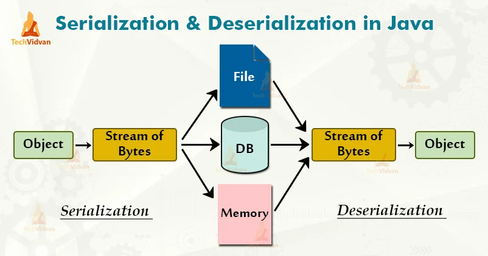
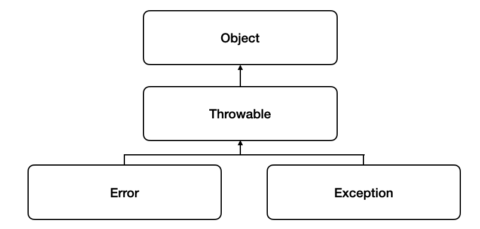

# Java

## Syncronous vs Asyncronous

### 비동기 Asyncronous

비동기란 현재 실행 중인 명령이 종료되지 않아도 다음 명령이 실행 가능한 것을 의미합니다. <br>
Callback 함수를 통해 결과를 확인할 수 있습니다. ex Ajax, Thread <br>

```java
class User {
  private int userNo = 0;

  // 임계 영역이 되어야하는 메소드
  public void add(String name) {
    System.out.println(name + " : " + userNo++);
  }
}

class UserThread extends Thread {
  User user;

  UserThread(User user, String name) {
    super(name);
    this.user = user;
  }

  public void run() {
    try {
      for (int i = 0; i < 3; i++) {
        user.add(getName());
        sleep(500);
      }
    } catch(InterruptedException e) {
      System.err.println(e.getMessage());
    }
  }
}

public class SyncThread {
  public static void name(String[] args) {
    User user = new User();

    // 3개의 스레드 객체 생성
    UserThread p1 = new UserThread(user, "A");
    UserThread p2 = new UserThread(user, "B");
    UserThread p3 = new UserThread(user, "C");

    // 스레드 스케줄링 : 우선순위 부여
    p1.setPriority(p1.MAX_PRIORITY);
    p2.setPriority(p2.NORM_PRIORITY);
    p3.setPriority(p3.MIN_PRIORITY);

    p1.start();
    p2.start();
    p3.start();
  }
}
```

```java
// 결과 => 순서 뒤죽박죽
A : 0번째 사용
B : 1번째 사용
C : 2번째 사용
A : 3번째 사용
C : 5번째 사용
B : 4번째 사용
C : 7번째 사용
A : 6번째 사용
B : 8번째 사용
```

### 동기 Syncronous

동기란 한 자원에 동시에 접근하는 것을 제한하여 순차적으로 진행되도록 하는 것을 의미합니다. <br>
다음에 실행될 명령은 현재 실행 중인 명령 종료 시까지 대기하고 대기시간이 발생하여 버퍼링이 생길 수 있습니다. <br>
서버와 클라이언트가 주고 받는 것이 동시에 이루어지는 형태로, 현금 인출기와 같이 시간적인 동기화가 필요한 경우 사용합니다. <br><br>

Java에서 `synchronized` 키워드를 사용하여 멀티 스레드 접근 제한을 할 수 있습니다. <br>

```java
public synchronized void add(String name) {
    System.out.println(name + " : " + userNo++);
  }
```

메소드, 블록 단위로 적용이 가능하고, 메소드 단위로 지정할 경우 메소드 전체에 lock이 걸리기 때문에 임계 영역이 너무 커서 가능하면 블록 영역을 활용하는 것이 좋습니다. <br>

```java
💡 Synchronized Collection을 사용하는 경우
List 대신 Vector, Map 대신 HashTable 등 synchronized 키워드를 기반으로 구현된 Collection를 사용할 수 있습니다.
하지만 이 Collection들은 제공하는 API가 적고 성능이 좋지 않을 수 있습니다.

따라서 이 경우에는 Collections라는 util 클래스에서 제공되는 메소드를 사용할 수 있습니다.
synchronizedList(), synchronizedSet(), synchronizedMap() 등이 존재합니다.

JDK 1.7 부터 concurrent package를 통해 ConcurrentHashMap이라는 구현체 또한 제공합니다.
이는 Collections util 보다 synchronized 키워드 적용 범위가 좁아서 보다 좋은 성능을 낼 수 있는 자료구조입니다.
```

---

## Lambda & Stream

Java 8부터 Lambda식이 도입되었고 Stream이라는 API가 추가되었습니다. <br>
Labmda를 통해 데이터 Collection의 반복 처리가 간단명료해졌고, Stream을 통해 분기 처리 없이 데이터 Collection의 요소를 반복 처리할 수 있게 되었습니다. <br>

### Lambda

Lambda 표현식이란 메소드를 하나의 식으로 표현하는 것으로, 매개변수와 화살표(->), {몸통} 구조로 이루어집니다. <br>
기존에 익명함수로 작성하던 코드를 줄여 간단하게 작성이 가능하여 가독성이 좋고 병렬 프로그래밍에 용이합니다. <br>
하지만 남용하면 오히려 가독성이 떨어질 수 있으며 익명함수 기반이기 때문에 디버깅이 어렵고 재귀 활용이 까다롭습니다. <br>
<br>
자바의 람다 표현식은 함수형 인터페이스로만 사용 가능합니다.<br>
함수형 인터페이스란 1개의 추상 메소드를 갖는 인터페이스를 말합니다. <br>
인터페이스 검증과 유지보수를 위해 @FunctionalInterface 어노테이션을 사용합니다. <br><br>

#### [Java에서 기본적으로 제공하는 함수형 인터페이스](https://bcp0109.tistory.com/313)

| 함수형 인터페이스 | Descripter    | Method                  |
| ----------------- | ------------- | ----------------------- |
| Predicate         | T -> boolean  | boolean test(T t)       |
| Consumer          | T -> void     | void accept(T t)        |
| Supplier          | () -> T       | T get()                 |
| Function<T, R>    | T -> R        | R apply(T t)            |
| Comparator        | (T, T) -> int | int compare(T o1, T o2) |
| Runnable          | () -> void    | void run()              |
| Callable          | () -> T       | V call()                |

```
💡 명령형 프로그래밍: 애플리케이션의 상태와 상태를 변경시키는 구문의 관심에서 연산을 설명하는 방식으로 어떻게 할 것인지 표현합니다.
      ├─ 절차 지향 프로그래밍
      └─ 객체 지향 프로그래밍

💡 선언형 프로그래밍: 무엇을 할 것인지 표현하는 방식입니다.
      └─ 함수형 프로그래밍
```

```
✅ 함수형 프로그래밍
하드웨어 발전과 함께 소프트웨어 패러다임은 Text 기반의 절차적 프로그래밍 -> GUI 기반 객체 지향 프로그래밍 -> 멀티코어 기반 함수형 프로그래밍으로 변화해왔습니다.
대용량의 데이터를 빠르고 효율적으로 처리하기 위해서 멀티코어를 활용하는 병렬처리 프로그래밍 도입이 필요해져 함수형 프로그래밍이 필연적으로 선택되었습니다.

함수형 프로그래밍이란 함수를 1급 객체로 사용하여 계산을 수학적 함수의 조합으로 생각하는 방식입니다.
1급 객체가 될 수 있는 조건은 아래와 같습니다.
- 변수나 데이터 구조 안에 담을 수 있는 객체
- 함수의 파라미터로 전달 가능
- 반환값으로 사용 가능
- 할당에 사용된 이름과 관계없이 고유한 구별 가능
- 동적으로 프로퍼티 할당 가능

애플리케이션의 상태는 같은 입력이 주어지면 항상 같은 출력을 반환하는 순수 함수를 통해 전달합니다.
또 명령형 흐름 제어보다 새로운 함수를 만들거나 계산하기 위해 둘 이상의 함수를 조합하여 합성 함수를 만들어 사용합니다. ex) 메소드 체이닝
```

### Stream

Stream이란 선언형으로 데이터 Collection을 반복적으로 처리할 수 있는 API입니다. <br>
Lambda식을 지원하며 중간 연산(filter, map...)과 최종연산(foreach, count, collect...)이 있습니다.<br>
여러 연산을 조립해서 사용할 수 있으며, 병렬로 처리하기 때문에 성능이 좋습니다. <br>

```java
// Java 8 이전
Iterator<String> iter = items.iterator();
while(iter.hasNext()) {
	if(iter.next()!=null){
		System.out.println(iter.next());
	}
}
// Java 8 이후
Stream<String> stream = list.stream();
stream.filter(item->item!=null).forEach(item -> System.out.println(item));
```

분할이 잘 이루어질 수 있는 데이터 구조이거나, 연산 작업이 독립적이면서 CPU 사용률이 높은 작업에 적합합니다. <br>
하지만 Parallel()은 공유된 thread pool을 사용하기 때문에 [성능 장애](https://m.blog.naver.com/tmondev/220945933678)를 일으킬 수 있어서 주의 깊게 사용해야 합니다. <br>

```java
✅ Collection vs Stream
💡 Collection
모든 값을 메모리에 저장하는 자료구조로, 외부 반복을 통해 사용자가 작업 반복 작업을 거쳐 요소를 가져올 수 있습니다. (for-each문)
Collection에 추가하기 전에 미리 계산이 완료되어 있어야 합니다.
외부 반복은 명시적으로 Collection 항목을 하나씩 가져와서 처리해야 하기 때문에 최적화에는 불리합니다.
Collection에서 병렬성을 이용하려면 직접 synchronized 를 통해 관리해야 합니다.


💡 Stream
요청할 때만 요소를 계산하는 방식으로, 내부 반복을 사용하므로 추출 요소만 선언해주면 알아서 반복 처리를 진행하게 됩니다.
내부 반복은 병렬 처리를 통해 최적화된 순서로 처리해주기 때문에 성능이 더 좋습니다.
스트림에 요소를 추가, 제거하는 작업은 불가능합니다.

🎈 Collection은 음악 파일을 저장하여 재생하는 플레이어라면, Stream은 필요할 때 검색해서 듣는 스트리밍 서비스라고 생각하면 쉽습니다.
```

#### 중간 연산

파이프라이닝이 가능한 연산으로 스트림을 반환합니다. <br>

```java
filter(Predicate) // Predicate를 인자로 받아 true인 요소를 포함한 스트림 반환
distinct() // 중복 필터링
limit(n) // 주어진 사이즈 이하 크기를 갖는 스트림 반환
skip(n) // 처음 요소 n개 제외한 스트림 반환
map(Function) // 매핑 함수의 result로 구성된 스트림 반환
flatMap() // 스트림의 콘텐츠로 매핑함. map과 달리 평면화된 스트림 반환
```

#### 최종 연산

스트림을 닫는 연산으로 중간 연산 값을 한꺼번에 처리합니다. <br>

```java
(boolean) allMatch(Predicate) // 모든 스트림 요소가 Predicate와 일치하는지 검사
(boolean) anyMatch(Predicate) // 하나라도 일치하는 요소가 있는지 검사
(boolean) noneMatch(Predicate) // 매치되는 요소가 없는지 검사
(Optional) findAny() // 현재 스트림에서 임의의 요소 반환
(Optional) findFirst() // 스트림의 첫번째 요소
reduce() // 모든 스트림 요소를 처리해 값을 도출. 두 개의 인자를 가짐
collect() // 스트림을 reduce하여 list, map, 정수 형식 컬렉션을 만듬
(void) forEach() // 스트림 각 요소를 소비하며 람다 적용
(Long) count // 스트림 요소 개수 반환
```

---

## Serialization & Deserialization

### 직렬화 Serialization

직렬화란 자바 시스템 내부에서 사용되는 객체 또는 데이터를 외부의 자바 시스템에도 사용할 수 있도록 byte 형태로 데이터를 변환하는 기술입니다. <br>
각 PC는 OS마다 서로 다른 가상 메모리 주소 공간을 갖기 때문에 Reference Type의 데이터들은 인스턴스를 전달 할 수 없습니다. <br>
따라서 이런 문제를 해결하기 위해 주소값이 아닌 Byte 형태로 직렬화된 객체 데이터를 전달해야 합니다. <br>
<br>
직렬화된 데이터들은 모두 Primitive Type이 되고, 이는 파일 저장이나 네트워크 전송 시 파싱이 가능한 유의미한 데이터가 됩니다. <br>
따라서 전송 및 저장이 가능한 데이터로 만들어주는 것이 바로 직렬화입니다. <br>
<br>
`java.io.Serializable` 인터페이스 구현으로 직렬화, 역직렬화가 가능합니다. <br>
ex. JVM에 상주하는 객체 데이터를 영속화할 때, Servlet Session, Cache, Java RMI(Remote Method Ivocation)

```java
@Entity
@AllArgsConstructor
@toString
public class Post implements Serializable {
private static final long serialVersionUID = 1L;

private String title;
private String content;

Post post = new Post("제목", "내용");
byte[] serializedPost;
try (ByteArrayOutputStream baos = new ByteArrayOutputStream()) {
    try (ObjectOutputStream oos = new ObjectOutputStream(baos)) {
        oos.writeObject(post);

        serializedPost = baos.toByteArray();
    }
}
```

`ObjectOutputStream`을 통해 직렬화하여 Byte로 변환된 값을 저장합니다. <br>

```
💡 serialVersionUID를 직접 설정하는 이유
serialVersionUID는 선언하지 않아도 자동으로 해시값이 할당됩니다.
직접 설정한 이유는 클래스 멤버 변수가 변경되면 serialVersionUID 값 또한 변경되기 때문에, 역직렬화 시 Exception이 발생할 수 있기 때문입니다.
따라서 개발자가 직접 관리해야 클래스의 변수가 변경되어도 직렬화에 문제가 발생하지 않게 됩니다.
```

### 역직렬화 Deserialization

역직렬화란 직렬화된 데이터를 받는 쪽에서 다시 객체 데이터로 변환하기 위한 작업을 말합니다. <br>
직렬화된 바이트 형태의 데이터를 객체로 변환해서 JVM으로 상주시키는 형태의 기술입니다. <br>
직렬화 대상이 된 객체의 클래스가 class path에 존재해야 하고 `import` 되어 있어야 합니다. <br>
자바 직렬화 대상 객체와 동일한 serialVersionUID를 가지고 있어야 합니다. <br>

```java
try (ByteArrayInputStream bais = new ByteArrayInputStream(serializedPost)) {
    try (ObjectInputStream ois = new ObjectInputStream(bais)) {

        Object objectPost = ois.readObject();
        Post post = (Post) objectPost;
    }
}
```

`ObjectOutputStream`로 Byte의 값을 다시 객체에 저장하여 역직렬화를 진행합니다. <br>

---

## Garbage Collection

Java는 C, C++ 언어와 달리 개발자가 명시적으로 객체를 해제할 필요가 없습니다.<br>
Java에서는 JVM(Java Virtual Machine)이 구성된 JRE(Java Runtime Environment)가 제공됩니다. <br>
JVM에서 Garbage Collection을 수행하여 사용하지 않는 객체를 메모리에서 삭제하는 작업을 하게 됩니다. <br>

```
💡 stop-the-world
GC를 실행하기 위해 JVM이 애플리케이션 실행을 멈추는 것입니다.
어떤 GC 알고리즘을 사용하더라도 이는 발생하게 되는데, 대개의 경우 GC 튜닝은 이 시간을 줄이는 것이 중요합니다.
```

다음과 같은 경우에 GC의 대상이 됩니다.

1. 객체가 Null인 경우
2. 블럭 실행 종료 후, 블럭 안에서 생성된 객체
3. 부모 객체가 Null인 경우, 포함하는 자식 객체

```
💡 GC 메모리 해제 과정
1. Marking: 프로세스는 마킹을 호출하여 메모리가 사용되는지 아닌지 찾아냅니다. 모든 오브젝트가 스캔되기 때문에 많은 시간이 소모됩니다.
2. Mormal Deletion: 참조되지 않는 객체를 제거하고 메모리를 반환합니다. 메모리 Allocator는 반환되어 비어진 블럭의 참조 위치를 저장해 두었다가 새로운 오브젝트가 선언되면 할당되도록 합니다.
3. Compacting: 퍼포먼스 향상을 위해 참조되지 않는 객체를 제거하고 남은 객체들을 묶음으로서 새로운 메모리 할당 시 더 쉽게 빠르게 진행될 수 있도록 합니다.
```

### Weak Generational Hypothesis

위 GC 메모리 해제 과정과 같이 모든 객체를 Mark & Compack 하는 JVM은 비효율적입니다. <br>
아래 그래프에서 Y축은 할당된 바이트의 수, X축은 바이트가 할당될 때의 시간을 나타냅니다. <br>
<br>
위 그래프와 같이 시간이 갈수록 적은 객체만 남는 다는 것이 약한 세대 가설입니다. <br><br>

신규로 생성한 객체의 대부분은 금방 사용하지 않는 상태가 되고, 오래된 객체에서 신규 객체로의 참조는 매우 적게 존재한다는 가설입니다. <br>
이 가설에 기반하여 자바는 Young 영역과 Old 영역으로 메모리를 분할하여<br>
신규로 생성되는 객체는 Young 영역에, 오랫동안 살아남은 객체는 Old 영역에 보관합니다. <br>

### Generational Gabage Collection

JVM의 메모리는 총 class, stack, heap, native method, PC, 5가지 영역으로 나뉘는데, GC는 힙 메모리만 다룹니다. <br><br>
<br>

1. Young Generation 영역 <br>
   새롭게 생성한 객체가 위치하는 곳으로 많은 객체가 생성되었다가 사라지는 영역입니다. <br>
   이 영역에서 객체가 사라질 때 Minor GC가 발생한다고 말합니다. <br>
2. Old Generation 영역 <br>
   접근 불가능 상태로 되지 않고 Young 영역에서 살아남은 객체가 여기로 복사됩니다. <br>
   Young 영역보다 크게 할당하며 크기가 큰 만큼 GC는 적게 발생합니다. <br>
   이 영역에서 객체가 사라질 때 Major GC 또는 Full GC가 발생한다고 말합니다. <br>
3. Permanent 영역<br>
   Methods Area라고도 하며, JVM이 클래스들과 메소드들을 설명하기 위해 필요한 메타 데이터들을 포함하는 영역입니다. <br>
   JDK8부터는 Meta Space로 교체됩니다. <br>

```
✅ Generational Gabage Collection 과정
1. 새로운 객체가 들어오면 Eden Space에 할당합니다.
2. Eden Space가 가득차면 Minor Garbage Collection이 시작됩니다.
3. 참조중인 객체는 Survivor1 영역으로, 비 참조 객체는 Eden Spacerk Clear될 때 반환됩니다.
4. 다음 Minor GC 때 참조 객체는 Survivor2 영역으로 이동합니다. 참조 객체들이 모두 Survivor2 영역으로 이동하게 되면 Eden Space와 Survivor1 영역은 Clear 됩니다. 주의할 점은 다른 age를 가진 객체들을 한 공간에 가지게 되었다는 것입니다.
5. 다음 Minor GC 에서는 참조 객체들이 Survivor1 영역으로 이동합니다. 이렇게 계속 두 공간을 번갈아가며 사용합니다.
6. Minor GC 후 Survivor 영역이 가득차거나 또는 객체들이 일정한 age threshold를 넘게 되면 Old 영역으로 Promition 됩니다.
7. Major Gsms Old Generation에서 실행 후 Clear 되고 공간이 Compact 됩니다.
```

### [GC의 종류](<https://memostack.tistory.com/229#article-3-1--serial-gc-(-xx:+useserialgc)>)

#### Serial GC (-XX:+UseSerialGC)

가장 단순한 방식의 GC로 싱글 스레드로 동작하기 때문에 그만큼 stop-the-world 시간이 깁니다.<br>
Mark & Sweep & Compact 알고리즘을 사용합니다. <br>

#### ParallelGC (-XX:+UseParallelGC)

Java 8의 default GC로, Young 영역의 GC를 멀티 스레드 방식으로 사용하기 때문에 Serial GC보다 stop-the-world 가 짧습니다. <br>
Old Generation 영역에서만 Full GC(공간 재확보 및 조각 모음) 수행합니다. <br>

#### Parallel Old GC (-XX:+UseParallelOldGC / -XX:+ParallelGCThreads=n)

Old 영역까지 멀티 스레드 방식을 사용하는 것으로 -XX:+ParallelGCThreads=n 옵션을 통해 멀티 스레드 개수를 지정할 수 있습니다. <br>

#### CMS GC(Concurrent Mark Sweep GC)

Stop The World로 Java Application이 멈추는 현상을 줄이고자 만든 GC로, <br>
4 단계로 나누어 Reacable 한 객체를 한번에 찾지 않고 나눠서 찾는 방식을 사용합니다. <br>

1. Initial Mark: GC Root가 참조하는 객체만 마킹합니다. (stop-the-world 발생)
2. Concurrent Mark: 참조하는 객체를 따라가며, 지속적으로 마킹합니다. (stop-the-world 없이 수행)
3. Remark: concurrent mark 과정에서 변경된 사항이 없는지 다시 한번 마킹하며 확정하는 과정을 진행합니다. (stop-the-world 발생)
4. Concurrent Sweep: 접근할 수 없는 객체를 제거하는 과정을 진행합니다. (stop-the-world 없이 수행)

CMS는 Old Generation의 조각 모음(Compaction)을 하지 않으므로 Full GC 시간이 길어지는 문제가 발생합니다. <br>

#### G1 GC (Garbage Frist GC) (-XX:+UseG1GC)

Java 9 이상의 버전에서 default GC로, 현재 GC 중 stop-the-world의 시간이 제일 짧습니다. <br>
CMS GC 를 개선하여 만든 GC로 다른 GC와 다르게 전체 힙 공간을 체스판처럼 `Region` 이라는 영역으로 나누어 관리합니다. <br>
<br>
전체 Heap에 대해서 탐색하지 않고 부분적으로 Region 단위로 탐색하여, 각각의 Region에만 GC가 발생합니다. <br>
Young과 Old 영역의 구분이 없으며, 영역의 참조를 관리할 목적으로 Remember Set을 만들어 사용합니다. (전체 힙의 5% 미만의 크기) <br>
큰 메모리를 가진 멀티 프로세스 시스템에 적합합니다. <br><br>

```
💡 G1 GC 동작 과적
Young 영역(Eden, Survivor)에서는 Young GC가 수행되며 Eden, Survivor 영역 이동
옮기면서 비워진 영역은 사용 가능한 빈 영역으로 되돌림

✅ Full GC 수행 단계
Initial Mark -> Root Region Scan -> Concurrent Mark -> Remark -> Cleanup -> Copy

- Initial Mark
  Old 지역에 존재하는 객체가 참조하는 Survivor 영역 탐색
  STW 발생

- Root Region Scan
  이전 단계에서 찾은 영역에 대한 GC 대상 객체 스캔

- Concurrent Mark
  전체 힙 영역 스캔
  GC 대상 객체가 없는 영역은 이후 단계에서 제외

- Remark
  STW가 발생하며 최종으로 GC 대상에서 제외할 객체 식별

- Cleanup
  STW가 발생하며 제거할 객체가 가장 많은 지역에서 GC 수행
  완료 후, 완전히 비워진 영역을 재사용하기 위해 Freelist에 추가

- Copy
  GC 대상이었지만 Cleanup 단계에서 완전히 비워지지 않은 지역의 남은 객체를 새로운 영역에 복사하여 조각 모음(Compaction) 작업 수행
```

---

## Reflection

리플렉션이란 구체적인 클래스 타입을 알지 못하더라도 그 클래스의 메서드, 타입, 변수들에 접근할 수 있도록 해주는 자바 API입니다. <br>
컴파일 시간이 아닌 실행 시간에 동적으로 특정 클래스의 정보를 추출할 수 있는 프로그래밍 기법입니다. <br>
리플렉션을 사용하여 가져올 수 있는 정보는 `Class`, `Constructor`, `Method`, `Field` 가 있습니다.<br><br>

리플렉션은 동적으로 클래스를 사용해야 할 경우, 즉 작성 시점에는 어떤 클래스를 사용할지 모르지만 런타임 시점에서 가져와 실행하는 경우 필요합니다. <br>
프레임워크나 IDE에서 Spring Annotation, IntelliJ 자동 완성 기능 등의 이런 동적 바인딩을 이용한 기능을 제공합니다. <br><br>

### [사용 방법](https://github.com/WeareSoft/tech-interview/blob/master/contents/java.md#java%EC%9D%98-%EB%A6%AC%ED%94%8C%EB%A0%89%EC%85%98-%EC%9D%B4%EB%9E%80)

`Class.forName("클래스이름")`을 통해 인스턴스를 생성할 수 있고 클래스의 정보를 가져올 수 있습니다.<br>

```java
public class DoHee {
    public String name;
    public int number;
    public void setDoHee (String name, int number) {
      this.name = name;
      this.number = number;
    }
    public void setNumber(int number) {
        this.number = number;
    }
    public void sayHello(String name) {
      System.out.println("Hello, " + name);
  }
}
```

```java
import java.lang.reflect.Method;
import java.lang.reflect.Field;

public class ReflectionTest {
    public void reflectionTest() {
        try {
            Class myClass = Class.forName("DoHee");
            Method[] methods = myClass.getDeclaredMethods();

            /* 클래스 내 선언된 메서드의 목록 출력 */
            /* 출력 : public void DoHee.setDoHee(java.lang.String,int)
                     public void DoHee.setNumber(int)
                     public void DoHee.sayHello(java.lang.String) */
            for (Method method : methods) {
                System.out.println(method.toString());
            }

            /* 메서드의 매개변수와 반환 타입 확인 */
            /* 출력 : Class Name : class DoHee
                     Method Name : setDoHee
                     Return Type : void */
            Method method = methods[0];
            System.out.println("Class Name : " + method.getDeclaringClass());
            System.out.println("Method Name : " + method.getName());
            System.out.println("Return Type : " + method.getReturnType());

            /* 출력 : Param Type : class java.lang.String
                     Param Type : int */
            Class[] paramTypes = method.getParameterTypes();
            for(Class paramType : paramTypes) {
                System.out.println("Param Type : " + paramType);
            }

            /* 메서드 이름으로 호출 */
            Method sayHelloMethod = myClass.getMethod("sayHello", String.class);
            sayHelloMethod.invoke(myClass.newInstance(), new String("DoHee")); // 출력 : Hello, DoHee

            /* 다른 클래스의 멤버 필드의 값 수정 */
            Field field = myClass.getField("number");
            DoHee obj = (DoHee) myClass.newInstance();
            obj.setNumber(5);
            System.out.println("Before Number : " + field.get(obj)); // 출력 : Before Number : 5
            field.set(obj, 10);
            System.out.println("After Number : " + field.get(obj)); // 출력 : After Number : 10
        } catch (Exception e) {
            // Exception Handling
        }
    }

    public static void main(String[] args) {
        new ReflectionTest().reflectionTest();
    }
}
```

---

## [Annotation](http://asfirstalways.tistory.com/309)

어노테이션이란 사전적으로는 주석이라는 의미로, 주석처럼 코드에 명시하여 클래스에 특별한 의미를 부여하거나 기능을 주입할 수 있는 기능입니다. <br>
인터페이스를 기반으로 한 문법이며, `Built-In Annotation`, `Meta Annotation`, `Custion Annotation` 세 종류로 구분할 수 있습니다. <br>

### Built-In Annotation

Java에 내장되어 있는 어노테이션으로 주로 컴파일러에게 유용한 정보를 제공하는 역할을 합니다. <br>

```java
@Override // 메서드 앞에만 붙일 수 있으며 현재 메서드가 Super 클래스의 메소드를 오버라이드한 메소드임을 컴파일러에게 명시합니다. 오타 발생 가능성을 잡아줄 수 있습니다.
@Deprecated // 더 이상 사용하지 않는 메소드를 나타냅니다.
@SupressWarning // 프로그래머의 의도를 컴파일러에게 전달하여 경고를 제거합니다.
@FunctionalInterface // 함수형 인터페이스라는 것을 알리고 검사하는 기능을 제공합니다. 개발자의 실수를 방지할 수 있습니다.
```

### Meta Annotation

어노테이션에 사용되는 어노테이션으로 해당 어노테이션의 동작 대상을 결정합니다. <br>
주로 새로운 어노테이션을 정의할 때 사용합니다. <br>

```java
@Target // 어노테이션이 적용가능한 대상을 지정하는데 사용합니. 여러 개 값을 지정할 때는 {}를 사용합니다.
@Retention // 어노테이션이 유지되는 기간을 지정할 수 있습니다. SOURCE / CLASS / RUNTIME
@Documented // 어노테이션에 대한 정보가 JavaDoc으로 작성한 문서에 포함되도록 할 때 사용하는 어노테이션으로 대부분의 Built-In Annotation에 붙어 있습니다. (@Override, @SuppressWarnings 제외)
@Inherited // 어노테이션이 자손 클래스에도 상속되도록 하는 어노테이션으로, 조상 클래스에 붙이면 자손 클래스도 이 어노테이션이 붙은 것과 같이 인식됩니다.
@ Native // JVM이 설치된 OS의 네이티브 메서드에 의해 참조되는 상수 필드에 붙이는 어노테이션입니다. 대표적으로 Object 클래스의 메서드들이 네이티브 메서드에 해당되며, 네이티브 메서드와 자바에 정의된 메서드를 연결하는 것을 JNI(Java Native Interface)라고 합니다.
```

### Custom Annotation

직접 어노테이션 타입을 선언하는 것으로 특별한 종류의 인터페이스입니다. <br>
일반적인 인터페이스 선언과 구분하기 위해 `interface` 앞에 `@`를 붙여 사용합니다. <br>
어노테이션 타입은 암묵적으로 `java.lang.annotation.Annotation`을 확장하기 때문에 `extends`절을 가질 수 없습니다. <br>

```java
💡 Marker Annotation
요소가 한 개도 없으며 단순히 표식으로서 사용되는 어노테이션으로, 컴파일러에게 의미를 전달하는 데 사용합니다.

💡 Single-value Annotation
요소로 단일 변수만을 갖는 어노테이션으로, 단일 변수밖에 없기 때문에 값만을 명시하여 데이터를 전달할 수 있습니다.

@interface MyAnnotation {
  String value();
}
@MyAnnotation("passed") // @MyAnnotation(value="passed")와 동일
class Newclass { ... }

💡 Full Annotation
요소로 둘 이상의 변수를 갖는 어노테이션으로, 데이터를 배열 안에 key-value의 형태로 전달합니다.
- 요소 타입은 Primitive Type, String, Enum, Annotation, Class만 허용됩니다. 각 요소는 기본값을 가질 수 있습니다.
- 요소의 () 안에 매개변수를 선언할 수 없습니다.
- 예외를 선언할 수 없습니다.
- 요소를 타입 매개변수로 정의할 수 없습니다.

int count() default 1;
```

---

## String vs StringBuffer vs StringBuilder

|                     | String       | StringBuffer | StringBuilder |
| ------------------- | ------------ | ------------ | ------------- |
| 저장 공간           | String pool  | Heap         | Heap          |
| 수정 가능 여부      | X(Immutable) | O(Mutable)   | O(Mutable)    |
| Thread Safe         | O            | O            | X             |
| 동기화 Synchromized | O            | O            | X             |
| 성능                | 빠름         | 느림         | 빠름          |

### [String](https://ifuwanna.tistory.com/221)

String 객체는 한번 값이 할당되면 그 공간은 변하지 않습니다. <br>
`+` 연산자 또는 `concat` 메소드를 통해 다른 문자열을 추가하더라도 기존 문자열에 붙이는 것이 아니라,<br>
새로운 String 객체를 만든 후 새 String 객체에 연결된 문자열을 저장하고 그 객체를 참조하도록 합니다. <br>
즉 String 클래스 객체는 Heap 메모리 영역에 생성되고 한번 생성된 객체의 내부 내용을 변화시킬 수 없습니다. <br>
주로 문자열 연산이 적고 멀티스레드 환경일 경우 사용합니다. <br>

### StringBuffer

주로 문자열 연산이 많고 멀티스레드 환경일 경우 사용합니다. <br>
StringBuffer는 가변성을 가지기 때문에 `append()`, `delete()`와 같은 API를 이용하여 동일 객체 내 문자열을 변경하는 것이 가능합니다. <br>
또한 동기화를 지원하여 멀티스레드 환경에서 안전(thread-safe)하다는 장점을 가지고 있습니다. <br>

### StringBuilder

주로 문자열 연산이 많고 단일 스레드이거나 동기화를 고려하지 않아도 되는 경우 사용합니다. <br>
StringBuffer와 동일하게 가변성을 갖지만, 동기화를 지원하지 않습니다. <br>
따라서 멀티스레드 환경에서 사용하는 것은 적합하지 않지만, 단일 스레드에서는 StringBuffer보다 성능이 좋습니다. <br>

---

## [Error vs Exception](https://toneyparky.tistory.com/40)

`오류`란 시스템이 종료되어야 할 수준의 상황과 같이 수습할 수 없는 심각한 문제를 의미합니다. <br>
개발자가 미리 예측하여 방지할 수 없습니다. <br>
`예외`는 개발자가 구현한 로직에서 발생한 실수나 사용자의 영향에 의해 발생합니다. <br>
오류와 달리 개발자가 미리 예측하여 방지 할 수 있기 때문에 상황에 맞는 예외 처리(Exception Handle)을 해야합니다.<br>

<br>

```java
💡 Throwable
Error와 Exception 모두 자바의 최상위 클래스인 Object를 상속 받습니다.
그리고 그 사이 Throwable이라는 클래스는 이 클래스의 객체에 오류나 예외에 대한 메시지를 담거나,
예외가 연결될 때(Chained Exception) 연결된 예외의 정보들을 기록하는 역할을 수행합니다.
이 Throwable 객체가 가진 정보와 할 수 있는 행위는 getMessage()와 printStackTrace()가 있습니다.
```

### Error

에러(Error)란 컴퓨터 하드웨어의 오동작 또는 고장으로 인해 응용프로그램에 이상이 생겼거나 JVM 실행에 문제가 생겼을 경우 발생하는 것입니다. <br>
시스템 레벨에서 발생하기 때문에 개발자가 미리 예측하여 처리할 수 없기 때문에, 애플리케이션에서 오류에 대한 처리를 신경 쓰지 않아도 됩니다. <br>

<br>

- `StackOverflowError`: 호출의 깊이가 깊어지거나 재귀가 지속되어 stack overflow 발생 시 던져지는 오류입니다.
- `OutOfMemoryError`: JVM이 할당된 메모리의 부족으로 더 이상 객체를 할당할 수 없을 때 던져지는 오류입니다. Garbage Collector에 의해 추가적인 메모리가 확보되지 못하는 상황이기도 합니다.

### Exception

예외(Exception)란 개발자가 구현한 로직에서 발생한 실수나 사용자의 영향에 의해 발생합니다. <br>
컴파일 시 발생할 수 있는 일반 예외 Exception와 실행 중에 발생하는 런타임 예외 RuntimeException로 구분됩니다. <br><br>

일반 예외는 소스코드를 `.class` 파일로 컴파일하는 과정에서 JVM이 던지는 에러로, 대부분 소스코드 자체의 문법적 오류로 인해 발생합니다. <br>
프로그램 자체에서 처리할 수 있는 방법은 없습니다. <br>
일반 예외의 예로는 `ClassNotFoundException`, `IllegalAccessException`, `NoSuchMethodException`등이 있습니다. <br><br>

- `IllegalArgumentException`: 메서드가 허가되지 않거나 부적절한 argument를 받았을 경우에 던져지는/던질 수 있는 예외입니다.<br>

런타임 예외는 문법적인 오류가 없어 컴파일 시에는 정상적으로 컴파일됐지만 프로그램을 실행하는 과정에서 발생하는 에러를 말합니다. <br>
이는 개발자가 직접 오류를 확인하여 처리해야 합니다. <br>
런타임 예외의 예로는 `NullPointerException`, `ArithmeticException`, `IndexOutOfBoundsException` 등이 있습니다.<br>

- `NullPointerException`: 객체가 필요한 경우인데 응용프로그램이 null을 사용하려고 시도할 경우 던져지는/던질 수 있는 예외입니다.<br>

예외는 오류와 달리 개발자가 미리 예측하여 방지할 수 있기 때문에 상황에 맞는 예외처리가 필요합니다. <br>

### [예외 처리](https://reakwon.tistory.com/155) Exception Handle

#### try... catch... finally

예외가 발생했을 때 `try`... `catch`... `finally` 라는 키워드로 예외를 처리하거나 메소드를 호출한 곳으로 던질 수 있습니다. <br>

- `try`: 예외가 발생한 만한 코드가 작성됩니다.
- `catch`: 예외가 발생되었을 때 처리하는 동작을 명시합니다. catch 블록은 여러 개가 있을 수 있습니다.
- `finally`: 예외 발생 유무와 상관 없이 공통으로 수행되어야 할 임시 파일의 삭제 등 뒷정리 코드가 작성됩니다.

```java
try {
	// 예외가 발생될만한 코드
} catch(FileNotFoundException e) { // FileNotFoundException이 발생했다면

} catch(IOException e) { // IOException이 발생했다면

} catch(Exception e) { // Exception이 발생했다면

} finally {
	// 어떤 예외가 발생하던 말던 무조건 실행
}
```

#### throws

예외를 바로 처리하지 않고 예외를 던져서 어떤 예외가 발생했는지 알리는 용도로 사용합니다. <br>

```java
public static void divide(int a,int b) throws ArithmeticException {
	if(b==0) throw new ArithmeticException("0으로 나눌 수는 없다니까?");
	int c=a/b;
	System.out.println(c);
}
public static void main(String[] ar){
	int a=10;
	int b=0;

	divide(a,b);
}
```

```java
✅ throw vs throws
💡 throw
메서드 내에서 예외를 발생시키는 데 사용됩니다.
throw new FoolException()

💡 thorws
메서드 선언부에서 사용되며, 해당 메서드가 처리하지 않은 예외를 호출자에게 전달함을 나타냅니다.
public void sayNick(String nick) throws FoolException
```

---

## [Optional](http://www.tcpschool.com/java/java_stream_optional#google_vignette)

Java8에서 도입된 클래스로 NullPointerException을 방지할 수 있도록 도와주는 Wrapper 클래스입니다. <br>
모든 타입의 참조 변수를 저장할 수 있고, 값이 null이더라도 바로 NPE가 발생하지 않습니다. <br>

### 객체 생성

`of()` 메소드나 `ofNullable()` 메소드를 사용하여 Optional 객체를 생성합니다. <br>
null이 될 가능성이 있다면 `ofNullable()` 메소드를 사용해야 비어 있는 Optional 객체를 반환하기 때문에 NullPointerException이 발생하지 않습니다. <br>

```java
Optional<String> opt = Optional.ofNullable("자바 Optional 객체"); // 객체 생성
if(opt.isPresent()) { // null 체크
    System.out.println(opt.get()); // 객체 접근
}
```

`get()`으로 객체에 접근할 때 저장된 값이 null이면 NoSuchElementException 예외가 발생할 수 있기 때문에 `isPresent()` 메소드를 사용하여 null 체크를 먼저 해야 합니다. <br>

| 메소드                                                                       | 설명                                                                                                                         |
| ---------------------------------------------------------------------------- | ---------------------------------------------------------------------------------------------------------------------------- |
| static <T> Optional<T> empty()                                               | 아무런 값도 가지지 않는 비어있는 Optional 객체를 반환함.                                                                     |
| T get()                                                                      | Optional 객체에 저장된 값을 반환함.                                                                                          |
| boolean isPresent()                                                          | 저장된 값이 존재하면 true를 반환하고, 값이 존재하지 않으면 false를 반환함.                                                   |
| static <T> Optional<T> of(T value)                                           | null이 아닌 명시된 값을 가지는 Optional 객체를 반환함.                                                                       |
| static <T> Optional<T> ofNullable(T value)                                   | 명시된 값이 null이 아니면 명시된 값을 가지는 Optional 객체를 반환하며, 명시된 값이 null이면 비어있는 Optional 객체를 반환함. |
| T orElse(T other)                                                            | 저장된 값이 존재하면 그 값을 반환하고, 값이 존재하지 않으면 인수로 전달된 값을 반환함.                                       |
| T orElseGet(Supplier<? extends T> other)                                     | 저장된 값이 존재하면 그 값을 반환하고, 값이 존재하지 않으면 인수로 전달된 람다 표현식의 결괏값을 반환함.                     |
| <X extends Throwable> T orElseThrow(Supplier<? extends X> exceptionSupplier) | 저장된 값이 존재하면 그 값을 반환하고, 값이 존재하지 않으면 인수로 전달된 예외를 발생시킴.                                   |
