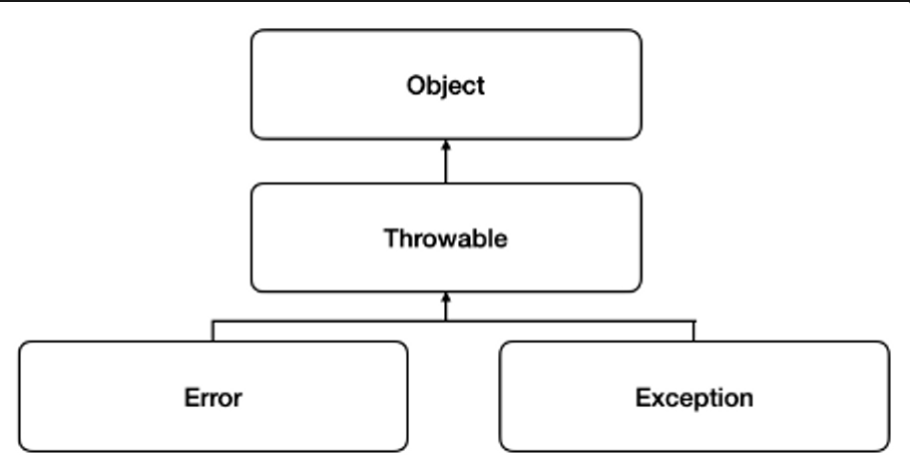
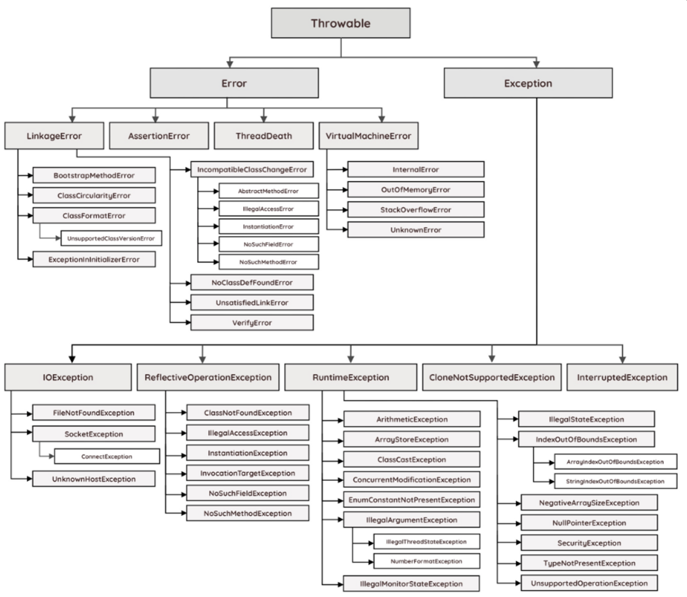
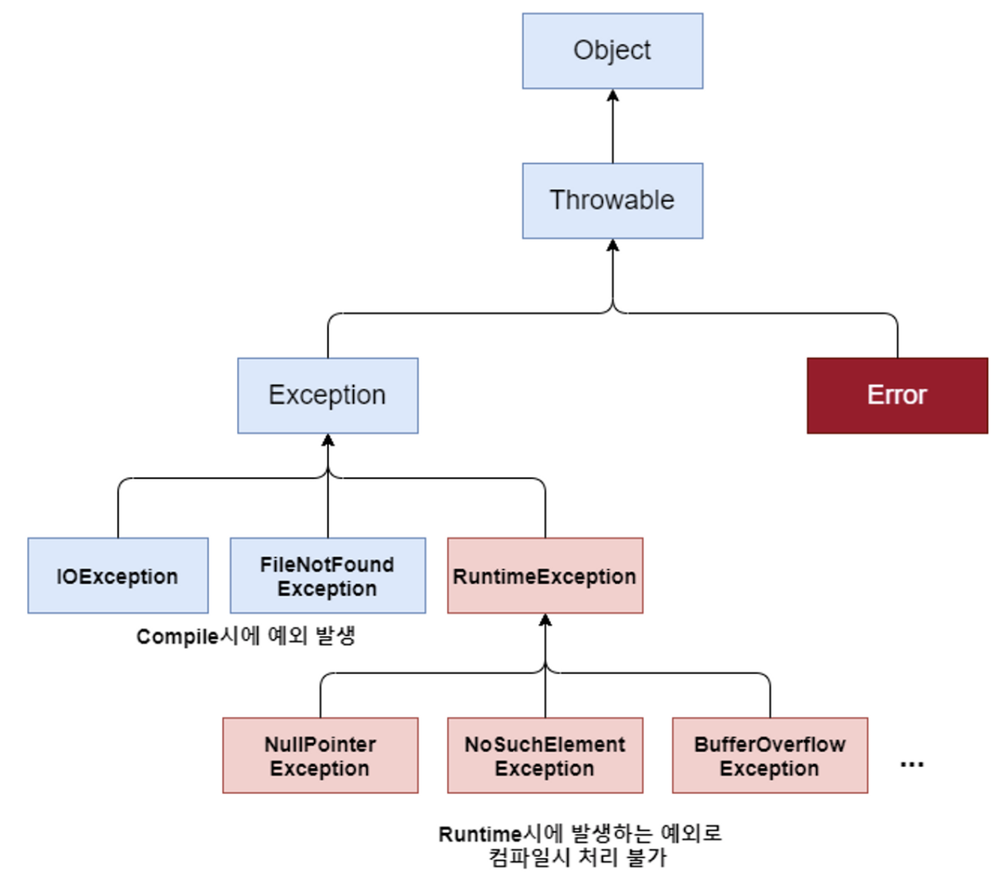
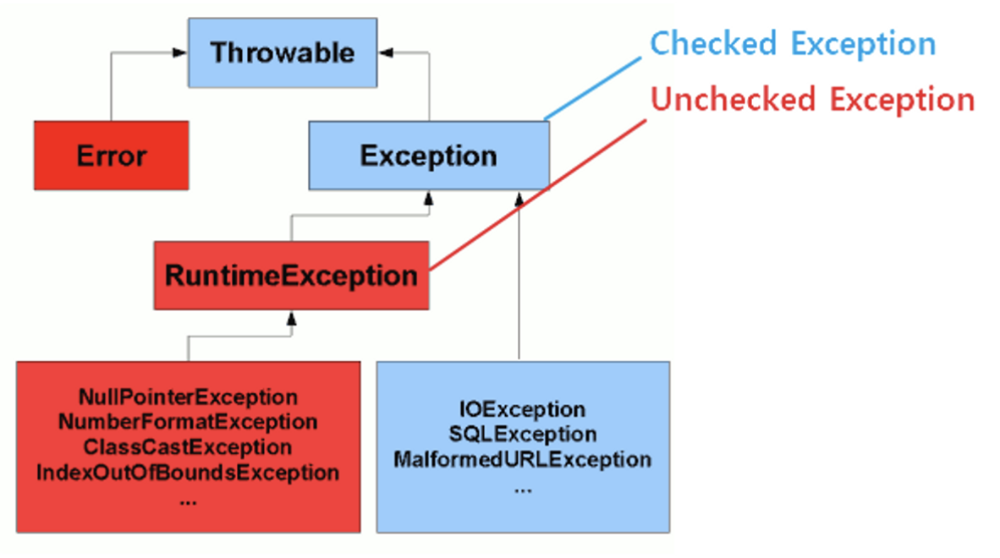
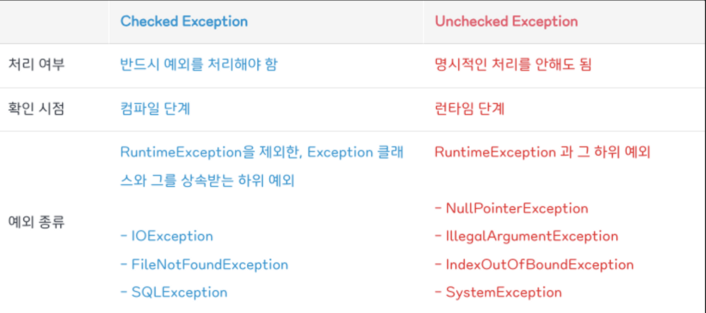

## Error & Exception

---

### 프로그래밍 오류의 종류

오류는 발생 시점에 따라 크게 3가지로 나눌 수 있다.

- `컴파일 에러`
  컴파일 시점에서 발생하는 에러로 소스코드를 컴파일러가 컴파일하는 시점에서 소스의 오타나 잘못된 구문, 자료형 체크등 검사를 수행하는데 여기서 발생하는 에러를 컴파일 에러라 하며 이 시점에서 발생하는 문제들을 수정 후 컴파일을 성공적으로 마칠경우 클래스 파일(`*.class`) 파일이 생성된다.
- `런타임 에러`
  프로그램 실행 시점에서 발생하는 에러로 컴파일러는 컴파일 시점에서 문법 오류나 오타같은 컴파일시점에서 예측가능한 오류는 잡아줄 수 있지만, 실행 중 발생할 수 있는 잠재적인 에러까지 잡을 순 없다. 그래서 컴파일은 문제없이 완료되어 프로그램 실행이되고 실행도중 의도치않은 동작에 대처하지못해 에러가 발생할 수 있다.
- `논리적 에러`
  소스 코드 컴파일도 정상적으로 되고 런타임상 에러가 발생하는 것도아닌 개발자의 의도와는 다르게동작하는 에러를 뜻한다.

 

### 컴파일 에러

프로그램의 컴파일 과정에서 발생하는 에러를 말한다. 컴파일 에러가 발생하면 컴파일이 안되기 때문에 프로그램 실행 자체가 불가능하다. 일반적으로 컴파일 에러 발생시 컴파일러는 문제를 일으킨 원인을 에러메시지로 출력해준다.

- 문법오류
- 타입확인오류
- 파일참조오류

 

> **[ 컴파일 ]**  
> 개발자가 프로그램을 위해 작성한 소스코드를 다른 프로그램이나 기계(H/W)가 처리하기 용이한 형태로 바꾸는 과정을 말한다.

 

> **[ 프로그래밍 언어와 컴파일 ]**  
>
> `Java`, `C`, `C++` 같은 언어들이 컴파일 언어이며 실행(런타임)되기 위해서는 반드시 컴파일 과정을 거쳐야한다.
>
> 반면에, `JavaScript`, `Python` 같은 언어들은 스크립트 언어이며 이런 언어들은 컴파일 과정없이 기계어로 번역되는 즉시 동작하도록 되어있다. 따라서 컴파일과정은 필요하지 않지만 작동시에는 컴파일 언어에 비해 느리다는 단점이 있다.
>
> 이런 컴파일을 진행하는 일련의 과정을 **컴파일 타임**이라고 한다.

 

> **[ Java 언어와 컴파일 ]**  
>
> 기본적으로 컴파일(Compile)은 소스코드를 기계(H/W)가 이해할 수 있는 기계어로 바꿔주는 역할을 하지만 자바(Java)언어같은 경우는 조금 다르게 생각해야 한다.
>
> 자바 언어를 컴파일 하면 바이트코드가 생성된다. 이는 컴퓨터(H/W)가 이해할 수 없는 언어이다. 자바가 컴파일한 언어를 이해할 수 있는 기계는 바로 JVM(Java Virtual Machine)이다.
>
> 즉, 자바 언어를 컴파일한 바이트 코드를 이해할 수 있는 기계는 바로 JVM을 의미한다는 것을 알 수 있다.

 

### 런타임 에러

코드가 이미 실행가능한 프로그램으로 성공적으로 컴파일이 되었더라도 여전히 프로그램의 실행중에 버그를 일으킬 수 있다. 이렇게 프로그램의 실행중에 발생하는 형태의 오류를 말하며 프로그램이 비정상적으로 종료될 수 있다.

- `Null` 참조 오류
- 메모리 부족 오류

 

> **[ 런타임(Runtime) ]**  
> 컴파일 과정을 마친 컴퓨터 프로그램이 실행되고 있는 환경 또는 동작되는 동안의 시간을 말한다.

 

### 에러(Error)와 예외(Exception)

`자바`에서는 실행 시 발생할 수 있는 런타임 오류를 `에러(Error)` 와 `예외(Exception)` 두가지로 구분하였다.

- `에러` 시스템이 종료되어야 할 수준의 상황과 같이 심각한 문제를 의미한다. 개발자가 사전에 예측하여 방지할 수 없다.
- `예외` 개발자가 구현한 로직에서 발생한 실수나 사용자의 영향에 의해 발생한다. 오류와 달리 개발자가 예측하여 예외처리를 통해 방지할 수 있다.

 

> **[ 예외처리(exception handling) ]**  
> 프로그램 실행 시 발생할 수 있는 예기치 못한 예외의 발생에 대비한 코드를 작성하는 행위를 말한다. 예외처리의 목적은 예외의 발생으로 인한 실행중인 프로그램의 갑작스런 비정상 종료를 막고, 정상적인 실행상태를 유지하는 것이다.

 

### 예외클래스의 계층구조

`자바`에서는 오류를 `에러(Error)` 와 `예외(Exception)` 두가지로 나누었고 이들을 클래스로 구현하여 처리하도록 했다. `JVM` 은 프로그램을 실행하는 도중에 예외가 발생하면 해당 예외 클래스로 객체를 생성하고 예외 처리 코드에서 예외 객체를 이용할 수 있도록 해준다.

`자바`의 오류 클래스 계층 구조를 보면 위 그림과 같이 구성되어 있다. 위 그림의 모든 오류 클래스를 개발자가 다룰 수 있지는 않다. 실제로 개발자가 다룰 수 있는 클래스들은 `예외(Exception)` 관련 클래스들로 **컴파일 에러(파란색)와 런타임 에러(붉은색)**에 관련된 클래스들 뿐이다.

  

## Checked Exception & UnChecked Exception

---

`Exception` 클래스는 많은 하위 클래스들을 가지고 있다. 그 중 `Runtime Exception` 은 `Checked Exception` 과 `UnChecked Exception` 을 구분하는 기준이다. `Exception` 클래스의 하위 클래스 중`Runtime Exception` 와 그 하위 클래스들은 `UnChecked Exception` 이라고 부른다. 이를 제외한 예외클래스들은 `Checked Exception` 이라고 부른다.

 

### Checked Exception

명시적인 예외 처리를 강제하기 때문에 `Checked Exception` 이라고 하며 컴파일 에러에 해당하는 예외를 말한다. 반드시 `try-catch` 로 예외를 잡거나 `throw` 를 사용해서 호출한 메서드에 예외를 던져야 한다. `Checked Exception` 의 경우 예외를 확인하는 시점이 컴파일 단계이기 때문에 별도의 예외처리를 하지 않는다면 컴파일 자체가 되지 않는다.

 

### Unchecked Exception

명시적인 예외처리를 강제하지 않는 런타임 에러에 해당하는 예외를 말한다.

 

### Checked & UnChecked Exception 비교

 

### 예외처리 방식

- 예외복구
- 예외처리 회피
- 예외 전환

 

### Reference

[☕ 자바 에러(Error) 와 예외 클래스(Exception) 💯 이해하기](https://inpa.tistory.com/entry/JAVA-%E2%98%95-%EC%97%90%EB%9F%ACError-%EC%99%80-%EC%98%88%EC%99%B8-%ED%81%B4%EB%9E%98%EC%8A%A4Exception-%F0%9F%92%AF-%EC%B4%9D%EC%A0%95%EB%A6%AC)

[예외처리(exception handling)](https://catsbi.oopy.io/92cfa202-b357-4d47-8de2-b9b3968dfb2e)

[[Java] Error와 Exception 차이](https://velog.io/@jipark09/Java-Error%EC%99%80-Exception-%EC%B0%A8%EC%9D%B4)

[Java 예외(Exception) 처리에 대한 작은 생각](https://www.nextree.co.kr/p3239/)
