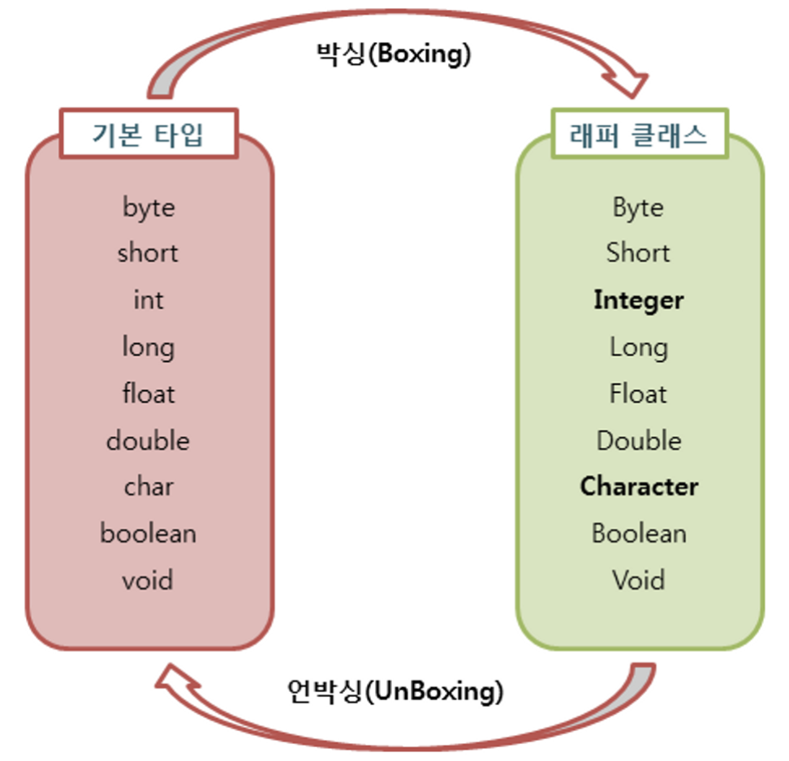

## Wrapper 클래스와 Boxing & Unboxing

---

### Wrapper 클래스

자바의 자료형은 `기본타입`과 `참조타입`으로 구분된다. 프로그래밍에서 데이터를 사용하며 이를 객체화할 필요성이 생기는데 이럴 때에 기본 타입의 데이터를 객체로 다루기 위해서 사용하는 클래스를 `래퍼클래스`라고 한다. `래퍼클래스` 는 `java.lang` 패키지에 포함되어 제공된다. `래퍼클래스` 를 이용하면 각 타입에 해당하는 데이터를 파라미터로 전달받아 해당 값을 가지는 객체로 만들어준다.

```java
Integer num1 = new Integer(5); // 기본형 타입 정수를 래퍼 클래스로 감싸 객체화
Integer num1 = 5; // 이런식으로도 표현 가능

Double num2 = new Double(1.11); // 기본형 타입 실수를 래퍼 클래스로 감싸 객체화
Double num2 = 1.11;
```

<br>

### 박싱(Boxing) & 언박싱(Unboxing)

`기본타입`의 데이터를 객체로 만드는 것을 `박싱(Boxing)`이라고 하며, `참조타입`의 데이터를 다시 `기본타입`으로 만드는 것을 `언박싱(Unboxing)` 이라고 한다.



`래퍼클래스` 는 산술 연산을 위해 정의된 클래스가 아니기 때문에 `래퍼클래스` 에 저장된 값을 직접 변경하는 것이 불가능하다. 따라서 `래퍼클래스` 를 언박싱해 값을 변경한 후에 `박싱` 하는 단계를 거쳐야 한다.

```java
// 박싱
Integer num = new Integer(20); // Integer 래퍼 클래스 num 에 21 의 값을 저장

// 언박싱 (intValue)
int n = num.intValue(); // 래퍼 클래스 num 의 값을 꺼내 가져온다.

// 재 포장(박싱)
n = n + 100; // 120
num = new Integer(n);
```

<br>

### \***\*자동 박싱(AutoBoxing) & 자동 언박싱(AutoUnBoxing)\*\***

`JDK 1.5` 버전 부터는 `박싱` 과 `언박싱` 을 자바 컴파일러가 자동으로 처리해주기 시작했다. 이러한 자동화된

`박싱` 과 `언박싱` 을 `오토박싱` 과 `오토언박싱` 이라고 부른다. 기본 타입 값을 직접 `박싱` 과 `언박싱` 을 하지 않아도 `래퍼클래스` 에 대입하면 자동으로 `박싱` 과 `언박싱` 이 일어난다.

```java
/* 기존 박싱 & 언박싱 */
Integer num = new Integer(17); // 박싱
int n = num.intValue();        // 언박싱

/* 오토 박싱 & 언박싱 */
Integer num = 17; // new Integer() 생략
int n = num; // intValue() 생략
```

<br>

### 박싱(Boxing) & 언박싱(Unboxing) 성능 고려

`박싱` 과 `언박싱` 은 가능적 편의성을 위해 제공되지만 다른 타입간의 형 변환은 어플리케이션의 성능에 영향을 미치게 된다.

**[ `Auto Boxing` 을 포함한 연산]**

```java
public static void main(String[] args) {
  long t = System.currentTimeMillis(); // 현재 시간(밀리초)를 저장

  Long sum = 0L; // 래퍼 객체로 오토 박싱으로 정수 값을 저장

  // 백만번 도는 동안 더하기 연산
  for (long i = 0; i < 1000000; i++) {
  	sum += i;
  }

  System.out.println("processing time: " + (System.currentTimeMillis() - t) + " ms") ;
}

// processing time: 34 ms
```

<br>

**[ `Primitive` 타입간 연산]**

```java
public static void main(String[] args) {
    long t = System.currentTimeMillis();

    long sum = 0L; // 기본형 정수 타입인 long 자료형에 정수 저장

    for (long i = 0; i < 1000000; i++) {
        sum += i;
    }

    System.out.println("processing time: " + (System.currentTimeMillis() - t) + " ms") ;
}

// processing time: 5 ms
```

위와 같이 `100`만번의 연산을 계산한다고 가정하면 거의 5배의 성능 차이를 보인다. 따라서, 코드에 불필요한 `auto casting` 이 반복적으로 이루어지고 있는지 확인하는것이 중요하다.

<br><br>