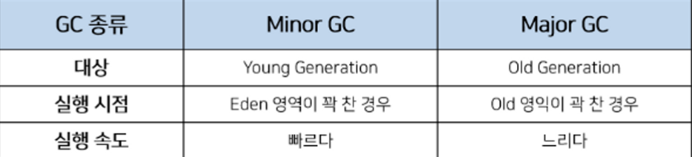

## GC(Garbage Collection)

---

`가비지 컬렉션(Garbage Collection, GC)`은 자바의 메모리 관리 기법중 하나로 `JVM`(자바 가상 머신)의 `Heap` 영역에서 동적으로 할당했던 메모리 중 필요없게 된 메모리 영역에 할당된 주소들을 모아 주기적으로 제거하는 프로세스를 말한다.

`C/C++` 언어에서는 이러한 가비지 컬렉션이 없어 개발자가 수동으로 메모리 할당과 해제를 일일히 해줘야 했다. 반면, `JAVA` 에서는 가비지 컬렉터가 메모리 관리를 대신 수행해주기 때문에 `JAVA` 프로세스가 한정된 메모리를 효율적으로 사용할 수 있게 하고, 개발자 입장에서는 메모리 관리, 메모리 누수 문제보다 로직 작성에 더 집중할 수 있다는 장점이 있다.

하지만, `GC` 에도 단점이 존재한다. 자동으로 처리해준다 해도 메모리가 언제 해제되는지 정확하게 알 수 없어 제어하기 힘들며, 가비지 컬렉션(GC)이 동작하는 동안에는 다른 동작을 멈추기 때문에 **오버헤드**가 발생되는 문제점이 있다. 이로 인해 `GC`가 너무 자주 실행되면 소프트웨어 성능 하락의 문제가 되기도 하다. 이를 `STW(Stop-The-World)` 라고 한다.

 

### **STW(Stop-The-World)**

`GC` 를 수행하기 위해 `JVM` 이 프로그램 실행을 멈추는 현상을 말한다. `GC`가 작동하는 동안 `GC` 관련 `Thread` 를 제외한 모든 `Thread` 는 멈추게 되어 서비스 이용에 차질이 생길 수 있다. 따라서 이 시간을 최소화 하는것이 중요하다.

 

### 가비지 컬렉션의 장단점

**[장점]**

- 메모리 관리를 `GC`가 수행해주기 때문에 로직 작성 등 개발에 보다 집중할 수 있다.
- 효율적인 메모리 사용이 가능하다.

**[단점]**

- 메모리가 언제 해제 되는지 정확히 알 수 없어 제어하기 힘들다.
- `GC`이 동작하는 중에는 `JVM`이 다른 동작을 멈추기 때문에 오버헤드가 발생한다.

 

### 가비지 컬렉션 대상

가비지 컬렉션은 특정 객체가 `GC` 대상인 `garbage` 인지 판단하기 위해서 `Reachability` 라는 개념을 적용한다. 객체가 참조되고 있다면 `Reachable`로 구분되고, 객체가 참조되고 있지 않다면 `Unreachable` 로 구분해 `GC` 의 대상으로 인식한다.

 

> `Reachable`  
> 객체가 참조되고 있는 상태

 

> `Unreachable`  
> 객체가 참조되고 있지 않으며 `GC` 의 대상이 되는 상태

 

예를 들어, `JVM` 메모리에서 객체들은 실질적으로 `Heap` 영역에서 생성되고 `Method Area` 그리고 `Stack Area` 에서는 `Heap Area` 에 생성된 객체의 주소만 참조하는 형식으로 구성된다.

하지만, 이렇게 생성된 `Heap Area` 의 객체들이 메서드가 끝나는 등의 특정 이벤트들로 인하여 `Heap Area` 객체의 메모리 주소를 가지고 있는 참조 변수가 삭제되는 현상이 발생하면, 위의 그림에서 빨간색 객체와 같이 `Heap` 영역에서 참조되지 않은 객체가 발생하게 된다.

이러한 객체들을 주기적으로 가비지 컬렉터가 대상으로 인식하고 할당했던 메모리 영역을 회수한다.

 

### 가비지 컬렉션에서 사용 알고리즘 - Mark And Sweep

가비지 컬렉션이 될 대상 객체를 `식별(Mark)` 하고 `제거(Sweep)` 하며 객체가 제거되어 파편화된 메모리 영역을 앞에서부터 채워나가는 `작업(Compaction)` 을 수행하는 `JAVA` 에서 메모리를 관리하는 방법이다. `Mark And Sweep` 방식을 사용하면 연결이 끊긴 순환 참조되는 객체들을 모두 지울 수 있다.

 

**[ Mark 과정 ]**

먼저 `Root Space` 그래프 순회를 통해 연결된 객체들을 찾아 각각 어떤 객체를 참조하고 있는지 마킹한다.

**[ Sweep 과정 ]**

참조하고 있지 않은 객체 즉, `Unreachable` 객체들을 `Heap` 에서 제거한다.

**[ Compact 과정 ]**

`Sweep` 후에 분산된 객체들을 `Heap` 의 시작 주소로 모아 메모리가 할당된 부분과 그렇지 않은 부분으로 압축한다. (가비지 컬렉터 종류에 따라 다름)

 

> **[ GC의 Root Space ]**   `Mark And Sweep` 방식은 루트로 부터 해당 객체에 접근이 가능한지가 해제의 기준이 된다. JVM 에서의 Root Space 는 Heap 메모리 영역을 참조하는 `mehtod area`, `static 변수`, `stack`, `native method stack`이 되게 된다.
>
> 즉, JVM 메모리 영역 중 Root Space 에 해당 되는 부분은 노란색 박스 안의 영역들이다.

 

> 

 

### 가비지 컬렉션과 JVM 메모리 구조

JVM의 `힙(heap)` 영역은 동적으로 레퍼런스 데이터가 저장되는 공간으로 `가비지 컬렉션`의 대상이 되는 공간이다. `힙(heap)` 영역은 초기 설계시 다음 2가지를 전제로 설계되었다.

 

- 대부분의 객체는 금방 접근 불가능한 상태(`Unreachable`) 가 된다.
- 오래된 객체에서 새로운 객체로의 참조는 아주 적게 존재한다.

 

즉, **객체는 대부분 일회성이되며, 메모리에 오랫동안 남아있는 경우는 드물다**는 것이다. 이러한 특성을 이용해 효율적인 메모리 관리를 위해 `힙(heap)` 영역을 나누게 되었고 `Young` 과 `Old` 총 2가지 영역으로 설계했다. (초기에는 `Perm` 영역도 존재했지만 `Java 8`부터 제거되었다.)

 

위 그림에서 `Old Generation` 이 `Young Generation` 에 비해 크게 할당되는 이유는 `Young Generation` 의 수명이 짧은 객체들은 큰 공간을 필요로 하지 않으며 큰 객체들은 `Young Generation` 이 아니라 바로 `Old Generation` 에 할당되기 때문이다.

 

**[ Young 영역 (Young Generation) ]**

- 새롭게 객체가 생성되는 영역
- 대부분의 객체가 금방 `Unreachable` 상태가 되기 때문에, 많은 객체가 `Young 영역`에 생성되었다가 사라진다.
- `Young 영역`에 대한 가비지 컬렉션을 `Minor GC`라고 부른다.

**[ Old 영역 (Old Generation) ]**

- `Young 영역`에서 `Reachable` 상태를 유지하며 살아남은 객체가 복사되는 영역
- `Young 영역`보다 크게 할당되며, 영역의 크기가 큰 만큼 가비지는 적게 발생한다.
- `Old 영역`에 대한 가비지 컬렉션을 `Major GC` 또는 `Full GC`라고 부른다.

 

또 다시 `힙(heap) 영역`은 더욱 효율적인 `GC`를 위해 `Young Generation` 을 3가지 영역 ( `Eden`, `survivor 0`, `survive 1` ) 으로 나눈다.

 

**[ Eden ]**

- `new` 연산자를 통해 새로 생성된 객체가 위치한다.
- 정기적인 가비지 컬렉션 작업에서 살아남은 객체들은 `Survivor 영역`으로 보내진다.

**[ Survivor 0 / Survivor 1]**

- 최소 `1`번 이상의 `GC`에서 살아남은 객체가 존재하는 영역
- `Survivor 영역`에는 특별한 규칙이 있는데 `Survivor 0` 또는 `Survivor 1` 둘 중 하나는 꼭 비어 있어야 한다는 것이다.

 

이렇게 하나의 힙 영역을 세부적으로 구분하여 객체를 관리하며 가비지 컬렉터를 보다 효율적으로 실행하도록 한다.

 

> **[ Java 8 에서의 Permanent ]**   `Permanent` 는 생성된 객체들 정보의 주소값이 저장된 공간이다. 클래스 로더에 의해 로드 되는 클래스와 메서드 등에 대한 메타정보가 저장되는 영역이고 `JVM`에 의해 사용된다. `Java 7` 버전까지는 힙 영역에 존재했지만 `Java 8` 버전 이후에는 `Native Method Stack`과 합쳐졌다.

 

### 가비지 컬렉션 - Minor GC

 

`Young Generation` 에는 짧게 살아남는 객체들의 메모리들이 존재하는 공간이다. 모든 객체는 처음에 `Young Generation` 에 생성된다. `Young Generation` 공간은 `Old Generation` 에 비해 상대적으로 작기 때문에 메모리 상의 객체를 찾아 제거하는데 적은 시간이 걸린다. ( 작은 공간에서 데이터를 찾기 때문에 ) 이 때문에 `Young Generation` 영역에서 발생되는 `GC`를 `Minor GC`라고 부른다.

1. 처음 생성된 객체는 `Young Generation` 영역의 일부인 `Eden` 영역에 위치한다.

   

1. 객체가 계속 생성되어 `Eden` 영역이 꽉 차게 되고 `Minor GC` 가 실행된다.

   

1. `Mark` 동작을 통해 `reachable` 객체를 탐색한다.

   

1. `Eden` 영역에서 살아남은 객체는 `1`개의 `Survivor` 영역으로 이동한다.

   

1. `Eden` 영역에서 사용되지 않는 객체(`unreachable`)의 메모리를 해제(`sweep`) 한다.

   

1. 살아남은 모든 객체들은 `age` 값이 `1` 씩 증가한다.

   

 

> **[ `age` 값 ]**   `Survivor` 영역에서 `GC` 에서 객체가 살아남은 횟수를 의미하는 값이며, `Object Header` 에 기록된다. 만일 `age` 값이 임계값에 다다르면 `Promotion` ( `Old 영역`으로 이동 ) 여부를 결정한다. 객체 헤더에 `age` 를 기록하는 부분은 `6 bit` 로 구성되어 있다.
>
> 또한, `Survivor` 영역의 제한 조건으로 `Survivor` 영역 중 반드시 1개는 사용 되어야 하고 나머지는 비어 있어야 한다. 만약 두 `Survivor` 영역에 모두 데이터가 존재하거나 모두 사용량이 `0` 이라면 현재 시스템이 정상적이지 않다는 반증이 된다.

 

1. 또다시 `Eden` 영역에 신규 객체들로 가득 차게 되면 다시 한번 `minor GC` 가 발생하고 `mark` 한다.

   

2. `marking` 한 객체들을 비어있는 `Survivor 1` 으로 이동하고 `sweep` 한다.

   

3. 다시 살아남은 모든 객체들은 `age` 값이 `1` 씩 증가한다.

   

4. 위의 과정들을 반복한다.

 

### 가비지 컬렉션 - Major GC

`Old Generation` 은 길게 살아남는 메모리들이 존재하는 공간이다. `Old Generation` 의 객체들은 거슬러 올라가면 처음에는 `Young Generation` 에서 생성되었으나 `GC` 과정중에 제거되지 않고 `age 임계값`에 다다르게 되면서 이동한 객체들이다. 그리고 `Major GC` 는 객체들이 계속 `promotion` 되어 `Old Generation` 의 메모리가 부족해지면 발생하게 된다.

1. 객체의 `age` 가 임계값 ( 여기선 `8`로 설정 ) 에 도달하게 되면

   

1. 이 객체들을 `Old Generation` 으로 이동하게 된다. 이를 `promotion` 이라고 부른다.

   

1. 위의 과정이 반복되어 `Old Generation` 영역의 공간(메모리)가 부족하게 되면 `Major GC` 가 발생한다.

   

`Major GC` 는 `Old Generation` 영역의 데이터가 가득 차면 `GC`를 실행하는 단순한 방식이다. `Old Generation` 영역에 할당된 메모리가 허용치를 넘게 되면, `Old Generation` 영역에 있는 모든 객체들을 검사하여 참조되지 않는 객체들을 한꺼번에 삭제하는 `Major GC` 가 실행된다.

하지만, `Old Generation`은 `Young Generation` 에 비해 상대적으로 큰 공간을 가지고 있어서 이 공간에서 메모리 해제에 많은 시간이 걸린다. 이때 발생하는 문제가 `Stop-The-World` 이다. `Major GC` 가 실행되면 `Thread` 가 멈추고 `Mark And Sweep` 작업을 해야 해서 `CPU`에 부하를 주기 때문에 멈추는 등의 현상이 일어날 수 있다.

이를 해결하기 위한 가비지 컬렉션 알고리즘이 있다.

 

### 가비지 컬렉션 알고리즘

`JVM` 이 `GC`를 통해 메모리를 관리해주는 것은 굉장히 유용하나 GC`를` 수행하기 위해서는 `Stop-The-World` 문제가 발생되고 이는 애플리케이션이 중지될 수 있는 문제를 유발할 수 있다. 또한, 자바에 발전에 따라 `Heap` 크기가 커지면서 애플리케이션의 지연현상이 두드러지게 나타날 수 있게 되었고 이를 최적화 하기 위한 `가비지 컬렉션 알고리즘`들이 개발되었다.

**GC 알고리즘은 모두 설정을 통해 Java에 적용가능** 하며 **상황에 따라 필요한 GC 방식을 설정해서 사용가능** 하다는 특징이 있다.

 

### Serial GC

- 서버의 `CPU` 코어가 `1`개 일 때 사용하기 위해 개발된 가장 단순한 `GC`
- `GC`를 처리하는 스레드가 `1`개(싱글 스레드) 이어서 가장 `Stop-The-World` 시간이 길다.
- `Minor GC` 에는 `Mark-Sweep`을 사용하고 `Major GC`에는 `Mark-Sweep-Compact` 를 사용한다.
- 성능이 안좋아서 실무에서는 잘 사용하지 않는다.

 

### Parallel GC

- `Java 8` 의 기본 `GC`
- `Serial GC` 와 기본 알고리즘은 같지만 `Young` 영역의 `Minor GC` 를 멀티 쓰레드로 수행한다. ( `Old` 영역은 여전히 싱글 스레드 )
- `Serial GC`에 비해 `Stop-The-World` 시간 감소

 

### Parallel Old GC ( Parallel Compacting Collector )

- `Parallel GC` 개선버전
- `Young` 영역 뿐만 아니라 `Old` 영역 에서도 멀티 쓰레드로 `GC` 수행
- 새로운 가비지 컬렉션 방식인 `Mark-Summary Compact` 방식을 사용한다.

 

### G1 C1 ( Garbage First )

- `JDK 7` 버전에서 최초로 배포된 `GC`
- `Java 9` 버전 이상의 디폴트 `GC` 로 지정
- `4GB` 이상의 힙 메모리, `Stop-The-World` 시간이 `0.5초` 정도 필요한 상황에 사용 (`Heap` 이 너무 작을경우 미 사용 권장)
- 기존의 알고리즘에서 `Heap 영역`을 물리적으로 고정된 `Young / Old 영역`으로 나누어 사용하였지만, `G1 GC` 는 아예 이러한 개념을 뒤엎는 `Region` 개념을 도입
- 전체 `Heap 영역`을 `Region` 이라는 영역으로 체스같이 분할하여 상황에 따라 `Eden`, `Survivor`, `Old` 등의 역할을 고정이 아닌 동적으로 부여
- `Garbage` 로 가득찬 영역을 빠르게 회수하여 빈 공간을 확보하므로 결국 `GC` 빈도가 줄어드는 효과를 얻게 되는 원리

 

> **[ G1 GC의 효율성 ]**   > `G1 GC` 에서는 이전의 `GC` 와는 달리 메모리가 많이 차있는 `영역(region)`을 인식하는 기능을 통해 메모리가 많이 차있는 영역을 우선으로 `GC` 를 수행한다. 즉, `Heap 영역` 전체를 탐색하는 것이 아니라 `영역(region)`을 나누어 탐색하고 `영역(region)` 별로 `GC`가 일어난다.
>
> 또한, 이전의 `GC` 들은 `Young 영역`의 객체들이 `GC` 가 수행될때마다 살아남으면 순차적으로 `Eden → Survivor 0 → Survivor 1` 순으로 이동했지만 `G1 GC` 에서는 더욱 효율적이라고 생각하는 위치로 객체를 `재할당(Reallocate)` 시킨다.

 

 

### 가비지 컬렉션 비교 ( Minor GC vs Major GC )

 

### Reference

[☕ 가비지 컬렉션 동작 원리 & GC 종류 💯 총정리](https://inpa.tistory.com/entry/JAVA-%E2%98%95-%EA%B0%80%EB%B9%84%EC%A7%80-%EC%BB%AC%EB%A0%89%EC%85%98GC-%EB%8F%99%EC%9E%91-%EC%9B%90%EB%A6%AC-%EC%95%8C%EA%B3%A0%EB%A6%AC%EC%A6%98-%F0%9F%92%AF-%EC%B4%9D%EC%A0%95%EB%A6%AC)

[[Java] GC(Garbage Collection)이란?](https://steady-coding.tistory.com/584)
