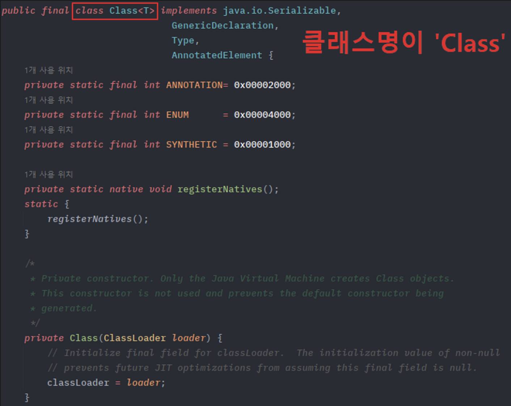
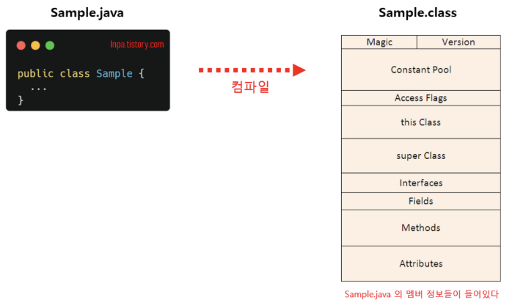

## 리플렉션(Reflection)

---

### 리플렉션(Reflection) API란?

구체적 클래스 타입을 알지 못해도 클래스 파일의 위치나 이름만 있다면 해당 클래스의 정보 ( `메서드`, `타입`, `변수` 등 ) 에 접근할 수 있으며 클래스의 인스턴스를 생성할 수 있도록 지원하고 인스턴스의 `필드`와 `메서드`를 `접근 제어자`와 관계없이 사용할 수 있도록 지원하는 `API` 이다.

<br>

### 리플렉션의 장단점

**[장점]**

- 런타임 시점에서 클래스의 인스턴스를 생성하고 접근제어자와 관계 없이 필드와 메서드에 접근하여 필요한 작업을 수행할 수 있는 유연성을 가지고 있다.

**[단점]**

- 캡슐화를 저해한다.
- 런타임 시점에서 인스턴스를 생성하는 등 동작하므로 컴파일 시점에 오류를 잡을 수 없다.

<br>

### 리플렉션 사용이유

`리플렉션API`는 런타임 시에 클래스 정보에 접근하여 클래스를 조작할 수 있다. 심지어 `private` 접근 제어자로 선언한 필드나 메서드까지 조작이 가능하다. 이는 객체지향설계에서 중요한 캡슐화를 깨뜨릴 수 있는 중요한 문제이다.

규모가 작은 개발 단계에서는 개발자가 충분히 컴파일 시점에 프로그램에서 사용될 객체와 의존관계를 모두 파악하고 관계를 맺어 줄 수 있다. 하지만 프레임워크와 같이 큰 규모의 개발에서는 의존관계 파악이 어렵다. 또한, 사용하는 사람이 어떤 클래스와 멤버를 구성할지 모르기 때문이다. 이러한 경우 리플렉션을 사용하여 동적으로 클래스를 만들어서 의존관계를 맺어줄 수 있다.

<br>

> **[ 리플렉션 사용예시 Spring Bean Factory ]** <br>
> Spring Bean Factory 의 경우 @Controller, @Service, @Repository 등의 어노테이션만 붙이면 Bean Factory에서 알아서 해당 어노테이션이 붙은 클래스를 생성하고 관리해준다. 이것이 가능한 이유는 리플렉션 덕분이다. 런타임에 해당 어노테이션이 붙은 클래스를 발견하면 리플렉션을 통해 해당 클래스의 인스턴스를 생성하고 필요한 필드를 주입하여 Bean Factory에 저장하는 식으로 사용된다.

<br>

### 자바의 클래스 객체

애플리케이션 실행 중 클래스를 동적으로 가져와 사용해야할 경우가 있다. 이럴 경우 코드 상에서 호출 로직을 통해 클래스 정보를 얻어와 런타임 시에 클래스를 조작한다. 이때 사용되는 것이 `Class` 클래스 객체이다.

`Class` 클래스는 java.lang.Class 패키지에 별도로 존재하는 독립형 클래스로서 자신이 속한 클래스의 모든 멤버 정보를 담고 있기 때문에 런타임 환경에서 동적으로 저장된 클래스나 인터페이스 정보를 가져오는데 사용된다.

( 클래스 자료형이 아닌 클래스 이름 `“Class”` 인 클래스를 말한다. )

<br>



<br>

자바의 모든 클래스와 인터페이스는 컴파일 후 `.java` → `.class` 파일로 변환된다. 이 `.class` 파일에는 멤버 `변수`, `메서드`, `생성자` 등 객체의 정보들이 들어 있는데 `JVM`의 클래스 로더에 의해서 클래스 파일이 메모리에 올라갈 때 `Class 클래스`는 이 `.class` 파일의 클래스 정보들을 가져와 힙 영역에 자동으로 객체화가 되게 한다. 그래서 따로 `new 연산자`를 사용해 인스턴스화 없이 가져와 사용할 수 있다.

<br>



<br>

> **[ JVM 과 Class 객체 ]** <br> > `JVM`의 `클래스 로더`는 실행 시에 필요한 클래스를 동적으로 메모리에 로드하는 역할을 한다. 먼저 기존에 생성된 클래스 객체가 메모리에 존재하는지 확인하고 있으면 객체의 참조를 반환하고, 없으면 `classpath`에 지정된 경로를 따라서 클래스 파일을 찾아 해당 클래스 파일을 읽어서 `Class객체`로 변환한다. 만약, 클래스 객체를 찾지 못하면 `ClassNotFoundException` 예외를 발생시킨다.

<br>

### 클래스 객체를 얻는 방법

클래스 객체를 얻는 방법은 3가지가 존재한다.

**[ Object.getClass() 로 얻기 ]**

- 모든 클래스의 최상위 클래스인 `Object클래스` 에서 제공하는 `getClass()` 메서드를 통해 가져온다.
- 단, 모든 클래스가 인스턴스화 된 상태여야 한다는 제약이 있다.

```java
public static void main(String[] args) {

    // 스트링 클래스 인스턴스화
    String str = new String("Class클래스 테스트");

    // getClass() 메서드로 얻기
    Class<? extends String> cls = str.getClass();
    System.out.println(cls); // class java.lang.String
}
```

**[ .class 리터럴로 얻기 ]**

- 인스턴스가 존재하지 않고, 컴파일된 클래스 파일만 있다면 리터럴로 `Class객체`를 곧바로 얻을 수 있다.
- 가장 간단하게 `Class객체`를 가져오는 방법이다.

```java
public static void main(String[] args) {

    // 클래스 리터럴(*.class)로 얻기
    Class<? extends String> cls2 = String.class;
    System.out.println(cls2); // class java.lang.String
}
```

**[ Class.forName() 으로 얻기 ]**

- 리터럴 방식과 같이 컴파일된 클래스 파일이 있다면 클래스 이름만으로 `Class객체`를 반환 받을 수 있다.
- 단, 이때는 클래스의 도메인을 상세히 적어야 한다. 클래스 파일 경로에 오타가 있으면 에러가 발생할 수 있다.
- 만일 `Class객체`를 찾기 못하면 `ClassNotFoundException` 이 발생하기 때문에 예외처리가 강제된다.
- 다른 두가지 방법보다 메모리를 절약하며 동적 로딩 할 수 있어 성능이 좋다.

```java
public static void main(String[] args) {
    try {
        // 도메인.클래스명으로 얻기
        Class<?> cls3 = Class.forName("java.lang.String");
        System.out.println(cls3); // class java.lang.String

    } catch (ClassNotFoundException e) {}
}
```

<br>

### 자바 리플렉션 사용법

`Person 클래스`에는 `public`과 `private`, `static`한 필드와 메소드를 가지고 있으며, 생성자도 아규먼트에 따라 두가지로 준비하였다. 이제 이 복잡하게 구성되어 있는 `Person 클래스`의 멤버 정보들을 리플렉션으로 동적으로 다루어 보겠다.

```java
// 필요 패키지 로드
import java.lang.reflect.*;

class Person {
    public String name; // public 필드
    private int age; // private 필드

    public static int height = 180; // static 필드

    // 이름, 나이를 입력받는 생성자
    public Person(String name, int age) {
        this.name = name;
        this.age = age;
    }

    // 기본 생성자
    public Person() {
    }

    public void getField() {
        System.out.printf("이름 : %s, 나이 : %d\n", name, age);
    }

    // public 메소드
    public int sum(int left, int right) {
        return left + right;
    }

    // static 메소드
    public static int staticSum(int left, int right) {
        return left + right;
    }

    // private 메소드
    private int privateSum(int left, int right) {
        return left + right;
    }
}
```

<br>

### 동적으로 생성자 가져와 초기화하기

- `getConstructor()` 를 호출할 때 인자로 생성자의 매개변수 타입을 바인딩 해주어야 한다.
- 만일 어떠한 매개변수 타입을 지정해주지 않으면 기본 생성자가 호출된다.
- 만약, 해당하는 생성자를 찾지 못하면 `NoSuchMethodException` 이 발생한다.

```java
public static void main(String[] args) throws Exception {
    // 클래스 객체 가져오기 (forName 메소드 방식)
    Class<Person> personClass = (Class<Person>) Class.forName("Person");

    // 생성자 가져오기 - Person(String name, int age)
    Constructor<Person> constructor = personClass.getConstructor(String.class, int.class); // getConstructor 인자로 생성자의 매개변수 타입을 바인딩 해주어야 한다.

    // 가져온 생성자로 인스턴스 만들기
    Person person1 = constructor.newInstance("홍길동", 55);
    person1.getField(); // 이름 : 홍길동, 나이 : 55
}
```

<br>

### 동적으로 메서드 가져와 실행하기

- `getMethod()` 를 호출할때 인자로 생성자의 매개변수 타입을 바인딩 해주어야 한다.
- 만약 매개변수가 없는 메서드라면 메서드 명만 입력해주면 된다.
- 실행은 메서드 타입에서 제공하는 `invoke()` 를 호출하여 실행한다.
  - `instance 메서드` : 매개변수로 인스턴스 필요
  - `static 메서드` : 매개변수 필요없음
  - `private 메서드` : `invoke` 하기 전에 `setAccessible()` 메서드의 인자를 `true` 로 설정하여 공개화 할 필요가 있다. 또한, `getDeclaredMethod()` 사용하여 메서드를 호출할 수 있다.

```java
public static void main(String[] args) throws Exception {
    Class<Person> personClass = (Class<Person>) Class.forName("Person");

    // 특정 public 메서드 가져와 실행
    // getMethod("메서드명", 매개변수타입들)
    Method sum = personClass.getMethod("sum", int.class, int.class);
    int result = (int) sum.invoke(new Person(), 10, 20);
    System.out.println("result = " + result); // 30

    // 특정 static 메서드 가져와 실행
    Method staticSum = personClass.getMethod("staticSum", int.class, int.class);
    int staticResult = (int) staticSum.invoke(null, 100, 200);
    System.out.println("staticResult = " + staticResult); // 300

    // 특정 private 메서드 가져와 실행
    Method privateSum = personClass.getDeclaredMethod("privateSum", int.class, int.class);
    privateSum.setAccessible(true); // private 이기 때문에 외부에서 access 할 수 있도록 설정
    int privateResult = (int) privateSum.invoke(new Person(), 1000, 2000);
    System.out.println("privateResult = " + privateResult); // 3000
}
```

<br>

### 동적으로 필드 조작하기

- `getField()` 를 통해 클래스의 필드를 얻을 수 있다.
- 필드 값 변경은 `set()` 메서드를 호출하면 된다.
- 필드는 클래스가 인스턴스가 되어야 `Heap메모리`에 적재되기때문에 인스턴스가 필요하다.
- 다만, `static 필드`라면 `Method Area`에 이미 적재되어 있으므로 인스턴스가 필요없다.

```java
public static void main(String[] args) throws Exception {
    Class<Person> personClass = (Class<Person>) Class.forName("Person");

    // static 필드를 가져와 조작하고 출력하기
    Field height_field = personClass.getField("height");
    height_field.set(null, 200);
    System.out.println(height_field.get(null)); // 200
}
```

```java
public static void main(String[] args) throws Exception {
    Person person = new Person("홍길동", 55);

    // 클래스 객체 가져오기
    Class<Person> personClass = (Class<Person>) Class.forName("Person");

    // public 필드를 가져온다.
    Field name_field = personClass.getField("name");

    // private 필드를 가져온다.
    Field age_field = personClass.getDeclaredField("age");
    age_field.setAccessible(true); // private 이기 때문에 외부에서 access 할 수 있도록 설정

    // 필드 조작하기
    name_field.set(person, "임꺽정");
    age_field.set(person, 88);

    System.out.println(name_field.get(person)); // 임꺽정
    System.out.println(age_field.get(person)); // 200
}
```

<br>

### Reference

[☕ 누구나 쉽게 배우는 Reflection API 사용법](https://inpa.tistory.com/entry/JAVA-%E2%98%95-%EB%88%84%EA%B5%AC%EB%82%98-%EC%89%BD%EA%B2%8C-%EB%B0%B0%EC%9A%B0%EB%8A%94-Reflection-API-%EC%82%AC%EC%9A%A9%EB%B2%95)

[[Java] Reflection 개념 및 사용 방법](https://steady-coding.tistory.com/609)
