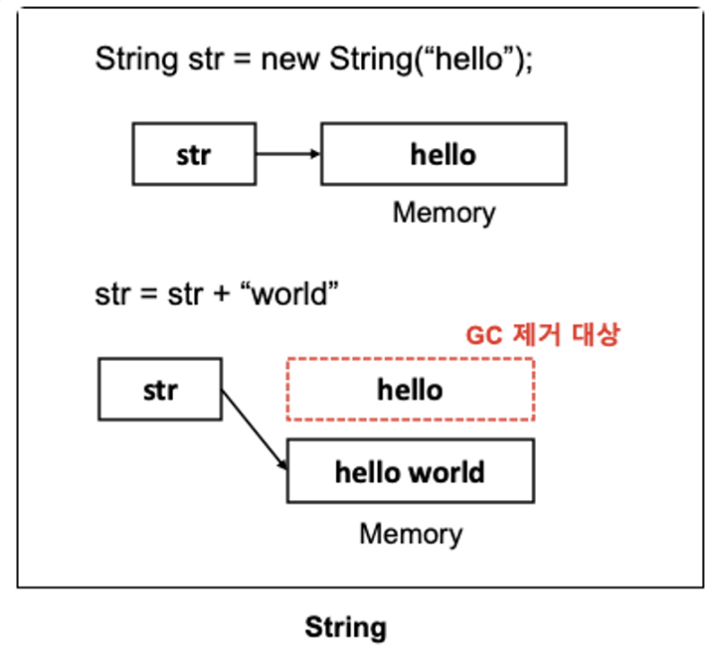
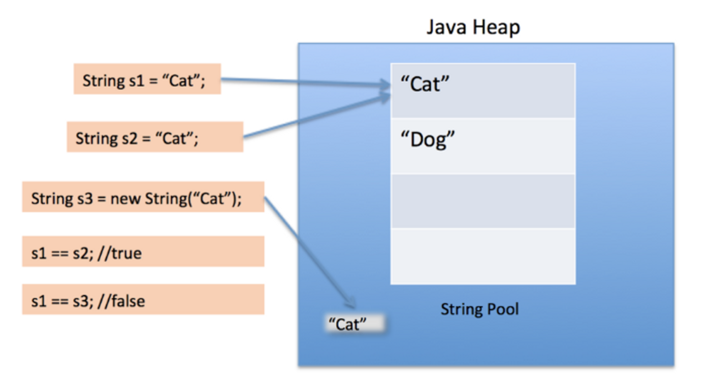
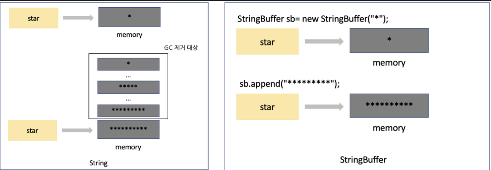
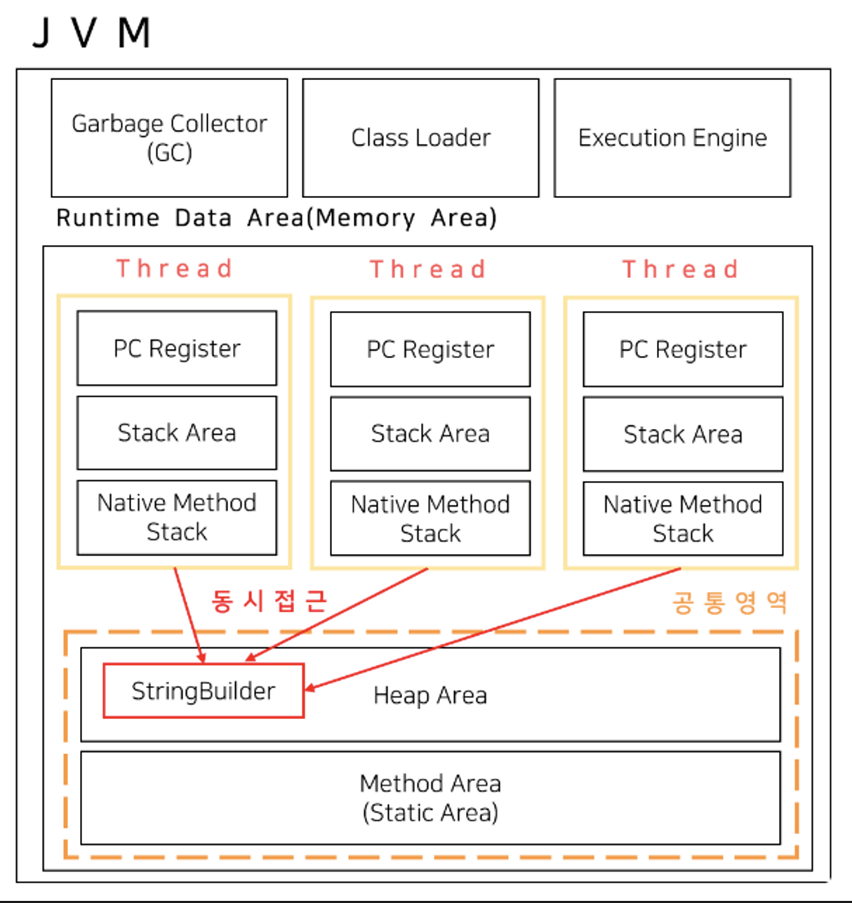
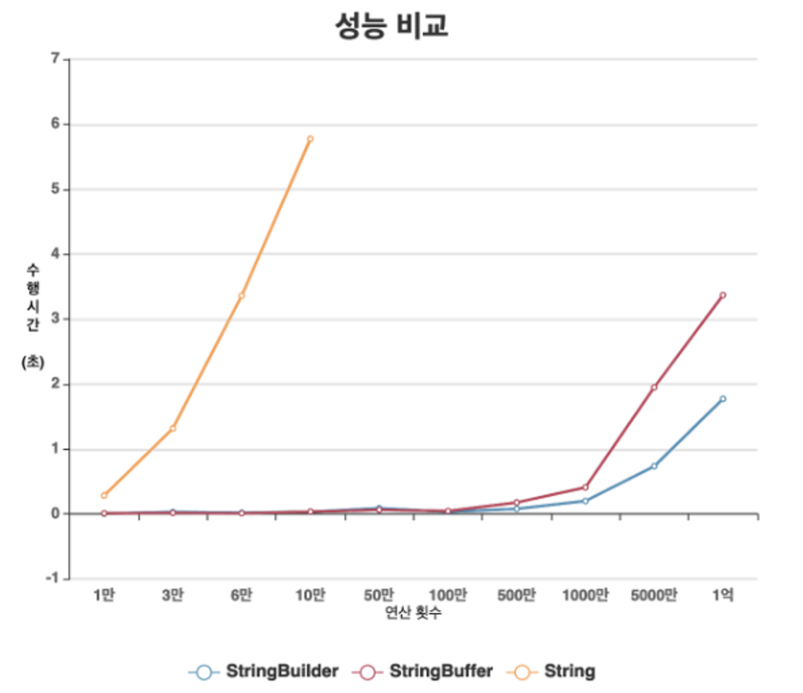
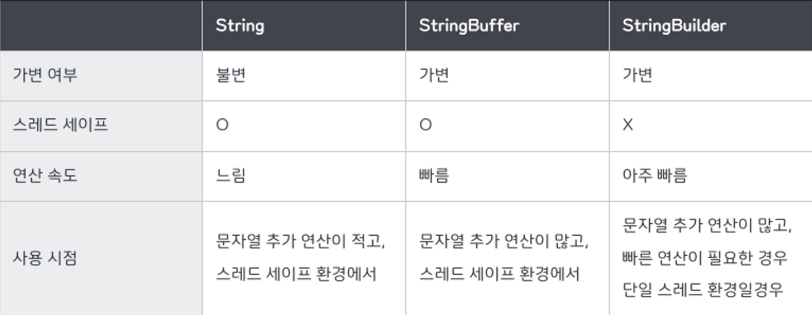

## String & StringBuilder & StringBuffer

---

### String 클래스

`String` 은 불변 객체이다. 실제로 `String` 객체의 내부 구성요소를 살펴보면 인스턴스 생성시 생성자의 매개변수로 입력받는 문자열은 `value` 라는 문자형 배열에 저장되게 된다. 이 `value` 배열은 `final` 키워드로 선언된 상수이므로 값을 변경하지 못한다.

```java
public final class String implements java.io.Serializable, Comparable {
		private final byte[] value;
}
```

한번 값을 할당하면 문자열을 수정하는 것은 불가능하며 더하기 연산을 통해 문자를 이어붙이는 등의 작업을 할 경우 새로운 객체가 생성되어 재 할당된다. 실제로 값을 수정해보면 객체의 `HashCode` 값이 달라지는 것을 확인할 수 있다. 즉, 두 객체는 다른 객체가 된다.

```java
String s = "hello";
System.out.println(s.hashCode());  // 99162322
s += " world";
System.out.println(s.hashCode());  // 1776255224
```

<br>



<br>

그런데, 반복적으로 문자열을 이어붙이면 `Heap` 영역에서 참조를 잃은 문자열 객체가 계속 쌓이게 된다. `GC` 에 의해 수거되겠지만 메모리 관리 측면에서 좋은 코드라고 할 수 없다. 또한, 계속해서 객체를 생서하기 때문에 연산 속도 측면에서 성능도 떨어질 수 밖에 없다.

<br>

> **[ String 내부 배열 변경 ]** <br> > `JDK8` 까지는 String 객체의 값은 `char[]` 배열로 구성되어져 있지만, `JDK9`부터 기존 `char[]`에서 `byte[]`을 사용하여 성능 및 `heap` 공간 효율(`2byte` -> `1byte`)을 높이도록 수정되었다.

<br>

### **자바 언어에서 String 이 불변인 이유**

`String` 객체를 불변하게 설계한 이유는 캐싱, 보안, 동기화, 성능측면에서 이점을 얻기 위함이다.

- `캐싱` 문자열 `String` 객체를 불변하게 함으로써 `String pool` 에 각 리터럴 문자열의 하나만 저장하며 다시 사용하거나 캐싱에 이용가능하고 이로 인해 힙 공간을 절약할 수 있다는 장점이 있다.
- `보안` 보안과 관련된 데이터가 변경이 가능하다면 문제가 발생할 수 있다.
- `동기화` 문자열 `String` 객체가 불변함으로써 동시에 실행되는 여러 스레드에서 안정적이게 공유가 가능하다.

<br>

### **String 불변성과 String Pool**



`String` 변수에 값이 할당되면 `Heap` 영역에 있는 `String Pool`이라는 공간에 문자열이 저장되고 `new` 연산자를 통해 `String` 을 만들면 `String Pool` 이 아닌 `Heap` 영역 어딘가에 데이터가 저장된다.

전자의 방식을 `String literal` 이라고 하는데 `String literal` 로 생성한 객체는 `String Pool` 의 메모리 주소를 가리키게 된다. 그래서 똑같은 `String literal` 객체가 생성될 경우 같은 값의 주소를 가리키게 되므로 하나의 메모리를 재사용 할 수 있다.

반면, 후자의 경우 일반적인 `new` 연산자를 통해 객체를 생성하는 방식이므로 `String Pool` 의 해당 값이 있더라도 `Heap` 영역 내 별도의 메모리를 할당하여 주소를 가리키게 된다.

```jsx
String cat1 = "cat";
String cat2 = "cat";
String cat3 = new String("cat");

System.out.println(cat1 == cat2);  // true
System.out.println(cat1 == cat3);  // false
```

만약, `String` 이 가변 객체라면 `String Pool` 을 사용할 수 없다. 왜냐하면 같은 값(`"cat"`)을 가리키는 두 객체(`cat1` , `cat2`) 가 있을 때 하나의 객체(`cat1`) 값을 변경하면 다른 객체(`cat2`)값도 변경되기 때문이다. 따라서 `String Pool` 을 이용하기 위해서 `String` 은 불변객체여야 한다.

<br>

### StringBuilder & StringBuffer 클래스

`String` 처럼 문자열을 데이터를 다루지만 `String` 과는 달리 가변적이라는 차이점이 있다. 내부적으로 문자열을 저장해두고 그 안에서 추가, 수정, 삭제 작업을 할 수 있도록 설계되어 있다.

`String` 객체는 한번 생성되면 불변적인 특징 때문에 값을 수정하면 매 연산 시마다 새로운 문자열을 가진 `String` 인스턴스가 생성되어 메모리공간을 차지하게 된다.



하지만, `StringBuilder` 그리고 `StringBuffer`는 가변성을 가지기 때문에 `.append()` `.delete()` 등의 메서드를 활용하여 동일 객체내에서 문자열을 수정하는 작업이 가능하다.

```jsx
public final class StringBuffer implements java.io.Serializable {
	private byte[] value;
}

StringBuffer sb = new StringBuffer();
// new StringBuffer() 인수에 아무것도 넣어주지 않으면 기본 16으로 배열 길이를 잡음

// sb.capacity() - StringBuffer 변수의 배열 용량의 크기 반환
System.out.println(sb.capacity()); // 16

sb.append("1111111111111111111111111111111111111111"); // 40길이의 문자열을 append
System.out.println(sb.capacity()); // 40 (추가된 문자열 길이만큼 늘어남)
```

### String과 StringBuilder & StringBuffer 의 성능비교

`String` 데이터를 `+` 연산하면 불필요한 객체들이 `Heap` 영역에 추가되기 때문에 성능에 악영향을 미칠수 있어

`String` 데이터를 `+` 통안 연산을 지양하고 `StringBuilder` 그리고 `StringBuffer` 의 `.append()` 메서드를 통해 문자열 데이터를 추가하는것이 좋다고 오해할 수 있다.

하지만 사실 자바에서 `String` 데이터를 `+` 연산을 사용하면, 컴파일 전 내부적으로 `StringBuilder` 를 만든 후 연산을 하고 다시 문자열로 돌려준다고 한다.

```jsx
String a = "hello" + "world";
/* 는 아래와 같다. */

String a = new StringBuilder("hello").append("world").toString();
// StringBuilder를 통해 "hello" 문자열을 생성하고 "world"를 추가하고 toString()을 통해 String 객체로 변환하여 반환
```

만약, 이런 작업이 반복적으로 많이 일어날 경우 `+` 연산을 사용하면 성능과 메모리 효율이 떨어질 수 있다. 따라서, 문자열 연산이 많을 경우 처음부터 `StringBuilder` 객체로 문자열을 생성해 다루는 것이 좋다.

```jsx
StringBuilder a = new StringBuilder();

for(int i = 0; i < 10000; i++) {
    a.append(i);
}

final String b = a.toString();
```

<br>

### StringBuilder & StringBuffer 사용시 주의사항

`StringBuilder` 그리고 `StringBuffer` 를 사용할 경우 성능적으로 무조건적인 유리하다고 생각할 수 있지만 그렇지 않을 수 있다. `StringBuilder` 그리고 `StringBuffer` 의 경우 객체 초기 생성에 필요한 비용이 필요하고 문자열 수정작업을 할 경우에도 내부 배열의 크기를 조절하는 등의 내부적인 연산이 필요하다. 따라서, 많은 양의 문자열 수정이 아니라면 `String` 객체를 사용하는 것이 성능적으로 유리할 수 있다.

또한, `String` 클래스는 불변이므로 단순하게 읽는 조회연산에서는 오히려 `StringBuilder` 그리고 `StringBuffer` 와 비교해서 빠를 수 있다. 따라서, 무조건적인 `StringBuilder` 그리고 `StringBuffer` 의 사용은 지양해야 한다.

정리하면, 문자열의 추가 등 변경작업이 많은 경우 `StringBuilder` 그리고 `StringBuffer` 를 사용하고 문자열 변경 작업이 거의 없는 경우 `String` 을 사용하는 것이 좋다.

<br>

### StringBuilder & StringBuffer 차이점

`StringBuilder` 과 `StringBuffer` 는 모두 크기를 유연하게 변경할 수 있는 가변적인 특성을 가지고 있으며 제공하는 메서드도 같고 사용하는 방법도 동일하다.

두 클래스의 차이점은 **멀티 쓰레드 환경에서의 안전성**이다. `StringBuffer` 클래스는 스레드에서 안전하다. 반면, `StringBuilder` 는 스레드에서 안전하지 않다.



두 클래스는 동기화(Synchronization)에서의 지원 유무에 차이가 있다. `StringBuilder` 는 동기화를 지원하지 않는 반면, `StringBuffer` 는 동기화를 지원하여 멀티 스레드 환경에서도 안전하게 동작할 수 있다. 그 이유는 `StringBuffer` 는 메서드에서 `synchronized` 키워드를 사용하기 때문이다.

<br>

> **[ 자바에서 `synchronized` ]** <br> > `synchronized` 키워드는 여러개의 스레드가 한 개의 자원에 접근하려고 할 때, 현재 데이터를 사용하고 있는 스레드를 제외하고 나머지 스레드들이 데이터에 접근할 수 없도록 막는 역할을 수행한다.

<br>

아래 코드는 실제로 `StringBuilder` 과 `StringBuffer` 객체를 만들어서 두개의 멀티스레드를 돌려 각 객체에 1 요소를 1만번 추가하는 로직을 수행하는 코드이다.

두개의 스레드가 있고 한개의 스레드에서 배열요소를 1만번 추가하니 문자열 배열의 길이는 2만이 된다고 유추할 수 있다.

```jsx
public class Main {
    public static void main(String[] args) throws IOException {
        StringBuilder stringBuilder = new StringBuilder();
        StringBuffer stringBuffer = new StringBuffer();

        new Thread(() -> {
            for (int i = 0; i < 10000; i++) {
                stringBuilder.append(1);
                stringBuffer.append(1);
            }
        }).start();

        new Thread(() -> {
            for (int i = 0; i < 10000; i++) {
                stringBuilder.append(1);
                stringBuffer.append(1);
            }
        }).start();

        new Thread(() -> {
            try {
                Thread.sleep(2000);

                System.out.println("StringBuffer.length: " + stringBuffer.length()); // thread safe 함
                System.out.println("StringBuilder.length: " + stringBuilder.length()); // thread unsafe 함
            } catch (InterruptedException e) {
                throw new RuntimeException(e);
            }
        }).start();
    }

}

// StringBuffer.length: 20000
// StringBuilder.length: 19452
```

하지만 실제 결과값은 다른것을 볼 수 있다. `StringBuilder` 가 더 작은것을 확인할 수 있는데 이는 스레드들이 동시에 `StringBuilder` 클래스에 접근하여 `append()` 작업을 수행하여 작업결과가 정상적으로 반영되지 못한 결과라고 보면 된다.

`StringBuilder` 가 `Thread safe` 하지 않아서 각기 스레드가 객체에 접근해서 변경을 하면 기다려주지 않기 때문에 해당 현상이 발생한 것이다.

반면, `StringBuffer` 는 한 스레드가 작업을 수행하고 있을 경우 다른 스레드가 동시에 자원에 접근하지 못하고 작업이 끝난 이후에 순차적으로 실행하게 했기 때문에 정상적인 작업결과가 나온것을 확인할 수 있다.

따라서, `web` 이나 `socket` 환경과 같이 비동기로 동작하는 경우가 많은 환경에서는 `StringBuffer` 를 사용하는 것이 안전하다는 것을 알 수 있다.

<br>

### String과 StringBuilder & StringBuffer의 성능비교

문자열 연산 수행 시간 결과를 보면 기본 성능은 `StringBuilder` 가 더 우수한것을 확인할 수 있다. 아무래도 스레드 안전성을 지원하지 않는 `StringBuilder` 가 성능적으로 뛰어날 수 밖에 없다.



위 그래프를 보면 `10` 만번 이상의 연산시 `String` 객체는 수행시간이 기하급수적으로 늘어나지만 `StringBuilder` 과 `StringBuffer` 는 `1000`만번 까지 큰 변화가 없으며 그 이상은 `StringBuilder` 가 우수한 것을 확인할 수 있다.

따라서, 만약 싱글 스레드 환경이나 비동기를 사용할 일이 없다면 `StringBuilder` 를 사용하는 것이 성능측면에서 이상적이라고 할 수 있다. (속도면에서 큰 차이는 없다.)

<br>

### String & StringBuilder & StringBuffer 비교 총정리



<br>

**[ String 을 사용할 경우 ]**

- `String` 은 불변성
- 문자열 연산이 적고 변하지 않는 읽기 작업이 많은 문자열을 사용할 경우
- 멀티 스레드 환경일 경우

**[ StringBuilder 을 사용할 경우 ]**

- `StringBuilder` 는 가변성
- 문자열의 추가, 수정, 삭제 등 작업이 빈번히 발생하는 경우
- 동기화를 지원하지 않아, 단일 스레드이거나 동기화를 고려하지 않아도 되는 경우
- 속도면에서 `StringBuffer` 보다 성능이 좋다.

**[ StringBuffer 을 사용할 경우 ]**

- `StringBuffer` 는 가변성
- 문자열의 추가, 수정, 삭제 등 작업이 빈번히 발생하는 경우
- 동기화를 지원하여 멀티 스레드 환경에서도 안전하게 동작
