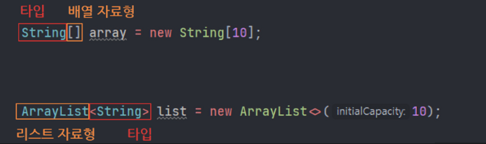
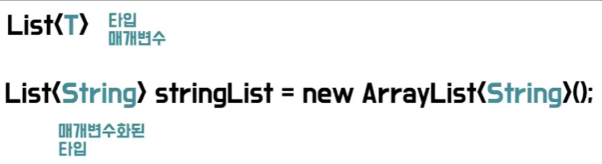
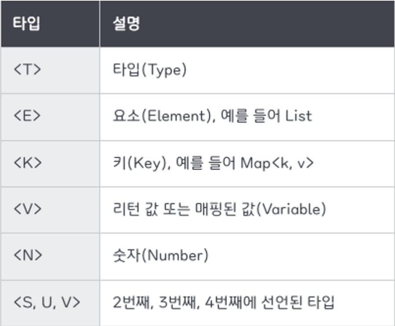

## 제네릭(Generic)

---

제네릭은 클래스 또는 메서드 내부에서 사용할 데이터 타입을 외부에서 사용자가 지정하는 기능이다. 이때 제네릭으로 사용되는 타입은 `Integer` 나 `String` 같은 참조 타입만 가능하다. 참조 타입이 가능하기 때문에 `사용자 정의 클래스 타입`으로도 명시할 수 있다.



<br>

### 제네릭 타입 매개변수

제네릭은 `<>` 꺾쇠 괄호 키워드를 사용하는데 이를 다이아몬드 연산자라고 한다. 그리고 이 꺾쇠 괄호 안에 식별자 기호를 지정해 파라미터 화 할 수 있다. 이것을 메서드가 매개변수를 받아 사용하는 것과 비슷하여 `타입매개변수`라고 한다.



제네릭에서 타입 매개변수로 할당 받을 수 있는 타입은 `Reference` 타입 뿐이다. 즉, `int` 같은 `Primitive` 타입은 제네릭 타입 파라미터로 넘길 수 없다.

또한, 제네릭 타입 파라미터에 클래스가 타입으로 오기 때문에 상속을 통해 관계를 맺는 객체 지향 프로그래밍의 다형성 원리가 적용된다.

```java
// 타입 매개변수로 Fruit을 지정했지만 업캐스팅을 통해 그 자식 객체도 할당이 가능함을 확인할 수 있다.

class Fruit { }
class Apple extends Fruit { }
class Banana extends Fruit { }

class FruitBox<T> {
    List<T> fruits = new ArrayList<>();

    public void add(T fruit) {
        fruits.add(fruit);
    }
}

public class Main {
    public static void main(String[] args) {
        FruitBox<Fruit> box = new FruitBox<>();

        // 제네릭 타입은 다형성 원리가 그대로 적용된다.
        box.add(new Fruit());
        box.add(new Apple());
        box.add(new Banana());
    }
}
```

<br>

### 타입 매개변수 기호 네이밍

타입 매개변수 식별자 기호는 문법적으로 정해져 있지는 않지만 아래 표와 같은 암묵적인 규칙이 존재한다. 예를 들어 `T` 같은 경우 타입 변수라고 하며, 임의의 참조형 타입을 의미한다.



<br>

### 제네릭 사용 이유와 이점

**[컴파일 타임에 타입 검사를 통해 런타임에 타입 변환으로 발생할 수 있는 예외를 방지]**

자바에서 제네릭은 `자바1.5`에 추가된 스펙이다. 그래서 `JDK 1.5` 이전에서는 여러 타입을 다루기 위해 인수나 반환값으로 `Object` 타입을 사용했었었다. 하지만 `Object`로 타입을 선언할 경우 반환된 `Object` 객체를 다시 원하는 타입으로 일일히 타입 변환을 해야 하며, 런타임 에러가 발생할 가능성도 존재하게 된다.

아래 예시처럼 `Apple` 객체 타입의 배열을 `FruitBox` 객체에 넣었는데, 개발자가 착각하고 `Banana`를 형변환하여 가져오려고 하였기 때문에 `ClassCastException` 이 발생하게 된다. 제네릭을 이용하면 이런 문제를 해결할 수 있다.

```java
class Apple {}
class Banana {}

class FruitBox {
    // 모든 클래스 타입을 받기 위해 최고 조상인 Object 타입으로 설정
    private Object[] fruit;

    public FruitBox(Object[] fruit) {
        this.fruit = fruit;
    }

    public Object getFruit(int index) {
        return fruit[index];
    }
}

public static void main(String[] args) {
    Apple[] arr = {
            new Apple(),
            new Apple()
    };
    FruitBox box = new FruitBox(arr);

    Apple apple = (Apple) box.getFruit(0);
    Banana banana = (Banana) box.getFruit(1); // ClassCastException 발생
}
```

<br>

**[타입을 지정 & 제한하여 불필요한 캐스팅을 없애 성능 향상]**

위의 예제 코드에서 `Apple` 배열을 `FruitBox`의 `Object` 배열 객체에 넣고, 배열 요소를 가져올때 반드시 다운 캐스팅(down casting)을 통해 가져와야 했다. 이는 곧 추가적인 오버헤드가 발생하는 것과 같다.

```java
Apple[] arr = { new Apple(), new Apple(), new Apple() };
FruitBox box = new FruitBox(arr);

// 가져온 타입이 Object 타입이기 때문에 일일히 다운캐스팅을 해야함 - 쓸데없는 성능 낭비
Apple apple1 = (Apple) box.getFruit(0);
Apple apple2 = (Apple) box.getFruit(1);
Apple apple3 = (Apple) box.getFruit(2);
```

반면 제네릭은 미리 타입을 지정 & 제한해두어 보다 효율적으로 코드를 작성할 수 있다.

```java
// 미리 제네릭 타입 파라미터를 통해 형(type)을 지정해놓았기 때문에 별도의 형변환은 필요없다.
FruitBox<Apple> box = new FruitBox<>(arr);

Apple apple = box.getFruit(0);
Apple apple = box.getFruit(1);
Apple apple = box.getFruit(2);
```

<br>

### 제네릭 사용시 주의사항

**[제네릭 타입의 객체는 `new` 연산자를 통한 객체 생성이 불가능하다.]**

제네릭 타입 자체로 타입을 지정하여 객체를 생성하는 것은 불가능하다. 즉, `new` 연산자 뒤에 제네릭 타입 파라미터가 올 수 없다.

```java
class Sample<T> {
    public void someMethod() {
        // Type parameter 'T' cannot be instantiated directly
        T t = new T();
    }
}
```

<br>

**[`static` 멤버에 제네릭 타입이 올 수 없다]**

`static` 멤버의 데이터 타입으로 제네릭 타입 매개변수를 사용하는 것은 불가능하다. 왜냐하면 `static` 멤버는 클래스가 동일하게 공유하는 변수로서 제네릭 객체가 생성되기 전에 이미 자료 타입이 정해져 있어야 하기 때문이다.

```java
class Student<T> {
    private String name;
    private int age = 0;

    // static 메서드의 반환 타입으로 사용 불가
    public static T addAge(int n) {

    }
}
```

<br>

**[제네릭으로 배열 선언 주의]**

기본적으로 제네릭 클래스를 타입으로 하는 배열을 만들 수는 없다.

```java
class Sample<T> {
}

public class Main {
    public static void main(String[] args) {
        Sample<Integer>[] arr1 = new Sample<>[10];
    }
}

// cannot create array with '<>' 에러 발생
```

하지만 제네릭 타입의 배열 선언은 허용된다. 위의 식과 차이점은 배열에 저장할 `Sample` 객체의 타입 파라미터를 `Integer` 로 지정한다는 뜻이다. 즉, `new Sameple<Integer>` 인스턴스는 저장이 가능하며, `new Sameple<String>`인스턴스는 저장이 불가능하다는 소리이다.
