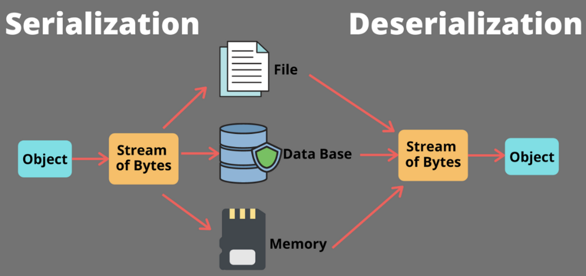
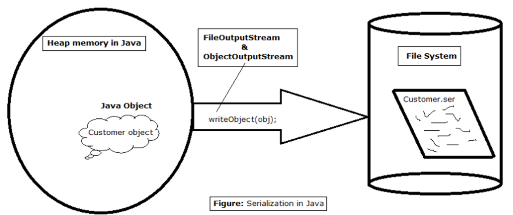
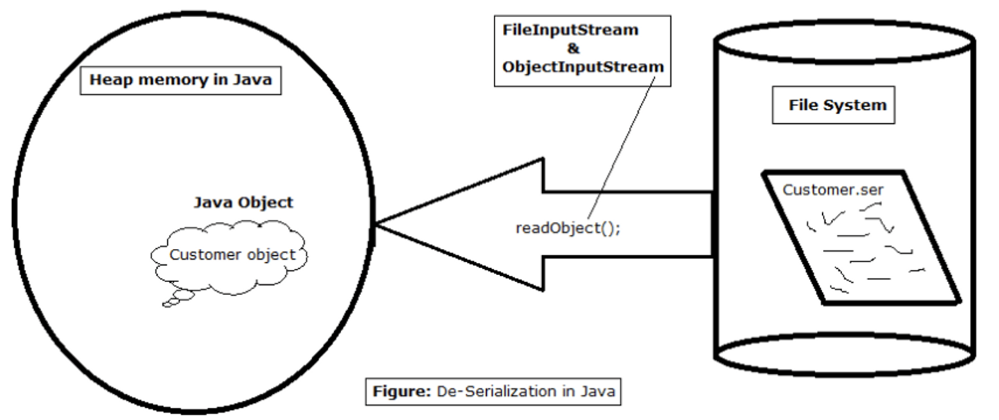
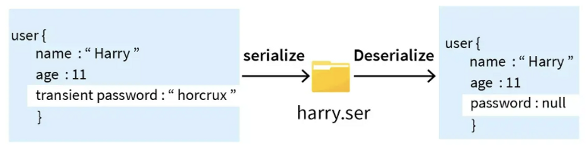

## 직렬화 & 역직렬화

---

### 데이터 직렬화

메모리를 디스크에 저장하거나 네트워크 통신에 사용하기 위한 형식으로 변환하는 기술을 말한다.

<br>

### 데이터 역직렬화

디스크에 저장한 데이터를 읽거나, 네트워크 통신으로 받은 데이터를 메모리에 쓸 수 있도록 변환하는 기술을 말한다.

<br>

### 데이터 직렬화의 종류

- `CSV, XML, JSON 직렬화`
- `Binary 직렬화`
- `Java 직렬화`

<br>

**[ CSV, XML, JSON 직렬화 ]**

사람이 읽을 수 있는 형태의 데이터로 저장 공간의 효율성이 떨어지고 파싱하는 시간이 오래 걸린다. 데이터 양이 적을 때 주로 사용하며 최근에는 JSON 형태의 데이터 직렬화를 많이 이용한다.

**[ Binary 직렬화 ]**

사람이 읽을 수 없는 형태로 저장 공간을 효율적으로 사용할 수 있고 파싱하는 시간이 빠르다. 데이터의 양이 많을 때 주로 사용한다.

**[ Java 직렬화 ]**

자바 시스템 간의 데이터 교환이 필요할 때 사용한다.

<br>

### 직렬화가 필요한 이유

데이터를 저장하는 방식은 기본적으로 스택에 메모리가 쌓이고 직접 접근이 가능한 `값 형식 데이터 ( int, float, char 등 )` 와 힙에 메모리가 할당되고, 스택에서는 이 힙 메모리를 참조하는 구조로 되어 있는 `참조 형식 데이터 ( 객체 등 )` 크게 2가지로 구분된다. 이 두 가지 형식의 데이터 중 디스크에 저장하거나 통신할 때는 `값 형식의 데이터`만 사용이 가능하다. `참조 형식 데이터`는 실제 데이터 값이 아닌 `힙`에 할당되어 있는 `메모리 주소`를 가지고 있기 때문이다.

<br>

따라서, 직렬화를 하게 되면 각 주소 값이 가지는 데이터를 가져와 값 형식 데이터로 변환해 준다. 직렬화 된 데이터는 저장하거나 통신할 때 파싱이 가능한 유의미한 데이터로 변환된다. 즉, 직렬화를 하는 이유는 사용하고 있는 데이터를 파일 저장 혹은 데이터 통신에서 파싱할 수 있는 유의미한 데이터를 만들기 위함이다.

<br>

> **[ 참조 형식의 데이터를 사용하지 못하는 이유 ]** <br>
> 예를 들어, 객체 `A`를 만들고 주소 값이 `0x0041123` 이라고 가정해보자. 이 값을 파일에 포함하여 저장하고 이후 프로그램을 종료하고 다시 실행해서 주소 값 `0x0041123` 을 가져오려고 하더라도 기존 `A` 객체를 가져올 수 없다. 왜냐하면 프로그램이 종료되면 기존에 할당 되었던 메모리는 해제되고 없어지기 때문이다.
>
> 네트워크 통신 역시 마찬가지로 각 PC마다 사용하고 있는 메모리 공간 주소는 전혀 다르다. 그러므로 내가 다른 PC로 전송한 `A` 객체 데이터 (`0x0041123`)는 무의미하다. 이 데이터를 받은 PC의 메모리 주소 `0x0041123` 에는 전혀 다른 값이 존재하기 때문이다.

<br>

### 자바의 직렬화(Serialize)

자바 언어에서 사용하는 `Object` 또는 `Data` 를 다른 컴퓨터의 자바 시스템에서도 활용할 수 있도록 `바이트 스트림(stream of bytes)` 형태의 `연속적인(serial) 데이터`로 변환하는 포맷 변환 기술로 `JVM 메모리`에 상주( `힙` 또는 `스택` )되어 있는 `객체 데이터`를 `바이트 형태`로 변환하는 기술이다.

<br>

### 자바의 역직렬화(Deserialize)

바이트로 변환된 데이터를 원래대로 자바 시스템의 `Object` 또는 `Data`로 변환하는 기술로 직렬화된 바이트 형태의 데이터를 `Object` 또는 `Data` 로 변환하여 `JVM` 에 위치시킨다.

<br>



<br>

> **[ 바이트 스트림 ]** <br>
> 스트림은 클라이언트나 서버 간에 출발지 목적지로 입출력하기 위한 데이터 흐르는 통로를 말한다. 자바는 스트림의 기본 단위를 바이트로 두고 있기 때문에 네트워크, 데이터베이스로 전송하기 위해 최소 단위인 바이트 스트림으로 변환하여 처리한다.

<br>

### 자바 직렬화의 장점

- 자바 직렬화는 자바의 고유 기술인 만큼 자바 시스템에서 개발에 최적화 되어 있다.
- 복잡한 데이터 구조의 객체라도 직렬화의 조건만 지키면 큰 작업 없이 직렬화와 역직렬화가 가능하다.
- 데이터 타입이 자동으로 맞춰지기 때문에 역직렬화가 되면 기존 객체처럼 바로 사용이 가능하다.

> **[ 자바 직렬화의 장점 보충설명 ]** <br>
> 자바의 컬렉션이나 클래스 인터페이스 타입등 사용자가 커스텀으로 자료형 타입을 만들어 사용하는 경우 이들을 외부로 전송하기 위해서는 각 데이터를 매칭시키는 별도의 파싱이 필요하다. 하지만, 직렬화를 이용하면 기본조건만 지킨다면 큰 작업없이 바로 외부로 전송할 수 있으며 역직렬화를 통해 읽어 들이면 데이터 타입이 자동으로 맞춰지기 때문에 자바 클래스의 기능들을 곧바로 이용할 수 있다. 그래서 직렬화된 문자열을 데이터베이스에 저장해두고 꺼내 쓰기도 한다.

<br>

### 자바 직렬화 문제점

- 직렬화는 객체에 저장된 데이터 뿐만 아니라 타입 정보, 클래스 메타 정보 등을 가지고 있어 용량이 크다.
- 역직렬화는 버그와 보안에 취약하다.
- 직렬화된 객체는 변경이 어렵다. 클래스의 구조가 변경되면 역직렬화시 문제가 발생한다.
- 직렬화를 하게 되면 그대로 외부로 노출되어 클래스의 캡슐화가 깨진다.

<br>

### 자바 직렬화의 사용예시

직렬화를 사용한다면 휘발성이 있는 캐싱 데이터를 영구 저장이 필요할 때 사용할 수 있다. 예를 들어, JVM 메모리에 상주되어 있는 객체 데이터가 시스템 종료 후에도 나중에 다시 재사용이 될 수 있을 때 영속화 ( Persistence ) 를 해두면 좋다.

**[ 서블릿 세션 ( Servlet Session ) ]**

단순히 세션을 서블릿 메모리 위에서 운용한다면 직렬화를 필요로 하지 않지만, 만일 세션 데이터를 파일로 저장하거나 DB에 저장 또는 세션 클러스터링을 통해 각 서버간에 데이터 공유가 필요하면 직렬화를 이용한다.

**[ 캐시 ( Cache ) ]**

데이터 베이스로부터 조회한 객체 데이터를 다른 모듈에서도 필요할 때 재차 `DB`를 조회하는 것이 아니라 객체를 직렬화하여 메모리나 외부 파일에 저장해 두었다가 역직렬화하여 사용하는 캐시 데이터로서 이용이 가능하다. 자바 직렬화를 이용해서만 캐시를 저장할 수 있는 것은 아니지만 자바 시스템에서 만큼은 구현이 간편하기 때문에 많이 사용된다. ( 단, 요즘은 `Redis` 와 같은 캐시 DB를 많이 사용한다. )

**[ 자바 RMI ]**

원격 시스템 간의 메시지 교환을 위해서 사용하는 자바에서 지원하는 기술이다. 원격 시스템에 전달하는 메시지를 자동으로 직렬화하고 전달 받는 원격 시스템에서는 메시지를 역직렬화하여 사용한다. ( 최근에는 소켓을 이용하기 때문에 사용하지 않는다. )

<br>

### 자바 직렬화 사용법

자바 직렬화를 사용하기 위해서는 `java.io.Serializable 인터페이스` 를 구현해야 한다. 그렇지 않으면 `NotSerializableException` 런타임 예외가 발생한다.

```jsx
import java.io.Serializable;

class Customer implements Serializable {
    int id; // 고객 아이디
    String name; // 고객 닉네임
    String password; // 고객 비밀번호
    int age; // 고객 나이

    public Customer(int id, String name, String password, int age) {
        this.id = id;
        this.name = name;
        this.password = password;
        this.age = age;
    }

    @Override
    public String toString() {
        return "Customer{" +
                "id=" + id +
                ", password='" + password + '\'' +
                ", name='" + name + '\'' +
                ", age=" + age +
                '}';
    }
}
```

<br>

직렬화에는 `ObjectOutputStream` 을 사용한다. 객체가 직렬화 될때 오직 객체의 인스턴스 필드값 만을 저장한다. `static` 필드나 메서드는 직렬화하여 저장하지 않는다.

```jsx
public static void main(String[] args) {
    // 직렬화할 고객 객체
    Customer customer = new Customer(1, "홍길동", "123123", 40);

    // 외부 파일명
    String fileName = "Customer.txt";

    // 파일 스트림 객체 생성 (try with resource)
    try (
            FileOutputStream fos = new FileOutputStream(fileName);
            ObjectOutputStream out = new ObjectOutputStream(fos)
    ) {
        // 직렬화 가능 객체를 바이트 스트림으로 변환하고 파일에 저장
        out.writeObject(customer);

    } catch (IOException e) {
        e.printStackTrace();
    }
}
```

<br>



코드를 실행하면 `Customer.txt` 파일이 생성된다.

<br>

### 자바의 역직렬화 사용법

역직렬화에는 `ObjectInputStream` 을 사용한다. 단, 역직렬화 할 때 주의사항이 있는데, 직렬화 대상이 된 객체의 클래스가 외부 클래스라면 클래스 경로에 존재해야 하며 `import` 된 상태여야 한다.

```jsx
public static void main(String[] args) {
    // 외부 파일명
    String fileName = "Customer.txt";

    // 파일 스트림 객체 생성 (try with resource)
    try(
            FileInputStream fis = new FileInputStream(fileName);
            ObjectInputStream in = new ObjectInputStream(fis)
    ) {
        // 바이트 스트림을 다시 자바 객체로 변환 (이때 캐스팅이 필요)
        Customer deserializedCustomer = (Customer) in.readObject();
        System.out.println(deserializedCustomer);

    } catch (IOException | ClassNotFoundException e) {
        e.printStackTrace();
    }
}
```

<br>



<br>

이렇게 역직렬화를 이용하게 되면, 직렬화된 외부 파일만 있으면 생성자로 객체 초기화 없이 바로 객체에 정보를 가져와 인스턴스화 하여 사용할 수 있게 된다.

<br>

### 직렬화 요소 제외

객체의 모든 인스턴스를 직렬화 하기에는 너무 무겁거나 혹은 중요한 정보는 외부에 노출시키고 싶지 않은 경우 직렬화 할 요소를 직접 선택할 필요가 있다. 이때 사용되는 것이 `transient 키워드` 이다.

간단하게 변수 정의문 옆에 `transient` 을 명시해주면 알아서 직렬화 대상에서 제외 되도록 할 수 있다. `transient` 이 붙은 인스턴스 변수의 값은 그 타입의 기본값으로 직렬화 된다. 단, 직렬화 대상에서 제외하는데 있어 그 데이터가 실제로 필요가 없는지, 제외하였을 경우 서비스 장애에 이상이 없는지 고려해야 한다.

```jsx
class Customer implements Serializable {
    int id;
    String name;
    transient String password; // 직렬화 대상에서 제외
    int age;

    public Customer(int id, String name, String password, int age) {
        this.id = id;
        this.name = name;
        this.password = password;
        this.age = age;
    }

    ...
}
```

<br>



<br>

### Reference

[[Java] 직렬화와 역직렬화](https://steady-coding.tistory.com/576)

[☕ 자바 직렬화(Serializable) - 완벽 마스터하기](https://inpa.tistory.com/entry/JAVA-%E2%98%95-%EC%A7%81%EB%A0%AC%ED%99%94Serializable-%EC%99%84%EB%B2%BD-%EB%A7%88%EC%8A%A4%ED%84%B0%ED%95%98%EA%B8%B0)
