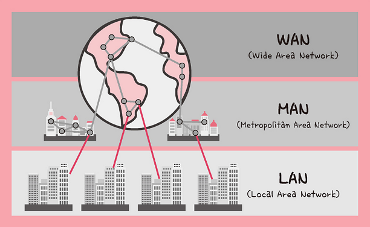
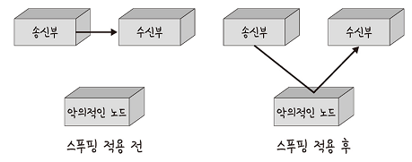
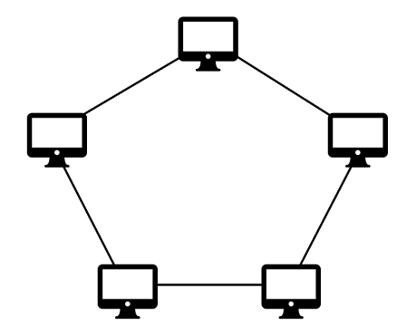

# 네트워크 기초 용어

### 네트워크란?

네트워크란 컴퓨터 등의 장치들이 **통신 기술을 이용하여 구축하는 연결망**을 지칭하는 용어다. 네트워크는 `노드(node)`와 `링크(link)`로 구성되어 있으며, **리소스를 공유**한다. 

> "몇 개의 독립적인 장치가 적절한 영역 내에서 적당히 빠른 속도로 물리적 통신 채널을 통하여 서로가 직접 통신할 수 있도록 지원해주는 데이터 통신 체계" _ IEEE(국제 전기 전자 공학회)

```
💡노드(node)
컴퓨터, 서버, 라우터, 스위치 등의 네트워크 장치

💡링크(link)
유선 또는 무선
```

<br>

### 처리량, 트래픽, 대역폭

처리량(throughput)이란 링크 내에서 **성공적으로 전달된 데이터의 양**을 말한다. 단위로는 `bps`(bits per second)를 사용하며 초당 전송(수신)된 비트 수를 나타낸다. 처리량은 보통 얼마만큼의 트래픽을 **처리했는지**를 나타내며 트래픽, 대역폭, 네트웨크 에러, 하드웨어 스펙 등에 영향을 받는다. 

![출처: [면접을 위한 CS 전공지식 노트]](./img/throughput.png)

출처: [면접을 위한 CS 전공지식 노트](https://product.kyobobook.co.kr/detail/S000001834833)

 

```
💡트래픽
특정 시점에 링크 내에 흐르는 데이터의 양

💡대역폭
일정 시간 동안 네트워크 연결을 통해 흐를 수 있는 최대 비트 수

“트래픽이 많아졌다” → “흐르는 데이터가 많아졌다”
“처리량이 많아졌다” → “처리된 트래픽이 많아졌다”
```

예를 들어 `100Mbps`의 대역폭을 가진 A서버가 있을 때, 이 서버는 1초에 최대 `100,000,000 bit` (1억 비트)의 데이터가 흐를 수 있다. 이때, 실제로 100명의 사용자가 `100kbps`로 파일 다운로드 요청을 보낸다면 누적 트래픽은 `100 X 100,000 bit = 10,000,000 bit`가 되는 것이다. 그리고 해당 트래픽이 모두 처리된다면 처리량은 `10Mbps` (1초에 천만비트 처리)가 된다. 

<br>

비트가 아닌 컴퓨터 저장매체에서 보통 사용하는 바이트(B)단위로 위의 내용을 정리해보면 아래와 같다

```
[A서버의 대역폭 = 100Mbps]
→ 초당 12.5MB 흐를  수 있음
*100M bit → 100,000,000 bit → 12,500,000 byte → 12.5MB


[100명의 사용자가 100kbps로 다운로드 요청 시]
트래픽: 100 X 12.5KB = 1250KB


[모든 트래픽이 처리될 때]
처리량: 10Mbps (1초당 1250KB 처리)
```

### 지연시간

지연시간(latency)이란 **네트워크를 통해 요청이 처리되는 시간**을 말하며 어떤 메시지가 두 장치 사이를 왕복하는 데 걸리는 시간을 의미한다. 즉, 특정 데이터 요청 시간부터 응답 데이터 수신 시간까지의 간격을 말한다. 

지연시간은 매체 타입(유선, 무선), 패킷 크기, 라우터의 패킷 처리 시간에 영향을 받는다. ‘좋은’ 네트워크를 구축하기 위해선 지연 시간이 짧고 장애빈도가 적으으며 좋은 보안을 갖추어야 한다. 

<br>
<br>

# 규모에 따른 네트워크 분류

네트워크는 규모를 기반으로 LAN, MAN, WAN으로 구분할 수 있다. 



출처: [면접을 위한 CS 전공지식 노트](https://product.kyobobook.co.kr/detail/S000001834833)

### LAN(Local Area Network)

- `근거리 통신망`을 의미하며, **같은 건물이나 캠퍼스, 사무실**같은 좁은 구역에서 운영
- 전송 속도가 빠르고, 혼잡하지 않음


### MAN(Metropolitan Area Network)

- `대도시 지역 네트워크`를 의미하며, **도시 같은 넓은 지역**에서 운영된다.
- 여러 LAN이 모여 MAN을 구성한다.
- 전송 속도는 평균이고, LAN보다 혼잡


### WAN(Wide Area Network)

- `광역 네트워크`를 의미하며, **국가 또는 대륙같은 보다 넓은 지역**에서 운영된다.
- MAN과 MAN이 연결되어 이루어진 형태
- 전송속도는 낮으며, MAN보다 더 혼잡

<br>
<br>

# 네트워크 토폴로지

> **토폴로지**(망구성방식)는 컴퓨터 네트워크의 요소들(링크, 노드 등)을 물리적으로 연결해 놓은 것, 또는 그 연결 방식을 말한다. _ 위키백과
 
<br>

### 트리 토폴로지


- 계층형 토폴로지라고 하며 트리형태로 네트워크를 구성
- 노드의 추가, 삭제 용이
- 특정 노드에 트래픽이 집중될 때, 하위 노드에 영향
<br>

### 버스 토폴로지


- 선형 토폴로지라고도 하며 중앙 통신 회선 하나에 여러 노드가 연결되어 공유하는 구성
- LAN(근거리 통신망)에서 주로 사용
- 중앙통신 회선에 노드 추가, 삭제 용이
- 스푸핑이 가능한 문제점이 있음

> **스푸핑** <br>LAN상에서 시스템이 잘못된 정보를 신뢰하고 받아들이게끔 속여 정상적인 수신부가 아닌 원하는 특정 노드에 패킷이 오도록 처리하는 것을 말함<br>
> 

<br>

### 스타 토폴로지


- 중앙에 있는 노드에 모두 연결된 네트워크 구성
- 노드 추가, 에러 탐지하기 용이
- 패킷의 충돌 발생 가능성이 낮음
- 중앙 노드가 아닐 경우 장애가 생기더라도 다른 노드에 영향 적음
- 중앙 노드에 장애가 발생하면 네트워크가 마비
- 설치비용이 고가
<br>

### 링형 토폴로지



- 각각의 노드가 양 옆의 두 노드와 연결되어 하나의 연속된 길을 통해 통신하는 구성방식
- 노드 수가 증가되어도 네트워크상 손실이 거의 없음
- 충돌 발생 가능성이 낮고 노드의 장애 발견 쉬움
- 네트워크 구성 변경 힘듦
- 회선에 장애가 발생하면 전체 네트워크에 큰 영향
<br>

### 메시 토폴로지


- 망형 토폴로지라고도 하며 노드가 그물망처럼 서로 연결
- 하나의 노드에 장애가 발생해도 여러 경로가 존재하기 때문에 네트워크를 계속 사용 가능
- 트래픽의 분산처리가 가능
- 노드 추가가 어렵고 구축 및 운용 비용이 고가
