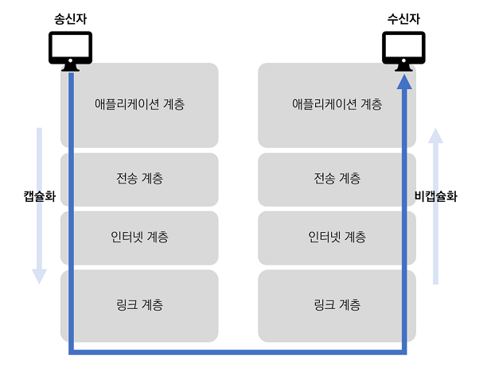

# 인터넷 프로토콜 스위트

인터넷 프로토콜 스위트(Internet protocol suite)은 인터넷에서 정보를 주고받는 데 이용되는 **통신 프로토콜의 모음**이다. 이를 보통 `TCP/IP 4계층 모델`과 `OSI 7계층 모델`로 설명한다. 

> **프로토콜 (protocol)**
>
> -컴퓨터 내부 또는 컴퓨터 사이에서 **데이터의 교환 방식을 정의하는 규칙 체계**
>
> -기기 간 통신은 교환되는 데이터의 형식에 대해 상호 합의를 요구하는데, 이런 형식을 정의하는 규칙의 집합을 프로토콜이라고 한다.
> 

# 네트워크 계층구조

컴퓨터 간 서로 통신하기 위해선 하나의 프로토콜로만 이루어질 수 없다. 통신 프로토콜의 집합은 프로토콜의 네트워킹 범위에 따라 **추상화 계층으로 구분**할 수 있으며 대표적으로 `OSI 7계층`과 `TCP/IP 4계층` 모델로 프로토콜들을 각 계층으로 추상화하고 설명할 수 있다. 

각 계층들은 특정 계층이 변경되었을 때 **다른 계층이 영향을 받지 않도록 유연하게 설계**되어있다. 예를들어 전송계층에 해당하는 TCP를 UDP로 변경하더라고 다른 계층의 프로토콜에게 영향을 주지 않는다. 

# 데이터 송수신 과정

TCP/IP 4계층 모델에서 데이터 송수신 과정

송신자가 수신자에게 데이터를 보내는 과정은 위의 그림과 같다. 송신자가 전송 요청을 보내면 상위 계층에서 하위 계층으로 데이터가 전달되면서 **필요한 정보를 데이터에 포함시키는 캡슐화** 과정이 이루어지고, 수신자의 하위계층에서 해당 정보를 전달받으면 캡슐화 시킨 데이터 단위에서 **정보를 제거하는 비캡슐화 과정**을 거쳐 최종적으로 수신자에게 전달된다. 각 계층 사이에 전달되는 데이터의 단위를 `PDU`라고 부르며 가장 최하위 계층에선 최종적으로 데이터를 전기적인 신호(0과 1)로 변환하여 주고받는다. 

### PDU

PDU(Protocol Data Unit)는 각 계층의 프로토콜에서 **처리하는 한 덩어리의 데이터 단위**를 말한다. 이 데이터 단위는 제어 관련 정보가 포함된 `헤더` 부분과 데이터를 의미한는 `페이로드` 로 구성되어 있으며, 이 데이터 단위를 부르는 명칭은 각 계층마다 다르다. 

 

### 캡슐화

캡슐화 과정은 상위 계층의 헤더와 데이터를 하위 계층의 데이터 부분에 포함시키고 해당 계층의 헤더를 삽입하는 과정을 말한다. 

`해당 계층의 PDU = 상위 계층 데이터 + 해당 계층 헤더`

TCP/IP 4계층에서 캡슐화 과정

- 애플리케이션 계층 → 전송계층 : TCP 헤더 추가 (세그먼트화, 데이터그램화)
- 전송계층 → 인터넷 계층 : IP 헤더 추가 (패킷화)
- 인터넷 계층 → 링크 계층 : 프레임 헤더 추가, 트레일러 추가 (프리엠화)
- 최종적으로 전기 신호로 변환 → 수신 측에 전달

*트레일러: 데이터 전송 시 마지막에 추가하는 정보 

### 비캡슐화 (역캡슐화)

비캡슐화 과정은 하위 계층에서 상위 계층으로 가며 각 계층의 **헤더 부분을 제거**하는 과정을 말한다. 송신 측에서 보낸 캡슐화된 데이터를 전달 받으면 링크 계층에서부터 애플리케이션 계층까지 올라오며 **프레임화**된 PUD가 **메시지화**된다.

 

# OSI 7계층

OSI (Open Systems Interconnection) 7계층은 네트워크에서 **프로토콜을 통해 통신하는 구조를 7개의 계층으로 분리**하여 계층 간 상호 작용하는 방식을 정해놓은 것이다. ISO(국제표준화기구)에서 개발한 네트워크 표준 모델이다. OSI 7계층을 OSI 참조 모델이라고도 부르는데, 누구나 OSI 7계층을 참조에 모든 통신 장치를 만들기 때문이다. 모델의 **각 계층은 독립**되어있기 때문에 특정 계층에 이상이 생기더라도 다른 계층에 영향을 주지 않는다. 

### 7계층 애플리케이션 계층

최상위 계층으로 사용자에게 네트워크 자원에 접근 가능하도록 **인터페이스를 제공**한다. 사용자가 최종적으로 볼 수 있는 유일한 계층으로 사용자가 실제로 실행하는 **응용 프로그램**들이 이 계층에 속한다. 예를 들어 브라우저, 이메일 등의 서비스들을 제공한다. 

📃프로토콜: HTTP, FTP, SMTP, DNS, POP3, IMAP, Telnet 등

📍PUD: 메시지

### 6계층 표현 계층

표현 계층에서는 전송하는 **데이터의 표현 방식을 결정**한다. 응용 계층과 세션 계층 사이에서 데이터를 **읽을 수 있는 형식으로 변환**하는데, 데이터의 **인코딩과 디코딩**이 이루어진다. (응용→세션: 세션 계층에 맞게 변환, 세션→응용: 응용 계틍에 맞게 변환) 또한 데이터의 안전을 위해 **암호화 및 복호화** 과정도 해당 계층에서 이루어진다. 

📃프로토콜: JPEF, MPEG, GIF, ASCII, AFP, PAP 등

📍PUD: 메시지

### 5계층 세션 계층

세션 계층에서는 두 노드(네트워크 장치) 사이의 세션을 관리하며 **포트를 기반**으로 연결한다. 모든 노드 간에 **연결을 설정 및 관리**하고 연결 형태 (전이중, 반이중) 확인, TCP/IP 세션 생션, 전송 중단 시 복구 등의 기능을한다. 

📃프로토콜: SSH, NetBIOS 등

📍PUD: 메시지

*세션: 일정시간 동안 같은 사용자로부터 들어오는 일련의 요구를 하나의 상태로 보고 그 상태를 일정하게 유지하는 기술을 말함

### 4계층 전송 계층

전송 계층에서는 하위 계층에 **신뢰할 수 있는 데이터 전송 서비스**를 제공한다. 즉, 노드 간 신뢰성 있는 데이터를 서로 주고받을 수 있도록 하여 상위 계층에서 데이터 전달 과정에 대해 생각하지 않도록 도와준다. **시퀀스 넘버 기반**의 오류 제어 방식을 사용하며 **흐름제어, 데이터 분리** 등을 통해 오류없이 상대 노드로 데이터가 전달되게 한다. 

📃프로토콜: TCP(신뢰성, 연결지향적), UDP(비신뢰성, 비연결성)

📍PUD: 세그먼트(TCP), 데이터그램(UDP)

📠 장비: 게이트 웨이

### 3계층 네트워크 계층

OSI 7계층 중 가장 복잡한 계층 중 하나로 실제 **네트워크 간 라우팅**을 담당한다. 즉, 데이터를 **목적지까지 가장 안전하고 빠르게 전달**하는 역할을 맡고있으며 라우터를 통해 경로를 선택하여 **논리 주소(IP)**를 정하고 경로에 따라 패킷을 전달한다. 상대방이 제대로 받았는지에 대해 보장하지 않는 **비연결형적인 특징**을 가지고 있다. (**낮은 신뢰성** → 상위 계층에서 패킷 분실 오류 복구)

*라우팅: 어떤 네트워크 안에서 통신 데이터를 짜여진 알고리즘에 의해 최대한 빠르게 보낼 최적의 경로를 선택하는 과정

> **라우팅으로 인한 “안전”한 전달, 하지만 낮은 신뢰성??**
> 
> 
> 네트워크 계층에선 목적지까지 데이터가 정확하고 신속히 올바른 경로로 라우팅한다는 의미에서 “안전”이라는 표현을 사용했다. 패킷이 **도착지에 오류없이 도달하고 잘못된 경로로 전달되거나 손실되지 않도록** 하는 것을 말한다. 
> 
> 하지만 네트워크 계층은 비연결형 프로토콜을 기반으로 동작한다. 이 의미는 패킷이 독립적으로 처리되어 **독립적인 경로로 전달**된다는 것을 의미한다. 이런 특성으로 인해 패킷이 목적지로 이동하는 동안 다른 경로를 통해 전달될 수 있으며 **패킷의 손실이 발생**할 수 있다. 
> 
> 결론적으로 네트워크 계층에서는 **패킷의 정확한 도착을 보장하지 않으며** 패킷의 신뢰성과 도착보장을 위해선 상위 계층에서 패킷 분실 오류를 복구해야 한다. 
> 

📃프로토콜: IP, RIP, ARP, ICMP

📍PUD: 패킷

📠 장비: 라우터

### 2계층 데이터 링크 계층

데이터 링크 계층에서는 **물리적인 네트워크를 통해 데이터를 전송**한다. 1홉 통신을 담당한다고도 표현한다. 프레임에 **물리적 주소(MAC 주소)를 부여**하고 에러검출, 재전송, 흐름 제어 등을 통해 포인트 투 포인트 간 신뢰성 있는 전송을 보장한다.  

*홉(hop): 컴퓨터 네트워크에서 노드에서 다음 노드로 가는 경로를 말한다. 1홉 통신이라는 뜻는 한 라우터에서 그 다음 라우터까지의 경로를 의미.

📃프로토콜: Ethernet, PPP, HDLC 등

📍PUD: 프레임

📠 장비: 브릿지, 스위치, 이더넷

### 1계층 물리 계층

최하위 계층으로 **데이터가 전송되는 물리적인 매체**이다. 데이터 링크 계층으로 부터 프레임을 받고 0과 1로 이루어져있는 **전기적 신호로 변환** 후 구리나 광섬유 또는 무선 통신 **매체를 통해 전송**한다. OSI 7계층 중 가장 복잡한 계층으로 간주된다. 

📃프로토콜: RS-232, RS-449 등 케이블

📍PUD:  비트

📠 장비: 통신 케이블, 리피터, 허브 등

[http://wiki.hash.kr/index.php/OSI_7_계층#cite_ref-1](http://wiki.hash.kr/index.php/OSI_7_%EA%B3%84%EC%B8%B5#cite_ref-1)

# TCP/IP 4계층

TCP/IP는 문자 그대로 보면 OSI 7계층 구조에서 봤던 3계층의 전송제어 프로토콜(TCP)와 4계층의 인터넷 프로토콜(IP)를 의미한다. 하지만 TCP/IP 4계층 구조는 단순히 두 프로토콜만을 말하는 것이 아닌 **프로토콜 스위트(프로토콜 집합) 중 TCP와 IP가 포함된 프로토콜 집합**을 말한다.

OSI 7계층은 표준이되는 모델이긴 하지만 실질적으로 구현되는 사례가 없는 반면 TCP/IP 4계층은 현재 많은 프로그램들이 인터넷으로 통신하는데 있어 **가장 기반이 되는 모델**이다. 

### 4계층 애플리케이션 계층

OSI 7계층에서 7,6,5 계층에 해당한다. **네트워크, 이메일, 웹 등의 서비스를 제공**하기 위해 **응용 프로그램들**이 표준적인 인터페이스를 제공한다. 

📃프로토콜: HTTP, FTP, SMTP, DNS, SSH 등

📍PUD: 메시지

### 3계층 전송 계층

OSI 7계층에서 4계층인 전송 계층에 해당한다. 노드 사이 **신뢰성 있는 전송기능**을 제공하며 시스템의 논리 주소와 포트를 이용해 상위 계층의 프로세스를 연결해 통신한다. 정확한 패킷의 전송을 보장하는 **TCP**와 정확한 전송을 보장하지 않는 **UDP** 프로토콜이 있다. 

📃프로토콜: TCP(신뢰성, 연결지향적), UDP(비신뢰성, 비연결성)

📍PUD: 세그먼트(TCP), 데이터그램(UDP)

📠 장비: 게이트 웨이

### 2계층 인터넷 계층

OSI 7계층에서 3계층인 네트워크 계층에 해당한다. 상위 전송계층에서 받은 데이터에 IP 패킷 헤더를 붙여 **IP 패킷을 만들어 논리 주소를 전달**하고 정해진 목적지까지 **라우팅하는 계층**이다. 상대방이 제대로 받았는지에 대해 보장하지 않는 **비연결형적인 특징**을 가지고 있다. (상위 계층에서 패킷 분실 오류 복구)

📃프로토콜: IP, RIP, ARP, ICMP

📍PUD: 패킷

📠 장비: 라우터

### 1계층 링크 계층 (네트워크 접근 계층)

OSI 7계층에서 2,1계층에 해당한다. 운영체제의 네트워크 카드, 디바이스 드라이버 등과 같은 **하드웨어적 요소와 관련된 모든 것**을 지원한다. 상위 계층인 인터넷 계층으로부터 받은 패킷에 **물리적 주소(MAC)가 담긴 헤더를 추가**하여 프레임을 만들고 프레임을 물리계층으로 전달한다. 

📃프로토콜: Ethernet, PPP, HDLC 등

📍PUD: 프레임

📠 장비: 브릿지, 스위치, 이더넷

http://wiki.hash.kr/index.php/TCP/IP

---

# TCP vs UDP

네트워크 계층 중 전송 계층에서 사용하는 프로토콜은 **가상회선 패킷 교환 방식을 사용하는 `TCP`**와 **데이터그램 패킷 교환 방식을 사용하는 `UDP`**로 나눌 수 있다. 

> **패킷 교환**
네트워크에서 데이터를 전송하기 위해 사용되는 기술적인 프로세스로 데이터를 패킷으로 분할하고 네트워크를 통해 목적지로 전송하는 과정
통신 기간(연결 기간) 동안 독점적인 사용을 위해 두 노드 사이를 연결(전용 채널)하는 회선 교환 방식과 달리, 패킷 교환 방식은 데이터를 전송하는 동안만 네트워크 자원을 사용한다.
> 

TCP의 연결과정과 연결해제 과정 간략 표현

## TCP (Transmission Control Protocol)

패킷 사이의 **순서를 보장**하고 **연결지향** 프로토콜을 사용하여 신뢰성을 구축해 수신 여부를 확인한다. **가상회선 패킷 교환** 방식 사용

데이터를 메시지 형태로 보내기 위해 IP와 함께 사용하는 프로토콜이다. 인터넷 계층에서 IP데이터를 네트워크 계층으로 전달하면 TCP는 해당 패킷을 추적 및 관리한다. 

- **연결 지향 서비스**
    - **연결 설정** : `3-way handshake` → 논리적 경로 확보
    - **연결 해제** : `4-way handshake`
    - **흐름제어**: 데이터 처리 속도 조절(슬라이딩 윈도우 사용) → 수신자 버퍼 오버플로우 방지
    - **혼잡제어** : 네트워크 내 패킷 수가 과도하게 증가하지 않게 방지
    - **에러제어**: 세그먼트의 손실 및 훼손, 순서가 어긋난 경우, 중복된 경우에 대한 처리
    - **에러 정정**: ARQ(Automatic Repeat Request)
- **전이중방식** → 양방향 통신 동시 가능
- **점대점**(point to point) **방식**→ 멀티캐스팅, 브로드 캐스팅 X
- 활용 서비스: 웹, 메일, 파일 전송(FTP, SFTP), 터미널 접속,…

### 가상회선 패킷 교환 방식

출처: ****면접을 위한 CS 전공지식 노트****

각 패킷에는 가상회선 식별자가 포함되며 모든 패킷을 전송하면 가상회선이 해제되고 패킷들은 전송된 순서대로 도착하는 방식을 말한다. 

- 패킷이 전송되기 전 논리적 접속 설정
- 첫 번째 패킷 전송 전 패킷 헤더에 있는 목적지를 바탕으로 최적의 경로 설정(라우팅)
- 그 이후 패킷은 설정된 경로에 따라 데이터 전송
- 연결지향 네트워크 서비스

## UDP (User Datagram Protocol)

패킷 사이의 **순서를 보장하지 않고** **비연결지형** 프로토콜을 사용하여 수신여부를 확인하지 않는다. 단순히 데이터만 주는 **데이터그램 패킷 교환** 방식 사용

- **비연결형 서비스**
    - 데이터 **수신 여부 확인 X** → TCP의 연결, 해제 과정 필요 없음
    - **흐름 제어, 혼잡 제어 X** →  낮은 신뢰성
- TCP보다 빠른 속도
- `1:1`, `1:N`, `N:N` 통신 가능
- 활용 서비스: 실시간 스트리밍, 음성, 파일전송(TFTP), …

### 데이터그램 패킷 교환 방식

출처: ****면접을 위한 CS 전공지식 노트****

패킷이 독립적으로 이동하며 최적의 경로를 선택하는 방식을 말한다. 하나의 메시지에서 분할된 여러 패킷은 서로 다른 경로로 전송될 수 있으며 도착한 순서가 다른 수 있다. 

- 송신 호스트가 전송하는 패킷마다 경로 배정(라우팅)이 서로 독립적
- 패킷마다 서로 다른 경로를 선택하며 목적지에 전달될 수 있음
- 패킷이 특정 노드에 도착할 당시 목적지까지의 최적 경로를 선택
(노드마다, 매 순간마다 최적 경로 선택)
- 패킷 마다 독립적으로 전송되기 때문에 도착지에 도착하는 패킷의 순서가 바뀔 수 있음
- 송신 호스트는 메시지를 패킷으로 나누는 과정에 일련번호를 지정하므로써 수신 호스트가 패킷을 올바르게 조립할 수 있도록 함(수신자, 순서를 맞추기위한 버퍼를 두어 재조립→상위계층으로 올림)
- 비연결형 네트워크 서비스
- 송신 호스트와 수신 호스트 사이 긴 메시지를 긴 시간 동안 교환할 경우 가상 회선 방식 유리

---

# TCP 연결 및 연결해제 과정 (3-way handshake / 4-way handshake)

TCP는 **신뢰성을 확보**하기 위해 송수신자 사이 `연결과정`과 `연결 해제 과정` 작업을 진행한다. 

### 기초 지식

**제어 플래그(코드 비트)**
세그먼트 헤더에 있는 영역으로 TCP 연결 회선 및 데이터를 제어하기 위한 비트이다. 6개의 종류가 있는데 TCP 연결 및 해제에선 아래 3개의 종류만 사용된다. 
****
`ACK`: Acknowledgement의 약자로 “응답”을 의미하는 플래그
`SYN`: Synchronize의 약자로 “연결 요청”을 의미하는 플래그
`FIN`: Finish의 약자로 “연결 해제 요청”을 의미하는 플래그

초기값: `0` / 활성시: `1`

**포트 상태 정보**

각 호스트의 포트 상태를 의미

`CLOSED` : 포트가 닫힌 상태

`LISTEN` : 포트가 열린 상태로 연결 요청 대기 중

`SYN_SENT` : SYN요청을 보내고 SYN+ACK 응답을 기다리는 상태

`SYN_RECEIVED` : SYN 요청을 받고 상대방의 응답을 기다리는 상태

`ESTABLISHED` : 포트 연결 상태

### 연결 과정 (3-way handshake)

통신할 네트워크 장치 간 **논리적 접속(Establish) 상태**를 만들기 위해 `3-way handshake` 방법을 사용한다. 이 과정을 위해 TCP의 세그먼트 **헤더에 존재**하는 플래그(코드 비트)에서 `ACK` 와 `SYN` 비트가 사용된다. 

**step1: SYN 단계**

**“연결 요청”**
클라이언트가 서버에 `클라이언트ISN`을 담아 `SYN`을 보낸다. 

*ISN은 첫 번째 패킷에 할당된 임의의 시퀀스 번호

> SYN : 1
client ISN : 12010 (내 고유번호)
> 

**step2: SYN + ACK 단계**

**“확인 + 나도 연결 요청”**

서버는 클라이언트의 `SYN`을 수신하고 `서버ISN`을 보내며 승인번호로 `클라이언트ISN + 1` 을 담아 `ACK`를 보낸다.

> SYN: 1
sever ISN: 5000 (내 고유번호)
ACK: 1
client ISN: 12011 (너 고유번호 + 1 → 확인했단 뜻)
> 

**step3: ACK 단계**

**“확인”**

클라이언트는 `서버ISN + 1` 의 값을 승인번호로 담아 `ACK` 를 서버에 보낸다.

> ACK: 1
server ISN: 5001 (너 고유번호 + 1 → 확인했단 뜻)
> 

### 연결 해제 과정 (4-way handshake)

연결을 해제할 때는 4단계로 이루어진 `4-way handshake` 과정이 발생한다.

**step1: FIN**

**“해제 요청”**
클라이언트가 연결 해제하고자 할 때 `FIN` 세그먼트를 서버에 보낸다.

그런 후 클라이언트는 `FIN_WAIT_1` 상태로 들어가 서버의 응답을 기다린다.

> FIN : 1
client: FIN_WAIT_1 (서버 응답 대기)
server: ESTABLISHED
> 

**step2: ACK** 

**“확인(수신 완료되면 말해줄게)”**

서버는 클라이언트에게 `ACK` 를 보내 해제 요청을 확인했음을 알린다.

그런 후 서버는 `CLOSE_WAIT` 상태로 들어간다. 서버의 `ACK` 세그먼트를 받으면 클라이언트는 `FIN_WAIT_2` 상태가 된다.

> ACK: 1
client: FIN_WAIT_2 (서버 데이터 처리 완료 대기)
server: CLOSE_WAIT (처리 남은 데이터 있다면 전송 마친 후 close 호출)
> 

**step3: FIN**

**“해제 요청(모든 데이터 처리 끝냈어)”**

서버는 2단계에서 `ACK` 를 보내고 일정 시간 이후에 클라이언트에게 `FIN` 세그먼트를 보낸다. 서버로부터 `ACK` 를 받은 클라이언트는 `TIME_WAIT` 상태가된다.

> FIN: 1
client: TIME_WAIT (일정 시간 있다가 포트 닫을게)
server: LAST_ACK (클라이언트 승인 대기)
> 

**step3: ACK**

**“확인, 해제 해 (난 좀 있다 해제할게)”**

`TIME_WAIT` 상태가 된 클라이언트는 다시 서버로 `ACK` 를 보내고 이를 받은 서버는 `CLOSED` 상태가된다. 클라이언트는 **어느 정도 `TIME_WAIT` 상태를 유지(대기)한 후** `CLOSED` 상태로 연결이 닫히고 이때 클라이언트와 서버의 모든 자원 연결이 해제된다. 

이때 클라이언트가 `ACK`를 보내고 바로 포트를 닫지 않고 `TIME_WAIT` 상태로 일정시간 유지하는 이유는 연결 데드락 상태를 방지하고자 함이다. `ACK` 를 보내자마자 클라이언트가 **포트를 닫아버렸다고 가정**해보자. 이때, 마지막으로 보낸 `ACK` 세그먼트가 **전송 도중 소멸**됐을 경우 서버는 `FIN` 을 보낸 이후 승인 메시지를 받지 못해 **포트가 아직 열려있는 상태**이다. 하지만 클라이언트 포트는 이미 닫아버렸기 때문에 승인 메시지를 **다시 보낼 수 없게 되어** 서버는 계속 응답 메시지만 기다릴 것이다. 따라서 이런 상태를 방지하고자 `ACK` 전송이 에러났을 경우 다시 재전송 가능하도록 지연시간을 둔 것이다.

> ACK: 1
client: TIME_WAIT (일정 시간 후 클라이언트 closed)
server: CLOSED
>