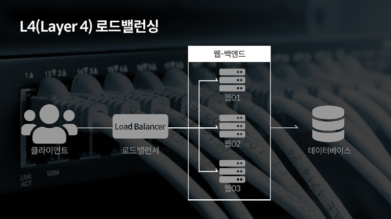
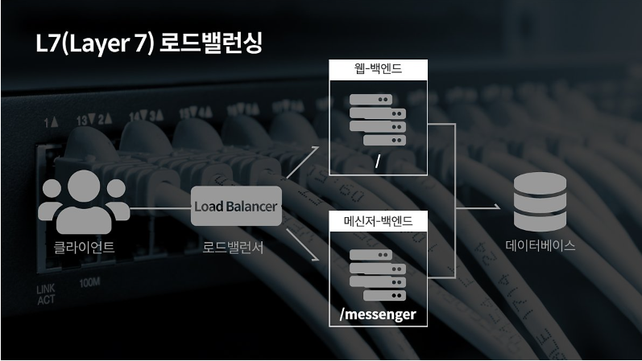
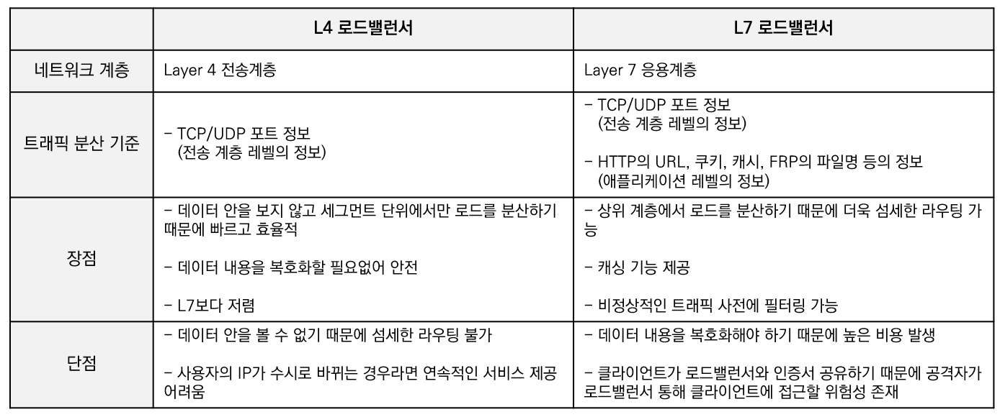
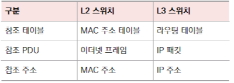

##  네트워크 기기 처리 범위

네트워크 기기는 네트워크 계층별로 처리 범위를 나눌 수 있음

상위 계층 처리 기기 → 하위 계층 처리 가능

하위 계층 처리 기기 → 상위 계층 처리 불가

- **애플리케이션 계층** : `L7로드밸런서(L7스위치)`
- **전송 계층** : `L4로드밸런서(L4스위치)`
- **인터넷 계층:** `라우터`, `L3스위치`
- **데이터 링크 계층** : `L2스위치`, `브리지`
- **물리 계층**: `NIC`, `AP`

> 💡 스위치<br>
>- 여러 장비를 연결하고 데이터 통신을 중재<br>
>- 목적지가 연결된 포트로만 전기 신호보내 데이터를 전송하는 네트워크 장비<br>
>- 소규모 통신을 위한 허브보다 전송 속도 개선

<br>

## 애플리케이션 계층 처리 기기

### L7로드밸런서(L7 스위치)

앞에 붙은 `L7`는 `Layer7`이란 뜻으로 OSI 7계층의 **7번째 계층**인 **애플리케이션 계층**에서 사용되는 기기라는 의미이다. `L7 로드밸런서`는 **서버의 부하를 분산하는 기기**이다. 클라이언트로부터 오는 요청을 **여러 서버로 나누는 역할**을 하며 시스템이 **처리할 수 있는 트래픽을 증가**시키기 위해 사용된다. 

**URL, 서버, 캐시, 쿠키**들을 기반으로 트래픽을 분산한다. 또한 바이러스, 불필요한 외부 데이터 등을 걸러내기 위한 필터링 기능과 응용프로그램 수준의 트래픽 모니터링도 가능하다. 

만약 장애가 발생한 서버가 있다면 이를 트래픽 분산 대상에서 제외해야 하므로, 정기적인 헬스체크를 이용하여 확인한다. 


> 💡 **헬스체크**<br>
> - 정상적인 서버와 비정상적인 서버를 판별하는 과정<br>
> - 전송 주기와 재전송 횟수 등을 설정 후 반복적으로 서버에 요청 보냄<br>
>   (부하가 되지않을 만큼의 요청 횟수 설정)<br>
> - **요청이 정상적**으로 이루어지면 **정상적인 서버**로 판별


> 💡 **로드밸런서**<br>
> - 로드(=부하) / 밸런싱(=분산)<br>
> - 서버에 가해지는 부하를 분산해주는 장치<br>
> - 클라이언트와 서버풀 사이에 위치하여 한대의 서버로 부하가 집중되지 않도록 트래픽 관리 <br>
> - 여러 대의 서버를 두고 서비스를 제공하는 분산 처리 시스템에 필요<br>
> 
>   *서버풀(Server Pool: 분산 네트워크를 구성하는 서버들의 그룹)

<br>

## 전송 계층 처리 기기

### L4 로드밸런서(L4 스위치)

4계층인 전송 계층에서 사용되는 로드밸런서를 `L4로드밸런서`(L4스위치)라고 한다. 스트리밍 관련 서비스에서는 사용할 수 없으며, 메시지가 아닌 **IP나 포트를 기반으로** 트래픽을 분산한다. (L7 로드밸런서는 메시지 기반 분산) 

위에서 말했든이 상위 계층의 처리 기기는 하위 계층을 처리할 수 있지만, 그 반대는 불가능하다. 따라서 URL, 쿠키, HTTP 헤더 등의 메시지 기반으로 분산 처리를 하는 L7로드밸런서는 포트나 IP로도 트래픽을 분산할 수 있다. 하지만 L4로드밸런싱은 상위 계층에서 사용되는 URL, 쿠키, HTTP 헤더 등은 인식하지 못하기 때문에 이를 이용해 트래픽을 분산할 수 없다.

#### L4 스위치 vs L7 스위치

<p>
    
    
</p>




<br>

## 인터넷 계층 처리 기기

### 라우터

라우터는 여러 개의 네트워크를 연결, 분할, 구분시켜주는 역할을 하며, 다른 네트워크에 존재하는 장치끼리 서로 데이터를 주고받을 때 **패킷 소모를 최소화하고 경로를 최적화하여 최소 경로로 패킷을 포워딩**하는 장비다. 

### L3 스위치

L3 스위치는 L2 스위치의 기능과 라우팅 기능을 갖춘 장비를 말한다. L3 스위치를 라우터라고 해도 무방한데, **하드웨어 기반의 라우팅**을 담당하는 장치를 `L3스위치`라고 한다. 

```bash
라우터 ┬── 소프트웨어 기반 라우팅
       └── 하드웨어 기반 라우팅  (L3스위치)
```

<br>

## 데이터 링크 계층 처리 기기

### L2 스위치

장치들의 **MAC 주소**(물리적 주소)를 **MAC 주소 테이블**을 통해 관리하며, 연결된 장치로부터 프레임이 왔을 때 프레임 전송을 담당한다.

프레임 단위의 데이터를 다루기 때문에 IP주소를 이해하지 못해 IP 주소 기반 라우팅은 불가능하며 단순히 프레임의 MAC주소를 읽어 스위칭하는 역할을 한다.

목적지가 MAC주소 테이블에 없다면 전체 포트에 전달한다. 




### 브리지

브리지는 두 개의 근거리 통신망(LAN)을 상호 접속할 수 있도록 하는 통신망 연결 장치로, 포트 사이의 다리 역할을 한다. 장치에서 방아온 MAC주소를 MAC주소 테이블로 관리한다. 

<br>

## 물리 계층 처리 기기

### MIC (Network Interface Card)

`LAN카드`라고도 하는 네트워크 인터페이스 카드는 2대 이상의 커뮤터 네트워크를 구성하는 데 사용하며, 네트워크와 빠른 속도로 데이터를 송수신할 수 있도록 컴퓨터 내에 설치하는 확장 카드이다. 이 LAN카드에는 **고유 식별번호인 MAC 주소**가 있다. 

### AP (Access Point)

패킷을 복사하는 기기로, 유선 LAN을 연결한 후 다른 장치에서 무선 LAN기술을 사용하여 무선 네트워크 연결을 할 수 있다. 
