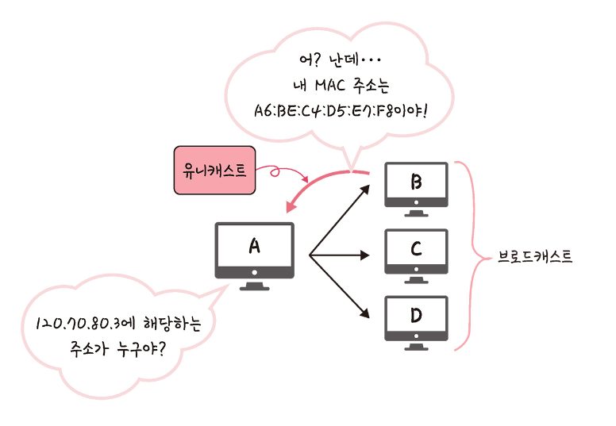
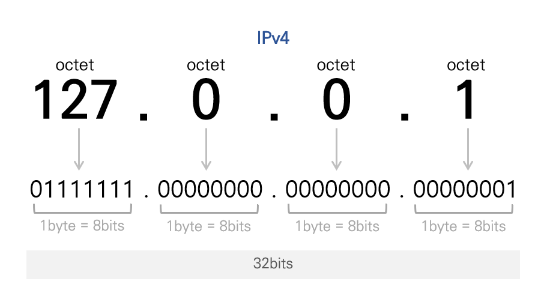
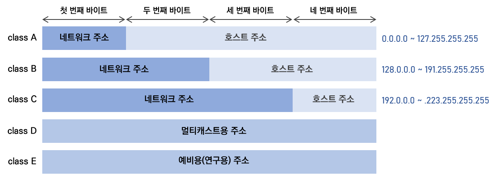
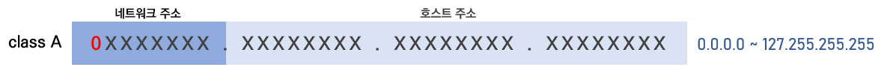
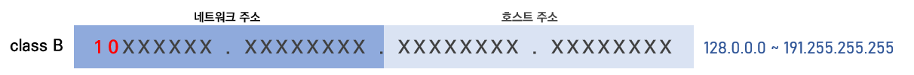
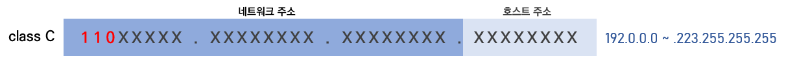

# IP 주소

<details>
<summary><h3>📑목차</h3></summary>
<div markdown="1">

- [ARP](#arp)
  - [IP주소와 MAC주소](#ip주소와-mac주소)
  - [ARP 동작 과정](#arp-동작-과정)
- [홉바이홉 통신](#홉바이홉-통신)
  - [라우팅 테이블](#라우팅-테이블)
- [IP 주소](#ip-주소)
  - [클래스](#클래스)
    - [A Class](#a-클래스)
    - [B Class](#b-클래스)
    - [C Class](#c-클래스)
  - [DHCP](#dhcp)
  - [NAT](#nat) 

</div>
</details>
<br>

## ARP

> **ARP(Address Resolution Protocol: 주소결정프로토콜)** <br>
> 네트워크 상에서 IP주소를 물리적 주소(MAC)로 대응시키기 위해 사용되는 프로토콜
>
> **RARP(Reverse Address Resolution Protocol: 역순주소결정프로토콜)** <br>
> MAC주소를 통해 IP주소를 알아내는 프로토콜

컴퓨터와 컴퓨터 사이 통신(host to host)은 `IP 주소`를 기반으로 통신한다. 정확히 말하면 `IP 주소`에서 `ARP`를 통해 `MAC 주소`를 찾아 통신한다. `ARP`는 IP 주소(가상 주소)를 MAC(실제 주소)로 변환해주는 프로토콜이다. 반대로 `RARP`는 MAC 주소(실제 주소)를 통해 IP 주소(가상 주소)를 알아낸다. 

```
ARP : IP 주소 → MAC 주소
RARP : MAC 주소 → IP 주소
```
[✏️ARP 관련 참고](https://cafe.naver.com/neteg/3101)

<br>

### IP주소와 MAC주소
네트워크에서 장치 간 통신을 할 때, `IP주소`와 `MAC주소`를 서로 변환하는 과정이 왜 필요할까? 실제 **물리적 주소인 MAC주소는 고유한 주소**라는데 이 주소만 가지고 통신할 수 없을까? 만약 MAC주소만을 이용하여 인터넷 상에서 라우팅하며 통신을 한다면 라우팅 테이블의 모든 MAC주소가 입력되어야 할 것이고 로컬 네트워크에선 가능할 지 몰라도 인터넷 통신에선 매우 비효율적인, 사실상 통신이 불가할 것이다.

이러한 이유로 통신의 효율성을 위해 **가상 주소**를 사용해 통신하며 이를 `IP주소`라고 말한다. IP주소는 MAC주소와는 다르게 변경될 수 있으며 지역적 특성을 가지고 있는 IP를 따라 다른 네트워크에 속해있는 장치에게도 데이터를 전송할 수 있다. 결국, IP주소만을 보고 데이터가 이리 저리 이동하다가 수신 장치가 위치하는 근거리 네트워크 속에선 물리적 주소인 MAC 주소를 통해 최종적으로 데이터가 전달된다.

<br>

### ARP 동작 과정

1. IP프로토콜이 ARP프로토콜에게 ARP Request 메시지 생성 요청
2. ARP Request 메시지 **브로드캐스팅**
3. 해당 IP 주소에 해당하는 장치가 ARP Reply 메시지에 MAC 주소 담아 전송 **(유니캐스트)**
4. 최초 송신자, **물리적 주소 획득**

<p align="center">
    
      <br>
    <small>출처: 면접을 위한 CS 전공지식 노트</small>
</p>

> 💡**브로드캐스트** <br>
>   송신 호스트가 전송한 데이터가 네트워크에 연결된 **모든 호스트에 전송**되는 방식
>
> 💡**유니캐스트** <br>
>   고유 주소로 식별된 하나의 네트워크 목적지에 **일대일로 데이터를 전송**하는 방식

<br><br>

## 홉바이홉 통신


IP주소를 통해 통신하는 과정을 **홉바이홉(hop by hop)통신**이라고 한다. 
네트워크에서 각 패킷이 여러 라우터를 건너가는 모습을 표현한 것으로, 
`홉(hop)`이란 **컴퓨터 네트워크에서 노드에서 다음 노드로 가는 경로**를 말한다.  
수많은 서브네트워크 안에 있는 라우터의 **라우팅 테이블의 IP를 기반**으로 패킷을 전달해나가며 최종 목적지까지 패킷을 전달한다.

<br>

### 라우팅 테이블

라우터에 들어가 있는 목적지 정보와 그 목적지로 가기 위한 방법이 들어있는 리스트를 말한다. 
라우팅 테이블에는 게이트웨이와 모든 목적지에 대해 **해당 목적지에 도달하기 위해 거쳐야 하는 다음 라우터 정보**를 가지고 있다. 

**라우터:** `패킷수신` → `다음 라우터 검색(라우팅 테이블)` → `패킷전송` → `패킷수신` →  ... 

<br>

> 💡**게이트 웨이 (gateway)** <br>
> - 컴퓨터 네트워크에서 서로 다른 통신망, 프로토콜을 사용하는 네트워크 간의 통신을 가능하게 하는 컴퓨터나 소프트웨어를 두루 일컫는 용어
> - 서로 다른 네트워크상의 통신 프로토콜을 변환해주는 역할
> - 하나 이상의 프로토콜을 사용하여 통신한다는 면에서 라우터, 스위치와 구별
> - OSI 참조모델 중 어느 계층에서도 동작 가능 

<br>

## IP 주소

**`IPv4`** : 32 비트를 8 비트 단위(옥텟)로 점찍어 표기   ex) `123.45.67.89`

**`IPv6`** : 128 비트를 16 비트 단위로 점찍어 표기   ex) `3FFE:FFFF:0:0:8:800:20C4:0` → `3FFE:FFFF::8:800:20C4:0`

<p align="center">
    
</p>

IP주소는 OSI 참조모델 중 3계층에서 사용하는 논리 주소로 라우터가 IP주소를 이해하고 최적의 경로를 찾아 패킷을 포워딩한다. IP주소는 사용자가 변경 가능고 주소에 `레벨(class)`이 존재하는데, **`네트워크 주소`** 와 **`호스트 주소`** 로 나뉜다. 

IPv4는 32비트로 사용할 수 있는 주소의 개수가 약 42억(2^32)개다. 인터넷 초기 개발 단계에서 만들어진 IPv4는 인터넷의 폭발적인 성장으로 인해 주소 부족 문제가 시작됐고 이를 해결하기 위해 거의 무한대의 주소 공간(2^128)을 가지고 있는 IPv6가 등장했다. 


> **네트워크 주소** <br>
> 호스트들을 모은 네트워크를 지칭하는 주소
> 
> **호스트 주소** <br>
> 특정 네트워크 내에 존재하는 호스트를 구분하기 위한 주소

<br>

### 클래스 

<p align="center">
    
</p>

IP 주소는 `5종류(A,B,C,D,E)`의 클래스로 분류할 수 있는데, 클래스란 하나의 IP 주소에서 **네트워크 영역과 호스트 영역을 나누는 방법**을 말한다. 즉, 클래스 개념을 알아야 IP주소에서 어디까지가 네트워크 영역이고 어디서부터 호스트 영역인지 알 수 있다. 이 중 `D`, `E` 클래스는 각각 멀티캐스트용, 예비용(연구용)으로 쓰인다. 

```
*클래스 기반의 IP 할당 방식은 사용하는 주소보다 버리는 주소가 많다는 단점이 있음 
(이를 보완하기 위해 DHCP와 IPv6, NAT 등장)
```

<br>

#### A 클래스

<p align="center">
    
</p>

- **네트워크 주소** : `1 byte`
- **호스트 주소** : `3 byte`
- **구분 비트** : `1`
- **IP 범위** : `0.0.0.0` ~ `127.255.255.255`
  
IP주소의 맨 왼쪽에 있는 비트를 `구분 비트`라고 한다. 이 비트를 통해 각 클래스를 구분할 수 있는데, `A클래스`는 구분비트가 `1` 로 시작한다. `A클래스`에서 가질 수 있는 IP의 범위는 `00000000.00000000.00000000.00000000` 에서 `01111111.11111111.11111111.11111111`로 십진수로 표현하면 `0.0.0.0` ~ `127.255.255.255`이다. 하지만 네트워크 주소 `127`인 경우는 특별하게 자신을 의미하는 루프백(Loopback) 주소로 쓰이기 때문에 실질적으로 사용할 수 있는 주소는 `126.255.255.255` 까지이다. 

A, B, C 클래스에서 모두 각 네트워크의 **첫 번째 주소**와 **마지막 주소**는 **`네트워크 주소`** 와 **`브로드캐스트용 주소`** 로 사용된다. 예를 들어 A 클래스 중 `15.0.0.0` 이란 네트워크가 할당됐다면 첫 번째 주소인 `15.0.0.0`은 해당 네트워크를 표시하는 주소로 사용되고, `15.255.255.255`는 브로드캐스트용으로 사용된다. 즉, 그 사이에 있는 `(2^24)-2`개의 호스트 주소를 가질 수 있다. 

<br>

#### B 클래스

<p align="center">
    
</p>

- **네트워크 주소** : `2 byte`
- **호스트 주소** : `2 byte`
- **구분 비트** : `10`
- **IP 범위** : `128.0.0.0 ~ 191.255.255.255`
  
`B클래스`는 구분비트가 `10` 으로 시작한다. `B클래스`에서 가질 수 있는 IP의 범위는 `128.0.0.0 ~ 191.255.255.255`이다. 네트워트 주소가 2바이트를 차지하기 때문에 각 네트워크가 가질 수 있는 호스트 주소 개수는 `(2^16)-2`개의 호스트 주소를 가질 수 있다. (마찬가지로 호스트 주소가 모두 `0`인 경우와 `1`인 경우 하나씩 제외)  

<br>

#### C 클래스

<p align="center">
    
</p>

- **네트워크 주소** : `3 byte`
- **호스트 주소** : `1 byte`
- **구분 비트** : `110`
- **IP 범위** : `192.0.0.0 ~ 223.255.255.255`
  
`C클래스`는 구분비트가 `110` 으로 시작한다. `C클래스`에서 가질 수 있는 IP의 범위는 `192.0.0.0 ~ 223.255.255.255`이며 네트워트 주소가 3바이트를 차지하기 때문에 각 네트워크가 가질 수 있는 호스트 주소 개수는 `(2^8)-2`개의 호스트 주소를 가질 수 있다. (마찬가지로 호스트 주소가 모두 `0`인 경우와 `1`인 경우 하나씩 제외)  

<br>

### DHCP

`DHCP`(동적 호스트 구성 프로토콜:Dynamic Host Configuration Protocol)는 **IP주소 및 기타 통신 매개변수를 자동으로 할당**하기 위한 네트워크 관리 프로토콜이다. 
이 기술을 통해 네트워크 장치의 IP주소를 수동으로 설정할 필요 없이 인터넷에 접속할 때마다 자동으로 IP주소를 할당할 수 있다.

- 네트워크 장치, 네트워크에 연결시 IP주소 요청
- DHCP 서버, 주소할당 및 주소 이용 모니터링
- 장치 연결 해제 시 주소 반환


### NAT

`NAT`(Network Address Translation)는 패킷이 라우팅 장치를 통해 **전송되는 동안 패킷의 IP주소 정보를 수정해 다른 IP주소로 매핑**하는 방법이다.

> 💡 **공인 IP 주소** <br>
> **인터넷이 사용자를 찾을 수 있도록** 사용자를 식별하는 역할
>
> 💡 **사설 IP 주소** <br>
> 사설 **네트워크에서 다른 장치와 안전하게 연결**하기 위해 사용되는 주소 <br>
> 동일한 네트워크의 각 장치에는 고유한 사설 IP 주소 할당
  


