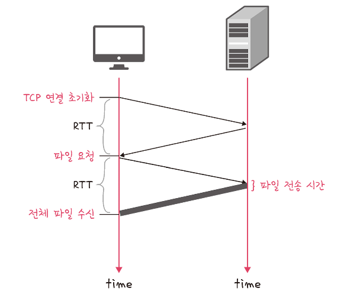
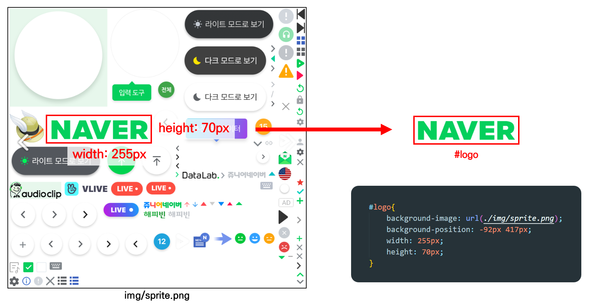
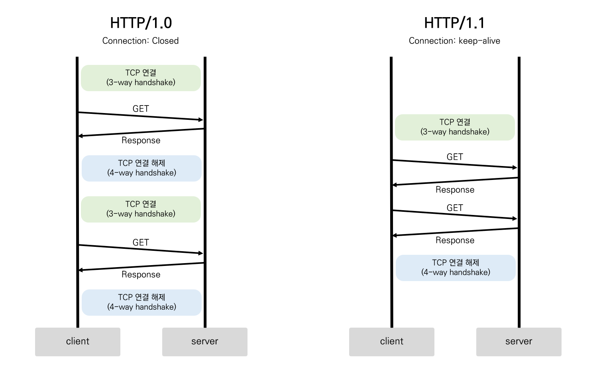
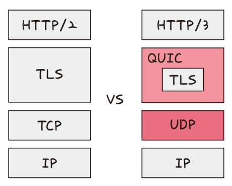
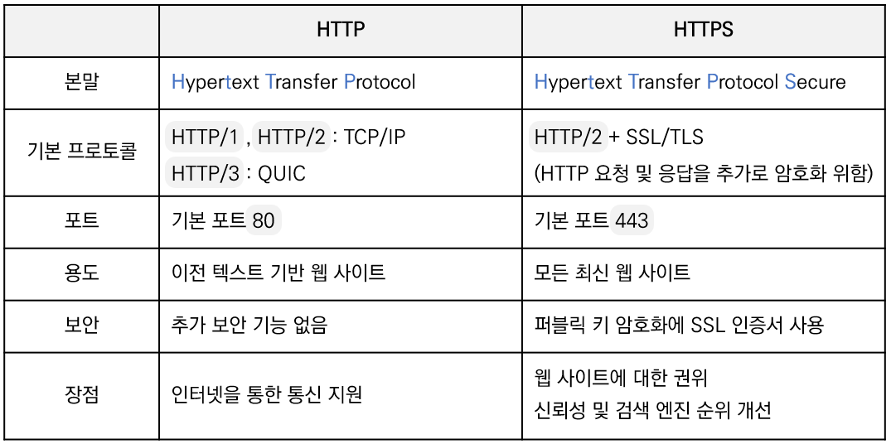
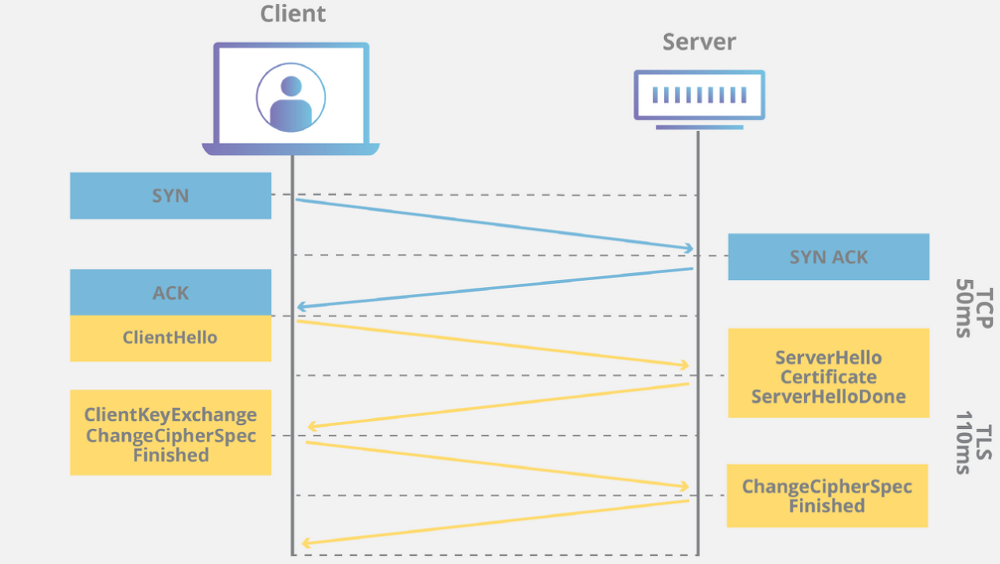
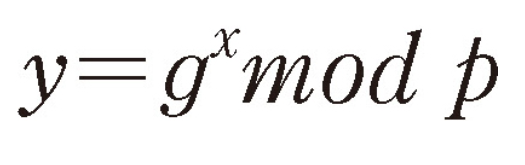
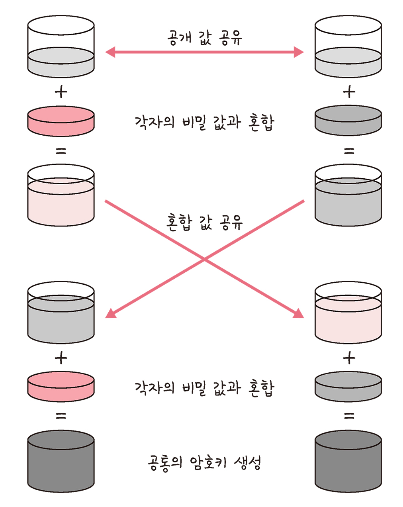

<details>
<summary><h3>📑목차</h3></summary>
<div markdown="1">

- [HTTP](#http)
- [HTTP/1.0](#📜http10)
  - [RTT 증가 해결 방법](#rtt-증가-해결-방법)
    - [이미지 스플리팅 (이미지 스프라이트)](#이미지-스플리팅-이미지-스프라이트)
    - [코드 압축](#코드-압축)
    - [이미지 Base64 인코딩](#이미지-base64-인코딩)
- [HTTP/1.1](#📜http11)
- [HTTP/2](#📜http2)
  - [멀티플렉싱](#멀티플렉싱)
  - [헤더 압축 (HPACK)](#헤더-압축-hpack)
  - [서버 푸시](#서버-푸시)
- [HTTP/3](#📜http3)
  - [초기 연결 설정 시 지연 감소](#초기-연결-설정-시-지연-감소)
  - [순방향 오류 수정 메커니즘](#순방향-오류-수정-메커니즘)
- [HTTPS](#https)
  - [SSL/TLS](#ssltls)
  - [SSL handshake](#ssl-handshake)
  - [인증 메커니즘](#인증-메커니즘)
  - [디피-헬만 키 교환 암호화 알고리즘](#디피-헬만-키-교환-암호화-알고리즘)
  - [해싱 알고리즘](#해싱-알고리즘)


</div>
</details>
<br>

# HTTP
`HTTP`(Hyper Text Transfer Protocol)는 클라이언트와 서버 간 정보를 주고받기 위한 통신 규약이다. 
`애플리케이션 계층`에서 동작하고 **웹 서비스 통신**에 사용된다. `HTTP/1.0`부터 `HTTP/3`까지 발전해왔다. 

- **`무상태성(stateless)`**
  - HTTP는 요청에 대한 상태를 가지지 않음
  - 각 요청은 독립적 → 요청 간의 서로 영향 주고받지 않음
  - 상태(로그인 정보 등)를 사용하기 위해선 세선이나 쿠키 사용
- **`비연결성(Connectionless)`**
  - 요청을 주고받을 때만 연결을 유지하고 전송이 끝나면 연결 끊김
- **`서버-클라이언트 구조`**
  - 일반적으로 클라이언트는 웹브라우저
  - 서버는 요청 대상인 서버 컴퓨터 의미  

<br>

## 📜HTTP/1.0
**한 연결당 하나의 요청을 처리**한다. 
서버로부터 정보를 가져올 때마다 TCP 연결(3-way handshake)과정이 필요하기 때문에 **RTT가 증가**한다는 단점이 있다.

> **RTT (Round Trip Time)** <br>
> -직역하면 "왕복 시간"이라는 의미<br>
> -인터넷 상에서 패킷이 송신지와 목적지 사이 왕복하는데 걸리는 시간을 말한다.<br>
> (패킷 왕복 시간)

<p align="center">
    
      <br>
    <small>출처: 면접을 위한 CS 전공지식 노트</small>
</p>

<br>

### RTT 증가 해결 방법
매번 연결할 때마가 RTT가 증가하기 때문에 서버에 부담이 많이 가고 사용자 응답 시간이 길어진다.
이를 해결하기 위해 `이미지 스플리팅`, `코드 압축`, `이미지 Base64 인코딩`을 사용했다. 

#### 이미지 스플리팅 (이미지 스프라이트)
이미지 스프라이트라고도 불리는 이 기법은 **여러 개의 이미지를 하나의 이미지로 합쳐 관리**하는 것을 말한다.
합쳐 있는 하나의 이미지만 다운받고 이를 기반으로 필요한 이미지만 화면에 표시한다.
스프라이트 이미지에서 사용할 이미지의 정확한 `width`와 `height`, `position`값을 이용해 화면에 표시한다.

<p align="center">
    
</p>

#### 코드 압축
코드에서 개행 문자, 빈칸을 없애 코드의 크기를 최소화하는 방법을 말한다. 

```
console.log('log1:'+txt);

if (true) {
  var txt = 'text';
  console.log('log2:'+txt);
}

console.log('log3:'+txt);
```

```
console.log('log1:'+txt);if(true){var txt='text';console.log('log2:'+txt)}console.log('log3:'+txt);
```


#### 이미지 Base64 인코딩
이미지 파일을 **64진법으로 이루어진 문자열로 인코딩**하는 방법이다. 
이미지가 Base64로 인코딩되어 있으면 해당 이미지 데이터는 **HTML 코드 내에 포함**되어 있다. 
따라서 서버에 이미지 파일을 따로 요청하여 파일로 저장할 필요가 없어지기 때문에 RTT를 줄일 수 있다. 
하지만 base64 문자열로 변환할 경우 약 33%의 크기가 더 커진다는 단점이 있다. 

<br>

## 📜HTTP/1.1
HTTP/1.0에서 발전된 형태로, **매번 TCP 연결을 하지않고** 
한 번 TCP 초기화 이후 `keep-alive` 옵션을 통해 여러 개의 파일을 송수신할 수 있다.
(keep-alive 표준화되어 기본 옵션으로 설정) 
아래 그림처럼 한번의 `TCP 3-way handshake`가 발생하면 그 다음부턴 발생하지 않는다. 

하지만 문서 안에 포함된 다수의 리소스를 처리하려면 요청 개수에 비례해 대기 시간이 길어진다는 단점(**HOL Blocking**)이 있다. 
또한, **헤더**에 쿠키 등 많은 메타데이터가 존재하고 압축되지 않아 **무겁다.**

<p align="center">
    
</p>

> **HOL Blocking(Head Of Line Blocking)** <br>
> 네트워크에서 같은 큐에 여러 패킷이 있을 때, 첫 번째 패킷의 지연시간이 길어져 발생하는 성능 저하 현상을 말한다.

> **keep-alive 옵션** <br>
> 하나의 TCP 연결을 활용해 여러개의 HTTP 요청 및 응답을 주고받을 수 있도록 해주는 기법 <br>
> 기본적으로 `HTTP/1.0` 연결은 하나의 요청에 응답할 때마다 `close`<br>
> `HTTP/1.1` 연결은 `keep-alive`로 persistent connection 지원 <br><br>
> `close`: 작업이 완료되면 연결이 종료되어야 함을 의미 <br>
> `keep-alive`: 클라이언트나 서버가 끊고자 하기 전까지 연결 지속 <br>
> [keep-alive란?](https://etloveguitar.tistory.com/137) 

<br>

## 📜HTTP/2
`HTTP/2`는 `HTTP/1.x`보다 지연 시간을 줄이고 응답 시간을 더 빠르게 할 수 있으며, 
`멀티플렉싱`, `헤더압축`, `서버푸시`, `요청의 우선순위 처리` 등을 지원한다.
또한, `HTTP/2`는 `HTTPS` 위에서 동작한다. 

<br>

### 멀티플렉싱
여러 개의 스트림을 사용하여 송수신한다는 것을 의미한다. 이를 통해 특정 스트림의 패킷이 손실되더라도 해당 스트림에만 영향을 미치고 나머지 스트림은 정상적으로 동작할 수 있다. 쉽게 말해 클라이언트가 **하나의 Connection 상에서 동시에 여러 request**를 보내는 기술을 말한다. 

`HTTP/1.1`에서도 parallel connection(병렬 커넥션)을 통해 동시에 여러 HTTP 요청을 보낼 수 있다. 
하지만 **하나의 연결에 하나의 요청만** 보낼 수 있기 때문에 동시에 여러 요청을 보내더라도 요청마다 TCP 연결 및 해제 작업이 필요하다. 이에 반해 멀티플레싱은 persistence cennection(지속 커넥션) 방식을 사용해 연결된 상태에서 연결 해제 없이 동시 요청을 보낼 수 있다. 이를 통해 `HTTP/1.x`에서 발생했던 **HOL Blocking 문제**를 해결할 수 있다.


<p align="center">
    
    <br>
    <small>병렬 커넥션</small>
</p>

<p align="center">
    
    <br>
    <small>지속 커넥션기반의 멀티플레싱</small>
</p>

### 헤더 압축 (HPACK)
`HTTP/1.x`에서 크기가 큰 무거운 헤더를 `HTTP/2`에서는 헤더 압축을 통해 해결했다.
**허프만 코딩 압축 알고리즘**을 사용한 `HPACK`압축 형식을 사용한다. 

> **허프만 코딩** <br>
> 문자열을 **문자 단위**로 쪼개 빈도수를 세어 **빈도가 높은 정보는 적은 비트 수**롤 사용하여 표현하고, 
> **빈도가 낮은 정보는 비트 수를 많이 사용**하여 표현한다. 전체 데이터의 표현에 필요한 비트양이 줄어든다.
> <br>
> [허프만 코딩](https://http2.tistory.com/1)


### 서버 푸시
이전 버전의 HTTP에서는 클라이언트가 **서버에 요청을 해야만** 데이터를 받을 수 있었다. 
하지만 `HTTP/2`에서는 클라이언트의 **요청 없이 서버가 바로 리소스를 푸시**할 수 있다. 

보통 html 파일 속엔 css나 js 파일이 포함되는데, html을 읽으면서 안에 들어있는 필요한 파일을 서버에서 푸시해 클라이언트에게 먼저 줄 수 있다. 

<p align="center">
    
</p>

<br>

## 📜HTTP/3
TCP 위에서 동작하는 이전 버전들과 달리 **QUIC 계층** 위에서 **UDP 기반**으로 동작한다. 
또한 HTTP/2의 장점인 멀티플렉싱을 가지고 있으며, **초기 연결 설정 시 지연 시간 감소**라는 장점이 있다. 

<p align="center">
    
    <br>
    <small>출처: 면접을 위한 CS 전공지식 노트</small>
</p>

#### 초기 연결 설정 시 지연 감소
QUIC는 TCP를 사용하지 않기 때문에 TCP 연결 과정인 **3-way handshake 과정을 거치지 않아도 된다**. 첫 연결 설정에서 1-RTT만 소요되며 클라이언트가 서버에 신호를 한 번 주고, 서버도 그에 대한 응답만 하면 바로 본 통신을 시작할 수 있다. 

#### 순방향 오류 수정 메커니즘
QUIC는 순방향 오류 수정 메커니즘(FEC:Forword Error Correction)이 적용된다. 이 메커니즘은 전송한 패킷이 손실되었다면, **수신측에서 에러를 검출하고 수정**하는 방식이다. 이를 통해 UDP를 사용하여도 열악한 네트워크 환경에서도 **낮은 패킷 손실률**을 보인다. 

<br>

# HTTPS
`HTTPS`는 애플리케이션 계층과 전송 계층 사이에 신뢰 계층인 **`SSL/TSL` 계층**을 넣은 **신뢰할 수 있는 HTTP 요청**을 말한다. (통신을 암호화함) HTTP는 텍스트 교환으로 누군가 네트워크 신호를 가로채면 내용이 노출되는 보안적 이슈가 존재하는데, 이를 해결해주는 프로토콜이 `HTTPS`이다. 

<p align="center">
    
    <br>
    <small><a href="https://aws.amazon.com/ko/compare/the-difference-between-https-and-http/">참고</a></small>
</p>

## SSL/TLS
`SSL/TLS`는 **전송 계층에서 보안을 제공**하는 프로토콜로, 클라이언트-서버 통신 시 제 3자가 메시지를 **도청하거나 변조하지 못하도록** 한다. `보안 세션`을 기반으로 데이터를 암호화하고 보안세션이 만들어질 때 `인증 메커니즘`, `키 교환 암호화 알고리즘`, `해싱 알고리즘`이 사용된다.

대칭키 방식과 비대칭키(공개키) 방식을 혼합하여 사용하는데, **비대칭키 방식으로 대칭키를 전달**하고 **대칭키 방식을 통해 암호화 및 복호화**를 진행하며 클라이언트와 서버간 통신을 진행한다. 

> `SSL1.0` → `SSL2.0` → `SSL3.0` → `TLS1.0` → ... → `TLS1.3` → `TLS` 로 명칭 변경! <br>
> **TLS**(Transport Layer Security) 프로토콜은 **SSL**(Secure Socket Layer) 프로토콜에서 발전한 것

> **세션** <br>
> 운영체제가 어떤 사용자로부터 자신의 자산 이용을 허락하는 일정 기간<br>
> 사용자는 일정 시간 동안 응용프로그램, 자원 등을 사용할 수 있음
 
> **보안 세션** <br>
> 보안이 **시작되고 끝나는 동안 유지되는 세션**을 말한다. `SSL/TLS`는 `SSL/TLS handshake`를 통해 보안 세션을 생성하고 이를 기반으로 상태 정보 등을 공유한다. 

> **대칭키 암호화 방식 (비밀키)** <br>
> 암호화, 복호화에 같은 키(대칭키)를 사용하는 방식<br>
> 키 전달과정에서 보안이 떨어짐
>
> **비대칭키 암호화 방식 (공개키)** <br>
> 암호화엔 공개키를 복호화엔 개인키를 사용하는 방식 <br>
> 복호화시 개인키로만 가능하기 때문에 키 전달 과정에서 보안 이슈 해결 가능 <br>
> 암호화 과정 복잡하다는 단점 
<br>

### SSL handshake
SSL/TLS handshake는 클라이언트와 서버가 서로 **암호화 통신을 시작할 수 있도록 보안 세션을 생성**하는 과정을 말한다. 
`https`에서는 `SSL handshake` 과정 이전에 TCP 연결 과정인 `3-way handshake` 과정이 일어난다. `SSL handshake` 과정엔 **대칭키를 생성하고 교환**하는 과정이 포함되어 있는데, 교환 방식은 **비대칭키 방식**을 사용한다. 이 과정에서 생성되는 대칭키를 이용해 이후 데이터 통신에서 암호화 및 복호화가 진행된다. (**대칭키 방식**)

<p align="center">
    
    <br>
    <small>출처: <a href="https://www.cloudflare.com/ko-kr/learning/ssl/what-happens-in-a-tls-handshake/">cloudflare</a></small>
</p>

우선 파란색 패킷은 TCP 연결을 위한 `3-way handshake` 과정이고, 노란색 패킷이 `SSL handshake`이다.

- 1️⃣`ClientHello`
  - 클라이언트가 서버에 연결 시도하며 전송
  - 사용 가능한 사이퍼 슈트목록, 세션 ID, SSL 프로토콜 버전 등을 전달
  - 추후 선택된 사이퍼 슈트 알고리즘에 따라 데이터 암호화
- 2️⃣`ServerHello`
  - 클라이언트가 보낸 ClientHello 패킷에서 사이퍼 슈트 중 하나를 선택
  - 선택한 것을 클라리언트에 알림
- 2️⃣`Certificate`
  - 서버가 자신의 SSL 인증서(서버 공개키 존재)를 클라이언트에게 전달
- 2️⃣`ServerHello Done` (`Server Key Exchange`)
  - SSL 인증서에 서버의 공개키가 없는 경우 Server Key Exchange로 직접 전달함
  - ServerHello Done은 서버의 행동 마쳤다는 뜻
- 3️⃣`Client Key Exchange`
  - 클라이언트는 데이터 암호화에 사용한 대칭키 생성
  - 서버로부터 받은 인증서 내부에 있는 서버 공개키를 이용해 암호화 및 전달
  - 여기서 전달되는 대칭키가 SSL Handshake의 목적 (실제 데이터를 암호화할 키)
- 3️⃣, 4️⃣ `ChangeCipherSpec` / `Finished`
  - 클라이언트와 서버가 서로에게 교환할 정보를 모두 보냄
  - 통신할 준비가 다 되었음을 뜻
    

> **사이퍼 슈트 (Cipher Suite)** <br>
> `프로토콜`, `AEAD 사이퍼 모드`, `해싱 알고리즘`이 나열된 규약을 말한다.
>
> ex. `TLS_AES_128_GCM_SHA256`
> -프로토콜: `TLS`
> -AEAD 사이퍼 모드: `AES_128_GCM`
> -해싱 알고리즘: `SHA256`


> **AEAD 사이퍼 모드** <br>
> AEAD(Authenticated Encryption with Associated Data)는 **데이터 암호화 알고리즘**이다. 
> ex. `AES_128_GCM`

<br>

### 인증 메커니즘
인증 메커니즘은 `CA`에서 발급한 **인증서를 기반**으로 이루어진다.
발급한 인증서는 **공개키**를 클라이언트에게 제공하고 사용자가 접속한 서버가 **신뢰할 수 있는 서버**임을 보장한다. 인증서는 `서비스 정보`, **`서버 측 공개키`**, `지문`, `디지털 서명` 등으로 이루어져 있다. 

> **CA(Certificate Authorities)** <br>
> 공개키를 저장해주는 신뢰성이 검증된 민간기업 <br>
> 대표적으로 Comodo, GoDaddy, 아마존 등의 기업이 있음
>
> **CA 발급 과정** <br>
> 사이트 정보와 공개키 CA에 제출<br>
> CA의 비밀키를 기반으로 CA 인증서 발급
>
> **클라이언트의 인증서 복호화** <br>
> 클라이언트가 서버로부터 서버의 공개키가 담긴 암호화된 인증서를 받음 <br>
> 일반적으로 신회할 수 있는 CA 기업의 공개키를 브라우저가 가지고 있음 <br>
> 클라이언트는 내장된 CA의 공개 키를 활용해 인증서를 복호화하여 인증서를 검증함

<br>

### 디피-헬만 키 교환 암호화 알고리즘
디피-헬만 키 교환(Diffie-Hellman key exchange) 암호화 알고리즘은 **암호키를 교환하는 방법**으로 **대칭키를 공유**하는데 사용한다. 아래 식에서 `g`, `x`, `p`를 안다면 `y`는 구하기 쉽지만 `g`, `y`, `p`만 안다면 `x`를 구하기는 어렵다는 원리에 기반한 알고리즘이다. 

이 과정은 대칭키 암호화 방식의 알고리즘에서 쓰이는 **대칭키를 생성하는 알고리즘일 뿐, 통신을 암호화하는 과정이 아니다.** 즉, 공개키와 개인키를 이용하여 대칭키를 만들어내는 과정!

<p align="center">
    
</p>

<p align="center">
    
    <br>
    <small>출처: 면접을 위한 CS 전공지식 노트</small>
</p>

**[과정]** <br>
- 서로 공개 값(공개키) 공유
- 각자의 비밀 값(개인키)과 혼합
- 혼합한 값 공유
- 자신의 비밀 값 한번 더 혼합
- 공통의 암호키(대칭키) 생성!

[✏️디피-헬만 키 교환 알고리즘](https://injae-kim.github.io/dev/2020/08/07/diffie-hellman-algorithm.html)

<br>

### 해싱 알고리즘
해싱 알고리즘이란 데이터를 추정하기 힘든 **더 작고 섞여 있는 조각으로** 만드는 알고리즘이다.
SSL/TLS는 해싱 알고리즘으로 `SHA-256`과 `SHA-384`알고리즘을 사용하며, 그중 `SHA-256`을 많이 쓴다. 

> **해시** <br>
> 임의의 크기를 가진 데이터를 고정된 데이터의 크기로 변환시키는 것
 

#### SHA-256
해시 함수의 **결과값이 256비트**인 알고리즘을 말한다. 
해싱을 해야 할 메시지에 1을 추가하는 등 전처리를 하고 전처리된 메시지를 기반으로 해시를 반환한다. 
[✏️SHA-256](https://losskatsu.github.io/blockchain/sha256/#4-sha-256-%EA%B3%BC%EC%A0%95)
