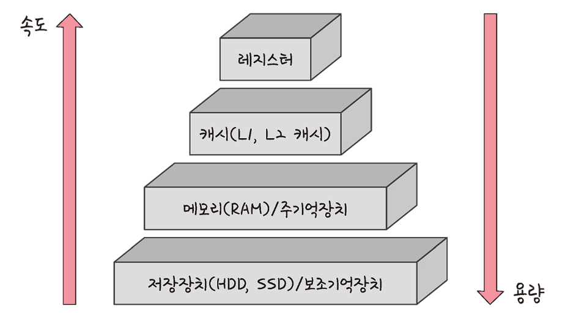
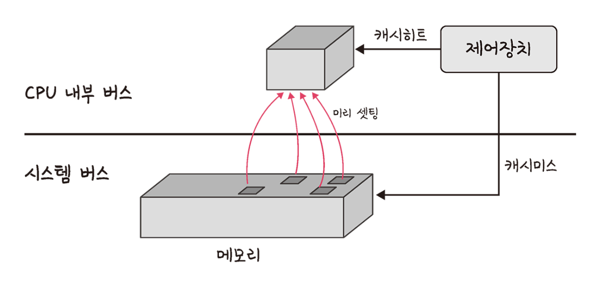
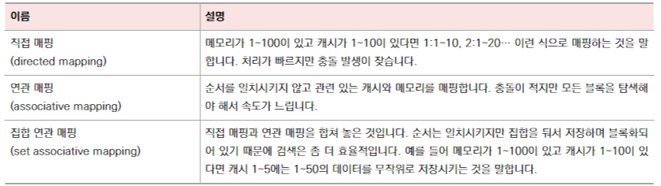
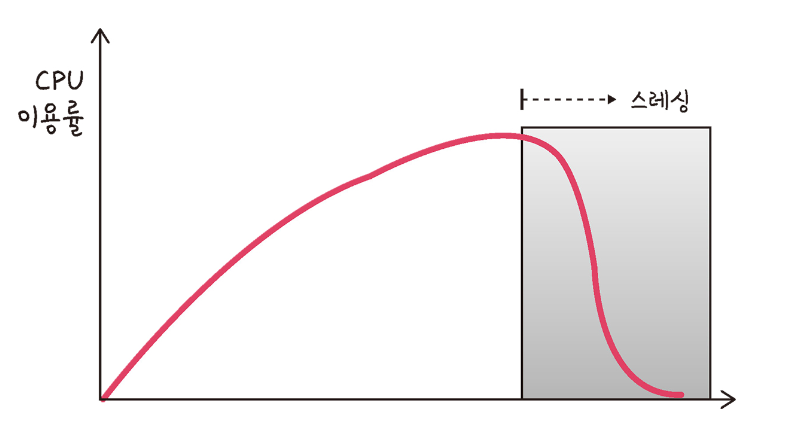

## 메모리 계층

메모리는 `레지스터`, `캐시`, `메모리`, `저장장치` 로 계층을 나눌 수 있다.  상위 계층일 수록 가격은 비싸지는데 용량은 작아지고 속도는 빨라진다는 특징이 있다. 즉, 최상단에 있는 레지스터가 가장 빠르고 기억 용량이 가장 작다. 

<p align="center">
    
      <br>
    <small>출처: 면접을 위한 CS 전공지식 노트</small>
</p>


- `레지스터` : CPU 안에 있는 작은 메모리 / **휘발성** / 가장 빠른 속도 / 가장 작은 용량
- `캐시` : `L1캐시`, `L2캐시` 를 지칭 / **휘발성** / 빠른 속도 / 작은 용량
- `주기억장치` : RAM을 지칭 / **휘발성** / 보통 속도 / 보통 용량
- `보조기억장치` : `HDD`, `SSD` 를 일컬음 / **비휘발성** / 느린 속도 / 큰 용량

<br>

## 캐시

캐시는 데이터를 미리 복사해 놓는 임시 저장소를 말한다. 빠른 장치와 느린 장치 사이의 **속도 차이에서 발생되는 병목 현상**을 줄이기 위해 사용되는 메모리다. 캐시를 통해 데이터에 접근하는 시간이 오래 걸리는 경우와 무언가를 다시 계산하는 시간을 절약할 수 있다. 

### 캐싱계층

속도 차이를 위해 계층과 계층 사이에 있는 계층을 캐싱 계층이라고 한다. 예를 들어 빠른 CPU와 비교적 느린 RAM 사이에 레지스터 계층을 둬 속도 차이를 해결하는데, 이 경우 레지스터 계층을 캐싱 계층이라고 할 수 있다. 

```
ex. [캐시 메모리 - 주기억장치 - 보조기억 장치]  ⇒ 주기억장치가 캐싱 계층
```

<br>

## 지역성의 원리

캐시가 효율적으로 동작하려면(캐시의 성능을 높이려면) CPU가 필요한 정보가 캐시 메모리에서 찾을 수 있는 비율(적중률: hit-rate)이 높아야한다. 즉, 캐시 메모리에 CPU가 찾는 정보가 많아야 하는 것이다. 

**캐시 적중률을 높일 수 있는 원리**가 지역성의 원리이며, 시간 지역성과 공간 지역성으로 구분된다. 여기서 **지역성**(locality)이란 기억 장치 내의 데이터를 균일하게 접근하는 것이 아닌 **특정 부분을 집중적으로 참조하는 특성**을 말한다. 


### 시간지역성

시간 지역성은 **최근 사용한 데이터에 다시 접근**하려는 특성을 말한다. 위에서 말한 “특정 부분을 집중적으로 참조”하는 것의 기준이 시간적인 요소인 것이다.


### 공간지역성

공간 지역성은 최근 접근한 데이터가 있는 공간이나 그 가까운 공간에 접근하려는 특성을 말한다. 참조의 기준이 공간적인 요소인 것이다. 

<br>

## 캐시히트와 캐시미스

`캐시히트` : 캐시에서 원하는 데이터를 찾은 것

`캐시미스` : 원하는 데이터가 캐시에 없어 주기억장치(RAM)로 가서 데이터를 찾아오는 것

<p align="center">
    
      <br>
    <small>출처: 면접을 위한 CS 전공지식 노트</small>
</p>

위의 그림처럼 원하는 데이터가 이미 캐시에 적재되어 있어 바로 찾았을 경우를 캐시히트라고 하는데, 이 경우 캐시의 위치도 가까우며 CPU 내부 버스를 기반으로 작동하기 때문에 빠르다. 하지만 이미 적재된 캐시에 원하는 데이터가 없어 캐시미스가 발생되면 메모리까지 가서 가져오게 되는데, 이는 거리도 멀고 시스템 버스를 기반으로 작동되기 때문에 느린 속도를 보인다. 


> **CPU 내부 버스**<br>
> CPU 내의 비공개 적인 데이터 전달 통로로, CPU 내부 장치인 ALU, 제어장치, 레지스터 간의 데이터 이동에 쓰인다 (보통 캐시는 CPU 내부에 존재하며 CPU 내부 버스를 이용해 데이터를 주고받음)
>
> **시스템 버스**<br>
> CPU와 다른 장치 사이 데이터를 전달하기 위해 사용되는 통로


<br>

### 캐시매핑

캐시매핑이란 캐시가 히트되기 위해 데이터를 캐시에 매핑하는 방법을 말한다. 

<p align="center">
    
    <br>
    <small>출처: 면접을 위한 CS 전공지식 노트</small>
</p>

#### 직접 매핑

메모리 주소의 순서와 캐시의 **순서를 일치**시키는 방법이다. 예를 들어 메모리가 `1~100`까지 있고 캐시가 `1~10`까지 있다면 `1`번 캐시엔 `1~10`의 메모리가 매핑되고, `2`번 캐시엔 `11~20`까지 메모리가 매핑되는 방식이다. 즉, `1`번 캐시에는 `1~10`번까지의 메모리 중 하나의 데이터가 적재될 수 있고, `2`번 캐시에는 `11~20`사이 역영의 메모리 중 하나의 데이터만 적재될 수 있다. 

이 방식은 캐시와 블록을 `1:1` 매핑하면 되기 때문에 **구현이 간단하지만, 적중률이 낮다**. 예를 들어 `21~30`번 사이의 메모리 영역에 있는 데이터를 자주 사용하는데 이 영역의 데이터를 적재할 수 있는 공간은 캐시에 하나의 공간(`3`번 캐시)밖에 없다. 즉 필요할 때마다 캐시에 데이터가 교체될 것이고 효율이 떨어진다. 

#### 연관 매핑

순서를 일치시키지 않고 관련있는 캐시와 메모리를 매핑하는 방법이다. 필요한 메모리값을 캐시의 어디든 저장할 수 있다. 이 방식은 필요한 메모리 위주로 캐시가 구성되기 때문에 적중률은 높지만 모든 블록을 탐색해야 하므로 메모리를 찾는 과정이 복잡하다. 

#### 직접 연관 매핑

연관 매핑과 직접 매핑을 합쳐 놓은 방식이다. 순서를 일치시키지만 캐시에 일정 그룹을 두어 해당 그룹 내에 무작위로 저장시키는 방법이다. 예를 들어 메모리가 `1~100`까지 있고 캐시가 `1~10`까지 있다면 캐시 `1~5`까지 하나의 그룹으로 만들어 `1~50`까지의 메모리를 매핑시킨다. 캐시 `6~10`까지는 `51~100`까지의 메모리 매핑. 직접 매핑에서 든 예시처럼 `21~30`사이 메모리 영역을 자주 사용하는 경우 직접 매핑은 이 블록을 저장할 수 있는 캐시 공간이 하나였지만 직접 연관 매핑은 `5`개가 되기 때문에 담을 수 있는 캐시 공간이 늘어났다. 

이 방식은 블록화 되어있기 때문에 연관 매핑보다 검색이 효율적이다. 

<br>

# 메모리 관리

## 가상메모리

<p align="center">
    
    <br>
    <small>출처:Tanenbaum, Andrew S. (2009). 《Modern operating systems》. </small>
</p>

가상 메모리는 메모리 관리 기법 중 하나로 실제 **이용 가능한 메모리 자원을 추상화**하여 이를 사용하는 **사용자들에게 매우 큰 메모리로 보이게 만드는 것**을 말한다. 

한 시스템의 여러 프로세스들은 CPU와 메인 메모리를 공유한다. CPU를 공유하는 부분에 있어서는 일반적으로 자신의 순서를 기다리기만 하기 때문에 느려질 수 있으나 오류가 발생하지 않는다. 하지만 프로세스들이 메인 메모리를 공유하는 부분에 있어서는 한 프로세스가 많은 메모리를 요구할 경우 오류가 발생할 수 있다. 이를 방지하기 위한 방법이 가상 메모리 기술이다. 사용자가 프로세스를 올리고 내리는 데 있어 사용자가 메모리를 신경쓸 필요 없게 해주는 기술로 운영체제가 가상메모리를 활용해 자동으로 메모리 관리를 할 수 있도록 한다. 

**각 프로세스가 독립된 가상 메모리**를 가지게 된다. A프로세스에서 `0x100` 이라는 주소를 가지면서 동시에 B프로세스에서도 `0x100`라는 주소를 가지게 될 수 있다. 이때 두 프로세스에서 각자 `0x100` 주소에 접근하는 명령을 실행할 경우 CPU에 내장된 `MMU`(메모리 관리 유닛)가 프로세스마다 별도로 가지고 있는 **페이지 테이블을 참조**해 **실제 주소로 연결**시켜준다. 즉, 두 프로세스가 `0x100`라는 가상 주소에 접근했을 경우 실제 물리적인 주소는 A프로세스에서는 `0x200`으로, B프로세스에서는 `0x300`으로 접근하게 된다.

이와 같은 방식으로 두 프로세스는 주소 공간이 겹치지 않고 독립적으로 실행되지만, 사용자는 이에 대한 별도의 생각을 하지 않아도 된다.  


> 💡**가상메모리 기능**<br>
> - **메모리 관리의 단순화**<br>
> : 각 프로세스마다 가사메모리의 통일된 주소 공간을 배정할 수 있어 메모리 관리가 단순해짐<br>
> - **메모리 용량 및 안정성 보장**<br>
> : 한정된 공간의 메인메오리가 아닌 거의 무한한 가상메모리 공간을 배정하여 프로세스들끼리 메모리 침범이 일어날 여지를 줄임


> **가상 주소(logical address)** <br>
> 가상으로 주어진 주소<br>
>
> **실제 주소(physical address)** <br>
> 실제 메모리상에 있는 주소<br>
> 
> **MMU(메모리관리장치: Memory Management Unit)** <br>
> CPU가 메모리에 접근하는 것을 관리하는 장치<br>
> 가상 주소를 실제 주소로 변환 → 속도 향상을 위해 **TLB** 사용<br>
> 
> **TLB(변환참조버퍼: Translation Lookaside Buffer)** <br>
> 메모리와 CPU 사이에 있는 주소 변환을 위한 캐시


<br>

### **스와핑**

메인 메모리에서 자주 사용되는 데이터가 캐시에 저장되었듯, 사용되지 않는 페이지는 하드디스크로 옮겨지고 **당장 사용되는 페이지만 메인 메모리에 존재**한다. 따라서 가상 메모리에 존재하는 모든 페이지가 메인 메모리에 존재하진 않는다. MMU가 가상 주소를 실제 주소로 변환하여 CPU가 해당 주소를 참조했는데 **요청한 페이지가 메인 메모리에 없고 하드디스크에 존재할 경우 `페이지 폴트`(Page fault)**가 일어난다. 페이지 폴트가 발생하면 OS는 요청한 페이지를 **디스크에서 가져와 메인 메모리에 적재하는 작업을 하게 되는데 이를 `스와핑`**이라고 한다. 


> **페이지(page)** <br>
> 가상 메모리를 일정한 크기로 나눈 블록<br>
> 가상 메모리를 사용하는 최소 크기 단위<br>
> 
> **프레임(frame)** <br>
> 실제 메모리를 사용하는 치소 크기 단위<br>
> 
> **스와핑(swapping)** <br>
> 메모리에서 당장 사용하지 않는 영역을 하드디스크로 옮기고 하드디스크의 일부분을 메인 메모리에 적재하는 작업<br>
> 
> **페이지폴트(page fault)** <br>
> 프로세스의 주소공간(가상메모리)에는 존재하지만 현재 메인 메모리에는 없는 데이터에 접근한 경우 발생<br>

*하드디스크가 아닌 SSD나 USB메모리 등 다른 보조기억장치에서도 스와핑 가능

<br>

## 스레싱

<p align="center">
    
    <br>
    <small>출처: 면접을 위한 CS 전공지식 노트</small>
</p>

`스레싱(thrashing)`은 메모리의 **페이지 폴트율이 높아져 CPU 이용률이 급격히 떨어지는 현상을** 의미한다. 이는 컴퓨터의 심각한 성능저하를 초래한다. 메모리에 너무 많은 프로세스가 동시에 올라가게 되면 어느 한계점까지는 CPU 이용률이 증가하는데 한계점 이후부터는 **페이지 폴트가 많아져 스와핑이 많이 일어나** 페이지 교체에 드는 시간이 증가하게 된다. 이로 인해 CPU 이용률이 떨어지게 되면 **운영체제는 CPU가 한가하다고 인식**하여 가용성을 높이기 위해 **더 많은 프로세스를 메모리에 올리게** 된다. 결국 악순환이 반복되며 스레싱이 일어나게 된다. 이를 해결하기 위해선 하드웨어적으로 메모리를 늘리거나 HDD를 SSD로 바꾸는 방법이 있다. 운영체제에서 스레싱을 해결하기 위한 방법은 `작업 세트`와 `PFF`가 있다. 


### 작업세트

작업 세트(working set)는 프로세스의 과거 사용 이력인 **지역성을 통해** 결정된 **페이지 집합**을 만들어 미리 메모리에 로드하는 것이다. 미리 메모리에 로드하면 탐색에 드는 비용을 줄일 수 있고 스와핑 또한 줄일 수 있다.

### PFF

PFF(Page Fault Frequency)는 페이지 폴트 빈도를 조절하는 방법으로, 상한선과 하한선을 만드는 방법이다. 상한선에 도달한다면 프레임을 늘리고 하한선에 도달한다면 프레임을 줄인다. 

<br>

## 메모리 할당

메모리에 프로그램을 할당할 때는 `시작 메모리 위치`, `메모리 할당 크기`를 기반으로 할당한다.

### 연속할당

연속 할당은 메모리에 프로그램을 적재할 때, 주소 공간을 여러 개로 분할하지 않고 **연속적으로** 할당하는 것을 말하며 크게 `고정분할 방식`과 `가변분할 방식`이 있다. 

**고정 분할방식**

메모리를 영구적인 분할로 미리 나누어 관리하는 방식을 말한다. 메모리가 미리 나뉘어 있기 때문에 메모리에 올릴 수 있는 프로그램의 수가 고정되어 있으며 수행 가능한 프로그램의 최대 크기 또한 제한되어 융통성이 없다.  `외부 단편화` 와 `내부 단편화`가 발생할 수 있다. 하나의 분할 공간에는 하나의 프로세스만 들어가기 때문에 내부 단편화가 발생되어 공간이 남더라도 다른 프로그램 적재 불가

**가변 분할방식**

매 시점 적재되는 프로그램의 크기에 맞게 분할의 크기와 개수가 동적으로 변하는 방식을 말한다. 프로그램의 크기에 맞게 할당하기 때문에 내부 단편화는 발생하지 않는다. 외부 단편화는 발생할 수 있다.


> **외부 단편화** <br>
> : 프로그램의 크기보다 분할의 크기가 작아서 해당 분할이 비어있음에도 프로그램을 적재하지 못하는 현상 (커서 못들어감)<br>
>
> **내부 단편화** <br>
> : 프로그램의 크기보다 분할의 크기가 커서 해당 분할에 프로그램을 적재하고 남는 현상<br>
>  (들어가는데 남아)

<br>

### 불연속할당

현대 운영체제가 쓰는 방식이다. `페이징 기법`, `세그멘테이션`, `페이지드 세그멘테이션` 기법이 있다.

#### 페이징

메모리를 **동일한 크기의 페이지 단위**로 나누고 프로그램마다 페이지 테이블을 두어 이를 통해 메모리의 서로 다른 위치에 프로그램을 할당하는 방법

- 홀의 크기 균일

- 주소 변환 복잡

*홀: 할당할 수 있는 비어있는 메모리 공간

#### 세그멘테이션

페이지 단위가 아닌 의미 단위의 세그먼트로 나누는 방식을 말한다. 프로세스를 코드와 데이터 영역으로 묶어 나누거나 코드 내의 작은 함수를 세그먼트로 놓고 나눌 수 있다. 

- 공유와 보안 측면에서 장점

- 홀의 크기 균일하지 않음

> 프로세스를 이루는 메모리는 `코드 영역`, `데이터 영역`, `스택 영역`, `힙 영역` 으로 나뉨


#### 페이지드 세그멘테이션

프로그램을 **의미 단위인 세그먼트**로 나누어 공유나 보안 측면에 강점을 두고, 임의의 길이가 아닌 **동일한 크기의 페이지 단위로** 나누는 것을 말함

### 페이지 교체 알고리즘

페이지 교체 알고리즘을 기반으로 스와핑이 일어남

#### 오프라인 알고리즘

- 먼 미래에 참조되는 페이지와 현재 할당하는 페이지 교체
- 가장 이상적인 방식
- 현실적으로 사용할 수 없는 알고리즘
- 성능 비교에 대한 상한 기준 제공 역할

#### FIFO

- First In First Out
- 가장 먼저 온 페이지를 교체 영역에 가장 먼저 놓는 방식

#### LRU

- Leat Recentle Used
- 참조가 가장 오래된 페이지를 교체
- 오래된 페이지를 파악하기 위해 페이지마다 계수기, 스택 존재
- 보통 두 개의 자료구조로 구현 (해시 테이블, 이중 연결 리스트)
- 해시 테이블 → 이중 연결 리스트에서 빠른 검색
- 이중 연결 리스트 → 한정된 메모리를 구현

#### NUR

- Not Used Recently
- LRU에서 발전한 알고리즘
- `0` 과 `1` 비트를 사용해 참조된 페이지와 그렇지 않은 페이지를 표현

#### LFU

- Least Frequently Used
- 가장 참조 횟수가 적은 페이지 교체
    
<br>

참조: [https://namu.wiki/w/가상 메모리#toc](https://namu.wiki/w/%EA%B0%80%EC%83%81%20%EB%A9%94%EB%AA%A8%EB%A6%AC#toc)
