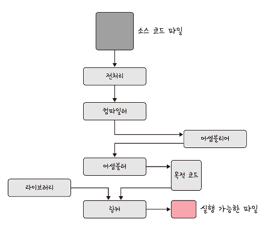

# 프로세스와 스레드

<h3>📑목차</h3>

- [프로세스](#프로세스)
    - [프로그램 컴파일](#프로그램-컴파일)
- [프로세스 상태](#프로세스-상태)
    - [프로세스 상태의 종류](#프로세스-상태의-종류)
    - [상태 전이 동작](#상태-전이-동작)
- [프로세스 메모리 구조](#프로세스-메모리-구조)
- [PCB](#pcb)
    - [PCB 구조](#pcb-구조)
    - [컨텍스트 스위칭](#컨텍스트-스위칭)
- [멀티프로세싱](#멀티프로세싱)
    - [IPC](#ipc)
        - [공유메모리](#공유메모리)
        - [파일](#파일)
        - [소켓](#소켓)
        - [익명 파이프](#익명-파이프)
        - [메시지 큐](#메시지-큐)
- [스레드](#스레드)
    - [멀티스레딩](#멀티스레딩)
- [공유자원과 임계영역](#공유자원과-임계영역)
    - [공유 자원](#공유-자원)
    - [임계 영역](#임계-영역)
    - [뮤텍스](#뮤텍스)
    - [세마포어](#세마포어)
        - [바이너리 세마포어](#바이너리-세마포어)
        - [카운팅 세마포어](#카운팅-세마포어)
    - [모니터](#모니터)
- [교착 상태](#교착-상태)
    - [교착 상태 원인](#교착-상태-원인)
    - [교착 상태 해결 방법](#교착-상태-해결-방법)

 

## 프로세스
`프로세스`는 컴퓨터에서 **실행되고 있는 프로그램**을 말하며, **CPU 스케줄링의 대상**이 되는 작업을 의미한다.
프로그램이 메모리에 올라가면 프로세스가 되는 **인스턴스화**가 일어나고, 이후 OS의 CPU 스케줄러에 따라 CPU가 프로세스를 실행한다. 

- 인스턴스화: `프로그램` → 메모리에 적재 (`프로세스`)
- CPU: `프로세스` 실행 (by `CPU 스케줄러`)

    
     
    <small>출처: 면접을 위한 CS 전공지식 노트</small>

> **💡인스턴스**  
> 실행 중인 임의의 프로세스로 응용 **프로그램을 메모리에 올린 것**
>
> **💡프로그램**  
> **파일 시스템**에 존재하는 **실행파일**
>
> **💡프로세스**  
> 프로그램의 하나의 인스턴스

#### 프로그램 컴파일 

    
     
    <small>출처: 면접을 위한 CS 전공지식 노트</small>

**`전처리`**  
소스코드의 주석을 제거하고 헤더 파일을 병합하여 `#include`와 같은 매크로를 치환

**`컴파일러`**  
오류 처리, 코드 최적화 작업을 통해 **어셈블리어로 변환**
 👉어셈블리어: 니모닉 기호를 정해 사람이 쉽게 제어할 수 있도록 기계어에 1:1로 대응되는 언어
  ex) 기계어: `10110000 01100001` → 어셈블리어: `mov al, 061h`

**`어셈블러`**  
어셈블리어를 **목적 코드(object code)로 변환** 
 👉목적 코드(목적 파일): 어셈블러에 의해 생성되 기계어(0과 1로 이루어진 Low Level Language) 파일
 👉확장자: `.o`, `.obj` 

**`링커`**  
프로그램 내에 있는 라이브러리 함수 또는 다른 파일들과 목적 코드를 결합하여 **실행 파일 생성**
 👉확장자: `.exe` 

 

## 프로세스 상태

    
     
    <small>출처: 면접을 위한 CS 전공지식 노트</small>

### 프로세스 상태의 종류

#### 생성 상태 `create`
- **"프로세스가 막 생성된 상태"**
- `fork()` 또는 `exec()` 함수 통해 생성
- `PCB` 할당 

> **💡PCB** (Process Control Block)  
> OS에서 **프로세스에 대한 메타데이터**를 저장한 데이터 블록
> 
> **💡`fork()`**  
> 새로운 자식 프로세스를 생성하는 함수 
> 부모 프로세스의 주소 공간을 그대로 복사 
> (비동기 작업 등은 상속 X)
>
> **💡`exec()`**  
> 새롭게 프로세스를 생성하는 함수 

#### 대기 상태 `ready`
- **"프로세스가 CPU에 실행되기 위해 대기하는 상태"**
- 메모리 공간 충분 시, 메모리 할당 받음
- CPU 스케줄러로부터 CPU 소유권이 넘어오길 기다림

#### 대기 중단 상태 `ready suspended`
- **"프로세스가 메모리를 제외한 다른 모든 필요한 자원들을 보유한 상태"**
- **메모리 부족**으로 일시 중단된 상태

#### 실행 상태 `running`
- **"프로세스에 포함된 명령어(인스트럭션)가 실행되고 있는 상태"**
- CPU 소유권과 메모리를 할당받음
- `"CPU burst"`가 일어났다고 표현

> **💡인스트럭션** (Instruction)  
> 컴퓨터에게 일을 시키는 단위로, 기계어로 이루어진 **명령어**

#### 중단 상태 `blocked`
- **"프로세스가 특정 자원이나 이벤트를 기다리는 상태"**
- 어떤 이벤트로 인해 프로세스가 차단되어 대기
- ex) I/O 디바이스에 의한 인터럽트

#### 일시 중단 상태 `blocked suspended`
- **"프로세스가 중단 상태에서 메모리를 잃은 상태"**
- 중단된 상태에서 프로세스가 실행되려 했지만 **메모리 부족**으로 일시 중단된 상태

#### 종료 상태 `terminated`
- **"프로세스가 실행 완료한 상태"**
- 메모리와 CPU 소유권을 모두 반납한 상태
- 자발적 종료: 자연스럽게 종료
- 비자발적 종료(`abort`): 부모 프로세스가 자식 프로세스를 종료시킴 

> **💡비자발적 종료 발생**  
> 할당된 자원의 한계치 넘어설 때 
> 부모 프로세스가 종료될 때 
> 사용자가 강제 종료할 때 (`process.kill` 등)

 

### 상태 전이 동작

**`Dispatch` (`대기`→`실행`)**  
우선순위가 높은 프로세스 선정하여 명령어 실행

**`Time runout` (`실행`→`대기`)**  
클럭이 인터럽트 발생시켜 제어권 빼앗음 (독점 방지)

**`Block` (`실행`→`중단`)**  
프로세서가 입출력, 자원 등을 기다리기 위해 중단

**`Wake up` (`중단`→`대기`)**  
입출력이 완료되거나 자원이 할당되어 다시 실행

**`Swap-out(Suspend)` (`대기`→`대기중단` | `중단`→`일시중단`)**  
기억장치(메모리)를 반납하고 `대기중단` 또는 `일시중단` 상태로 전이

**`Swap-in(Resume)` (`대기중단`→`대기` | `일시중단`→`중단`)**  
기억장치(메모리)를 할당 받아 `대기` 또는 `중단` 상태로 전이

 

## 프로세스 메모리 구조
운영체제는 프로세스에 **다음 구조를 기반**으로 적절한 메모리를 할당한다. 

    
     
    <small>출처: <a href="https://gabrieletolomei.wordpress.com/miscellanea/operating-systems/in-memory-layout/">GABRIELE TOLOMEI</a></small>

#### 스택(Stack)
- 동적할당 (런타임 단계에서 메모리 할당)
- 함수 호출에 필요한 모든 데이터 저장
- `지역변수`, `매개변수`, `실행 함수` 들에 의해 늘어나거나 줄어듦
- 함수 호출 마다 스택 프레임 계속 저장
- 한 호출 내 변수집합 → 다른 함수 호출의 변수 집합과 완전히 독립적

> **💡스택 프레임**  
> 하나의 함수 호출에 대해 푸시되는 값 집합

#### 힙(Heap)
- 동적할당 (런타임 단계에서 메모리 할당)
- 동적으로 할당되는 변수 저장
- 프로세스에서 모든 공유 라이브러리와 동적으로 로드된 모듈이 공유
- `malloc()`, `free()` 함수 통해 관리 가능
- BSS 세그먼트 끝에서 시작해서 상위 메모리 주소로 올라감

#### BSS segment
- **"초기화되지 않은 데이터"**
- 전역 변수 또는 `static` 변수 저장
- **`0`으로 초기화** 되거나 **초기화되지 않은 변수** 할당

#### Data segment
- **"초기화된 데이터"**
- 전역 변수 또는 `static` 변수 저장
- `0`이 **아닌 값**으로 초기화된 변수 할당

#### Text segment (Code segment)
- 프로그램의 코드 저장
- 수행할 명령어 적재
- 명령어 수정 방지를 위해 읽기 전용인 경우 많음

 

## PCB
PCB(Process Control Block: 프로세스 제어 블록)은 운영체제에서 **프로세스에 대한 메타데이터**를 저장한 데이터 블록을 말한다. 프로세스 생성 시 OS가 PCB를 생성하고, 프로세스 종료 시 제거된다. 프로세스의 중요한 정보를 포함하고 있기에, 일반 사용자가 접근할 수 없도록 **커널 스택의 가장 앞부분에서 관리**한다. 

`프로세스 생성` → `프로세스 주소공간 생성` → `PCB에 메타데이터 저장`

#### PCB 구조

    
     
    <small>출처: 면접을 위한 CS 전공지식 노트</small>

 

### 컨텍스트 스위칭
컨텍스트 스위칭(context switching)은 **PCB를 교환하는 과정**을 말한다. 즉, 현재 작업 중인 프로세스에서 다른 프로세스로 넘어갈 때 현재 PCB를 저장하고 새 프로세스의 PCB를 다시 적재한다. 한 프로세스의 **할당된 시간이 끝**나거나 **인터럽트**에 의해 발생한다.

컴퓨터에서 **특정한 시점에 실행되고 있는 프로세스는 단 한 개(싱글 코어 기준)** 이며, 많은 프로그램을 동시에 실행하는 것처럼 보이는 이유는 **컨텍스트 스위칭이 빠른 속도로 실행**되기 때문이다. 

    
     
    <small>출처: 면접을 위한 CS 전공지식 노트</small>

1. `A 프로세스`가 인터럽트를 받으면서 `A PCB`에 상태 정보 저장
2. 다음 수행될 `B 프로세스`의 `B PCB`에서 `B 프로세스`의 상태 정보가 CPU에 재로딩
3. `B 프로세스` 일정시간 수행
4. `B 프로세스`가 인터럽트를 받으면서 `B PCB`에 상태 정보를 저장
5. 다음 수행할 `A 프로세스`의 `A PCB`에서 `A 프로세스`의 상태 정보 CPU에 재로딩
6. `A 프로세스` 일정시간 수행

> [컨텍스트 스위칭 비용] 
> **유휴 시간(idle time)**  
> 컴퓨터 시스템이 사용 가능한 상태이나 실제적인 작업이 없는 시간
>
> **캐시미스**  
> 컨텍스트 스위칭이 이루어지면 A프로세스에서 B프로세스로 전환할 때 캐시에 있는 A프로세스의 값들이 필요없어진다 판단하여 캐시 클리어함. 이로 인해 캐시 미스가 일어남.

 

## 멀티프로세싱
멀티프로세싱은 여러 개의 프로세스를 통해 동시에 두 가지 이상의 일을 수행할 수 있는 것을 말한다. 
- 하나 이상의 일을 병렬로 처리할 수 있음
- 프로세스 중 일부에 문제 발생하더라도 다른 프로세스 이용해 처리 가능 → 신뢰성 높음

### IPC
멀티프로세스는 **프로세스끼리 데이터를 주고받고 공유데이터를 관리**하는 매커니즘인 `IPC`(Inter Process Communication)가 가능하다 

#### 공유메모리
기본적으로 각 프로세스의 메모리에 다른 프로세스가 접근할 수 없지만, **공유 메모리를 통해 여러 프로세스가 하나의 메모리를 공유**할 수 있다. 같은 메모리 영역을 공유하기 때문에 동기화가 필요하다. 하드웨어 관점에서 공유메모리는 CPU가 접근할 수 있는 RAM을 가리킴.

#### 파일
**디스크에 저장된 데이터** 또는 파일 서버에서 제공한 데이터를 말하며 이를 기반으로 프로세스 간 통신을 한다. 

#### 소켓
**동일한 컴퓨터의 다른 프로세스**나 **네트워크의 다른 컴퓨터로 전송**하는 데이터를 의미하며 TCP와 UDP가 있다. 

#### 익명 파이프
프로세스 간의 FIFO 방식으로 읽히는 임시 공간인 파이프를 기반으로 데이터를 주고받으며 단방향 방식의 읽기 전용, 쓰기 전용 파이프를 만들어 작동하는 방식을 말한다. **부모, 자식 프로세스 간에만** 사용할 수 있다. (네트워크 상에서 불가)

#### 메시지 큐
메시지를 **큐 데이터 구조** 형태로 관리하는 것을 의미한다. 커널에서 전역적으로 관리되며 다른 IPC 방식에 비해 사용 방법이 **매우 직관적이고 간단**하다. 

 

## 스레드
스레드는 **프로세스의 실행 가능한 가장 작은 단위**를 말한다. 프로세스는 여러 스레드를 가질 수 있다. 프로세스와 달리 스레드는 `코드`, `데이터`, `힙` 영역은 스레드끼리 서로 공유한다. 

- `프로세스`: 코드, 데이터, 힙, 스택 각각 생성
- `스레드`: 코드, 데이터, 힙 영역 스레드 간 공유

### 멀티스레딩
멀티스레딩은 프로세스 내 작업을 여러 개의 스레드로 처리하는 기법을 말한다. 스레드는 서로 자원을 공유하기 때문에 효율성이 높다. 

- 자원 공유로 높은 효율성
- 하나의 스레드 중단되어로 다른 스레드 실행 (중단없는 빠른 처리 가능)
- 동시성 장점
- 하나의 스레드에 문제 생기면 다른 스레드에 영향 미친다는 단점

 

## 공유자원과 임계영역
### 공유 자원(shared resource)
공유자원은 시스템 안에서 각 **프로세스, 스레드가 함께 접근할 수 있는** 모니터, 메모리, 프린터, 파일, 데이터 등의 **자원이나 변수**를 의미함. 이 공유 자원을 **두 개 이상의 프로세스가 동시에 접근하는 상황**을 **`경쟁 상태`** 라고 한다. 

### 임계 영역(critical section)
둘 이상의 프로세스, 스레드가 공유 자원에 접근할 때 순서 등의 이유로 **결과가 달라지는 코드 영역**을 말한다. 

**임계영역 해결 방법**  
`상호 배제`, `한정 대기`, `융통성` 조건 만족
- 뮤텍스
- 세마포어
- 모니터

> **상호 배제**  
> 한 프로세스가 임계 영역에 들어갔을 때, 다른 프로세스는 들어갈 수 없음
>
> **한정 대기**  
> 특정 프로세스가 영원히 임계 영역에 들어가지 못하면 안됨
>
> **융통성**  
> 한 프로세스가 다른 프로세스의 일을 방해해서는 안됨

 

### 뮤텍스
뮤텍스(mutex)는 프로세스나 스레드가 공유 자원을 **`lock()`** 을 통해 잠금 설정하고, 사용한 후 **`unlock()`** 을 통해 잠금 해제하는 **객체**다. 잠금 설정 시 다른 프로세스나 스레드는 해당 영역에 접근할 수 없다. 또한, 뮤텍스는 **잠금 또는 잠금 해제라는 상태만** 가진다. 

    
     
    <small>출처: 면접을 위한 CS 전공지식 노트</small>

 

### 세마포어
세마포어(semaphore)는 **일반화된 뮤텍스**이다. `간단한 정수` 값과 두 가지 함수 `wait(P 함수)`, `signal(V 함수)`로 공유 자원에 대한 접근을 처리한다. 

    
     
    <small>출처: 면접을 위한 CS 전공지식 노트</small>

- `wait()`: 자신의 차례가 올 때까지 기다리는 함수 (공유 자원 접근 시 호출)
- `signal()`: 다음 프로세스로 순서를 넘겨주는 함수 (공유 자원 해제 시 호출)
- 조건 변수 없음
- 프로세스나 스레드가 **세마포어 값을 수정**할 땐 다른 프로세스나 스레드가 **동시에 값 수정 불가**

#### 바이너리 세마포어
0과 1의 두 가지 값만 가질 수 있는 세마포어. 뮤텍스와 유사하지만, **뮤텍스**는 잠금 기반으로 상호배제가 일어나는 **"잠금 메커니즘"** 이고 **바이너리 세머포어**는 신호 기반으로 상호배제가 일어나는 **"신호 메커니즘"** 이다. 

#### 카운팅 세마포어
**여러 개의 값을 가질 수 있는 세마포어**이며, 여러 자원에 대한 접근을 제어하는 데 사용된다. 

 

### 모니터
둘 이상의 스레드나 프로세스가 공유 자원에 안전하게 접근할 수 있도록 공유 **자원을 숨기고** 접근에 대한 **인터페이스만 제공**하는 방법을 말한다. 

- 모니터 뮤를 통해 작업 순차적 처리
- 상호 배제 자동 (세마포어는 명시적 구현)

    
     
    <small>출처: 면접을 위한 CS 전공지식 노트</small>

 

## 교착 상태
두 개 이상의 프로세스들이 서로 가진 자원을 기다리며 중단된 상태를 말한다. 

예를 들어` 프로세스 A`가 `프로세스 B`의 **어떤 자원을 요청**할 때 `프로세스 B`도 `프로세스 A`가 점유하고 있는 **자원을 요청**하는 것이다. 

#### 교착 상태 원인

    
     
    <small>출처: 면접을 위한 CS 전공지식 노트</small>

#### 교착 상태 해결 방법
- 자원 할당 시 애초에 조건 성립되지 않게 설계
- 교착 상태 가능성 없을 때만 자원 할당
- 교착 상태 발생하면 사이클 있는지 찾아보고 관련된 프로세스 한 개씩 삭제
- 교착 상태 처리 비용이 크기 때문에 교착 상태 발생하면 사용자가 작업 종료 "응답 없음" (현대 운영체제 방식)

