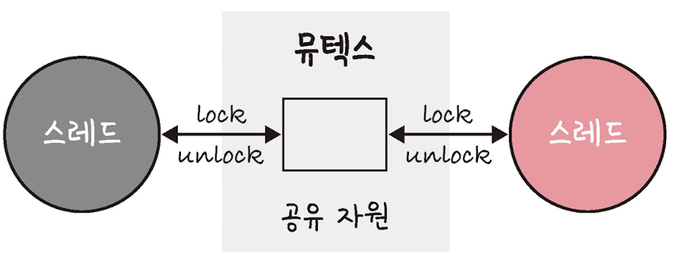
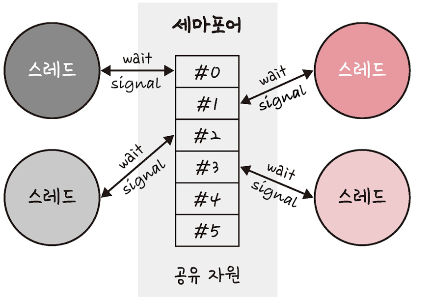
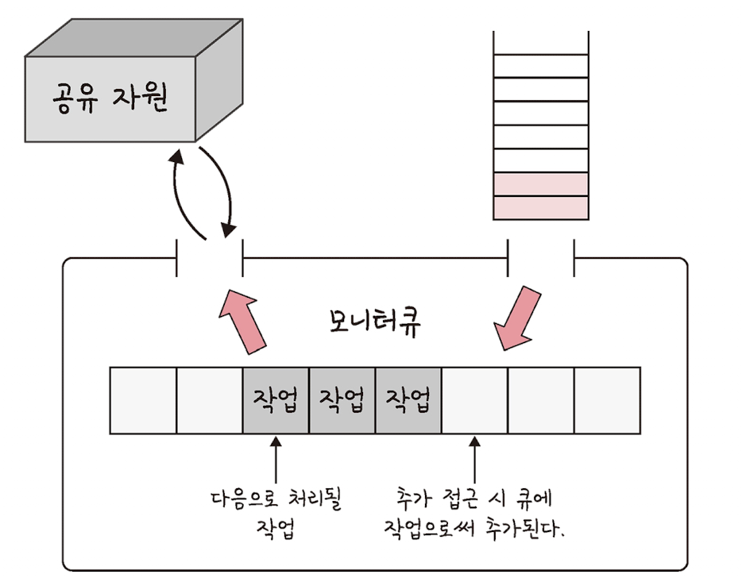

# 프로세스와 스레드

```
💡 프로세스
프로세스는 컴퓨터에서 실행되고 있는 프로그램으로, CPU 스케줄링의 대상이 되는 작업, task라는 용어와 같은 의미로 쓰입니다.
프로그램이 메모리에 올라가 인스턴스화된 것을 말합니다.
운영체제의 CPU 스케줄러에 따라 CPU가 프로세스를 실행합니다.

💡 스레드
프로세스 내 작업의 흐름을 말합니다.
```

## 1 프로세스와 컴파일 과정


1️⃣ 전처리: 소스 코드의 주석을 제거하고 `#include` 등 헤더 파일을 병합하여 메크로를 치환합니다.<br>
2️⃣ 컴파일러: 오류 처리, 코드 최적화 작업을 하며 어셈블리어로 변환합니다.<br>
3️⃣ 어셈블러: 어셈블러를 통해 어셈블리어가 목적 코드(object code)로 변환됩니다. 리눅스에서는 확장자가 `.o`라는 파일이 만들어지게 됩니다.<br>
4️⃣ 링커: 프로그램 ㄴ내에 있는 라이브러리 함수 또는 다른 파일들과 목적 코드를 결합하여 실행 파일을 만듭니다. 확장자는 `.exe` 또는 `.out`이라는 확장자를 갖습니다.<br>

```
💡 정적 라이브러리
프로그램 빌드 시 라이브러리가 제공하는 모든 코드를 실행 파일에 넣는 방식으로 라이브러리를 쓰는 방법입니다.
시스템 환경 등 외부 의존도가 낮은 장점이 있지만,
코드 중복 등 메모리 효율성이 떨어지는 단점이 있습니다.

💡 동적 라이브러리
프로그램 실행 시 필요할 때만 DLL이라는 함수 정보를 통해 참조하여 라이브러리를 쓰는 방법입니다.
메모리 효율성에서의 장점을 지니지만 외부 의존도가 높아진다는 단점이 있습니다.
```

---

## 2 프로세스의 상태


1️⃣ **생성(create)**: 프로세스가 생성된 상태로, `fork()` 또는 `exec()` 함수를 통해 생성합니다. 이때 PCB가 할당됩니다.

```
✅ fork()
부모 프로세스의 주소 공간을 그대로 복사하며, 새로운 자식 프로세스를 생성하는 함수입니다.
주소 공간만 복사할 뿐 부모 프로세스의 비동기 작업을 상속하지는 않습니다.

✅ exec()
새롭게 프로세스를 생성하는 함수입니다.

```

2️⃣ **대기(ready)**: 메모리 공간이 충분하면 메모리를 할당받고, 아니면 아닌 상태로 대기하고 있습니다. CPU 스케줄러로부터 CPU 소유권이 넘어오기를 기다리는 상태입니다.<br>
2️⃣-1️⃣ **대기 중단(ready suspended)**: 메모리 부족으로 일시 중단된 상태입니다.<br>
3️⃣ **실행(running)**: CPU 소유권과 메모리를 할당받고 instruction을 수행 중인 상태를 의미합니다. CPU burst가 일어났다고도 표현합니다.<br>
4️⃣ **중단(blocked)**: 어떤 이벤트가 발생한 이후 기다리면 프로세스가 차단된 상태입니다. I/O 디바이스에 의한 인터럽트로 발생합니다.<br>
4️⃣-1️⃣ **일시 중단(blocked suspended)**: 대기 중단과 유사하게, 중단된 상태에서 프로세스가 실행되려고 했지만 메모리 부족으로 일시 중단된 상태입니다.<br>
5️⃣ **종료(terminated)**: 메모리와 CPU 소유권을 모두 놓고 가는 상태를 말합니다. <br>
자발적 종료와 부모 프로세스가 자식 프로세스를 강제로 종료시키는 비자발적 종료(abort)도 있습니다.<br>
자원의 한계치를 넘어섰을 경우, 부모 프로세스가 종료되는 경우, 사용자가 `process.kill` 등 명령어로 프로세스를 종료한 경우 발생합니다.<br>

---

## 3 프로세스의 메모리 구조


### 스택과 힙

런타임 단계에서 메모리를 할당받는 동적 할당이 됩니다.

#### 스택

지역 변수, 매개 변수, 실행되는 함수에 의해 늘어나거나 줄어드는 메모리 영역입니다. <br>
함수가 호출될 때마다 호출될 때의 환경 등 특정 정보가 스택에 계속해서 저장됩니다. <br>
재귀 함수가 호출된다고 했을 때 새로운 스택 프레임이 매번 사용되기 때문에, 함수 내의 변수 집합이 해당 함수의 다른 인스턴스 변수를 방해하지 않습니다. <br>

#### 힙

동적으로 관리되는 자료 구조의 경우 힙 영역을 사용하는데, `malloc()`, `free()` 함수를 통해 관리할 수 있습니다. <br>
`vector`는 내부적으로 힙 영역을 사용합니다.

### 데이터 영역과 코드 영역

컴파일 단계에서 메모리를 할당하는 정적 할당 영역입니다.

#### 데이터 영역(Data Segment)

전역 변수 또는 `static`, `const` 로 선언되어 있는 변수들이 할당됩니다.<br>
1️⃣ BSS Segment: 0으로 초기화 또는 초기화되지 않은 변수들이 할당됩니다.<br>
2️⃣ Data segment: 0이 아닌 값으로 초기화된 변수가 할당됩니다.

#### 코드 영역(Code Segment)

프로그램의 코드가 들어갑니다.

---

## 4 PCB(Process Control Block)

프로세스 제어 블록으로, 운영체제에서 프로세스에 대한 메타데이터를 저장한 데이터를 말합니다. <br>
프로세스가 생성되면 운영체제는 해당 PCB를 생성합니다. <br><br>

프로그램이 실행되면 프로세스가 생성되고 프로세스 주소 값들에 앞서 설명한 스택, 힙 등의 구조를 기반으로 메모리가 할당됩니다. <br>
이 프로세스의 메타데이터들이 PCB에 저장되어 관리됩니다. <br>
이는 프로세스의 중요한 정보를 포함하고 있기 때문에 일반 사용자가 접근하지 못하도록 커널 스택의 가장 앞부분에서 관리됩니다. <br>

```
💡 메타데이터
데이터에 관한 구조화된 데이터이자, 데이터를 설명하는 작은 데이터입니다.
대량의 정보 가운데에서 찾고 있는 정보를 효율적으로 찾아내서 이용하기 위해 일정한 규칙에 따라 콘텐츠에 부여되는 데이터입니다.
```

### PCB의 구조

- 프로세스 스케줄링 상태: `준비`, `일시중단` 등 프로세스가 CPU에 대한 소유권을 얻은 이후의 상태
- 프로세스 ID: 프로세스 ID, 해당 프로세스의 자식 프로세스 ID
- 프로세스 권한: 컴퓨터 자원 또는 I/O 디바이스에 대한 권한 정보
- 프로그램 카운터: 프로세스에서 실행해야 할 다음 명령어의 주소에 대한 포인터
- CPU 레지스터: 프로세스를 실행하기 위해 저장해야 할 레지스터에 대한 정보
- CPU 스케줄링 정보: CPU 스케줄러에 의해 중단된 시간 등에 대한 정보
- 계정 정보: 프로세스 실행에 사용된 CPU 사용량, 실행한 유저의 정보
- I/O 상태 정보: 프로세스에 할당된 I/O 디바이스 목록

### 컨텍스트 스위칭(Context Switching)

PCB를 교환하는 과정으로, 한 프로세스에 할당된 시간이 끝나거나 인터럽트에 의해 발생합니다. <br>
많은 프로그램을 동시에 실행하는 것처럼 보이지만 어떠한 시점에서 실행되고 있는 프로세스는 단 한 개이며, <br>
싱글 코어에서 많은 프로세스가 동시에 구동되는 것처럼 보이는 것은 다른 프로세스와의 컨텍스트 스위칭이 아주 빠른 속도로 실행되기 때문입니다. <br>


위 그림처럼 컨텍스트 스위칭이 일어날 때 유휴 시간(idle time)과 캐시미스가 발생합니다.<br>

```
💡 캐시미스
컨텍스트 스위칭이 일어날 때 프로세스가 가지고 있는 메모리 주소가 그대로 있으면,
잘못된 주소 변환이 생기므로 캐시클리어 과정을 겪게 되고, 이 때문에 캐시미스가 발생합니다.

💡 스레드 컨텍스트 스위칭
스레드는 스택 영역을 제외한 모든 메모리를 공유하기 때문에, 비용이 더 적고 시간도 더 적게 걸립니다.
```

---

## 5 멀티프로세싱

### 웹 브라우저

멀티프로세스 구조를 가지고 있으며, 브라우저, 랜더러, 플러그인, GPU 프로세스가 있습니다.

- 브라우저 프로세스: 주소 표시줄, 북마크 막대, 뒤로 가기 버튼, 앞으로 가기 버튼 등을 담당하며, 네트워크 요청이나 파일 접근 같은 권한을 담당합니다.
- 렌더러 프로세스: 웹 사이트가 보이는 부분의 모든 것을 제어합니다.
- 플러그인 프로세스: 웹 사이트에서 사용하는 플러그인을 제어합니다.
- GPU 프로세스: GPU를 이용해서 화면을 그리는 부분을 제어합니다.

### IPC(Inter Process Communication)

프로세스끼리 데이터를 주고 받고 공유 데이터를 관리하는 매커니즘을 말하며, 멀티 프로세스에서 가능합니다. <br>
예시로 클라이언트는 데이터를 요청하고 서버는 클라이언트 요청에 응답하는 것이 있습니다.<br><br>

IPC의 종류로는 공유 메모리, 파일, 소켓, 익명 파이프, 명명 파이프, 메시지 큐가 있습니다. <br>
이들은 모두 메모미가 완전히 공유되는 스레드보다는 속도가 떨어집니다. <br>

#### 공유 메모리(shared memory)

여러 프로세스에 동일한 메모리 블록에 대한 접근 권한이 부여되어<br>
프로세스가 서로 통신할 수 있도록 공유 메모리를 생성해서 통신하는 것을 말합니다.<br>


각 프로세스의 메모리를 다른 프로세스가 접근할 수 없지만, 공유 메모리를 통해 여러 프로세스가 하나의 메모리를 공유할 수 있습니다.<br>
하드웨어 관점에서 공유 메모리는 CPU가 접근할 수 있는 큰 랜덤 접근 메모리인 RAM을 가리키기도 합니다. <br>
IPC 방식 중 어떠한 매개체를 통해 데이터를 주고받는 것이 아닌 메모리 자체를 공유하기 때문에, 불필요한 데이터 복사의 오버헤드가 발생하지 않아 가장 빠릅니다.<br>
같은 메모리 영역을 여러 프로세스가 공유하기 때문에 동기화가 필요합니다. <br>

#### 파일

디스크에 저장된 데이터 또는 파일 서버에서 제공한 데이터로, 이를 기반으로 프로세스 간 통신을 합니다. <br>

#### 소켓

동일한 컴퓨터의 다른 프로세스나 네트워크의 다른 컴퓨터로 네트워크 인터페이스를 통해 전송하는 데이터를 의미하며 TCP와 UDP가 있습니다. <br>

#### 익명 파이프(unamed pipe)

프로세스 간에 FIFO 방식으로 읽히는 임시 공간인 파이프를 기반으로 데이터를 주고 받으며, 단방향 방식의 읽기, 쓰기 전용 파이프를 만들어 작동하는 방식을 말합니다. <br>


이는 부모, 자식 프로세스 간에만 사용할 수 있으며 다른 네트워크상에서는 사용이 불가능합니다. <br>

#### 명명된 파이프(named pipe)

파이프 서버와 하나 이상의 파이프 클라이언트 간의 통신을 위한 명명된 단방향 또는 양방향 파이프를 말합니다. <br>
클라이언트/서버 통신을 위한 별도의 파이프를 제공하며, 여러 파이프를 동시에 사용할 수 있습니다. <br>
컴퓨터의 프로세스끼리 또는 다른 네트워크상의 컴퓨터와도 통신을 할 수 있습니다. <br>


보통 서버용 파이프와 클라이언트용 파이프로 구분해서 작동하며, <br>
하나의 인스턴스를 열거나 여러 개의 인스턴스를 기반으로 통신합니다. <br>

#### 메시지 큐

메시지를 `queue` 데이터 구조 형태로 관리하는 것으로, <br>
커널의 전역변수 형태 등 커널에서 전역적으로 관리되며 다른 IPC 방식에 비해서 사용 방법이 매우 직관적이고 간단합니다. <br>
다른 코드의 수정 없이 단지 몇 줄의 코드를 추가시켜 간단하게 메시지 큐에 접근할 수 있는 장점이 있습니다. <br>


공유 메모리를 통해 IPC를 구현할 때 쓰기 및 읽기 빈도가 높으면 동기화 때문에 기능을 구현하는 것이 매우 복잡해지기 때문에, 대안으로 메시지 큐를 사용합니다. <br>

---

## 6 스레드와 멀티스레딩

### 스레드

스레드는 프로세스의 실행 가능한 가장 작은 단위로, 프로세스는 여러 스데르를 가질 수 있습니다.<br>


코드, 데이터, 스택, 힙을 각각 생성하는 프로세스와는 달리, 스레드는 코드, 데이터, 힙은 스레드끼리 서로 공유합니다. <br>
그 외의 영역은 각각 생성됩니다. <br>

#### 멀티스레딩

프로세스 내 작업을 여러 개의 스레드, 멀티스레드로 처리하는 기법이며, 스레드끼리 서로 자원을 공유하기 때문에 효율성이 높습니다. <br>
웹 요청을 처리할 때 새 프로세스를 생성하는 대신, 스레드를 사용하는 웹 서버의 경우, 훨씬 적은 리소스를 소비합니다. <br><br>

한 스레드가 중단(blocked)되어도 다른 스레드는 실행(running) 상태일 수 있기 때문에 중단되지 않은 빠른 처리가 가능합니다. <br>
또한 서로 독립적인 작업들을 작은 단위로 나누고 동시에 실행되는 것처럼 보여주는 동시성에도 큰 장점이 있습니다.<br><br>

하지만 한 스레드에 문제가 생기면 다른 스레드에도 영향을 끼쳐, 스레드로 이루어져 있는 프로세스에 영향을 줄 수 있는 단점이 있습니다. <br><br>

멀티스레드의 예로는 웹 브라우저의 렌더러 프로세스를 예로 들 수 있는데,<br>
이 프로세스 내에는 메인 스레드, 워커 스레드, 컴포지터 스레드, 레스터 스레드가 존재합니다. <br>

---

## 7 공유 자원과 임계 영역

### 공유 자원(shared resource)

시스템 안에서 각 프로세스, 스레드가 함께 접근할 수 있는 모니터, 프린터, 메모리, 파일, 데이터 등의 자원이나 변수 등을 의미합니다. <br>
이 공유 자원을 두 개 이상의 프로세스가 동시에 읽거나 쓰는 상황을 경쟁 상태(race condition)라고 합니다. <br>
동시에 접근을 시도할 때 접근의 타이밍이나 순서 등이 결괏값에 영향을 줄 수 있는 상태를 의미합니다. <br>

### 임계 영역(critical section)

둘 이상의 프로세스, 스레드가 공유 자원에 접근할 때 순서 등의 이유로 결과가 달라지는 코드 영역을 말합니다. <br>
임계 영역을 해결하기 위한 방법은 크게 `뮤텍스`, `세마포어`, `모니터` 세 가지가 있으며, 이 방법 모두 상호 배제, 한정 대기, 융통성이란 조건을 만족합니다. <br>
이 방법에 토대가 되는 매커니즘은 잠금(lock)입니다. <br>

```
💡 상호 배제
한 프로세스가 임계 영역에 들어갔을 때 다른 프로세스는 들어갈 수 없습니다.

💡 한정 대기
특정 프로세스가 영원히 임계 영역에 들어가지 못하면 안 됩니다.

💡 융통성
한 프로세스가 다른 프로세스의 일을 방해해서는 안 됩니다.
```

#### 뮤텍스(mutex)

프로세스나 스레드가 공유 자원을 `lock()`을 통해 잠금 설정하고 사용한 후에는 `unlock()`을 통해 잠금 해제하는 객체입니다.<br>
잠금이 설정되면 다른 프로세스나 스레드는 잠긴 코드 영역에 접근할 수 없고 해제는 그와 반대가 되어, 잠금 또는 잠금 해제라는 상태만을 가집니다. <br>



#### 세마포어(semaphore)

일반화된 뮤텍스로, 간단한 정수 값과 두 가지 함수 `wait`(`P 함수`) 및 `signal`(`V 함수`)로 공유 자원에 대한 접근을 처리합니다. <br>
`wait()`는 자신의 차례가 올 때까지 기다리는 함수이며, `signal()`은 다음 프로세스로 순서를 넘겨주는 함수입니다. <br>



프로세스나 스레드가 공유 자원에 접근하면 세마포어에서 `wait()` 작업을 수행하고, <br>
프로세스나 스레드가 공유 자원을 해제하면 세마포어에서 `signal()` 작업을 수행합니다. <br>
세마포어에는 조건 변수가 없고, 프로세스나 스레드가 세마포어 값을 수정할 때 다른 프로세스나 스레드는 동시에 세마포어 값을 수정할 수 없습니다. <ㅠㄱ>

```
✅ 바이너리 세마포어
0과 1의 두가지 값만 가질 수 있는 세마포어입니다.
구현의 유사성으로 뮤텍스를 바이너리 세마포어라고 할 수 있지만 엄밀히 말하면 다릅니다.
뮤텍스는 잠금을 기반으로 상호배제가 일어나는 잠금 매커니즘이고, 세마포어는 신호를 기반으로 생호배제가 일어나는 신호 매커니즘입니다.

✅ 카운팅 세마포어
여러 개의 값을 가질 수 있는 세마포어이며, 여러 자원에 대한 접근을 제어한느 데 사용됩니다.
```

### 모니터

둘 이상의 스레드나 프로세스가 공유 자원에 안전하게 접근할 수 있도록 공유 자원을 숨기고 해당 접근에 대해 인터페이스만 제공합니다. <br>



모니터는 모니터큐를 통해 공유 자원에 대한 작업들을 순차적으로 처리합니다. <br>
세마포어에서는 상호배제를 명시적으로 구현해야 하지만, 모니터에서는 상호 배제가 자동이기 때문에 세마포어보다 구현하기 쉽습니다.<br>

---

## 8 교챡 상태(deadlock)

두 개 이상의 프로세스들이 서로가 가진 자원을 기다리며 중단된 상태를 의미합니다.<br>
프로세스 A가 프로세스의 B의 어떤 자원을 요청할 때, 프로세스 B도 프로세스 A가 점유하고 있는 자원을 요청하는 것입니다. <br>

### 교착 상태의 원인

- 상호 배제: 한 프로세스가 자원을 독점하고 있으며 다른 프로세들은 접근이 불가능한 상태
- 점유 대기: 특정 프로세스가 점유한 자원을 다른 프로세스가 요청하는 상태
- 비선점: 다른 프로세스의 자원을 강제적으로 가져올 수 없는 상태
- 환형 대기: 프로세스 A가 프로세스의 B의 어떤 자원을 요청할 때, 프로세스 B도 프로세스 A가 점유하고 있는 자원을 요청하는 상황

### 교착 상태의 해결 방법

1. 자원 할당 시 위 조건이 성립되지 않도록 설계하는 것
2. 교착 상태 가능성이 없을 때만 자원 할당되며, 프로세스당 요청할 자원들의 최대치를 통해 자원 할당 가능 여부를 파악하는 `은행원 알고리즘`을 사용
3. 교착 상태가 발생하면 사이클이 있는지 찾아보고 이에 관련된 프로세스를 한 개씩 지움
4. 교착 상태 처리 비용이 크므로 교착 상태 발생 시 사용자가 작업을 종료시킴

```
💡 은행원 알고리즘
총 자원의 양과 현재 할당한 자원의 양을 기준으로 안정 또는 불안정 상태로 나누고 안정 상태로 가도록 자원을 할당하는 알고리즘
```
