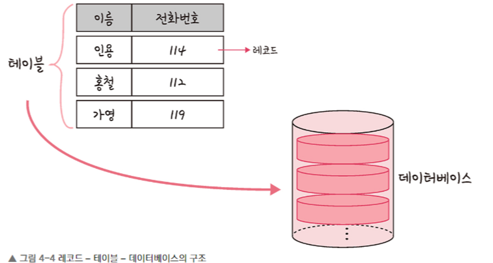
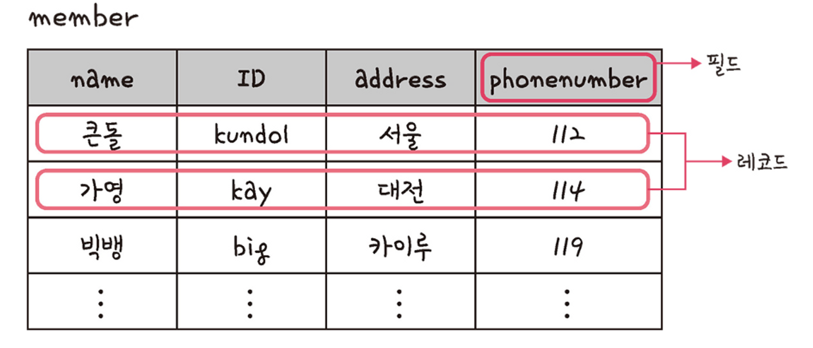
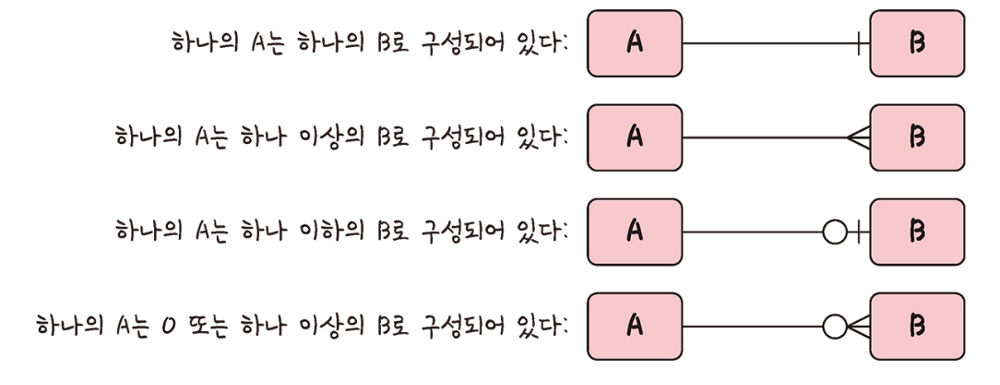
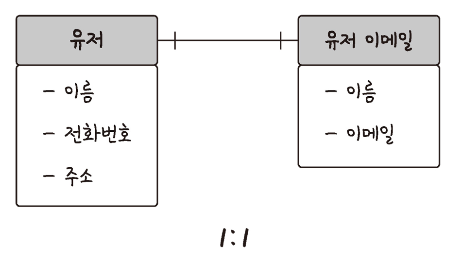
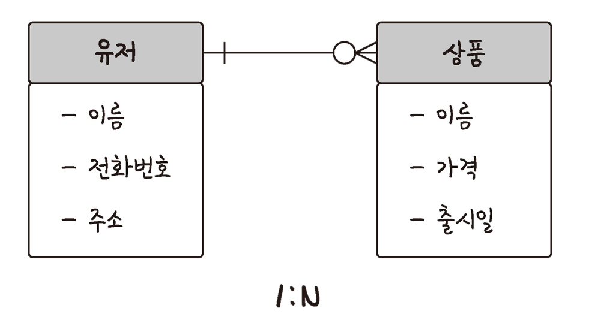
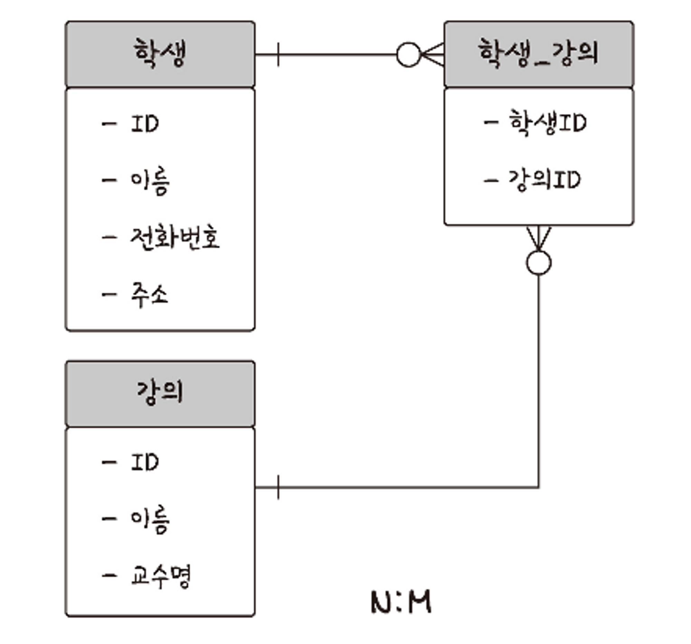
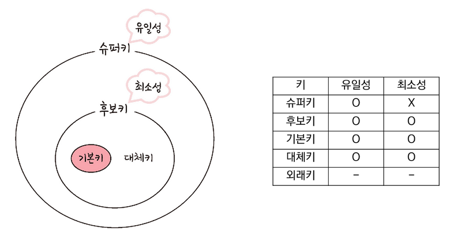

# 데이터베이스 기본

<h3>📑목차</h3>

- [데이터베이스(DB)](#데이터베이스db)
- [엔티티](#엔티티)
- [릴레이션](#릴레이션)
- [도메인](#도메인)
- [필드와 레코드](#필드와-레코드)
    - [필드 타입](#필드-타입)
- [관계](#관계)
    - [1:1 관계](#11-관계)
    - [1:N 관계](#1n-관계)
    - [N:M 관계](#nm-관계)
- [키](#키)

 

## 데이터베이스(DB)
일정한 규칙 혹은 규약을 통해 **구조화되어 저장되는 데이터의 모음**

`실시간 접근` 및 `동시 공유` 가능

#### 데이터베이스 관리 통합 시스템(DBMS)
데이터베이스를 제어, 관리하는 통합 시스템

DBMS마다 정의된 **쿼리 언어**를 통해 데이터들의 `CRUD` 등을 수행
ex) MySQL, ..

 

## 엔티티
**여러 개의 속성을 지닌 명사**를 의미

서비스 요구 사항에 맞춰 엔티티의 속성 정해짐
> ex) 사람, 장소, 물건, 사건, 개념 등..

#### 약한 엔티티 / 강한 엔티티
A가 혼자서는 존재하지 못하고 **B의 존재 여부에 따라 종속적**일 때, A는 약한 엔티티, B는 강한 엔티티라고 함

 

## 릴레이션
DB에서 **정보를 구분하여 저장**하는 기본 단위

`엔티티`가 데이터베이스에서 관리될 때, `릴레이션`으로 변화

엔티티에 관한 데이터를 DB의 릴레이션 하나에 담아 관리

> **릴레이션**  
> - 관계형 DB → **“테이블”**  
> - NoSQL DB → **“컬렉션”**
>
> **데이터 베이스 구조**  
> - 관계형 DB: 레코드 → 테이블 → 데이터베이스  
> - NoSQL DB: 도큐먼트 → 컬렉션 → 데이터베이스

    
     
    <small>출처: 면접을 위한 CS 전공지식 노트</small>
      
    <small>*레코드가 쌓여 테이블이 되고, 테이블이 쌓여 데이터베이스가 됨</small>

 

## 도메인
릴레이션의 각 속성들이 가질 수 있는 값의 집합

> ex) “성별”이라는 속성 → “남”, “여”라는 값을 가질 수 있음 → **“성별” 속성의 도메인: {”남”, “여”}**

 

## 필드와 레코드

    
     
    <small>출처: 면접을 위한 CS 전공지식 노트</small>
      
    <small>"회원"이란 엔티티가 "member"라는 테이블에 저장</small>

### 필드 타입
필드는 숫자, 날짜, 문자 등의 타입을 가짐

- **숫자**: `TINYINT`, `SMALLINT`, `MEDIUMINT`, `INT`, `BIGINT`
- **날짜**: `DATE`, `DATETIME`, `TIMESTAMP`
- **문자**: `CHAR`, `VARCHAR`, `TEXT`, `BLOB`, `ENUM`, `SET`

> 💡**VARCHAR**  
> 둘 다 큰 데이터 저장 시 사용 / 디폴트값 지정 불가 
> TEXT → 큰 문자열 저장에 쓰임 (주로 게시판) 
> BLOB (Binary Large OBject) → 이미지, 동영상 등 대용량 바이너리 데이터 저장 
> *하지만 보통 이미지, 동영상 같은 파일은 서버에 올리고 경로를 VARCHAR로 저장
>
> 💡**ENUM과 SET**  
> 모두 문자열을 열거한 타입, 공간적인 이점이 있으나 어플리케이션 수정되면 정의 목록 수정 필요 
> **ENUM** → 단일 선택만 가능 / 0, 1 등으로 매핑되어 저장 (공간적 이점) / 잘못된 값 삽입 시 빈문자열 
> **SET** → 여러 개 선택 가능 / 각 문자열이 비트로 표현되어 저장 (공간적 이점)/ 비트 단위 연산 가능

 

## 관계
테이블은 서로의 관계가 정의되어 있음 (관계 화살표로 표현) 
`1:1 관계` / `1:N 관계` / `N:M 관계`

    
     
    <small>출처: 면접을 위한 CS 전공지식 노트</small>

### 1:1 관계

참조하는 테이블의 레코드와 참조되는 테이블의 레코드가 단 하나의 관계를 가지는 것을 의미함

하나의 테이블을 두 개의 테이블로 나눈 구조

아래 그림을 통해 설명하면 한 명의 유저는 하나의 이메일을 가질 수 있음

    
     
    <small>출처: 면접을 위한 CS 전공지식 노트</small>

### 1:N 관계

하나의 레코드가 서로 다른 여러 개의 레코드와 연결된 경우를 의미함

한 명의 유저가 여러 상품을 구매할 수 있음 (반대로 하나의 상품이 여러 유저에게 판매될 수는 없음)

    
     
    <small>출처: 면접을 위한 CS 전공지식 노트</small>

### N:M 관계

여러 레코드가 다른 테이블의 여러 레코드와 관계를 맺는 경우를 의미함

두 테이블을 직접 연결하여 구축하지 않고, 1:N, 1:M이라는 관계를 갖는 테이블을 설정

한 학생이 여러 강의를 들을 수 있고, 한 강의도 여러 학생을 포함할 수 있음

    
     
    <small>출처: 면접을 위한 CS 전공지식 노트</small>

 

## 키

테이블 간의 관계를 명확하게 하고 테이블 자체의 인덱스를 위해 설정된 장치

관계형 데이터베이스의 테이블에서 조건을 만족하는 튜플들을 찾거나 정렬할 때 다른 튜플들과 구별할 수 있는 기준이 되는 속성

    
     
    <small>출처: 면접을 위한 CS 전공지식 노트</small>

- **슈퍼키:** 유일성
- **후보키:** 유일성 + 최소성
- **대체키:** 후보키 중 기본키로 선택받지 못한 키
- **기본키:** 후보키 중 선택된 하나 (자연키 또는 인조키 중에 골라 설정)
- **외래키**: 다른 테이블의 기본키를 그대로 참조하는 값 (개체와의 관계를 식별, 중복 가능 → 일대다)

> *유일성: 중복되는 값 없이 하나의 키값으로 튜플을 유일하게 식별할 수 있는 성질 
> *최소성: 최소의 필드만 써서 키를 형성하는 성질 
> *자연키: 중복된 값들을 제외하며 자연스레 선택되는 속성 
> *인조키: 오로지 키 역할을 하기 위해 인조적으로 만든 속성