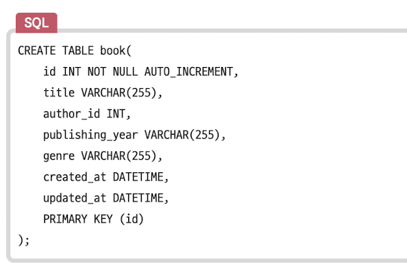
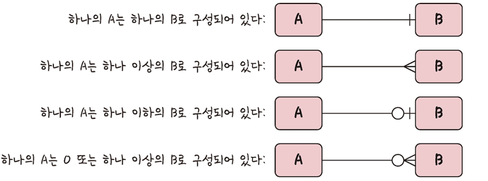
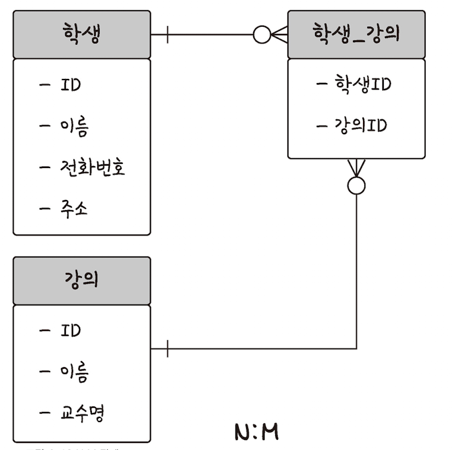

# 데이터베이스의 기본

데이터베이스는 일정한 규칙, 혹은 규익을 통해 구조화되어 저장되는 데이터의 모음입니다.<br>
해당 데이터베이스를 제어, 관리하는 통합 시스템을 DBMS라고 하며, <br>
데이터베이스 안에 있는 데이터들은 특정 DBMS마다 정의된 쿼리 언어를 통해 삽입, 삭제, 수정, 조회 등을 수행할 수 있습니다.<br>
데이터베이스는 실시간 접근과 동시 공유가 가능합니다.

## 1 엔터티

사람, 장소, 물건, 사건, 개념 등 여러 개의 속성을 지닌 명사를 의미합니다. <br>
서비스 요구사항에 맞춰 속성이 정해지게 됩니다. <br>

```
💡 약한 엔터티
혼자서는 존재하지 못하고 다른 엔터디의 존재 여부에 따라 종속적인 엔터티

💡 강한 엔터티
다른 엔터디의 종속을 결정하는 엔터티
```

---

## 2 릴레이션

데이터베이스에서 정보를 구분하여 저장하는 기본 단위로, 엔터티에 관한 데이터를 릴레이션 하나에 담아서 관리합니다. <br>
회원이라는 엔터티가 데이터베이스에서 관리될 때 릴레이션으로 변화되어, <br>
관계형 데이터베이스에선느 `테이블`이라고 하며, NoSQL 데이터베이스에서는 `컬렉션`이라고 합니다. <br>

```
💡 관계형 데이터베이스
대표적으로 MySQL이 있으며, 레코드-테이블-데이터베이스 구조를 가지게 됩니다.
레코드가 쌓여서 테이블이 되고, 테이블이 쌓여서 데이터베이스가 됩니다.

💡 NoSQL 데이터베이스
대표적으로 MongoDB가 있으며, 도큐먼트-컬렉션-데이터베이스 구조를 가지게 됩니다.

```

---

## 3 속성(attribute)

릴레이션에서 관리하는 구체적이며 고유한 이름을 갖는 정보입니다. <br>
서비스 요구 사항을 기반으로 관리해야 할 필요가 있는 속성들만 엔터티의 속성이 됩니다. <br>

---

## 4 도메인

릴레이션에 포함된 각각의 속성들이 가질 수 있는 값의 집합입니다. <br>
예를 들어 회원이라는 릴레이션에 이름, 아이디, 주소, 전화번호, 성별이라는 속성이 있고, 성별은 {남, 여}라는 도메인을 가질 수 있습니다.

---

## 5 필드와 레코드

### 레코드

관계형 데이터베이스에서 테이블은 속성인 이름, 아이디 등을 가질 수 있고, name, ID 등의 필드를 가집니다. <br>
테이블에 쌓이는 행(row) 단위의 데이터를 레코드 또는 튜플이라고 합니다. <br><br>

1. 엔터티를 정의하고 이를 기반으로 테이블을 만들 때, 필요한 속성들을 정합니다.
2. 이 엔터티를 데이터베이스에 넣어 테이블로 만들기 위해 속성에 맞는 타입을 정의합니다.

(ex) 책의 아이디: INT, 책의 제목: VARCHAR(255), 생성 일시: DATETIME<br><br>

MySQL로 구현하면 다음과 같은 코드를 입력하게 됩니다.



### 필드 타입

MySQL 기준 필드의 타입은 대표적으로 숫자, 날짜, 문자 타입이 있습니다.

#### 숫자 타입


#### 날짜 타입

1. `DATE`: 날짜 부분만 포함되는 값으로 1000-01-01부터 9999-12-31 범위를 지원합니다. 3byte 용량을 가집니다.
2. `DATETIME`: 날짜와 시간을 포함하는 값으로, 1000-01-01 00:00:00부터 9999-12-31 23:59:59 범위를 지원합니다. 8byte 용량을 가집니다.
3. `TIMESTAMP`: 날짜와 시간을 포함하는 값으로, 1970-01-01 00:00:01부터 2038-01-18 03:14:07의 범위를 지원합니다. 4byte 용량을 가집니다.

#### 문자 타입

- CHAR와 VARCHAR: 타입과 함께 수를 입력해서 몇 자까지 입력할 지 정합니다.
  1. `CHAR`: 고정 길이 문자열로, 0부터 255 사이의 값을 가집니다. 더 적은 글자수를 입력하더라도 무조건 선언한 길이의 값으로 `고정`해서 저장됩니다. 유동적이지 않은 길이를 가진 데이터에 효율적입니다.
  2. `VARCHAR`: 가변 길이 문자열로, 길이는 0부터 65,535 사이의 값을 가집니다. 입력된 데이터에 따라 용량을 가변시켜 저장합니다. 글자수 + 길이기록욕 1바이트로 저장하게 됩니다. 유동적인 길이를 가진 데이터에 효율적입니다.
- TEXT와 BLOB: 큰 데이터를 저장할 때 쓰는 타입입니다.
  1. `TEXT`: 큰 문자열 조장에 쓰며 주로 게시판의 본문을 저장할 때 씁니다.
  2. `BLOB`: 이미지, 동영상 등 큰 데이터 저장에 씁니다. 그러나 보통은 S3 등 서버에 파일을 올리고 파일에 관한 경로를 VARCHAR로 저장하는 방식을 사용합니다.
- ENUM과 SET: 문자열을 열거한 타입입니다. 공간적인 이점이 있지만, 애플리케이션의 수정에 따라 목록을 수정해야 한다는 단점이 있습니다.
  1. `ENUM`: 타입과 함께 문자열을 괄호안에 열거하는 형태로 쓰이며, 단일 선택만 가능합니다. 없는 값을 삽입하면 빈 문자열이 삽입됩니다. ENUM을 이용하면 x-small 등이 0, 1 등으로 매핑되어 메모리를 적게 사용하는 이점이 있습니다. 최대 65,535개 요소를 넣을 수 있습니다.
  2. `SET`: 여러 개의 데이터를 선택할 수 있고, 비트 단위의 연산을 할 수 있습니다. 최대 64개 요소를 넣을 수 있습니다.

---

## 6 관계

데이터베이스에는 여러 개의 테이블이 있고 이러한 테이블은 서로 관계가 정의되어 있습니다.<br> 이러한 관계를 관계화살표로 나타냅니다. <br>



### 1:1 관계

테이블을 두 개의 테이블로 나눠 테이블의 구조를 더 이해하기 쉽게 만들어 줍니다.

### 1:N 관계

하나의 개체가 다른 많은 개체를 포함하는 관계를 말합니다.

### N:M 관계



테이블 두 개를 직접적으로 연결해서 구축하지 않고, 1:N, 1:M이라는 관계를 갖는 테이블 두개로 나눠서 설정합니다.

---

## 7 키
