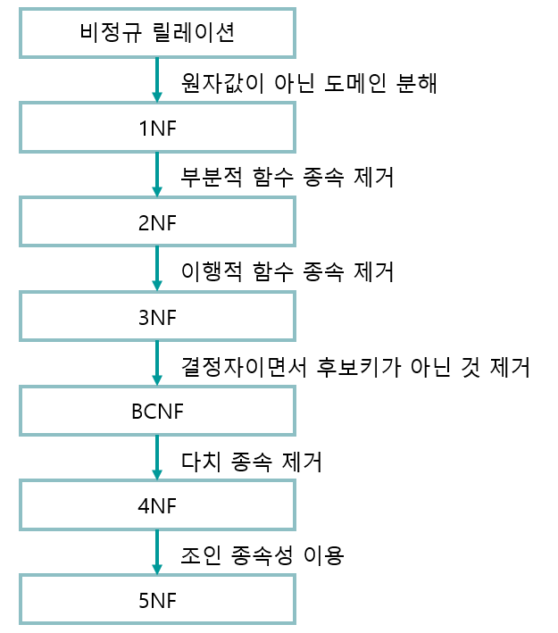
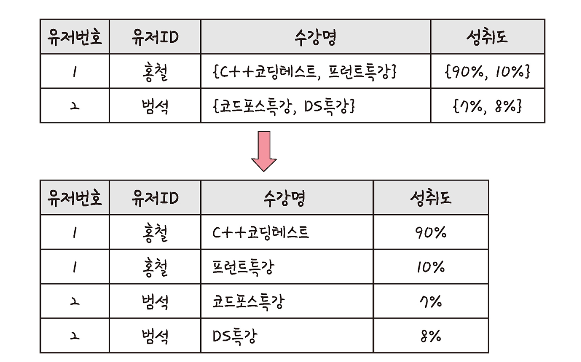
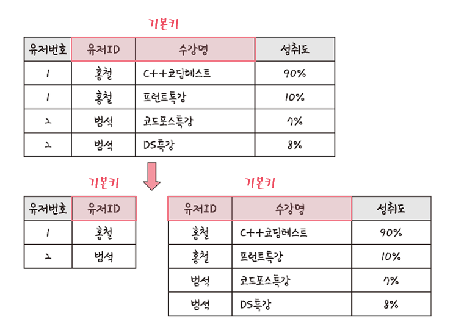
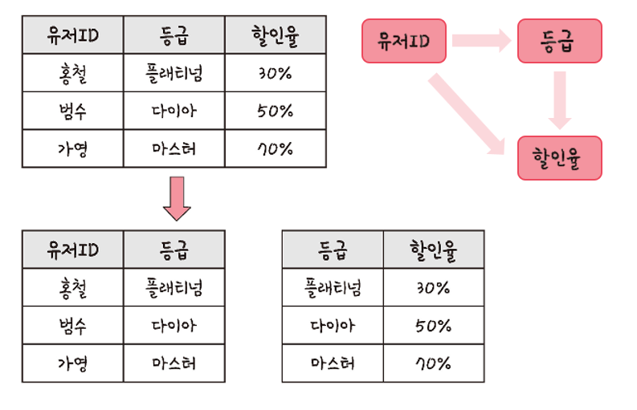
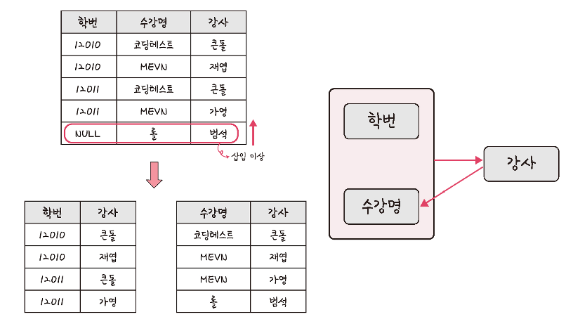
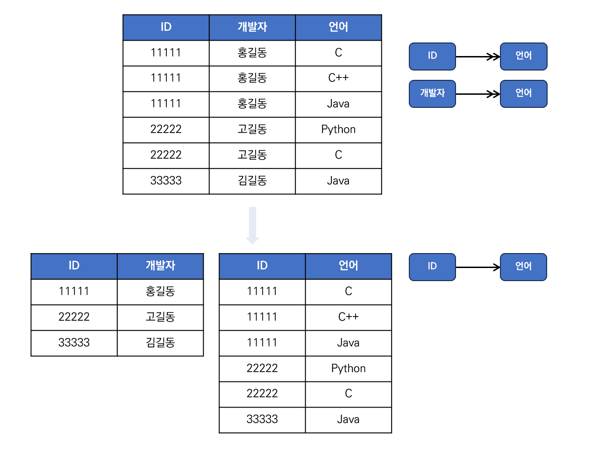

# ERD와 정규화 과정

<h3>📑목차</h3>

- [ERD](#erd)
- [정규화 과정](#정규화-과정)
    - [제1정규형(1NF)](#제1정규형-1nf)
    - [제2정규형(2NF)](#제2정규형-2nf)
        - [부분 함수 종속](#부분-함수-종속)
        - [완전 함수 종속](#완전-함수-종속)
    - [제3정규형(3NF)](#제3정규형-3nf)
        - [이행적 함수 종속](#이행적-함수-종속)
    - [보이스/코드 정규형(BCNF)](#보이스코드-정규형-bcnf)
    - [제4정규형(4NF)](#제4정규형-4nf)
        - [다치 종속(다중값 종속)](#다치-종속다중값-종속)

 

## ERD
`ERD`(Entity Relationship Diagram)는 릴레이션 간의 관계들을 정의한 것을 의미한다. 

- 요구 사항을 기반으로 작성
- ERD 기반으로 데이터베이스 구축
- 관계형 구조로 표현할 수 있는 데이터에 유용
- 비정형 데이터 충분히 표현 불가

 

## 정규화 과정
릴레이션 간 잘못된 종속 관계로 **데이터베이스 이상현상이 일어난 것을 해결**하거나, 효율성을 위해 **릴레이션을 여러 개로 분리**하는 과정

- **정규형 원칙**을 기반으로 정규형을 만들어가는 과정
- 정규화 정도는 정규형(`NF`: Normal Form)으로 표현
- 기본 정규형: `제1정규형`, `제2정규형`, `제3정규형`, `보이스/코드 정규형`
- 고급 정규형: `제4정규형`, `제5정규형`

    
     
    <small><a ref="https://bazingzinga.blogspot.com/2019/02/10.html">출처</a></small>

> **📋정규형 원칙**  
> - 같은 의미를 표현하는 릴레이션이지만 좀 더 좋은 구조
> - 자료의 중복성 감소
> - 독립적인 관계는 별개의 릴레이션으로 표현
> - 각 릴레이션은 독립적인 표현 가능

> 데이터베이스 이상현상

 

### 제1정규형 `1NF`
릴레이션의 모든 도메인이 더 이상 분해될 수 없는 **`원자 값`** 만으로 구성되어야 한다.

- 각 속성의 값은 하나의 값만 가져야 함
- 각 속성의 값은 같은 종류나 타입의 값을 가져야 함
- 각 속성은 유일한 이름을 가져야 함
- 속성의 순서가 상관 없어야 함

    
     
    <small>출처: 면접을 위한 CS 전공지식 노트</small>

 

### 제2정규형 `2NF`
제1정규형을 만족시켜야 하며, 모든 컬럼의 부분 함수의 종속성을 제거해야 한다. 즉, 완전 함수 종속을 만족해야 한다. 

#### 부분 함수 종속
부분 함수의 종속이란 기본키 중 특정 컬럼에만 종속되는 것을 말한다. 

#### 완전 함수 종속
완전 함수 종속이란 기본키를 구성하는 모든 속성이 포함된 기본키의 부분집함에 종속되는 경우를 말한다. 

아래 그림에서 정규화하기 전 테이블을 보면 `유저번호` 속성은 복합키인 기본키 중 `유저ID` 속성만 알면 알 수 있다. 즉, 수강명까지 볼 필요가 없으니 **`부분 함수 종속성`** 이 존재한다. 이를 두 테이블로 분해하여 각 테이블에서 모든 속성이 완전 종속을 이룰 수 있게 한다. 

- 제1정규형 만족
- 부분 함수 종속을 제거
- 릴레이션 분해 시 동등한 릴레이션으로 분해
- 무손실 분해 (정보 손실 발생 X)

    
     
    <small>출처: 면접을 위한 CS 전공지식 노트</small>

> **종속**  
> 릴레이션 R(테이블)에서 X와 Y를 R의 부분집합이라고 할 때, X의 값 각각에 대해 Y의 값이 오직 하나로 결정 될때 Y는 X에 종속 된다고 함  
> *즉, 테이블의 한 필드값(X)이 다른 필드값(Y)를 결정하는 관계
>
> **결정자**  
> 함수 종속 관계에서 특정 종속자를 결정짓는 요소 
> [X → Y 관계에서] 
> X: 결정자 
> Y: 종속자

 

### 제3정규형 `3NF`
제2정규형을 만족시켜야 하며, 기본키가 아닌 모든 속성이 이행 함수 종속을 만족하지 않는 상태여야 한다. 

#### 이행적 함수 종속
이행적 함수 종속(transitive Functional Dependency)이란 `A → B`와 `B → C`가 존재할 때 `A → C`가 성립되는데, 이때 `C`가 `A`에 이행적으로 함수 종속이 되었다고 한다. 

아래 그림에서 `유저ID → 등급`, `등급 → 할인율`, `유저ID → 할인율`을 만족하므로 이행 함수 종속이 존재한다. 따라서 2개의 테이블로 분리하여 이행 함수 종속을 제거한다. 

- 제2정규화 만족
- 이행 함수 종속 제거

    
     
    <small>출처: 면접을 위한 CS 전공지식 노트</small>

 

### 보이스/코드 정규형 `BCNF`
제3정규형을 만족시켜야 하며, **결정자가 후보키가 아닌 함수 종속 관계를 제거**해야 한다. 즉, 릴레이션의 함수 종속 관계에서 **모든 결정자가 후보키인 상태**를 말한다. 

- 제3정규형을 만족
- 모든 결정자가 후보키 집합에 속함

    
     
    <small>출처: 면접을 위한 CS 전공지식 노트</small>

 

### 제4정규형 `4NF`
보이스/코드 정규형을 만족시켜야 하며, **다치 종속(다중값 종속)**을 제거해야 한다. 

#### 다치 종속(다중값 종속)
같은 테이블 내의 독립된 두 속성이 1:N 관계로 대응하는 경우를 말한다. 다치 종속은 머리가 두개인 이중 화살표 `↠`로 표기한다. `A ↠ B` 다치 관계에서 `A`가 `B`를 다치 결정하고, `B`가 `A`에 다치 종속된다. 

아래 그림에서 `ID ↠ 언어`, `개발자 ↠ 언어` 다치 종속이 존재해 `ID`, `개발자`가 중복되는 값들이 만들어진 것을 볼 수 있다. 이를 테이블 2개로 분할하여 다치 종속을 없앨 수 있다. 

- 보이스/코드 정규형 만족
- 다치 종속 제거

    

 

<!-- ### 제5정규형 `5NF`
제4정규형을 만족시켜야 하며, **조인 종속성**을 제거해야 한다. 

#### 조인 종속성
하나의 릴레이션을 여러개의 릴레이션으로 분해했다가, 다시 조인했을 때 데이터의 손실 또는 추가가 발생하지 않는 것을 말한다. 

릴레이션을 분해했다가 그대로 다시 조인하는데, 데이터 변형이 있겠냐 싶지만 아래의 경우처럼 데이터가 추가 또는 손실되는 경우가 있다. 이런 경우는 조인 종속성이 아니기 때문에 제5정규형의 대상이 되지 않는다. 

즉, 제5정규형은 테이블이 분해되었다 다시 조인했을 때 이전 테이블과 같다면(조인 종속성이 존재한다면) 테이블을 분해하는 것을 말한다. (분할했다가 다시 합쳤을 때 데이터 변형 있다면 분해하지 X)

- 제4정규형 만족
- 조인 종속성 제거 -->
