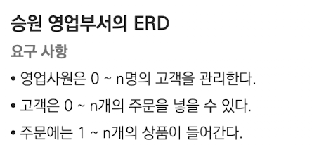
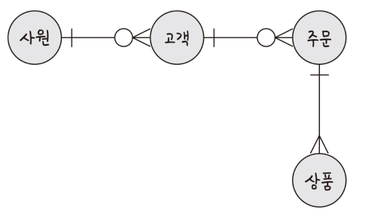
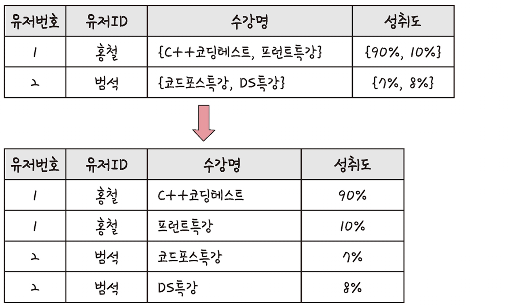
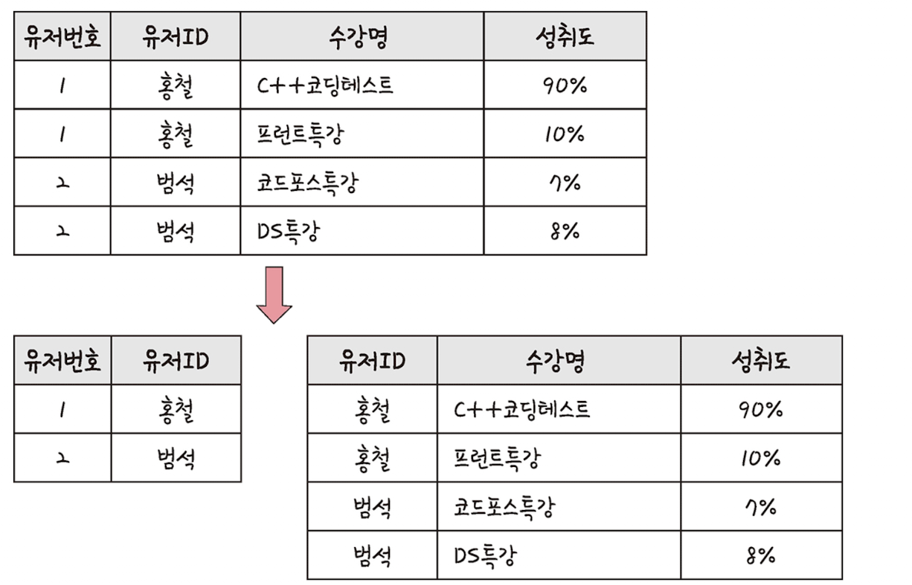
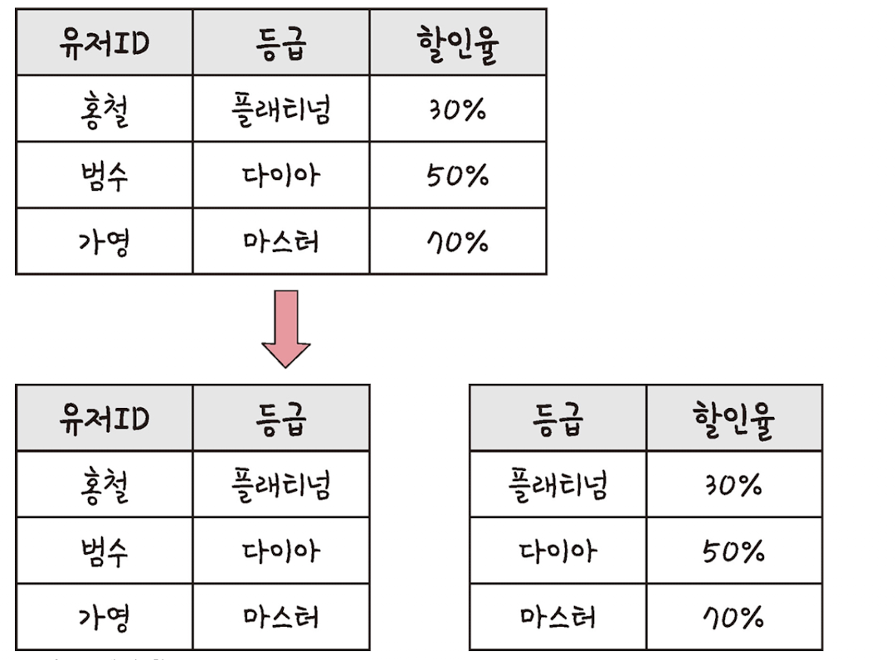
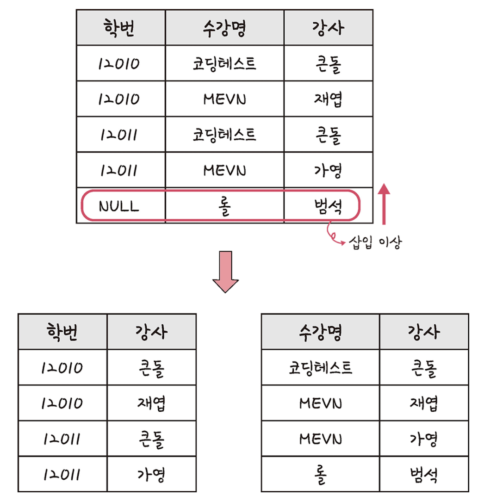

# ERD와 정규화 과정

ERD(Entity Relationship Diagram)는 데이터베이스를 구축할 때 가장 기초적인 뼈대 역할을 하며, 릴레이션 간의 관계들을 정의한 것입니다. <br>
단단한 골조로 건물을 짓는 것과 같이 서비스를 구축할 때 가장 먼저 신경 써야 할 부분입니다.

## 1 ERD의 중요성

ERD는 시스템의 요구 사항을 기반으로 작성되며 이 ERD를 기반으로 데이터베이스를 구축합니다. <br>
데이터베이스를 구축한 이후에도 디버깅, 또는 비즈니스 프로세스 재설계가 필요한 경우에 설계도 역할을 담당하기도 합니다. <br>
관계형 구조로 표현할 수 있는 데이터는 유용하지만, 비정형 데이터는 충분히 표현할 수 없다는 단점이 있습니다. <br>

```
💡 비정형 데이터
비구조화 데이터를 말하며, 미리 정의도니 데이터 모델이 없거나, 미리 정의된 방식으로 정리되지 않은 정보를 말합니다.
```

---

## 2 예제로 배우는 ERD

<p>


</p>

---

## 3 정규화 과정

### 제1정규형

릴레이션의 모든 도메인이 더 이상 분해될 수 없는 원자 값(atomic value)만으로 구성되어야 합니다. <br>
릴레이션의 속성 값 중에서 한 개의 기본키에 대해 두 개 이상의 값을 가지는 반복 집합이 있어서는 안 됩니다. <br>
만약 반복 집합이 있다면 제거해야 합니다. <br>



앞의 그림처럼 홍철, 범석 ID에 수강명에 반복 집합이 있어서, 이것을 나누어 반복 집합을 제거하는 것을 볼 수 있습니다.

### 제2정규형

릴레이션이 제1정규형이며 부분 함수의 종속성을 제거한 형태를 말합니다. <br>
부분 함수의 종속성 제거란 기본키가 아닌 모든 속성이 기본키에 완전 함수 종속적인 것을 말합니다. <br>



앞의 그림을 보면 기본키인 유저 ID, 수강명과 완전 종속된 `유저번호` 릴레이션과 `성취도` 릴레이션으로 분리할 수 있습니다. <br>
이 때 주의할 점은 릴레이션을 분해할 때 동등한 릴레이션으로 분해해야 하고, <br>
정보 손실이 발생하지 않는 무손실 분해로 분해되어야 한다는 것입니다. <br>

### 제3정규형

제2정규형이고 기본키가 아닌 모든 속성이 이행적 함수 종속(transitive FD)을 만족하지 않는 상태를 말합니다.

```
💡 이행적 함수 종속
A->B와 B->C가 존재하면 논리적으로 A->C가 성립하는데,
이 때 집합 C가 집합 A에 이행적으로 함수 종속이 되었다고 합니다.
```



유저 ID와 등급, 할인율이 정해져 있는 테이블을 위와 같이 분해하는 것을 말합니다.

### 보이스/코드 정규형(BCNF)

제3정규형이고, 결정자가 후보키가 아닌 함수 종속 관계를 제거하여 릴레이션의 함수 종속 관계에서 모든 결정자가 후보키인 상태를 말합니다. <br>

```
💡 결정자
함수 종속 관계에서 특정 종속자(dependent)를 결정짓는 요소로, 'X->Y'일 때 X는 결정자, Y는 종속자입니다.
```



강사 속성이 결정자이지만 후보키가 아니므로 강사 속성을 분해하는 것을 말합니다. <br><br>

이렇게 정규형 과정을 거쳐 테이블을 나눈다고 해서 성능이 무조건 좋아지는 것은 아니고 나빠질 수도 있습니다.<br>
테이블을 나누게 되면 어떠한 쿼리는 조인을 해야 하는 경우도 발생해서 오히려 느려질 수도 있기 때문에 서비스에 따라 정규화 또는 비정규화 과정을 진행해야 합니다.
