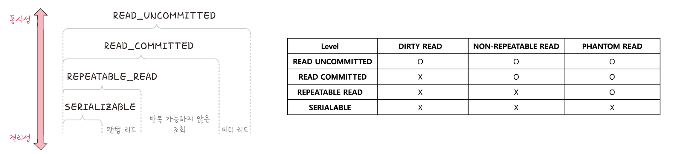
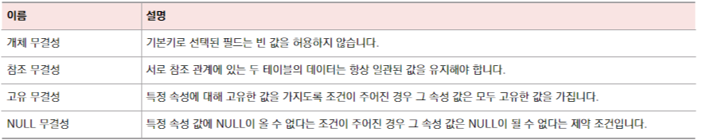

# 트랜잭션과 무결성

<h3>📑목차</h3>

- [트랜잭션](#트랜잭션)
- [트랜잭션의 연산](#트랜잭션의-연산)
    - [커밋](#커밋)
    - [롤백](#롤백)
- [트랜잭션 특징 (ACID)](#트랜잭션-특징-acid)
    - [원자성](#원자성)
    - [일관성](#일관성)
    - [격리성](#격리성)
        - [격리수준](#격리수준)
            - [SERIALIZABLE](#serializable)  
            - [REPEATABLE_READ](#repeatable_read)  
            - [READ_COMMITTED](#read_committed)  
            - [READ_UNCOMMITTED](#read_uncommitted)  
    - [지속성](#지속성)
- [무결성](#무결성)

 

## 트랜잭션
트랜잭션이란 DB에서 하나의 논리적 기능을 수행하기 위한 작업의 단위를 말한다. 즉, 여러 쿼리들을 하나로 묶는 단위이다. 

 

## 트랜잭션의 연산
트랜잭션의 연산으로 `커밋`과 `롤백`이 있는데, 이 연산을 통해 **데이터의 무결성이 보장**된다. 

#### 커밋 
여러 쿼리가 성공적으로 처리되었다고 확정하는 명령어로, 트랜잭션 단위로 수행된다. 즉, 변경된 내용이 모두 영구적으로 저장된 것을 의미한다. 
> 💡 "커밋이 수행되었다" = "하나의 트랜잭션이 성공적으로 수행되었다."

#### 롤백
트랜잭션으로 처리한 하나의 묶음 과정을 일어나기 전으로 되돌리는 일을 말한다.

 

## 트랜잭션 특징 (ACID)
트랜잭션은 `원자성(A)`, `일관성(C)`, `격리성(I)`, `지속성(D)`의 특징을 가지고 있다. 

 

### 원자성
원자성(atomicity)은 트랜잭션과 관련된 일이 **모두 수행되었거나 되지 않았거나**를 보장하는 특징이다.

트랜잭션 단위로 여러 로직들을 묶을 때 **외부 API를 호출하면 안된다.** 막얀 호출한다면 롤백이 일어났을 때 어떻게 해야 할 지 방안이 있어야 한다. 또한 트**랜잭션 전파를 신경써서 관리**해야 한다. 

> 트랜잭션 전파
> 하나의 트랜잭션 내부에 다른 트랜잭션이 있는 경우, 트랜잭션 정책에 따라 어떻게 동작할지 결정하는 것  
> <a hef="https://escapefromcoding.tistory.com/734">✏️스프링 트랜잭션 전파 기본개념</a>

 

### 일관성
일관성(consistency)은 '허용된 방식'으로만 데이터를 변경해야 하는 것을 말한다. 데이터베이스의 제약이나 규칙에 따라 항상 일관성있게 작업의 처리 결과가 나와야 한다. 
> ex. 송금 트랜잭션에서 "잔액은 항상 양의 정수"라는 제약 조건이 있다면 송금 트랜잭션이 수행된 이후의 잔액은 항상 일정하게 양의 정수이어야 한다. 

 

### 격리성
격리성(isolation)은 트랜잭션 수행 시 서로 끼어들지 못하는 특성을 말한다. 복수의 병렬 트랜잭션은 서로 격리되어 마치 순차적으로 실행되는 것처럼 작동되어야 하며 DB엔 여러 사용자가 같은 데이터에 접근할 수 있어야 한다. **여러 격리 수준**으로 나뉘어 격리성을 보장한다. 

 

### 격리수준
격리 수준은 `SERIALIZABLE`, `REPEATABLE_READ`, `READ_COMMITTED`, `READ_UNCOMMITTED가` 있다.

아래 그림에서 위로 갈수록 동시성이 강해지고 아래로 갈 수로 격리성이 강해진다. 또한 각 단계마다 나타나는 현상이 존재한다. 

    
     
    <small>출처: 면접을 위한 CS 전공지식 노트</small>

> **[격리 수준에 따라 발생하는 현상]**   
> **팬텀 리드** (phantom read) 
> 한 트랜잭션 내에서 동일한 쿼리를 보냈을 때 해당 조회 결과가 다른 경우 
> ex. A: `age`가 12이상인 회원 조회 (결과 3개) 
>   → B: `age`가 15인 레코드 삽입 
>   → A: `age`가 12이상인 회원 조회 (결과 4개)
>
> **반복 가능하지 않은 조회** (non-repeatable read) 
> 한 트랜잭션 내에서 같은 행에 두 번 이상 조회 발생 시, 그 값이 다른 경우
> ex) A: `age` 조회 (결과: 100) 
>   → B: `age = 15` (값 변경 및 커밋) 
>   → A: `age` 조회 (결과: 15)
>
> **더티 리드** (dirty read) 
> 한 트랜잭션이 실행 중 다른 트랜잭션에 의행 수정되었지만 아직 **커밋되지 않은 행의 데이터**를 읽을 수 있는 경우

#### SERIALIZABLE
- 트랜잭션 순차 진행
- **해당 트랜잭션의 읽기 차단**
- 여러 트랜잭션 **동시에 같은 행 접근 불가** (해당 행에 대해 격리)
- 가장 엄격한 수준의 격리성 단계
- 교착 상태 일어날 확률 적지만 성능 떨어짐 

#### REPEATABLE_READ
- 하나의 트랜잭션이 수정한 행, **다른 트랜잭션이 수정 불가**
- 새로운 행 추가 가능 (→ `팬텀 리드` 발생 가능)

#### READ_COMMITTED
- 다른 트랜잭션이 **커밋 완료한 데이터에 대해서만 조회 허용**
- 다른 트랜잭션이 접근한 행 수정 가능 (→ `반복 가능하지 않은 조회` 발생 가능)
- 가장 많이 사용되는 격리 수준
- 많은 DBMS에서 기본값으로 설정됨

#### READ_UNCOMMITTED
- 다른 트랜잭션이 **커밋하지 않은 데이터에 대해 조회 가능** (→ `더티 리드` 발생 가능)
- 가장 낮은 격리 수준

 

### 지속성
지속성(durability)은 성공적으로 수행된 트랜잭션은 영원히 반영되어야 하는 것을 의미한다. DB에 시스템 장애가 발생해도 원래 상태로 복구하는 회복 기능이 있어야 함을 의미한다. `체크섬`, `저널링`, `롤백` 등을 통해 지속성 보장

> **체크섬**  
> 데이터의 무결성을 확인하기 위해 사용되는 기술로 데이터블록이나 파일의 체크섬을 계산하여 해당 블록이나 파일이 손상되지 않았는지 확인하는 기법
>
> **저널링**  
> 데이터베이스 시스템에 변경사항을 커밋하기 전에 로깅하는 것. 

 

## 무결성
데이터 무결성은 데이터에 결함이 없는 상태로 데이터의 정확성, 일관성, 유효성이 유지되는 것을 의미한다. 무결성이 유지되어야 데이터베이스에 저장된 값과 그 값에 해당하는 현실 세계의 실제 값이 일치하는지에 대한 신뢰가 생긴다. 

    
     
    <small>출처: 면접을 위한 CS 전공지식 노트</small>

> **💡정확성**    
> 데이터의 중복이나 누락이 없는 상태
>
> **💡일관성**     
> 원인과 결과의 의미가 연속적으로 보장되어 변하지 않는 상태
