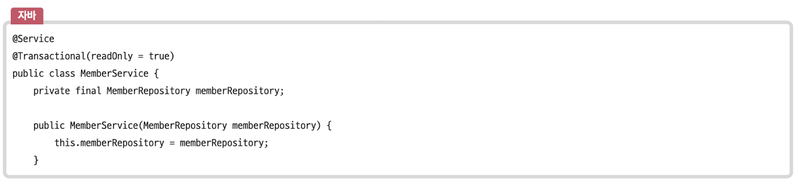

# 트랜잭션과 무결성

## 트랜잭션

트랜잭션은 데이터베이스에서 하나의 논리적 기능을 수행하기 위한 작업의 단위를 말하며,<br>
데이터베이스에 접근한느 방법은 쿼리이므로, 여러 개의 커리들을 하나로 묶는 다위를 말합니다. <br>
이에 대한 특징은 원자성, 일관성, 독립성, 지속성이 있으며, 이를 한꺼번에 ACID 특징이라고 합니다.

### 원자성(Atomicity)

트랜잭션과 관련된 일이 모두 수행되었거나 되지 않았거나를 보장하는 특징입니다. <br>
트랜잭션에 문제가 발생하여 롤백하는 경우 그 이후에 모두 수행되지 않음을 보장하는 것을 말합니다. <br>
계좌 송금과 같은 경우 작업을 취소한다고 했을 때 일부 operation만 적용되면 안되기 때문에, all or nothing이어야 합니다. <br>

```
💡 커밋
여러 쿼리가 성공적으로 처리되었다고 확정하는 명령어입니다.
트랜잭션 단위로 수행되며 변경된 내용이 모두 영구적으로 저장되는 것을 말합니다.
커밋이 수행되었다는 의미는, 하나의 트랜잭션이 성공적으로 수행되었다는 의미와 같습니다.
update, insert, delete의 쿼리가 하나의 트랜잭션 단위로 수행되고 이후에 데이터베이스에 영구저장됩니다.

💡 롤백
에러나 여러 이슈 때문에 트랜잭션을 전으로 돌려야 할 때 사용하는 명령어입니다.
트랜잭션으로 처리한 하나의 묶음 과정을 일어나기 전으로돌리는 일을 말합니다.

이러한 커밋과 롤백 덕에 데이터의 무결성이 보장됩니다.
또한 데이터 변경 전에 변경 사항을 쉽게 확인할 수 있고 해당 작업을 그룹화할 수 있습니다.
```

#### 트랜잭션 전파

트랜잭션을 수행할 때 커넥션 단위로 수행하기 때문에 커넥션 객체를 넘겨서 수행해야 합니다.<br>
하지만 이를 넘겨서 수행하지 않고 여러 트랜잭션 관련 메서드의 호출을 하나의 트랜잭션에 묶이도록 하는 것을 트랜잭션 전파라고 합니다. <br>



위 코드와 같이 Spring 프레임워크에서는 `@Transactional` 애너테이션으 통해 여러 쿼리 관련 코드들을 하나의 트랜잭션으로 처리합니다.

### 일관성(Consistency)

허용된 방식으로만 데이터를 변경해야 하는 것을 의미합니다.<br>
데이터베이스에 기록된 모든 데이터는 여러 가지 조건, 규칙에 따라 유효함을 가져야 합니다. <br>

### 격리성(Isolation)

트랜잭션 수행 시 서로 끼어들지 못하는 것을 말합니다. <br>
복수의 병렬 트랜잭션은 서로 격리되어 마치 순차적으로 실행되는 것처럼 작동되어야 하고, <br>
데이터베이스는 여러 사용자가 같은 데이터에 접근할 수 있어야 합니다. <br><br>

격리성은 여러 개의 격리 수준으로 나뉘어 격리성을 보장합니다. <br>


격리 수준은 `SERIALIZABLE`, `REPEATABLE_READ`, `READ_COMMITTED`, `READ_UNCOMMITTED`가 있으며,<br>
위로 갈수록 동시성이 강해지지만 격리성은 약해집니다.<br>
`REPEATABLE_REA`는 팬텀 리드,<br>
`READ_COMMITTED`는 팬텀리드, 반복 가능하지 않은 조회가 발생하며, <br>
`READ_UNCOMMITTED`는 팬텀리드, 반복 가능하지 않은 조회, 더티 리드가 발생할 수도 있습니다. <br>

```
✅ 팬텀 리드(phantom read)
한 트랜잭션 내에서 동일 한 쿼리를 보냈을 때 해당 조회 결과가 다른 경우를 말합니다.

✅ 반복 가능하지 않은 조회(non-repeatable read)
한 트랜잭션 내의 같은 행에 두 번 이상 조회가 발생했는데, 그 값이 다른 경우를 가리킵니다.
팬텀 리드는 다른 행이 선택될 수 있는 것이고, 반복 가능하지 않은 조회는 행 값이 달라지는 경우가 다른 점입니다.

✅ 더티 리드(dirty read)
한 트랜잭션이 실행 중일 때 다른 트랜잭션에 의해 수정되었지만 아직 커밋되지 않은 행의 데이터를 읽을 수 있을 때 발생합니다.
반복 가능하지 않은 조회와 유사합니다.
```

1. `SERIALIZABLE`: 트랜잭션을 순차적으로 진행시키는 것으로, 여러 트랜잭션이 동시에 같은 행에 접근할 수 없습니다. 매우 엄격한 수준으로 해당 행에 대해 격리시키고, 이후 트랜잭션이 이 행에 대해 일어난다면 기다려야 합니다. 교착 상태가 일어날 확률도 ㅁ낳고 가장 성능이 떨어지는 격리 수준입니다.<br>
2. `REPEATABLE_READ`: 하나의 트랜잭션이 수정한 다른 행을 다른 트랜잭션이 수정할 수 없도록 막아주지만 새로운 행을 추갛나느 것은 막지 않습니다. 따라서 이후에 추가된 행이 발견될 수도 있습니다.<br>
3. `READ_COMMITTED`: 가장 많이 사용되는 격리 수준이며, MySQL8.0, PostreSQL, SQL Server, 오라클에서 기본값으로 설정되어 있습니다. 다른 트랜잭션이 커밋하지 않은 정보는 읽을 수 없고, 커밋 완료된 데이터에 대해서만 조회를 허용합니다. 하지만 어떤 트랜잭션이 접근한 행을 다른 트랜잭션이 수정할 수 있습니다.<br>
4. `READ_UNCOMMITTED`: 가장 낮은 격리 수준으로, 하나의 트랜잭션이 커밋되기 이전에 다른 트랜잭션에 노출되는 문제가 있지만 가장 빠릅니다. 데이터 무결성을 위해 되도록이면 사용하지 않는 것이 이상적이나, 몇몇 행이 제대로 조회되지 않더라도 괜찮은 거대한 데이터를 어림잡아 집계하는 데는 사용하면 좋습니다.<br>

### 지속성(Durability)

성공적으로 수행된 트랜잭션은 영원히 반영되어야 하는 것을 의미합니다. <br>
데이터베이스에 시스템 장애가 발생해도 원래 상태로 복구하는 회복 기능이 있어야 함을 뜻하며, <br>
이를 위해 체크섬, 저널링, 롤백 등의 기능을 제공합니다.

```
💡 체크섬
중복 검사의 한 형태로, 오류 정정을 통해 송신된 자료의 무결성을 보호하는 단순한 방법입니다.

💡 저널링
파일 시스템 또는 데이터베이스 시스템에 변경 사항을 반영(commit)하기 전에 로깅하는 것으로,
트랜잭션 등 변경 사항에 대한 로그를 남기는 것입니다.
```

---

## 무결성

데이터의 정확성, 일관성, 유효성을 유지하는 것을 말하며,<br>
무결성이 유지되어야 데이터베이스에 저장된 데이터 값과 그 값에 해당하는 현실 세계의 실제 값이 일치하는지에 대한 신뢰가 생깁니다. <br>


