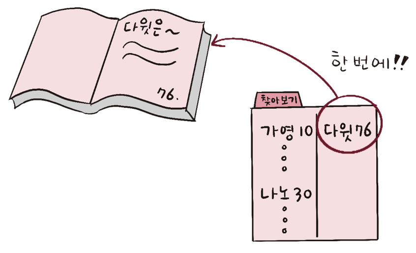
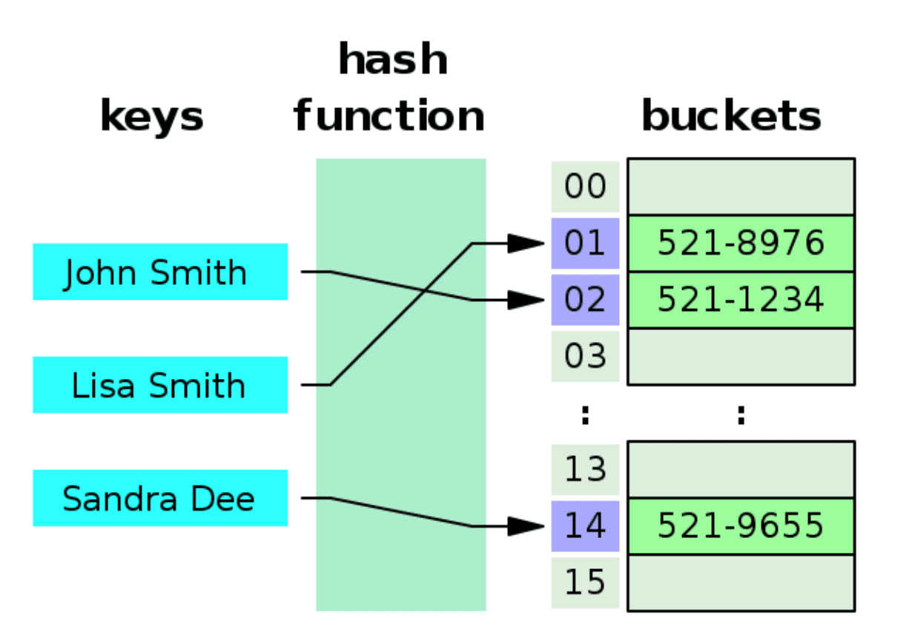

# 인덱스

<h3>📑목차</h3>

- [트랜잭션](#트랜잭션)

 

## 인덱스
데이터베이스 테이블의 **검색 속도를 향상시키기 위한 자료구조**를 말한다. 인덱스는 테이블 내의 1개 컬럼 또는 여러개의 컬럼을 이용해 생성할 수 있는데, 특정 컬럼에 인덱스를 설정하면 해당 컬럼의 **데이터들을 정렬**하여 **별도의 메모리 공간에 물리적 주소와 함께 저장**된다. 

인덱스가 생성되고 해당 컬럼을 쿼리에서 조건으로 사용하게 되면, **`옵티마이저`** 에서 인지하여 생성된 **인덱스를 사용**하여 데이터베이스를 스캔한다. 즉, 데이터베이스의 맨 앞부터 순차적으로 full scan하지 않아 효율적으로 데이터를 조회할 수 있다. 

> **💡옵티마이저**  
> 가장 효율적인 방법으로 SQL을 수행할 최적의 처리 경로를 생성해주는 DBMS의 핵심 엔진 (DB의 두뇌)
>
> **💡인덱스를 책에 비유**  
> `책의 내용` → `데이터`  
> `책의 색인(찾아보기)` → `인덱스`  
> `책의 페이지 번호` → `물리적 주소`
> 

>    
>     
>    <small>출처: 면접을 위한 CS 전공지식 노트</small>
> 

 

### 인덱스 관리
DBMS는 인덱스를 항상 최신의 정렬된 상태로 유지해야만 원하는 값을 빠르게 탐색할 수 있다. 따라서 인덱스가 적용된 컬럼에 `INSERT`, `UPDATE`, `DELETE`가 수행되면 각 다음과 같은 연산으르 추가적으로 수행해야 한다. (오버헤드 발생)

- `INSERT`: 새로운 데이터에 대한 **인덱스 추가**
- `DELETE`: 삭제하는 데이터의 인덱스를 **사용하지 않는다는 작업** 진행
- `UPDATE`: 기존의 데이터에 대한 인덱스를 **사용하지 않음 처리**, 갱신된 데이터에 대한 **인덱스 추가**
 *즉, 인덱스를 **"삭제"** 하지 않음

> **💡오버헤드(overhead)**  
> 어떤 처리를 하기 위해 들어가는 간접적인 처리 시간, 메모리 등
>
> **ex) 새로운 데이터 DB에 삽입(INSERT)**  
> → 데이터 삽입 처리 5초  
> → 인덱스 추가 처리 2초 (**오버헤드**)

 

### 인덱스 장단점 

#### 장점
🔹테이블 조회 속도와 그에 따른 성능 향상 
🔹전반적인 시스템 부하 감소 

#### 단점
🔹인덱스 관리 위해 DB의 약 10% 정도의 저장공간 필요 
🔹인덱스 관리 위한 추가 작업 필요 
🔹잘못 사용할 경우 오히려 성능 저하되는 역효과 발생 

> **인덱스 역효과**  
> `INSERT`, `DELETE`, `UPDATE` 쿼리가 빈번한 속성에 인덱스 생성시, 인덱스 크기가 비대해져 오히려 성능이 저하될 수 있음. 
> 
> 위에서 설명한 것 처럼 DELETE, UPDATE 시 **인덱스를 삭제하지 않고 "사용하지 않음" 처리**하기 때문
  
 

### Good and Bad
#### 사용하면 좋은 경우
🔹규모가 작지 않은 테이블 
🔹`WHERE`, `ORDER BY` 절에서 자주 사용되는 컬럼 
🔹`JOIN`에 자주 사용되는 컬럼 
🔹외래키가 사용되는 컬럼 

#### 피해야 하는 경우
🔹DML(`INSERT`, `DELETE`, `UPDATE`)가 자주 일어나는 컬럼 
🔹데이터 중복도가 높은 컬럼 

 

## 인덱스 자료구조

### 해시 테이블
- (key-value) 데이터를 저장하는 자료구조
- 인덱스로 사용 시 `key = 데이터(컬럼값)`, `value = 데이터위치`
- 특정 데이터 조회 시, 데이터(키)가 해싱 함수를 통해 인덱스값 생성 
- 시간복잡도 `O(1)` → 빠른 데이터 검색 필요 시 유용
- **등호(`=`) 연산** 에만 특화 (데이터 조금이라도 다르면 해싱 함수가 다른 인덱스 생성)
- 부등호 연산, 포함문 등의 연산에 사용될 수 없음
- 실제로 잘 사용하지 않음

   
    
   <small>출처: https://en.wikipedia.org/wiki/Hash_table</small>

https://velog.io/@jsj3282/17.-%ED%95%B4%EC%8B%9CHash-%EC%9D%B8%EB%8D%B1%EC%8A%A4

### B-트리
- 이진 트리를 확장하여 N개의 자식을 가질 수 있는 자료구조
- `루트노드`, `리프노드`, `브랜치노드`로 구성
- 모든 노드들이 값을 저장하고 있으며, 포인터 역할을 동반함
- 좌우 자식 간 균형이 맞지 않을 경우 매우 비효율적이기 때문에, 항상 균형을 맞춘다는 의미에서 **`Balanced Tree`** 라고도 불림
- 검색하는 키의 값보다 **같거나 큰 값**을 발견 시 하위노드로 이동

> - **루트노드**: 최상위에 존재하는 단 하나의 노드
> - **리프노드**: 최하위 노드
> - **브랜치노드**: 루트 노드와 리프 노드 사이에 있는 중간 노드

### B+트리

#### ✏️참고
[위키백과 - 인덱스(데이터베이스)](https://ko.wikipedia.org/wiki/%EC%9D%B8%EB%8D%B1%EC%8A%A4_(%EB%8D%B0%EC%9D%B4%ED%84%B0%EB%B2%A0%EC%9D%B4%EC%8A%A4))

[망나니개발자 - 인덱스(index)란?](https://mangkyu.tistory.com/96)