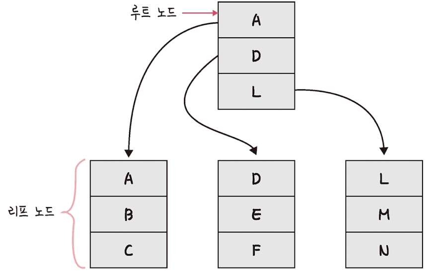
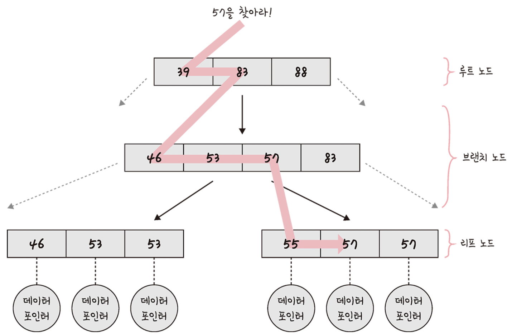
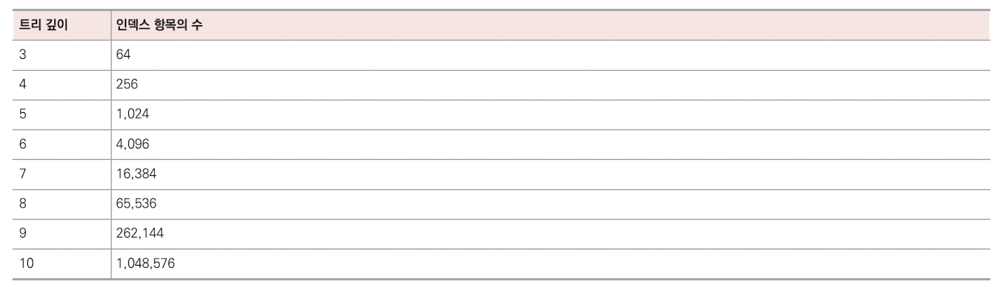

# 인덱스

## 인덱스의 필요성

인덱스는 데이터를 빠르게 찾을 수 있는 하나의 장치입니다. <br>
인덱스를 설정하면 테이블 안에 내가 찾고자 하는 데이터를 빠르게 찾을 수 있습니다. <br>

---

## B-트리

인덱스는 보통 B-트리라는 자료 구조로 이루어져 있습니다. <br>
루트 노드, 리프 노드, 그리고 루트 노드와 리프 노드 사이에 있는 브랜치 노드로 나뉩니다. <br>
<br>
예를 들어 위 그림에서 E를 찾을 때 A, B, C, D, E 다섯 번을 탐색하는 것이 아니라, 두 번만에 리프 노드에서 찾을 수 있습니다. <br><br>

<br>
트리 탐색은 맨 위 루프 노드부터 탐색이 일어나며 브랜치 노드를 거쳐 리프 노드로 내려오게 됩니다. <br>
키 57에 해당하는 데이터를 검색할 때, `57보다 같거나 클 때까지 <=`를 기반으로 탐색하는 것을 볼 수 있습니다. <br>
이렇게 루트 노드부터 시작하여 마지막 리프 노드에 도달해서 57이 가리키는 데이터 포인터를 통해 결괏값을 반환하게 됩니다. <br>

### 인덱스가 효율적인 이유와 대수확장성

인덱스가 효율적인 이유는 효율적인 단계를 거쳐 모든 요소에 접근할 수 있는 균형 잡힌 트리 구조와 트리 깊이의 대수확장성 때문입니다. <br>

```
💡 대수확장성
트리 깊이가 리프 노드 수에 비해 매우 느리게 성자하는 것을 의미합니다.
기본적으로 인덱스가 한 깊이씩 증가할 때마다 최대 인덱스 항목의 수는 4배씩 증가합니다.
```

<br>
앞의 표처럼 트리 깊이는 열 개짜리로 100만 개의 레코드를 검색할 수 있다는 의미입니다. <br>
인덱스는 이것보다 훨씬 더 효율적이며, 그렇기 때문에 인덱스가 효율적이라고 볼 수 있습니다. <br>

---

## 인덱스 만드는 방법

### MySQL

클러스터형 인덱스는 테이블 당 하나를 설정할 수 있습니다. <br>
primary key 옵션으로 기본키를 만들면 클러스터형 인덱스를 생성할 수 있고, <br>
기본키로 만들지 않고 unique not null 옵션을 붙이면 클러스터형 인덱스로 만들 수 있습니다. <br><br>

`create index...` 명령어를 기반으로 만들면 세컨더리 인덱스를 만들 수 있습니다. <br>
하나의 인덱스만 생성할 것이라면 클러스터형 인덱스를 만드는 것이 세컨더리 인덱스를 만드는 것보다 성능이 좋습니다. <br>
세컨더리 인덱스는 보조 인덱스로 여러 개의 필드 값을 기반으로 쿼리를 많이 보낼 때 생성해야 하는 인덱스입니다. <br>

### MongoDB

도큐먼트를 만들면 자동으로 ObjectID가 형성되며, 해당 키가 기본키로 설정됩니다. <br>
그리고 세컨더리키도 부가적으로 설정해서 기본키와 세컨더리키를 같이 쓰는 복합 인덱스를 설정할 수 있습니다. <br>

---

## 인덱스 최적화 기법

### 1. 인덱스는 비용이다

먼저 인덱스는 두 번 탐색하도록 강요합니다. <br>
인덱스 리스트, 그 다음 컬렉션 순으로 탐색하기 때문에 관련 읽기 비용이 들게 됩니다. <br>
또한 책의 본문이 수정되었을 때 목차나 찾아보기도 수정되듯이, 컬렉션이 수정되었을 때 인덱스도 수정되어야 합니다. <br>
이때 B-트리의 높이를 균형 있게 조절하는 비용도 들고 데이터를 효율적으로 조회할 수 있도록 분산시키는 비용도 들게 됩니다. <br>
따라서 쿼리에 있는 필드에 인덱스를 설정한다고 무조건 좋은 것은 아니며, 컬렉션에서 가져와야 하는 양이 많을수록 비효율적이게 됩니다. <br>

### 2. 항상 테스팅하라

인덱스 최적화 기법은 객체의 깊이, 테이블의 양 등의 서비스 특징에 따라 달라집니다. <br>
따라서 항상 테스팅하는 것이 중요합니다. <br>
`explain()` 함수를 통해 인덱스를 만들고 쿼리를 보낸 이후에 테스팅을 하며 걸리는 시간을 최소화해야 합니다. <br>

```SQL
EXPLAIN
SELECT * FROM t1
JOIN t2 ON t1.c1 = t2.c2
```

### 3. 복합 인덱스는 같음, 정렬, 다중 값, 카디널리티 순이다

여러 필드를 기반으로 조회할 때 복합 인덱스를 생성하는데, 이 인덱스를 생성할 때는 순서가 있고, 생성 순서에 따라 인덱스 성능이 달라집니다. <br>
같음, 정렬, 다중 값, 카디널리티 순으로 생성해야 합니다. <br>

1. 같음을 비교하는 `==` 이나 `equal`이라는 쿼리가 있다면 제일 먼저 인덱스로 설정합니다.
2. 정렬에 쓰는 필드라면 그 다음 인덱스로 설정합니다.
3. 다중 값을 출력해야 하는 필드, 즉 쿼리 자체가 `>` 또는 `<` 등 많은 값을 출력해야 하는 쿼리에 쓰는 필드라면 나중에 인덱스를 설정합니다.
4. 유니크한 값의 정도를 카디널리티라고 합니다. 이 카디널리티가 높은 순서를 기반으로 인덱스를 생성해야 합니다.
