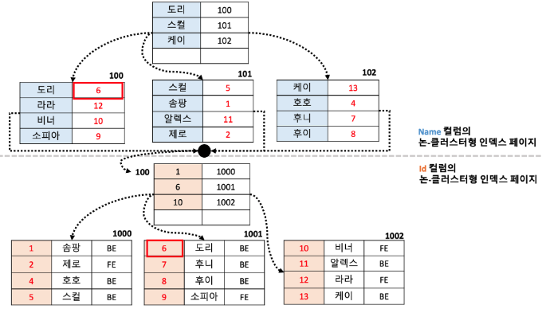
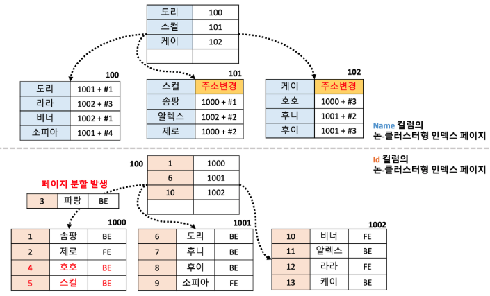

# 인덱스(Index)

### 인덱스란?

관계형 데이터베이스에서 저장 성능을 희생하여 검색 성능을 높이기 위해 만들어진 자료구조로 where 절을 통해 활용된다.

<br>

### 인덱스의 사용

**[인덱스를 이메일로 설정한 후 특정 이메일을 찾는 조회문]**

```sql
select *
from member
where email = "asdf123@naver.com"
```

1. 인덱스 대상을 정렬(email 기준으로 정렬)
2. where 절을 통해 인덱스를 통해 검색

**[인덱스를 이메일로 설정 했으나 where 절을 사용하지 않는 조회문]**

```sql
select *
from member
```

1. where 절을 통해 검색X
2. 인덱스가 사용 되지 않았다.

<br>

### 인덱스 사용시 장단점

- 테이블을 조회하는 속도와 성능을 향상할 수 있다.
- 데이터베이스의 약 10% 추가저장공간 필요하다.
- 성능 저하의 역효과가 발생할 수 있다.

<br>

### 인덱스의 관리

DBMS는 인덱스를 최신의 정렬상태로 유지해야 원하는 값을 빠르게 탐색할 수 있다. 따라서 인덱스가 적용된 컬럼에 INSERT, UPDATE, DELETE가 수행된다면 추가 연산이 필요해 그에 따른 성능저하가 발생한다.

- INSERT : 새로운 데이터에 대한 인덱스 추가
- DELETE : 인덱스의 데이터를 삭제하지 않고 상태를 **사용안함**으로 변경한다.
- UPDATE : DELETE (기존 값 사용안함으로 상태 변경) → INSERT (변경된 값 삽입)

<br>

**[인덱스를 INSERT 과정에 적용했을 경우]**

1. OOO 데이터를 삽입, PPP가 이동 → 큰 부하가 없다.

   

1. 1번과 달리 데이터가 가득 찬 페이지에 추가로 데이터를 저장하려고 할 경우 페이지가 가득차있기 때문에 새로운 페이지를 확보해서 가득찬 페이지의 데이터를 두 개의 페이지로 공평하게 나누어 저장한다.
   
   

1. 2번의 작업을 수행하면 아래와 같은 모습으로 페이지를 나눌 수 있다. 이 작업을 페이지 분할 이라고한다. 이 작업은 데이터베이스에 상당한 부하를 주는 작업이다.

   

<br>

> **페이지 분할**
>
> 1.  페이지에 새로운 데이터를 추가할 공간이 없어 페이지에 변화가 발생한다.
> 2.  DB가 느려지는 등 성능에 악영향을 준다.

<br>

> **페이지(Page)**
>
> 페이지란 디스크와 메모리에 데이터를 읽고 쓰는 최소 작업단위를 말한다. 일반적인 인덱스를 포함해 PK와 테이블 등은 모두 페이지 단위로 관리된다. 따라서 만약 쿼리를 통해 1개의 레코드를 읽고 싶더라도 결국은 하나의 페이지를 읽어야 한다.

<br><br>

## 인덱스의 자료구조

### B-Tree(Balenced Tree)

B-Tree는 자식을 2개만 갖는 이진트리를 확장하여 N개의 자식을 가질 수 있는 자료구조로 좌우 자식노드들의 균형을 맞춰 편향 이진트리처럼 비효율적인 모습을 갖는 이진트리의 단점을 보완한 트리이다. 항상 균형을 맞추기 때문에 균형트리라고 부르기도 한다. B-Tree의 최상단 노드는 루트노드 그리고 중간노드는 브랜치노드 최하위 노드를 리프노드라고 한다.

<br>

### Hash Table

해시 테이블은 데이터 요소의 주소/인덱스 값이 해시 함수에서 생성되는 데이터 구조이다. 인덱스 값이 데이터 값에 대한 키로 동작하기 때문에 매우 빠른 데이터 액세스가 가능하다. 즉, 해시 테이블은 키-값 쌍을 저장하지만 키는 해싱함수를 통해 생성된다. 따라서 키 값 자체가 데이터를 저장하는 배열의 인덱스가 되기 때문에 데이터 요소의 검색 및 삽입기능이 훨씬 빨라진다.

해시 테이블의 시간 복잡도는 O(1)이며 매우 빠른 검색을 지원하는데 반해 DB 인덱스에서 해시 테이블이 사용되는 경우는 제한적이다. 이유는 해시가 등호(=)연산에만 특화 되었기 때문이다. 해시 함수는 값이 조금이라도 달라지면 완전히 다른 해시 값을 생성하기 때문에 부등호 연산(<, >)이 자주 사용되는 데이터베이스 검색을 위해서는 적합하지 않다.

<br><br>

## 클러스터형 인덱스와 논-클러스터형 인덱스

인덱스의 종류에는 테이블의 기본 키에 대해 적용되는 클러스터형 인덱스와 기본 키 외에 다른 컬럼에 적용하는 논-클러스터형 인덱스(세컨더리 인덱스)가 있다.

```sql
CREATE TABLE member (
	id int primary key               // -> 클러스터형 인덱스
	name varchar(255),
	email varchar(255) unique        // -> 논-클러스터형 인덱스
);
```

<br>

### 클러스터형 인덱스

테이블의 레코드를 지정된 컬럼에 대해 물리적으로 재배열한다. 클러스터형 인덱스는 테이블 당 한 개만 존재할 수 있고 primary key 제약조건을 지정하는 컬럼에 대해 자동으로 클러스터형 인덱스를 생성한다. 따라서, 우리가 일반적으로 테이블을 생성할 때 특정 컬럼에 primary key 제약조건을 지정했다면, 데이터가 자동으로 primary key를 기준으로 정렬되는 것이다.

클러스터형 인덱스를 생성한 컬럼을 기준으로 테이블의 데이터가 정렬되기 때문에 속도면에서 우수한 성능을 보이지만 데이터의 추가 / 수정 / 삭제 시 매번 데이터를 정렬해야 하기 때문에 성능이 저하된다.

<br>

### 클러스터형 인덱스 특징

- 데이터를 클러스터형 인덱스 기준으로 정렬한다.
- 테이블 당 1개만 설정 가능하다.
- 리프 페이지가 실제 데이터가 저장된 페이지이다.
- 논-클러스터형 인덱스보다 속도면에서 우수한 성능을 보이지만 데이터 추가/수정/삭제 시 매번 정렬을 수행해야 하기 때문에 성능이 떨어진다.
- 아래의 제약조건시 자동으로 생성된다.
  - 기본키 제약조건 설정(우선순위)
  - not null 제약조건과 unique 제약조건을 한 컬럼에 설정

<br>

### 클러스터형 인덱스 적용

1. 아래와 같은 테이블 구조가 있다고 가정

   ```sql
   CREATE TABLE member (
   	id int,
   	name varchar(255)
   );

   // 제약조건 X, Index X
   ```

2. 클러스터형 인덱스를 id 컬럼에 적용

   

3. 클러스터형 인덱스를 적용하면 아래와 같이 정렬된다.

   

4. 클러스터형 인덱스 적용방법 (기본키, unique + not null)

   

<br>

### 클러스터형 인덱스가 적용된 테이블에서 데이터를 찾는 과정


1. 루트 페이지에서 찾으려는 데이터의 인덱스가 저장된 페이지의 주소값을 찾는다.
2. 데이터가 저장된 페이지의 주소값을 찾아가 데이터를 순차적으로 탐색한다.
3. 만약, 데이터가 수정이나 삭제등 변경이 발생해도 최신상태로 데이터가 정렬된 상태로 유지된다.

<br>

### 논-클러스터형 인덱스

물리적으로 레코드를 정렬하지 않은 상태로 데이터 페이지가 구성된다. 즉, 테이블의 레코드는 그대로두고 지정된 컬럼에 대해 정렬된 인덱스를 만든다. 물리적으로 레코드를 정렬하지 않기 때문에 클러스터형 인덱스보다 속도면에서는 성능이 떨어지지만, 추가/수정/삭제의 성능은 더 뛰어나다.

논-클러스터형 인덱스는 unique 제약 조건을 설정한 컬럼에 대해 자동으로 생성된다. 따라서 테이블 당 여러개 설정이 가능하다. 하지만 남용할경우 성능이 저하되는 문제가 발생할 수 있다.

<br>

### 논-클러스터형 인덱스 특징

- 데이터는 정렬되지 않고 인덱스 페이지만 정렬된다.
- 한 테이블에 여러 개의 논-클러스터형 인덱스를 생성할 수 있다.
- unique 제약조건 설정 시 자동으로 논-클러스터형 인덱스가 생성된다.
- 물리적으로 테이블이 정렬되어 있지 않기 때문에 클러스터형 인덱스보다 속도면에서 성능은 떨어지지만 데이터의 입력/수정/삭제 성능은 더 뛰어나다.
- 인덱스 생성시 데이터 페이지는 그냥 둔 상태에서 별도의 인덱스 페이지를 따로 만들기 때문에 추가 용량이 필요하다.

<br>

### 논-클러스터형 인덱스 적용

아래와 같은 테이블이 있다고 가정하고 논-클러스터형 인덱스를 적용해보자.

```sql
CREATE TABLE member (
	id int,
	name varchar(255),
	group varchar(255)
);

// 제약조건 X, Index X
```

<br>

1. 논-클러스터형 인덱스 적용

   

   <br>

1. 논-클러스터형 인덱스를 생성하면 기존에 데이터가 저장된 페이지와는 별개로 B-Tree의 구조를 갖는 새로운 페이지가 생성된다.

   

<br>

1. [100주소를 갖는 페이지]의 [도리: 1002 + #3]의 데이터를 살펴보면 페이지의 주소가 1002인 페이지의 3번째 데이터를 나타내는것을 알 수 있다.

   

   <br>

1. 논-클러스터형 인덱스 적용방법

   

   방법 1은 unique 제약조건을 컬럼에 부여하여 인덱스를 생성하는 방법

   방법 2는 unique-index를 생성하여 인덱스를 부여하는 방법으로 중복을 허용하지 않으며 인덱스를 생성

   방법 3은 default index를 생성하여 인덱스를 부여하는 방법으로 중복을 허용하는 인덱스를 생성

   <br>

### 논-클러스터형 인덱스가 적용한 테이블에서 데이터 탐색과정

**“라라”** 라는 이름을 갖는 데이터를 찾는 과정을 살펴보자.


1. Name 인덱스 페이지에서 “라라”를 탐색한다.
2. “라라”의 데이터 페이지 주소를 통해 실제 데이터를 탐색한다.

<br>

### 하나의 테이블에 클러스터형 인덱스와 논-클러스터형 인덱스를 함께 적용할 경우

1. 하나의 테이블에 클러스터형, 논-클러스터형 인덱스를 함께 적용.

   

   <br>

1. 두가지 인덱스를 함께 적용했을 때 실제 구성도

   

   클러스터형 인덱스가 적용된 컬럼의 실제값이 논-클러스터형 인덱스 페이지에 데이터로 들어있다.

   (인덱스 페이지 100의 “도리” 데이터를 확인.)

<br>

1. 두 가지 인덱스를 함께 적용한 테이블에서 **“라라”** 데이터를 검색해보자.

   

   1. name 인덱스 페이지에서 “라라”를 탐색한다.
   2. “라라”의 인덱스인 12를 id 인덱스 페이지에서 탐색한다.

<br>

### **하나의 테이블이 클러스터형과 논-클러스터형 인덱스를 함께 적용했을 경우 왜 데이터페이지의 주소가 들어있지 않고 실제 데이터가 들어있는 이유**

페이지의 주소가 들어있을 경우 데이터 삽입 등의 작업으로 인해 페이지 분할이 발생할 경우 주소의 변경이 발생할 수 있기 때문에 인덱스 페이지에 영향을 주지 않도록 논-클러스터링 페이지의 데이터를 저장하도록 되어있다.

<br>

만약, 아래 그림처럼 파랑의 데이터가 삽입되었다고 가정해보자.


새로 삽입되는 데이터는 id를 기준으로 정렬되어야 하기 때문에 1000페이지에서 **페이지 분할**이 발생한다. 따라서, name 인덱스(논-클러스터형 인덱스 페이지) 페이지에서 **스컬과 호호의 주소**가 변경되어야 한다.



위와 같은 이유로 데이터가 추가 될 때마다 인덱스 페이지가 변경되어야 할 수도 있다. 페이지 분할은 데이터베이스 성능을 저하시킬 수 있기 때문에 id가 변경되지 않는 한 인덱스 페이지에 영향을 주지 않도록 아래 그림과 같이 인덱스가 적용된 실제값으로 논-클러스터형 페이지의 데이터를 저장한다.


<br>

### 두 가지 클러스터형 인덱스 비교


<br>

### 인덱스의 적용기준

1. 카디널리티가 높은(중복 수치가 가장 낮은) 컬럼에 적용한다.
2. where, join, order by 절에 자주 사용되는 컬럼에 적용한다.
   - 인덱스는 추가공간을 필요로 한다.
   - 조건절이 없다면 인덱스가 사용되지 않는다.
3. 삽입/삭제/수정이 자주 발생하지 않는 컬럼에 적용한다.
4. 규모가 작지 않은 테이블에 적용한다.

<br>

### 인덱스 사용시 주의사항

1. 잘 사용되지 않는 인덱스는 과감히 제거한다.
   - where 절에 사용되더라도 자주 사용되어야 가치가 있다.
   - 불필요한 인덱스로 성능저하가 발생할 수 있다.
2. 데이터 중복도가 높은 컬럼은 인덱스 효과가 적다.
3. 자주 사용되더라도 삽입/삭제/수정이 자주 일어나는지 고려해야 한다.
   - 일반적인 웹서비스 같은 온라인 트랜잭션 환경에서 쓰기와 읽기 비율은 2:8 또는 1:9이다.
   - 조금 느린 쓰기를 감수하고 빠른 읽기를 선택하는 것도 방법이다.

<br>

### 함께 공부하면 좋은 지식

- B-Tree
- SQL 최적화
- 다중 컬럼 인덱스
- 옵티마이저

<br>

### **[Reference]**

[[Database] Clustered Index와 Non-clustered Index](https://choiblack.tistory.com/53)

[[MYSQL] 📚 인덱스(index) 핵심 설계 & 사용 문법 💯 총정리](https://inpa.tistory.com/entry/MYSQL-%F0%9F%93%9A-%EC%9D%B8%EB%8D%B1%EC%8A%A4index-%ED%95%B5%EC%8B%AC-%EC%84%A4%EA%B3%84-%EC%82%AC%EC%9A%A9-%EB%AC%B8%EB%B2%95-%F0%9F%92%AF-%EC%B4%9D%EC%A0%95%EB%A6%AC#hash_%EC%9D%B8%EB%8D%B1%EC%8A%A4_%EC%95%8C%EA%B3%A0%EB%A6%AC%EC%A6%98)

[[DB] 인덱스(index)란? 인덱스 자료구조](https://code-lab1.tistory.com/46)

[[데이터베이스] B-Tree 인덱스를 보편적으로 사용하는 이유](https://steady-coding.tistory.com/558)
