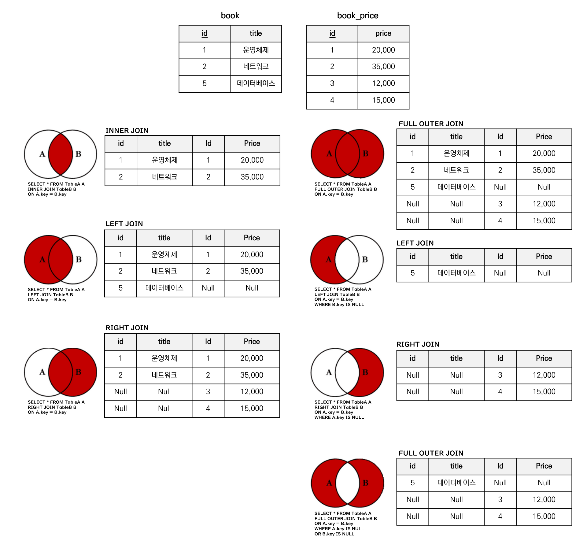
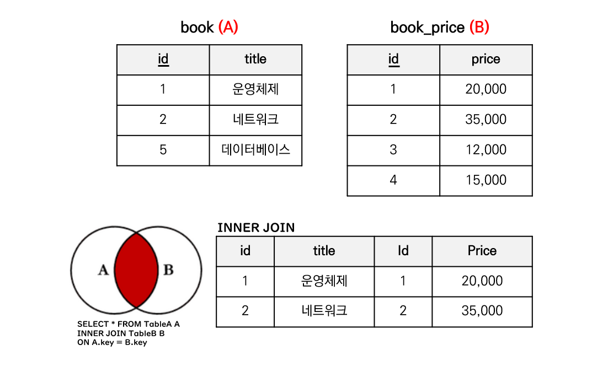
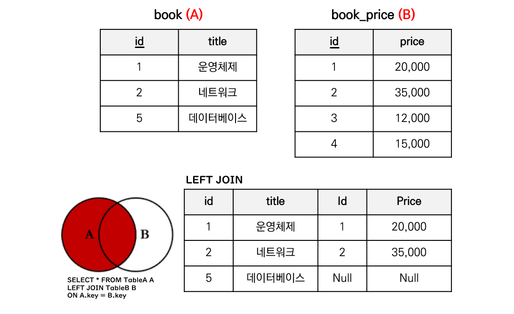
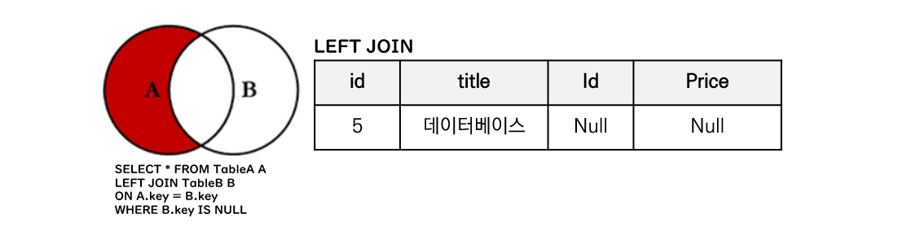
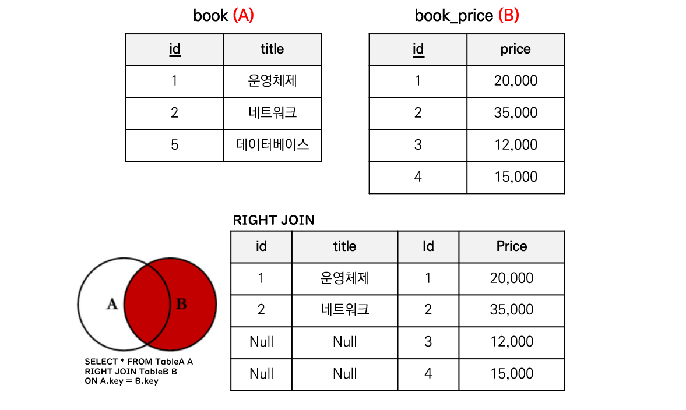
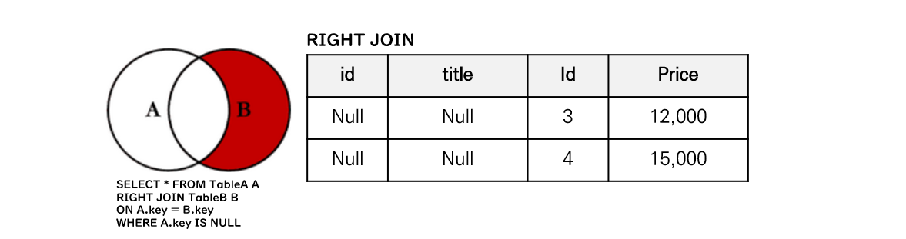
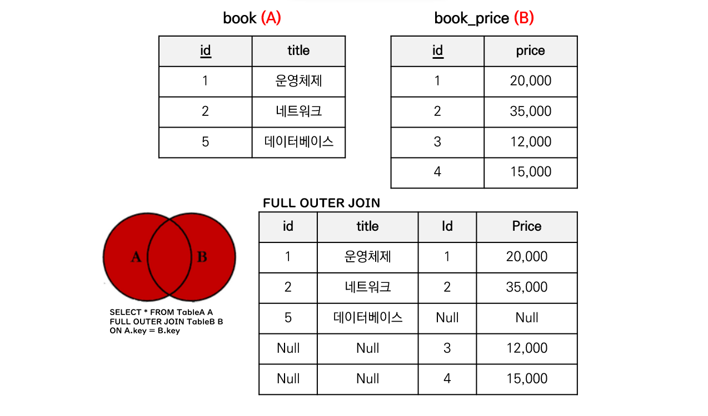
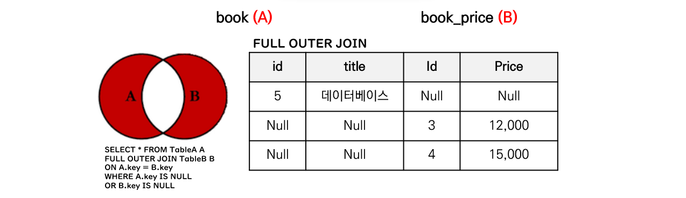
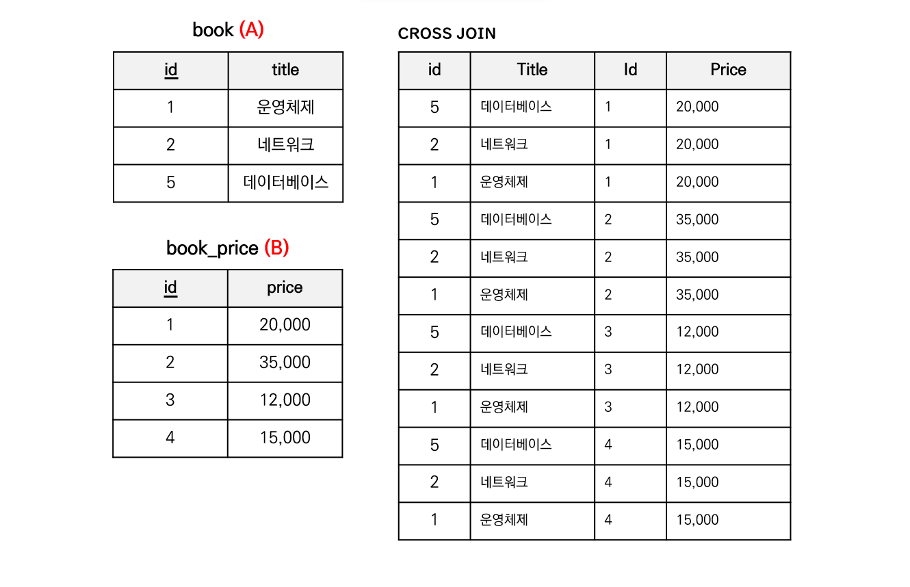
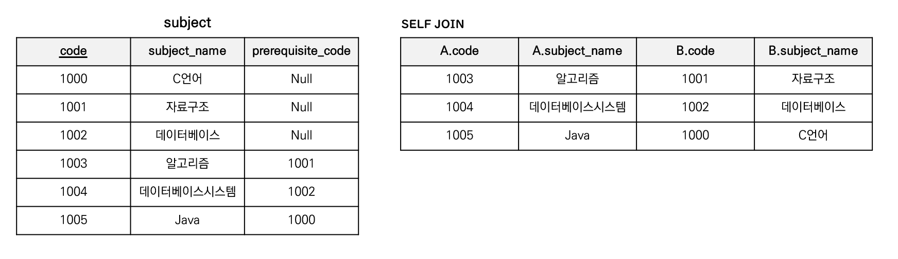

# 조인의 종류

<details>
<summary><h3>📑목차</h3></summary>
<div markdown="1">

- [조인](#조인)
- [조인의 종류](#조인논리적-조인의-종류)
    - [Inner Join (내부조인)](#inner-join-내부-조인)
    - [Outer Join (외부조인)](#outer-join-외부조인)
        - [Left Join (왼쪽 조인)](#left-outer-join-왼쪽-외부-조인)
        - [Right Join (오른쪽 조인)](#right-outer-join-오른쪽-외부-조인)
        - [Full Outer Join (전체 외부 조인)](#full-outer-join-전체-외부-조인)
    - [Cross Join (교차 조인)](#cross-join-교차-조인)
    - [Self Join (셀프 조인)](#self-join-셀프-조인)
    
</div>
</details>
<br>

## 조인 
**두 개 이상의 테이블을 묶어 하나의 결과물**을 만드는 것을 말한다. 비관계형 데이터베이스(MongoDB)에서도 `lookup`이란 쿼리로 이를 처리할 수 있는데, **관계형 데이터베이스보다 성능이 떨어지기 때문**에 되도록 사용하지 않는다. 


## 조인(논리적 조인)의 종류

논리적 조인이란 **사용자가 SQL문을 이용해** 원하는 데이터 결합 방식을 기술하는 것을 의미한다. 

- `Inner Join` (내부 조인): 왼쪽 테이블과 오른쪽 테이블의 두 행이 모두 일치하는 행이 있는 부분만 표기
- `Outer Join`
    - `Left Join` (왼쪽 조인): 왼쪽 테이블의 모든 행이 결과 테이블에 표기
    - `Right Join` (오른쪽 조인): 오른쪽 테이블의 모든 행이 결과 테이블에 표기
    - `Full Outer Join` (전체 외부 조인): 두 개의 테이블을 기반으로 조인 조건에 만족하지 않는 행까지 모두 표기
- `Cross Join` (교차 조인): 조인 조건 없이 모든 데이터 조합 표기
- `Self Join` (셀프 조인): 하나의 테이블에서 발생하는 조인(자기 자신과 결합)
- [✏️JOIN 시각화 사이트](https://sql-joins.leopard.in.ua/)

<p align="center">
    
</p>


### `Inner Join` 내부 조인

내부 조인은 조인하고자 하는 두 테이블에서 공통된 요소들을 통해 결합하는 방식이다. 위와 같이 `도서(book)` 테이블과 `도서가격(book_price)` 테이블에서 같은 도서 `id`를 가진 행끼리 결합하여 출력한다. 

MySQL에서는 `INNER`를 생략 가능 하다. 즉, `JOIN`문을 사용하면 자동으로 내부 조인 수행

<p align="center">
    
</p>

``` SQL
-- MySQL
SELECT * FROM book A
INNER JOIN book_price B 
ON A.id = B.id;
```


<br>

### `Outer Join` 외부조인
외부조인은 내부조인과 다르게, 두 테이블 사이 공통된 값뿐만 아니라 **일치하지 않는 값도 결과에 포함**시킨다. 

### `Left (Outer) Join` 왼쪽 (외부) 조인

왼쪽 조인은 **왼쪽 테이블의 모든 데이터**와 **오른쪽 테이블의 조인 조건이 동일한 데이터**를 추출한다. 
> `FROM` 절의 테이블이 왼쪽 테이블 <br>
> `LEFT JOIN` 절의 테이블이 오른쪽 테이블

<p align="center">
    
</p>

``` SQL
-- MySQL
SELECT * FROM book A
LEFT JOIN book_price B 
ON A.id = B.id;
```


만약 왼쪽 테이블에만 존재하는 데이터를 추출하고 싶다면 `WHERE` 절을 이용하여 출력할 수 있다. 양 테이블에 공통적으로 존재하는 데이터는 각 테이블의 `id` 값을 가지고 있지만, 왼쪽에만 존재하는 데이터는 오른쪽 테이블에 존재하지 않기 때문에 `B.id` 컬럼에 `Null` 값이 들어가게 된다. 이를 이용해 `WHERE`절에서 조건을 걸어 추출한다. 

<p align="center">
    
</p>

``` SQL
-- MySQL
SELECT * FROM book A
LEFT JOIN book_price B 
ON A.id = B.id 
WHERE B.id IS NULL;
```

<br>

### `right (Outer) Join` 오른쪽 (외부) 조인

오른쪽 조인은 **오른쪽 테이블의 모든 데이터**와 **왼쪽 테이블의 조인 조건이 동일한 데이터**를 추출한다. 
> `FROM` 절의 테이블이 **왼쪽** 테이블 <br>
> `RIGHT JOIN` 절의 테이블이 **오른쪽** 테이블

<p align="center">
    
</p>

``` SQL
-- MySQL
SELECT * FROM book A
RIGHT JOIN book_price B 
ON A.id = B.id;
```


만약 오른쪽 테이블에만 존재하는 데이터를 추출하고 싶다면 `WHERE` 절을 이용하여 출력할 수 있다.

<p align="center">
    
</p>

``` SQL
-- MySQL
SELECT * FROM book A
RIGHT JOIN book_price B 
ON A.id = B.id 
WHERE A.id IS NULL;
```


<br>

### `Full Outer Join` 전체 외부 조인

전체 외부 조인은 양쪽의 모든 데이터를 추출하는 기법으로, 왼쪽 조인과 오른쪽 조인을 합친 결과과 같다.

MySQL에서는 `FULL JOIN`문을 지원하지 않기 때문에 `UNION` 구문을 통해 왼쪽 조인과 오른쪽 조인을 합해준다. 

<p align="center">
    
</p>

``` SQL
-- MySQL
(SELECT * FROM book A
LEFT JOIN book_price B 
ON A.id = B.id)
UNION
(SELECT * FROM book A
RIGHT JOIN book_price B 
ON A.id = B.id);
```


만약 공통된 부분을 제외한 데이터를 추출하고 싶다면 `WHERE` 절을 이용하여 출력할 수 있다.

<p align="center">
    
</p>

``` SQL
-- MySQL
(SELECT * FROM book A
LEFT JOIN book_price B 
ON A.id = B.id 
WHERE B.id IS NULL)
UNION
(SELECT * FROM book A
RIGHT JOIN book_price B 
ON A.id = B.id 
WHERE A.id IS NULL);
```

<br>

### `Cross Join` 교차 조인

교차조인이란 조인 조건 없이 **모든 데이터 조합**을 추출하는 기법으로 **모든 경우의 수에 대한 결합**을 진행한다. (`ON`절 필요 없음)

<p align="center">
    
</p>

``` SQL
-- MySQL
SELECT * FROM book A 
CROSS JOIN book_price B;
```

<br>

### `Self Join` 셀프 조인
셀프 조인은 자기 스스로를 결합시키는 조인이다. 아래와 같이 과목의 정보를 담고 있는 `subject` 테이블이 있을 때, 선수과목 강의명을 출력하고자 셀프 조인을 할 수 있다. 

<p align="center">
    
</p>

``` SQL
-- MySQL
SELECT A.code, A.subject_name, B.code, B.subject_name FROM subject A 
JOIN subject B
ON A.prerequisite_code = B.code;
```