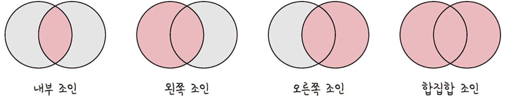

# 조인의 종류

조인이란 하나의 테이블이 아닌 두 개 이상의 테이블을 묶어서 하나의 결과물을 만드는 것을 말합니다. <br>
MySQL에서는 `JOIN`이라는 쿼리고, MongoDB에서는 `lookup`이라는 쿼리로 처리할 수 있습니다. <br><br>

하지만 MongoDB의 `lookup`은 관계형 데이터베이스보다 성능이 떨어지기 때문에 되도록 사용하지 않는게 좋습니다. <br>
따라서 여러 테이블을 조인하는 작업이 많을 경우 관계형 데이터베이스를 쓰는 것이 좋습니다. <br><br>

조인의 종류 중 대표적으로 내부 조인, 왼쪽 조인, 오른쪽 조인, 합집합 조인이 있습니다.<br>
<br>
왼쪽 테이블은 `A`, 오른쪽 테이블은 `B`로 설명하게 됩니다. <br>
[SQL JOIN 시각화 사이트 링크 바로가기](https://sql-joins.leopard.in.ua/)

## 내부 조인(inner join)

A와 B 두 테이블의 두 행이 모두 일치하는 행이 있는 부분으로, 교집합을 나타냅니다.<br>

```SQL
SELECT * FROM TableA A
INNER JOIN TableB B ON
A.key = B.key
```

---

## 왼쪽 조인(left outer join)

A 테이블의 모든 행이 결과 테이블에 표기되는 것으로, 테이블 B에 일치하는 부분이 포함되고 없으면 null이 됩니다. <br>

```SQL
SELECT * FROM TableA A
LEFT JOIN TableB B ON
A.key = B.key
```

---

## 오른쪽 조인(right outer join)

B 테이블의 모든 행이 결과 테이블에 표기되는 것으로, 테이블 A에 일치하는 부분이 포함되고 없으면 null이 됩니다. <br>

```SQL
SELECT * FROM TableA A
RIGHT JOIN TableB B ON
A.key = B.key
```

---

### 합집합 조인(full outer join)

두 개의 테이블을 기반으로 조인 조건에 만족하지 않는 행까지 모두 표기하는 것으로, 완전 외부 조인이라고도 합니다.<br>
양쪽 테이블에서 일치하는 레코드와 함께 테이블 A와 B의 모든 레코드 집합을 생성합니다. <br>
일치하는 항목이 없으면 누락된 쪽에 null 값이 포함되어 출력됩니다. <br>

```SQL
SELECT * FROM TableA A
FULL OUTER JOIN TableB B ON
A.key = B.key
```
