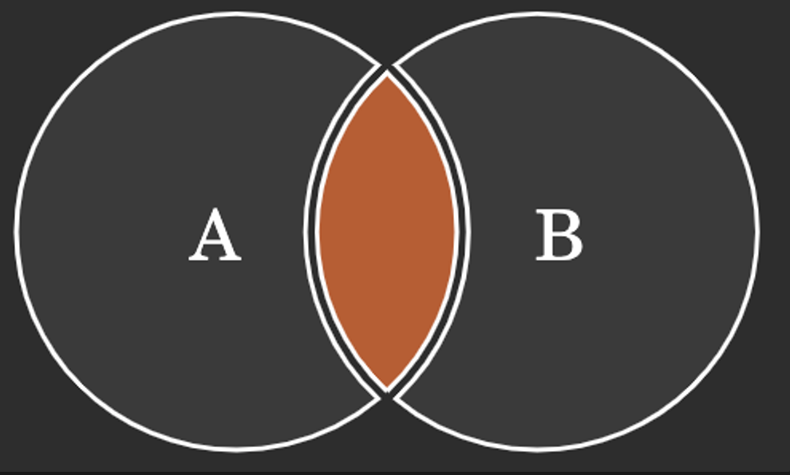
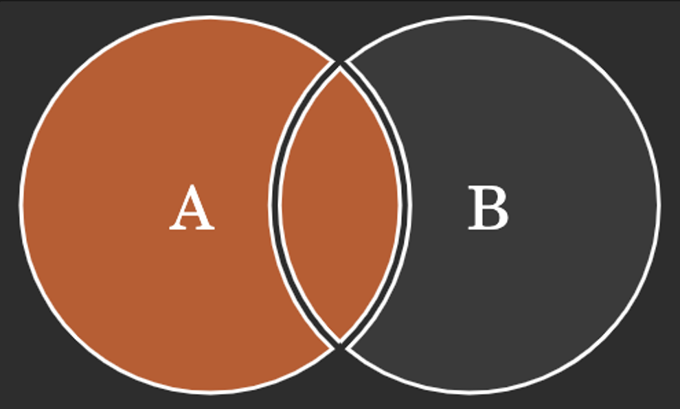
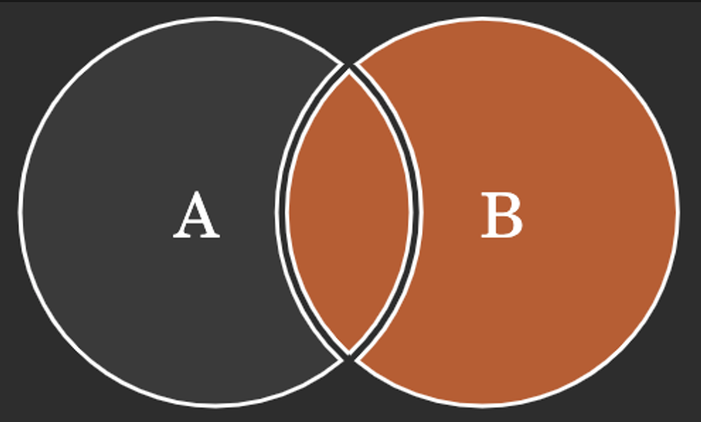
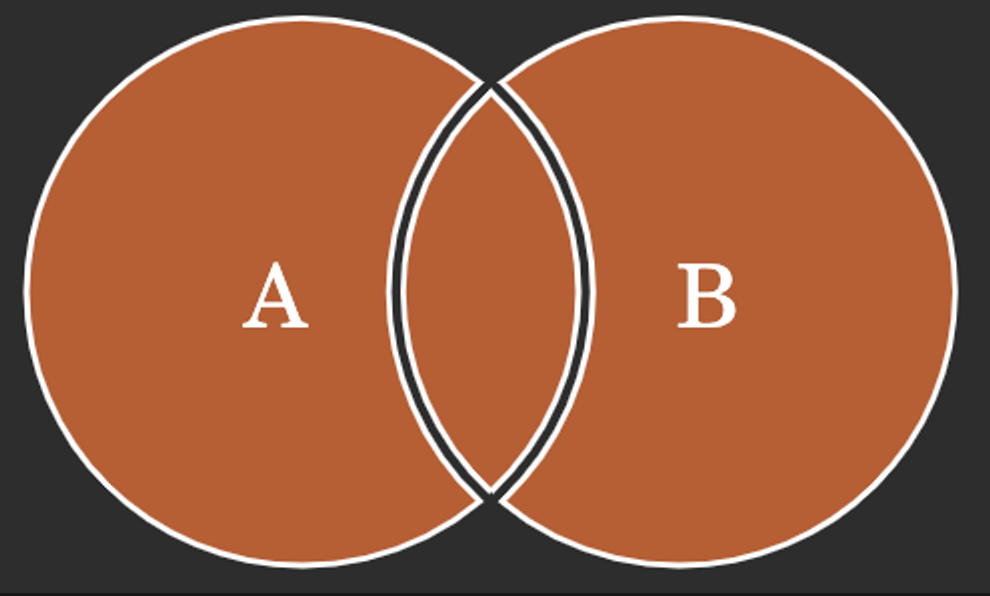
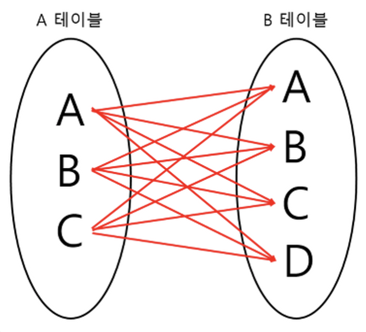
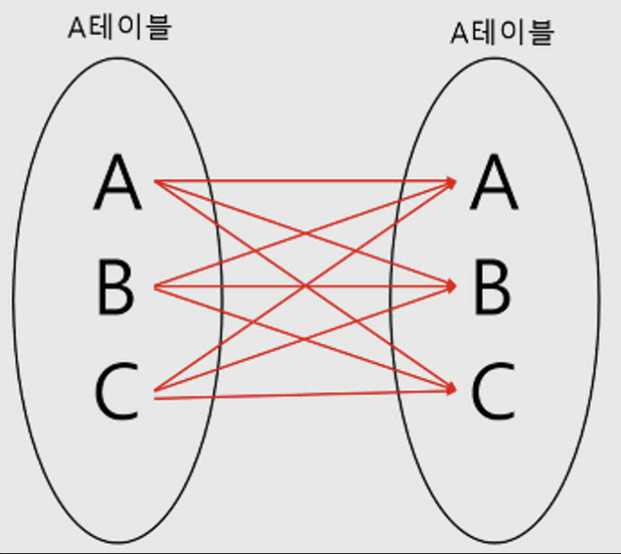

# 조인의 종류

태그: 데이터베이스 - 조인의 종류와 원리

## 조인의 종류

---

### 조인(Join)이란?

두 개 이상의 테이블을 조합하여 하나의 결과물을 만드는 것을 말한다.

<br>

### 조인의 필요성

조인이 필요한 이유는 정규화 때문이다. 관계형 데이터베이스는 정규화를 통해 이상현상을 방지하고 데이터 무결성을 유지하기 위해 서로 관계있는 데이터들을 여러 테이블에 나누어 저장한다. 때문에 각 테이블에 저장된 데이터를 효과적으로 조회하기 위해서는 조인이 필요하다.

<br>

### 조인의 종류

- 내부조인 (자연조인, 동등조인)
- 외부조인 (LEFT, OUTER, FULL)
- 교차조인
- 셀프조인

<br>

### 내부조인(Inner Join)

둘 이상의 테이블에 존재하는 공통 속성의 값이 같은 것을 결과로 추출하는 조인이다. 내부 조인은 동등 조인과 자연 조인으로 구분할 수 있다.



```sql
SELECT * FROM TableA A
INNER JOIN TableB B ON
A.key = B.key
```

<br>

> **동등 조인(equi join)**

둘 이상의 테이블에 존재하는 공통 속성을 비교하여 조건이 정확하게 등호로(=) 일치하는 데이터만 가져오는 조인이다.

>

> **자연 조인(natural join)**

동등 조인과 거의 유사한 조인으로 조인 대상 테이블의 모든 컬럼들을 비교하여, 같은 컬럼명을 가진 대상으로 조인을 수행한다. 단, 중복된 컬럼은 한번만 출력되게 한다.

동등 조인 + 중복컬럼제거 → 자연조인

>

<br>

### 외부조인(Outer Join)

외부조인은 LEFT OUTER JOIN, RIGHT OUTER JOIN, FULL OUTER JOIN 세가지로 구분할 수 있다.

- LEFT OUTER JOIN (오른쪽 외부 조인)
  테이블 A를 기준으로 모든 결과 데이터를 조회하며 동시에 테이블 B의 일치하는 부분의 데이터를 조회하여 집합을 생성한다. 만약 일치하는 데이터가 없는 경우 NULL로 표기되어 출력된다.
  

  ```sql
  SELECT * FROM TableA A
  LEFT JOIN TableB B ON
  A.key = B.key
  ```

    <br>

- RIGHT OUTER JOIN (왼쪽 외부 조인)
  테이블 B를 기준으로 모든 결과 데이터를 조회하며 동시에 테이블 A의 일치하는 부분의 데이터를 조회하여 집합을 생성한다. 만약 일치하는 데이터가 없는 경우 NULL로 표기되어 출력된다.
  

  ```sql
  SELECT * FROM TableA A
  RIGHT JOIN TableB B ON
  A.key = B.key
  ```

    <br>

- FULL OUTER JOIN (합집합 조인, 완전외부조인)
  양쪽 테이블(A와 B)에서 일치하는 데이터와 함께 테이블 A와 테이블 B의 일치하지 않는 데이터까지 모두 조회하여 집합을 생성한다. 이때 일치하는 데이터가 없는 경우 NULL로 값이 표기되어 출력된다.
  
  ```sql
  SELECT * FROM TableA A
  FULL OUTER JOIN TableB B ON
  A.key = B.key
  ```

<br>

### 교차조인(Cross Join, Cartesian Product)

두 테이블에서 곱 집합을 반환한다. 즉, 두 테이블에서 나올 수 있는 모든 경우의 수를 표현해주는 조인 방식이다. 예를 들어 m열을 가진 테이블과 n열을 가진 테이블이 교차 조인되면 m\*n개의 열을 생성한다.



```sql
// 교차조인 명시적 사용
SELECT *
FROM A CROSS JOIN B;

// 교차조인을 암묵적으로 사용
SELECT *
FROM A, B;
```

<br>

### 셀프 조인 (Self Join)

하나의 테이블을 두 개의 테이블처럼 자기자신에 조인을 시키는 방식이다. 자신이 가지고 있는 컬럼을 변형시켜 활용할 때 자주 사용한다.



```sql
// 교차조인 명시적 사용
SELECT a.column1, b.column2, a.column3
FROM A a, A b
where a.column3 = b.column3
```
