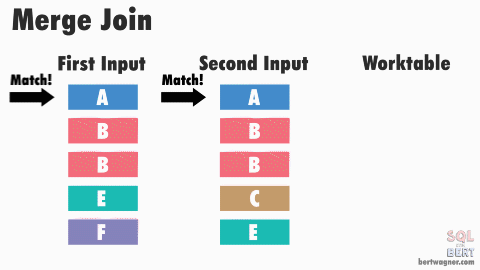

# 조인의 원리 (물리적 조인)

<h3>📑목차</h3>

- [물리적 조인](#물리적-조인)
- [중첩 루프 조인](#중첩-루프-조인-nlj-nested-loop-join)
- [정렬 병합 조인](#정렬-병합-조인-sort-merge-join)
    - [일대다 병합 조인](#일대다-병합-조인)
    - [다대다 병합 조인](#다대다-병합-조인)
- [해시 조인](#해시-조인)
    - [빌드 단계](#빌드-단계)
    - [프로브 단계](#프로브-단계)
    

 

## 물리적 조인
SQL쿼리로 표현되는 논리적 조인과 다르게, 물리적 조인은 **실제 데이터베이스 시스템에서 두 테이블 간의 물리적인 연결을 구현하는데 사용**되는 방법을 말한다. 데이터베이스 엔진은 논리적 조인을 물리적인 실행 계획으로 변환하여 효율적으로 데이터를 처리하도록 한다.

요약하자면, 논리적 조인은 SQL 쿼리에서 사용되는 조인 연산자와 관련된 개념으로, 어떤 종류의 조인을 수행할지 논리적으로 나타냅니다. 물리적 조인은 실제 데이터베이스 시스템에서 두 테이블 간의 연결을 어떻게 처리할지를 결정하는 단계로, 성능과 최적화를 고려하여 논리적 조인 계획을 물리적인 실행 계획으로 변환합니다.

    
     
    <small>출처: <a ref="https://bertwagner.com/category/sql/internals.html">Data with Bert</a></small>

 

### 중첩 루프 조인 (NLJ: Nested Loop Join)
중첩 for문과 같은 원리로, **두 개의 테이블의 모든 행을 확인**하여 조인하는 방법을 말한다. 첫 번째 테이블(선행 테이블)에서 **하나의 값을 가져와 두번 째 테이블(후행 테이블)의 모든 값과 비교**하여 일치하는지 확인한다. (첫 번째 테이블의 값을 모두 가져와 이를 반복함)

    
     
    <small>출처: <a ref="https://bertwagner.com/posts/visualizing-merge-join-internals-and-understanding-their-implications/">Data with Bert</a></small>

> **💡선행 테이블, 외부 테이블 (Driving Table)**  
> 선행 테이블을 **순차적으로 모두 스캔**하면서 각 레코드에 대해 후행 테이블 스캔을 시작한다. 
>
> **💡후행 테이블, 내부 테이블 (Driven Table)**  
> 후행 테이블에 **인덱스가 있다면** 테이블 전체를 탐색하지 않고 효율적으로 조인할 수 있다. 이 때 랜덤 액세스가 일어나는데, 인덱스를 사용하여 선행 테이블에서 가져온 조인 조건 값에 해당하는 레코드에 좀 더 효율적으로 접근한다. (인덱스가 없다면 후행 테이블의 레코드를 순차적으로 스캔)
>
> **💡랜덤 액세스**  
> **한 번에 하나의 블록만을 접근**하는 방식을 말하며, **특정 위치에 있는 데이터를 직접 읽거나 수정**하는 방식이다. 이 방식은 인덱스 기반 검색에서 주로 발생하는데, 개별 레코드에 빠르게 접근할 수 있다. 하지만 **데이터 양이 많은 경우 랜덤 액세스가 많이 발생하면 성능이 저하**될 수 있다.
 

 **[👍/👎]**
- 메모리 사용량 적음
- **좁은 범위**에서 성능이 좋음
- 대용량의 테이블에서는 사용하지 않음
- (랜덤 액세스에 대한 비용 많이 증가)

 

### 정렬 병합 조인 (Sort Merge Join)
각 테이블을 조인할 필드를 기준으로 **정렬한 후 조인 작업을 수행**하는 방식을 말한다. 각 테이블에서 **같은 행을 여러 번 돌아가 조회할 필요가 없어** 효율적이다. 

#### 일대다 병합 조인
- 조인에 사용되는 두 테이블 모두 조건에 대해 정렬
- 두 테이블의 첫 번째 행을 비교
- 두 번째 테이블의 값이 첫 번째 테이블의 값과 **일치하면 두 번째 테이블의 다음행을 계속 비교**
- 두 값이 더 이상 일치하지 않으면 **더 작은 값을 가진 테이블의 행을 증가**시킴
- 비교 과정을 반복

    
     
    <small>출처: <a ref="https://bertwagner.com/posts/visualizing-merge-join-internals-and-understanding-their-implications/">Data with Bert</a></small>

#### 다대다 병합 조인
위의 일대다 병합 조인은 두 테이블이 물리적으로 `1:N 관계`일 경우 사용된다. 즉, 첫 번째 테이블엔 조인 조건 컬럼에 중복이 없기 때문에 두 번째 테이블에서 같은 범위를 다시 접근하지 않는다. 

하지만, 첫 번째 테이블에 **중복 값이 존재하는 경우**(`N:N 관계`) 위의 방식대로 조인을 진행하면 두 번째 테이블에서 **특정 구간을 중복적으로 읽어야 한다.** 이를 방지하기 위해서 **다대다 병합 조인**에선 조인에 성공한 두 번째 테이블의 특정 구간(집합)을 **임시테이블에 복사**해 놓는다. 이후 첫 번째 테이블에서 중복된 값이 나타나면 **임시테이블에 엑세스**한다. 임시 테이블 스캔이 끝난 후, 다시 첫 번째 테이블에서 다른 값이 나타나면 두 번째 테이블로 이동해 탐색한다. 

    
     
    <small>출처: <a ref="https://bertwagner.com/posts/visualizing-merge-join-internals-and-understanding-their-implications/">Data with Bert</a></small>

**[👍/👎]**
- 사용할 적절한 인덱스가 없을 때 사용
- **대용량 테이블을 조인**할 때 사용
- 조인 조건으로 범위 비교 연산자가 있을 때 사용
- 중복 레코드가 많은 경우 성능이 저하될 수 있음
- 일반적으로 사용 빈도 적음

 

### 해시 조인
**해시 테이블을 기반**으로 조인하는 방법을 말하며 `빌드 단계`, `프로브 단계`를 거쳐 동작한다.

    
     
    <small>출처: <a ref="https://bertwagner.com/posts/visualizing-merge-join-internals-and-understanding-their-implications/">Data with Bert</a></small>

#### 빌드 단계 
테이블 중 하나를 기반으로 **메모리 내 해시 테이블을 빌드**하는 과정
- 두 테이블 중 **더 작은 테이블**을 기반으로 해시 테이블 생성
- 조인에 사용되는 필드가 해시 테이블의 키로 사용
- 해시 함수를 통해 계산된 해시 테이블의 버킷 아래에 행과 함께 데이터 저장
- 특별한 경우 제외하고 대부분 경우 해시 버킷 당 데이터 행 1개만 존재
- 특별한 경우: 
    - 조인 조건 데이터가 중복된 행이 있는 경우  
    - 해시 충돌로 인해 다른 데이터가 동이란 해시를 받는 경우

#### 프로브 단계
두 번째 테이블의 레코드를 읽어 **조인 조건에 일치하는 데이터를 찾아 반환**하는 단계
- 각 행의 조인 조건 데이터를 통해 해시를 계산
- 해시 테이블에 해당 해시 존재하는 지 확인
- 일치하는 해시 찾으면 해시 테이블의 행과 두 번째 테이블의 데이터가 실제로 일치하는지 확인
   (해시 충돌 가능성 있기 때문)

**[👍/👎]**
- **중첩 루프 조인 단점 보완**
    - 랜덤 액세스가 있으나 인덱스 기반이 아니기 때문에 더욱 빠름
- **정렬 병합 조인 단점 보완**
    - 정렬 과정이 필요 없어 부하가 적음
- 인덱스가 없을 때 효율적으로 사용
- 하나의 테이블이 메모리에 온전히 들어갈 때 효율적으로 사용 가능 
(메모리에 올릴 수 없을 정도로 크다면 디스크 사용 비용 발생)
- 동등 조인에서만 사용 가능
- 각 테이블은 한번 씩만 읽게 되어 중첩 루프 조인보다 좋은 성능

참고
[Data with Bert](https://bertwagner.com/category/sql/internals.html)
