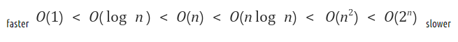
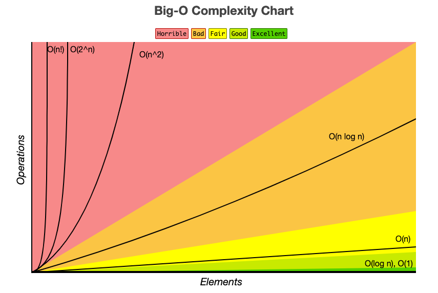
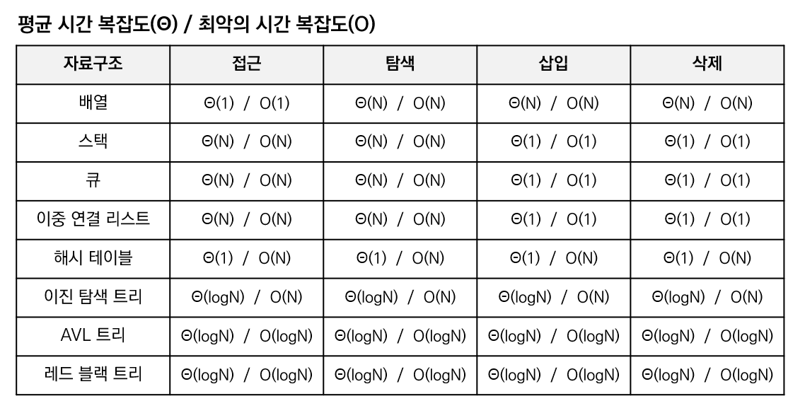

# 복잡도

<h3>📑목차</h3>

- [자료구조](#자료구조)
- [복잡도](#복잡도)
- [시간 복잡도](#시간-복잡도)
    - [표기법](#표기법)
    - [빅오 표기법](#빅오-표기법)
    - [자료 구조 별 시간 복잡도](#자료-구조-별-시간-복잡도)

 

## 자료구조
자료구조(data structure)란 효율적으로 데이터를 관리하고 `수정`, `삭제`, `탐색`, `저장`할 수 있는 데이터 집합을 말한다. 

 

## 복잡도

- 시간 복잡도: 입력 크기에 따른 문제를 해결하는 데 걸리는 시간
- 공간 복잡도: 프로그램을 실행시켰을 때 필요로 하는 자원 공간의 양

## 시간 복잡도 
알고리즘의 수행 시간을 분석할 때 시간 복잡도를 사용하는데, 실제 수행 시간은 실행환경에 따라 다르게 측정되기 때문에 `ms`, `s` 등과 같이 실제 시간 측정 단위로 표현하지 않고 **기본 연산의 실행 횟수로 표현**한다. 기본 연산이란 **데이터 입출력**, **산술 연산**, **제어 연산** 등을 말한다. 

### 표기법
입력 범위 n을 기준으로 로직이 몇 번 반복되는지 나타낸 것으로, "가장 영향을 많이 끼치는" 항 (**최고차항**)에서 상수 인자를 빼고 나머지 항을 없앤 후 표기한다.

예를 들어 입력 크기 n인 경우 걸리는 시간: 

$$g(n) = 3n^2 + n + 5 → O(n^2)$$

- **최선의 경우**: `빅 오메가(Ω)` 표기법 / 최선의 시나리오로 측정한 시간
- **평균적인 경우**: `빅 세타(Θ)` 표기법 / 평균 시간을 표현
- **최악의 경우**: `빅 오(O)` 표기법 / 최악의 시나리오로 아무리 오래 걸려도 이 시간보다 적게 걸림

 

### 빅오 표기법
최악의 경우 시간 복잡도를 나타내는 방법으로 알고리즘 성능을 파악할 때 **가장 많이 사용**된다. 

    

    

- $O(1)$ `상수시간(Constant time)`: 입력 크기에 상관없이 언제나 일정한 시간 소요
    - ex. 배열에서 인덱스로 요소에 접근
- $O(logN)$ `로그시간(Logarithmic time)`: 입력 크기에 비례하여 로그만큼 시간 소요 (문제를 해결하는데 필요한 단계들이 연산마다 특정 요인에 의해 줄어듦)
    - ex. 이진 탐색, 분할 정복 알고리즘
- $O(N)$ `선형시간(Linear time)`: 입력 크기에 정비례하여 시간 소요
    - ex. 배열(1차원) 내 모든 요소 한 번씩 조회
- $O(NlogN)$ `선형 로그 시간(Linearithmic time)`: N * (logN) 번만큼의 소요
    - ex. 병합 정렬, 퀵 정렬
- $O(N^2), O(N^3) ..$ `다항식 시간`: 입력 데이터 N의 거듭제곱이 소요
    - ex. 2차원 배열 탐색, 버블정렬
- $O(2^N)$ `지수 시간(Exponential time)`: 문제를 해결하기 위한 단계의 수는 주어진 상수값 C 의 n 제곱
    - ex. 재귀로 구현한 피보나치

### 자료 구조 별 시간 복잡도

    

