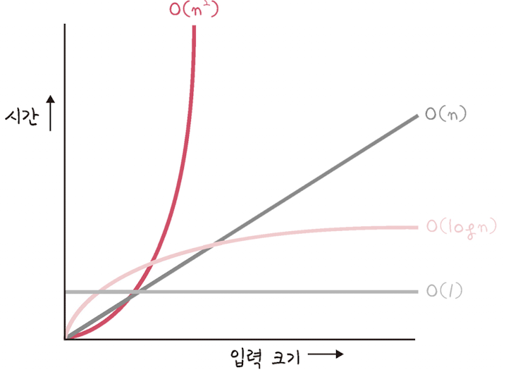
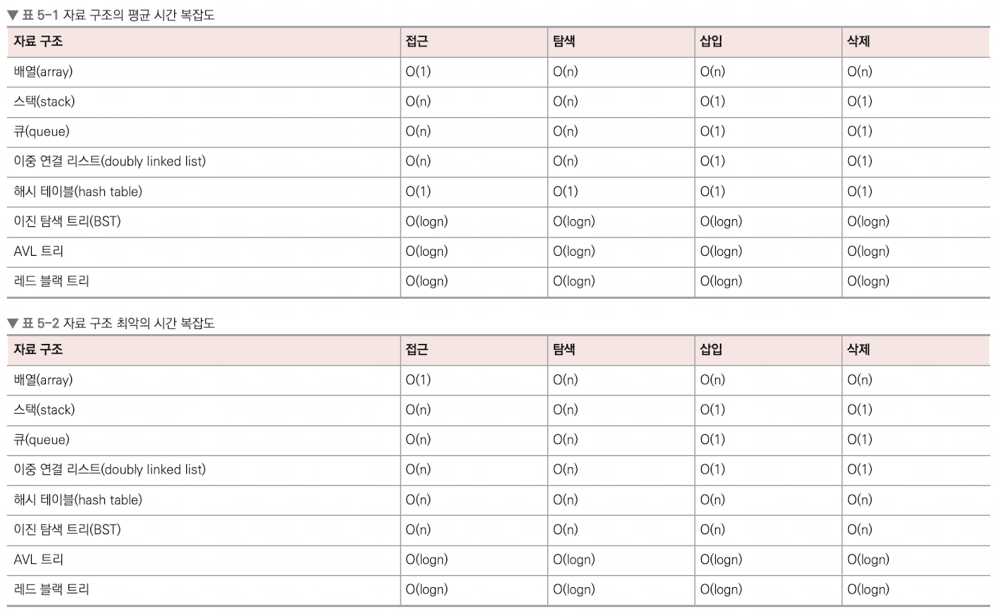

# 복잡도

자료 구조(data structure)는 효율적으로 데이터를 관리하고 수정, 삭제, 탐색, 저장할 수 있는 데이터 집합을 말합니다. <br>

```
💡 STL
C++의 표준 템플릿 라이브러리로, 스택, 배열 등 데이터 구조의 함수 등을 제공하는 라이브러리의 묶음
```

## 시간 복잡도

시간 복잡도란 문제를 해결하는 데 걸리는 시간과 입력의 함수 관계를 가리킵니다.<br>
어떠한 알고리즘의 로직이 얼마나 오랜 시간이 걸리는지를 나타내는 데 쓰이며, 보통 빅오 표기법으로 나타냅니다. <br>

### 빅오 표기법

빅오 표기법이란 입력 범위 n을 기준으로 해서 로직이 몇번 반복되는지 나타내는 것인데, 앞서 말한 코드의 시간 복잡도를 빅오 표기법으로 나타내면 O(n^2)이 됩니다. <br>
가장 영향을 많이 끼치는 항의 상수 인자를 빼고 나머지 항을 없앤 형태로 쓰게 됩니다. <br>

### 시간 복잡도의 존재 이유

시간 복잡도는 효율적인 코드로 개선하는 데 쓰이는 척도가 됩니다. <br>
<br>
O(n^2) 보다는 O(n), O(n) 보다는 O(1)을 지향해야 합니다. <br>

---

## 공간 복잡도

공간 복잡도는 프로그램을 실행시켰을 때 필요로 하는 자원 공간의 양을 말합니다. <br>
정적 변수로 선언된 것 말고도 동적으로 재귀적인 함수로 인해 공간을 계속해서 필요로 할 경우도 포함합니다. <br>

```java
int[] a = new int[1004];
```

예를 들어 위 코드처럼 배열을 선언하게 되면 1004 \* 4byte의 크기를 가지게 되고, 이 공간을 의미합니다. <br>

---

## 자료 구조에서의 시간 복잡도

다음은 자주 쓰는 자료 구조의 시간 복잡도를 나타낸 모습입니다. <br>
<br>
보통 시간 복잡도를 생각할 때 평균과 최악의 시간 복잡도를 고려하면서 사용합니다. <br>
