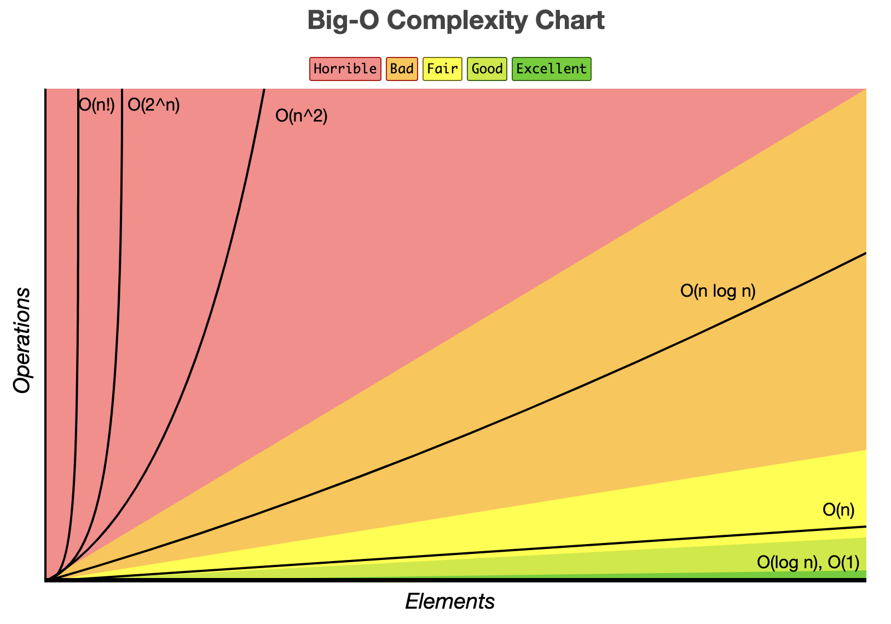
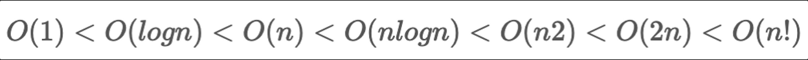
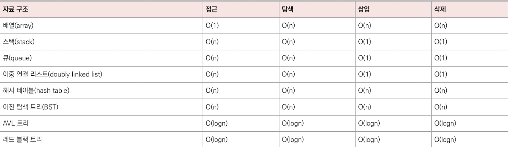

# 시간복잡도 / 공간복잡도

### 공간복잡도란?

프로그램을 실행 시켰을 때 필요로 하는 자원 공간의 양을 말한다.

<br>

### 시간복잡도란?

실행시간 관점에서 알고리즘의 효율성을 측정하는 척도이다. 알고리즘의 수행 시간을 분석할 때 시간 복잡도를 사용하는데, 실제 수행 시간은 실행환경에 따라 다르게 측정되기 때문에 `ms`, `s` 등과 같이 실제 시간 측정 단위로 표현하지 않고 **기본 연산의 실행 횟수로 표현**한다. 기본 연산이란 **데이터 입출력**, **산술 연산**, **제어 연산** 등을 말한다.

<br>

### 시간복잡도 표기법

시간복잡도는 최선, 평균, 최악 3가지로 나타낸다. 실제로 시간복잡도를 측정할 때는 세가지 경우 중 최악의 경우를 산정하여 계산한다.

- 최선의 경우 : 빅 오메가(`Ω`) 표기법 사용
- 평균적인 경우 : 빅 세타 `Θ` 표기법 사용
- 최악의 경우 : 빅 오`O` 표기법 사용

<br>

> **빅오 표기법(Big O Notation)**
>
> 빅오 표기법이란 시간복잡도를 나태낼 때 사용하는 표기법으로 입력범위 `n`을 기준으로 해서 로직이 몇 번 반복하는지 나타낸다.

<br>

### 시간 복잡도 계산 방법

- 코드를 보고 계산
- 코드 작성전 문제의 크기를 보고 구현 방법을 생각하여 계산

일일히 연산을 세는것은 큰 의미가 없다. 반복문 밖에 있는 단순 연산들은 결국 상수항이라 무시되고 반복문 안에있는 연산이라도 가장 큰 차수 외에는 각 항의 계수를 포함한 모든 것들이 무시되기 때문이다. 결국 반복문과 재귀로 반복되는 횟수만 확인하면 된다.

예를 들어, 반복횟수가 `n`인 `for` 반복문이 두 번 있다면 `n`에 대한 1차식 두개를 곱하므로 연산의 개수에 대한 식은 `n²`이 되는 것이고 시간복잡도를 빅오 표기법으로 나타내면 `O(n²)`이다.

결국 빅오 표기법은 알고리즘 내에서 반복의 차수와 직결된다고 볼 수 있다.

```java
int sum = 0;

for (int i = 0; i < N; i++) {
    for (int j = 0; j < N; j++) {
        if(i==j){
	         sum += j;
        }
    }
}
```

위 코드의 시간복잡도를 측정해보면 바깥쪽 `for`문을 `n`번 수행하고 안쪽 `for`문을 `n`번 수행한다. `n`을

`n`번 수행하기 때문에 시간복잡도는 `O(n*n)` 즉, `O(n²)`이다.

문제 크기 `N`에 대하여 대략 `N`이 `1`억이라고 가정하면 실제 수행 시간은 `1`초정도 걸린다고 생각하면 된다. (실제로는 `0.1 - 0.2`초정도의 차이가 있다.)

<br>

### 시간 복잡도 종류별 속도 비교





- `O(1) - 상수시간` : 입력의 크기에 상관없이 언제나 일정시간 소요
  ex) 배열 하나의 요소에 접근할 경우
- `O(logn) - 로그시간` : 입력의 크기에 비례해 로그만큼 시간이 소요된다.
  ex) 크기가 `n`인 배열 이진탐색
- `O(n) - 선형시간` : 입력의 크기에 비례해 증가하는 경우
  ex) 배열에서 특정 요소를 탐색할 경우
- `O(nlogn) - 선형로그시간` : 입력의 크기에 대해 `n * logn` 만큼 증가하는 경우
  ex) 힙 정렬, 병합 정렬
- `O(n²) - 제곱시간` : 입력의 크기에 대해 거듭 제곱만큼 증가하는 경우
  ex) 삽입 정렬, 선택 정렬, 크기가 `n`인 2차원 배열 탐색
- `O(2^n) - 지수시간` : 입력의 크기에 대해 상수값의 제곱 만큼 증가하는 경우
  ex) 재귀 함수로 구현한 피보나치 수를 구하는 경우

<br>

### 자료구조 별 최악의 경우 시간복잡도 비교


