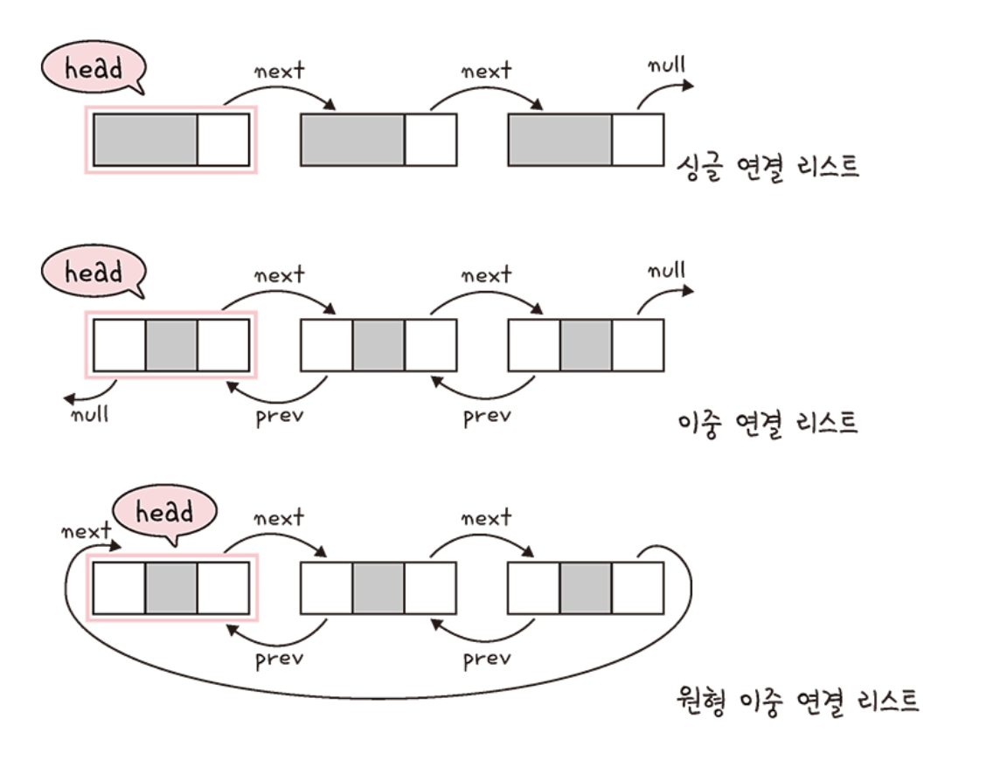
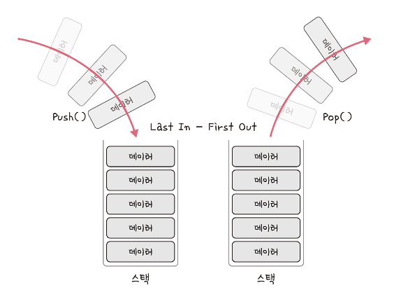
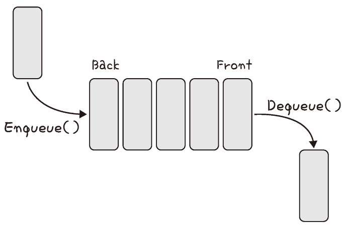

# 선형 자료 구조

<details>
<summary><h3>📑목차</h3></summary>
<div markdown="1">

- [선형 자료 구조](#선형-자료-구조)
- [배열(정적 배열)](#✅-배열-정적-배열)
- [리스트(동적 배열)](#✅-리스트-동적-배열)
- [연결 리스트](#✅-연결-리스트)
- [스택](#✅-스택)
- [큐](#✅-큐)

</div>
</details>
<br>

## 선형 자료 구조
선형 자료 구조란 **요소가 일렬로 나열**되어 있는 자료 구조를 말한다. 

<br>

## ✅ 배열 (정적 배열)
같은 타입의 변수들로 이루어져 있으며 크기가 정해져 있는 자료구조를 말하며, 인접한 메모리 위치에 있는 데이터를 모아놓은 집합이다.  


- 삽입, 삭제: `O(n)`
- 탐색: `O(1)` (랜덤 접근)

<br>

- 중복 허용, 순서 존재
- 데이터의 추가, 삭제보다 탐색이 효율적
- 인덱스에 해당하는 원소에 빠르게 접근할 때 사용


> **💡랜덤 접근 (=직접 접근)** <br>
> 배열과 같은 순차적 데이터가 있을 때, 동일한 시간에 임의의 인덱스에 해당하는 데이터에 접근할 수 있는 기능 (순차적 접근과 반대)

<br>

### ☕ in Java
👉 선언 시 크기 고정 <br>
👉 `java.util.Arrays` 클래스 통해 다양한 메소드로 배열을 다룰 수 있음

``` java
public class StaticArrayExample {
    public static void main(String[] args) {
        // 정적 배열 선언과 초기화
        // 크기가 5인 정수형 배열 선언
        int[] numbers = new int[5]; 

        // 배열에 값 할당
        numbers[0] = 10;
        numbers[1] = 20;
        numbers[2] = 30;
        numbers[3] = 40;
        numbers[4] = 50;

        // 배열 값 출력
        for (int i = 0; i < numbers.length; i++) {
            System.out.println("numbers[" + i + "] = " + numbers[i]);
        }

        // numbers[0] = 10
        // numbers[1] = 20
        // numbers[2] = 30
        // numbers[3] = 40
        // numbers[4] = 50
    }
}
```

<br>

## ✅ 리스트 (동적 배열)
동적으로 요소를 할당할 수 있는 동적 배열을 말한다. 컴파일 시점 요소의 개수를 모르는 경우 사용한다. 

- 탐색: `O(1)`
- 맨 뒤 요소 삭제, 삽입: `O(1)` 
- 중간 요소 삭제, 삽입: `O(n)` 
    - :해당 요소 뒤의 요소들 앞으로 이동시켜야 하기 때문

<br>

- 중복 허용, 순서 존재
- **랜덤 접근 가능**

<br>

### ☕ in Java
👉 `java.util.ArrayList` 클래스 사용 <br>
👉 `add()` 시 맨 뒤에 요소 삽입 <br>
👉 `get(idx)` 메서드 활용해 인덱스에 랜덤 접근 가능 <br>
👉 처음 할당한 배열의 크기를 넘어서 삽입하면 동적으로 배열의 크기 늘림 <br>
    
> `ArrayList`는 1.5배 (기본값)<br>
> `Vector`는 2배 (기본값)

``` java
import java.util.ArrayList;

public class DynamicArrayExample {
    public static void main(String[] args) {
        // 동적 배열 선언과 초기화
        ArrayList<Integer> numbers = new ArrayList<>();

        // 배열에 값 추가
        numbers.add(10);
        numbers.add(20);
        numbers.add(30);

        // 배열 값 출력
        for (int i = 0; i < numbers.size(); i++) {
            System.out.println("numbers[" + i + "] = " + numbers.get(i));
        }

        // numbers[0] = 10
        // numbers[1] = 20
        // numbers[2] = 30
    }
}

```
``` java
// java 공식 문서
public class ArrayList<E> extends AbstractList<E>
        implements List<E>, RandomAccess, Cloneable, java.io.Serializable
{
    ...

    transient Object[] elementData;

    ...

    public E get(int index) {
        Objects.checkIndex(index, size);

        // 인덱스로 바로 접근 (랜덤 접근)
        return elementData(index);      
    }

    ...
}
```

<br>

## ✅ 연결 리스트
데이터를 감싼 노드를 포인터로 연결해서 공간적 효율성을 극대화시킨 자료 구조를 말한다. 즉, **각 노드가 데이터와 포인터를 가지고 한 줄로 연결**되어 있는 방식

<p align="center">
   
   <br>
   <small>출처: 면접을 위한 CS 전공지식 노트</small>
</p>

- 삽입, 삭제: `O(1)`
- 탐색: `O(n)`
- `prev`: **앞**의 노드를 연결 시킨 **포인터**
- `next`: **뒤**의 노드를 연결 시킨 **포인터**
- `head`: 맨 앞에 있는 **노드**

<br>

- 배열에 비해 데이터 추가/삭제 용이
- **인덱스가 없는 특징**으로 인해 특정 요소에 접근하기 위해 **순차탐색 필요**
- 탐색/정렬 多 -> 배열 사용
- 데이터 추가/삭제 多 -> 연결 리스트 사용 

<br>

> ### [연결 리스트 종류] 
> **싱글 연결 리스트** <br>
> -`next` 포인터만 가짐 <br>
> -다음 노드에 대해서만 참조<br>
> -일반적으로 큐 구현할 때 사용<br><br>
> **이중 연결 리스트** <br>
> -`next`, `prev` 포인터를 가짐 <br>
> -각 노드가 이전, 다음 노드에 대해 참조<br><br>
> **원형 이중 연결 리스트** <br>
> -이중 연결 리스트와 유사 <br>
> -마지막 노드의 `next`포인터가 헤드 노드를 가리킴

<br>

### ☕ in java
👉 `java.util.LinkedList` 클래스 사용<br>
👉 `get(idx)` 메서드로 인덱스 사용하는 것처럼 보이지만, 내부 동작은 순차 탐색!

``` java
import java.util.LinkedList;

public class LinkedListExample {
    public static void main(String[] args) {
        // 연결 리스트 선언과 초기화
        LinkedList<String> linkedList = new LinkedList<>();

        // 리스트에 요소 추가
        linkedList.add("Apple");
        linkedList.add("Banana");
        linkedList.add("Orange");

        // 리스트 값 출력
        for (String fruit : linkedList) {
            System.out.println(fruit);
        }

        // Apple
        // Banana
        // Orange
    }
}

```

``` java
// java 공식 문서
public class LinkedList<E>
    extends AbstractSequentialList<E>
    implements List<E>, Deque<E>, Cloneable, java.io.Serializable
{
    transient int size = 0;
    transient Node<E> first;    // Pointer to first node.
    transient Node<E> last;     // Pointer to last node.

    ...

    public E get(int index) {
        checkElementIndex(index);
        return node(index).item;
    }

    ...

    // 순차 탐색으로 원하는 인덱스 위치에 있는 값 반환
    Node<E> node(int index) {       

        if (index < (size >> 1)) {
            Node<E> x = first;
            for (int i = 0; i < index; i++)
                x = x.next;
            return x;
        } else {
            Node<E> x = last;
            for (int i = size - 1; i > index; i--)
                x = x.prev;
            return x;
        }
    }
    ...
}
```


<br>

## ✅ 스택
가장 마지막으로 들어간 데이터가 가장 첫 번째로 나오는 성질을 가진 자료 구조이다. 

<p align="center">
   
   <br>
   <small>출처: 면접을 위한 CS 전공지식 노트</small>
</p>

- `LIFO`(Last In First Out)
- 삽입, 삭제: `O(1)`
- 탐색: `O(n)`

<br>

- 재귀적 함수, 알고리즘에 사용
- 웹 브라우저 방문 기록 등에 사용

<br>

### ☕ in Java
👉 `java.util.Stack` 클래스 사용 <br>
👉 `push()`: 스택에 데이터 삽입 <br>
👉 `pop()`: 스택에서 값 제거하며 가져옴 <br>

``` java
import java.util.Stack;

public class StackExample {
    public static void main(String[] args) {
        // 스택 선언과 초기화
        Stack<Integer> stack = new Stack<>();

        // 스택에 값 추가 (Push)
        stack.push(10);
        stack.push(20);
        stack.push(30);

        // 스택 값 출력
        while (!stack.isEmpty()) {
            int value = stack.pop(); // 스택에서 값 제거 (Pop)
            System.out.println(value);
        }

        // 30
        // 20
        // 10
    }
}
```

<br>

## ✅ 큐
먼저 집어넣은 데이터가 먼저 나오는 성질을 가진 자료 구조이다.

<p align="center">
   
   <br>
   <small>출처: 면접을 위한 CS 전공지식 노트</small>
</p>

- `FIFO`(First In First Out)
- 삽입, 삭제: `O(1)`
- 탐색: `O(n)`

<br>

- CPU 작업 프로세스, 스레드 행렬 등에 사용
- BFS, 캐시 등에 사용

<br>

### ☕ in Java
👉 `Queue` 인터페이스를 구현한 `LinkedList` 클래스 사용 <br>
👉 `offer()`: 큐에 데이터 삽입 (실패 시: `false` 반환) <br>
👉 `add()`: 큐에 데이터 삽입 (실패 시: 예외 발생) <br>
👉 `poll()`: 큐에서 값 제거하며 가져옴

``` java
import java.util.LinkedList;
import java.util.Queue;

public class QueueExample {
    public static void main(String[] args) {
        // 큐 선언과 초기화
        Queue<String> queue = new LinkedList<>();

        // 큐에 값 추가 (Enqueue)
        queue.add("Apple");
        queue.add("Banana");
        queue.add("Orange");

        // 큐 값 출력
        while (!queue.isEmpty()) {
            // 큐에서 값 제거 (Dequeue)
            String value = queue.poll(); 
            System.out.println(value);
        }

        // Apple
        // Banana
        // Orange
    }
}
```
