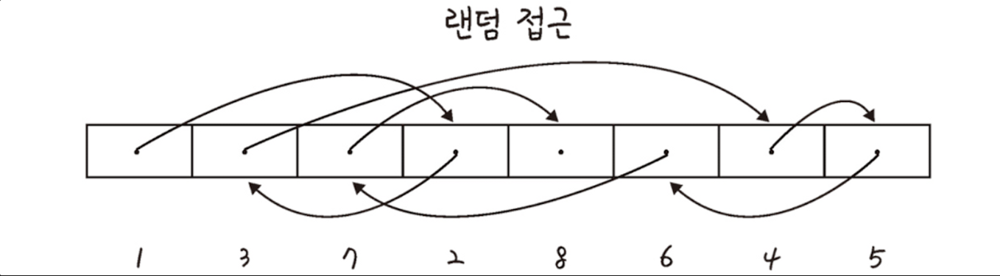
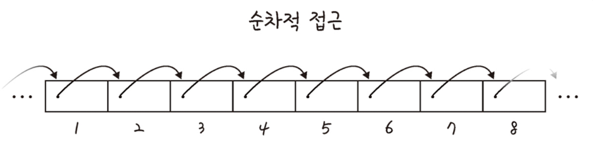
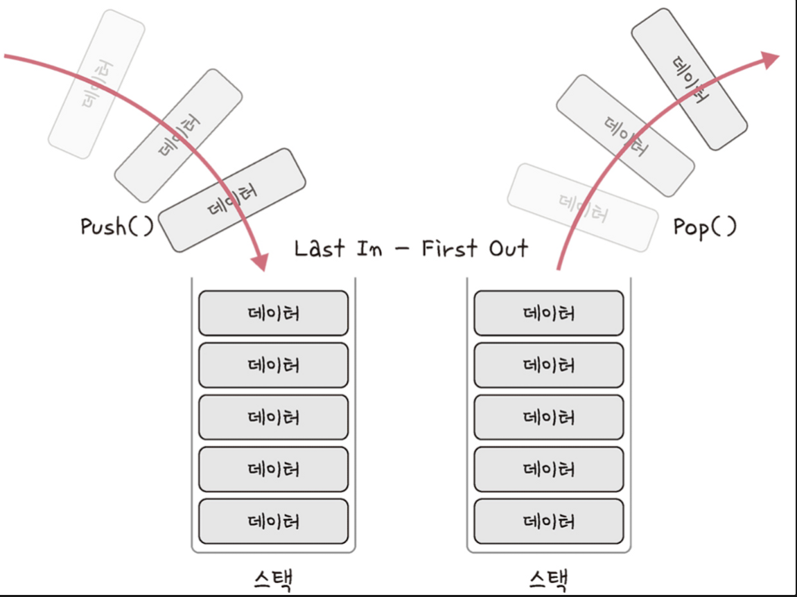
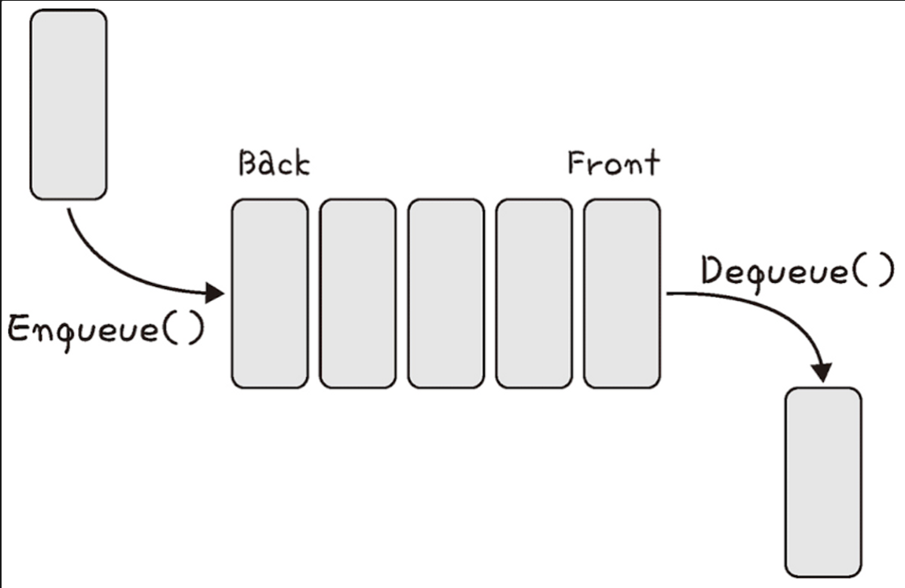

# 선형 자료구조

### 자료구조

효율적으로 데이터를 관리하고 수정, 삭제, 탐색, 저장할 수 있는 데이터 구조를 말한다. 자료구조는 형태에 따라 **선형 자료구조(Linear Data Structure)**와 **비선형 자료구조(NonLinear Data Structure)**로 구분할 수 있다.

### 선형 자료구조 **(Linear Data Structure)**

선형 자료구조란 자료가 일렬로 나열되어 저장되는 형태의 자료구조를 말한다.

### 선형 자료구조의 종류

- 배열
- 리스트(ArrayList, LinkedList)
- 벡터
- 큐
- 스택
- 덱

## 배열(Array)

---

### 배열이란?

연속된 메모리 공간에 순차적으로 데이터를 저장하는 선형 자료구조이다. 같은 타입의 원소들로 이루어져 있으며 한번 크기를 지정하면 변경할 수 없다.

### 배열의 특징

- 연속된 메모리 공간에 데이터를 순차적으로 저장한다.
- 한번 크기를 선언하면 변경할 수 없다. (정적 할당)
- 인덱스를 사용하여 특정 원소에 접근이 가능하다. (랜덤접근)
- 메모리는 배열이 선언될 때 (컴파일 될 때) Stack 영역에 할당된다.

### 배열의 시간복잡도

- 배열의 특정 위치의 데이터를 탐색하는 경우 : `O(1)`
  배열은 데이터가 순차적으로 저장되어 있어 `K` 번째 데이터를 찾을 경우 `배열의 시작 주소 + (1칸의 주소 * K)` 칸 만큼 더하면 되기 때문에 단순 사칙연산에 의해 `O(1)` 시간만에 데이터를 찾을 수 있다.
- 배열의 맨 뒤에 데이터를 삽입/삭제 하는 경우 : `O(1)`
  배열의 맨 뒤에 데이터를 삽입하는 경우 `배열의 시작 주소 + (1칸의 주소 * 배열의 길이)` 의 식을 통해 맨 뒤에 데이터를 저장하면 된다.
  배열의 맨 뒤 데이터를 삭제하는 경우 `배열의 시작 주소 - 1칸의 길이` 식을 통해 단순 사칙연산에 의해 `O(1)` 시간 복잡도 만에 데이터 삽입/삭제가 가능하다.
- 배열의 맨 뒤가 아닌 위치에 데이터를 삽입/삭제 하는 경우 : `O(n)`
  배열의 임의의 위치에 원소를 새로 추가해서 끼워넣으려면 그 뒤에 존재하는 모든 원소들을 한 칸씩 뒤로 밀어야 한다. 뒤로 미는 연산이 한 번 일어날 때 `O(n)`이 걸린다. 만약 `n`개의 원소를 한 칸씩 밀어야 한다면`O(1 * n) = O(n)` \*\*\*\*이 걸리게 된다.
  배열의 임의의 위치의 원소를 삭제하면 삭제된 원소의 주소의 데이터는 비게 된다. 하지만, 배열은 메모리의 데이터를 연속하게 배치한 자료구조이기 때문에 해당 원소 뒤의 원소들을 모두 한칸씩 앞으로 땡겨야 한다.

### 배열의 장단점

**[장점]**

- 연속된 메모리 공간에 데이터를 저장하기 때문에 특정 원소를 index를 통해 빠르게 찾을 수 있다.
- 데이터의 크기가 정해져 있을 경우 연속된 메모리 공간에 존재하기 때문에 관리가 편하다.

**[단점]**

- 배열은 데이터 사이의 빈공간을 허용하지 않기 때문에 데이터의 삽입/삭제 시 속도가 느려 삽입/삭제가 빈번한 경우에는 유용하지 않다.
- 배열의 크기를 변경할 수 없기 때문에 배열의 크기를 너무 크게 설정하면 메모리 낭비가 심해질 수 있고 너무 작게 설정하면 데이터를 모두 담지 못할 수 있다.

### 배열의 데이터 접근

- 랜덤접근
  직접 접근이라고 하는 랜덤 접근은 동일한 시간내에 배열과 같은 순차적인 데이터가 있을 때 임의의 데이터에 접근할 수 있는 기능이다. 데이터를 저장된 순서대로 접근하는 순차적 접근과는 반대이다.
  
- 순차적 접근
  데이터를 저장된 순서대로 접근
  

## 리스트(List)와 벡터(Vector)

---

### ArrayList

`Array`특징과 `List` 의 특징을 모두 가지고 있는 선형 자료구조로 내부적으로 `Object[]` 을 사용한다. 내부적으로 배열을 사용하기 때문에 중복을 허용하고 순서를 유지하며 인덱스로 원소들을 관리한다는 점에서 배열과 상당히 유사하다. 하지만, 배열과 달리 배열을 추가, 삭제 하는 메서드를 통해 `List` 크기 조절 (`기존크기의 1.5배` )이 가변적인 리스트를 말한다.

### ArrayList의 특징

- 배열처럼 연속된 메모리 공간에 데이터를 순차적으로 저장한다.
- 배열과 달리 한번 크기를 선언 해도 데이터에 크기에 따라 가변적으로 크기가 조절된다. (동적 할당)
- 배열처럼 인덱스를 사용하여 특정 원소에 접근이 가능하다.

### ArrayList의 시간복잡도

내부적으로 배열을 사용하기 때문에 배열의 시간복잡도와 유사하다.

- 특정 위치의 데이터를 탐색하는 경우 : `O(1)`
- 맨 뒤에 데이터를 삽입/삭제 하는 경우 : `O(1)`
- 맨 뒤가 아닌 위치에 데이터를 삽입/삭제 하는 경우 : `O(n)`

### ArrayList의 장단점

**[장점]**

- 연속된 메모리 공간에 데이터를 저장하기 때문에 `LinkedList`와 비교해서 특정 원소를 `index`를 통해 빠르게 찾을 수 있다.
- 데이터의 크기가 정해져 있을 경우 연속된 메모리 공간에 존재하기 때문에 관리가 편하다.
- 배열과 달리 크기가 가변적으로 조절이 가능하다.

**[단점]**

- 배열처럼 데이터 사이의 빈공간을 허용하지 않기 때문에 `LinkedList`와 비교해서 데이터의 삽입/삭제 시 속도가 느리다.
- 내부적으로 배열의 크기를 증가 또는 감소하는 메서드를 사용하기 때문에 데이터 삽입/삭제에 따른 추가적인 연산이 필요하고 이는 시스템의 성능저하로 이어질 수 있기 때문에 삽입/삭제가 잦은 경우 비효율적이다.

### 연결리스트(LinkedList)

데이터를 감싼 노드를 다른 노드의 주소를 저장하고 있는 포인터로 연결해서 공간적인 구성의 효율을 극대화시킨 선형 자료구조이다. 배열과 `ArrayList`와는 달리 포인터에 주소값을 저장하고 있기 때문에 데이터를 연속적으로 저장하지 않는다. 연결방식에 따라 `싱글 연결 리스트`, `이중 연결 리스트`, `원형 연결 리스트` 로 구분할 수 있다.해당 글에서는 이중 연결리스트를 기준으로 설명한다.

> **싱글 연결 리스트 (Single Linked List)**

다음 노드의 주소값만을 가지고 있는 연결 리스트를 말한다.

>

> **이중 연결 리스트 (Double Linked List)**

이전 노드의 주소값과 다음 노드의 주소값을 모두 가지고 있는 양방향 연결 리스트를 말한다.

>

> **원형 이중 연결 리스트** **(Double Linked List)**

이중 연결 리스트와 같지만 `tail` 노드의 포인터가 `head` 노드의 주소값을 가지고 있는 연결 리스트를 말한다.

>

### 연결 리스트의 특징

- 데이터를 포인터로 연결하기 때문에 배열과 달리 연속적으로 메모리에 데이터를 저장하지 않는다.
- 가변적으로 크기 조절이 변경이 가능하다. (동적 할당)
- 데이터 접근시 포인터를 통한 순차 접근만 가능하다.
- 연결 리스트를 구성하는 각 노드들은 연결되어 있는 다른 노드들의 주소값과 데이터로 구성되어 있다.

### 연결 리스트의 시간복잡도

- 특정 위치의 데이터를 탐색하는 경우 : `O(n)`
  특정 데이터를 조회하는 경우 배열처럼 연속적으로 데이터를 저장하지 않기 때문에 각 노드의 포인터에 저장된 주소값을 통해 모든 노드를 탐색하는 순차접근만이 가능해 `ArrayList` 와 비교해 탐색 속도가 느리다.
- 데이터를 삽입/삭제 하는 경우 : `O(1)`
  `ArrayList`와 달리 중간에 데이터를 삽입/삭제 해도 데이터를 밀거나 땡기는 과정없이 단지 삽입/삭제하는 앞뒤 노드 포인터의 주소값만 변경하면 되므로 `ArrayList` 보다 삽입/삭제가 용이하다.

### 연결 리스트의 장단점

**[장점]**

- 데이터의 빠른 삽입/삭제가 가능하다.
- 배열과 달리 크기가 가변적으로 조절이 가능하다.

**[단점]**

- 배열처럼 랜덤접근이 불가능하고 순차 접근만 가능하기 때문에 탐색속도가 느리다.
- `포인터 + 데이터`로 구성된 객체를 저장단위로 사용하기 때문에 저장공간 측면에서 배열과 `ArrayList` 와 비교했을 때 비 효율적이다.

### 벡터(Vector)

`Vector`클래스는 배열을 기반으로 한 `List` 인터페이스를 구현한 자료구조이다. `ArrayList` 와 유사하지만 모든 메서드가 `Synchronized` 키워드로 동기화 되어있어 `Tread-Safe` 하다는 특징이 있다.

### 벡터의 장단점

**[장점]**

- `Vector` 클래스 내부의 메서드들은 `Tread-Safe` 하다.

**[단점]**

- 경쟁상태를 따지지 않아도 되는 환경에서 메서드를 실행할 경우 동기화 여부 확인으로 인해 일반적인 메서드보다 속도가 느려질 수 있다.
- `Vector` 인스턴스 자체에 대해서는 동기화처리가 되어있지 않아서 `Tread-Safe` 하지 못한 상황이 발생한다. 만약, 동기화 처리를 해야 할 상황이 필요하다면 `Synchronized` 블록을 통해 따로 동기화 처리를 해야한다.

> `ArrayList`사용시 동기화가 필요하면 `Collections.synchronizedList()` 를 이용해 동기화 처리하면 `Tread-Safe` 한 `ArrayList` 를 사용할 수 있다.

## Stack과 Queue

---

### 스택(Stack)

스택은 한쪽 끝에서만 데이터를 넣고 뺄 수 있는 제한적으로 접근할 수 있는 후입선출(Last-In-First-Out) 형태의 선형 자료구조이다. 기본적으로 `Stack` 클래스는 내부에서 **최상위 타입 배열인 `Object[]` 배열**을 사용하여 데이터를 관리하고 있다.

### 스택의 시간복잡도

- 특정 위치의 데이터를 탐색하는 경우 : `O(n)`
- 데이터를 삽입/삭제 하는 경우 : `O(1)`

### 스택의 활용

- 웹 브라우저의 페이지 뒤로가기
- 재귀함수

### 큐(Queue)

**큐(Queue)란** 양 쪽 끝에서만 데이터를 넣거나 뺄 수 있는 삽입과 삭제의 위치가 제한적인 형태의 선입선출(First-In-First-Out) 구조를 갖는 선형 자료구조이다. 큐는 스택과는 달리 클래스가 아닌 인터페이스로 정의해 놓았을 뿐 별도의 클래스를 제공하고 있지 않다. 대신 Queue 인터페이스를 구현한 클래스를 제공하고 있어 이들 중 하나를 선택해서 사용해야 한다.

### 큐의 구현체

- `ArrayDeque`
- `LinkedList`
- `PriorityQueue`

### 큐의 시간복잡도

- 특정 위치의 데이터를 탐색하는 경우 : `O(n)`
- 데이터를 삽입/삭제 하는 경우 : `O(1)`

### 큐의 활용

- 그래프의 너비 우선 탐색(BFS)에서 사용
- 캐시 구현시 활용
- CPU 프로세스 관리
