# 비선형 자료 구조

<details>
<summary><h3>📑목차</h3></summary>
<div markdown="1">

- [선형 자료 구조](#선형-자료-구조)


</div>
</details>
<br>

## 비선형 자료 구조
비선형 자료 구조란 일렬로 나열하지 않고 자료 순서나 관계가 복잡한 구조를 말한다. 일반적으로 트리나 그래프를 말한다. 

<br>

## 그래프 (Graph)
그래프는 정점과 간선으로 이루어진 자료 구조를 말한다. 

- `정점`(V: Vertex): 그래프 내의 하나의 개별적 요소
    - out-degree: 다른 정점으로 나가는 간선
    - in-degree: 특정 정점으로 들어오는 간선
- `간선`(E: Edge): 정점과 정점 사이를 연결하는 선 (흐름, 관계 표현)
- `가중치`(W: Weight): 간선과 정점 사이에 드는 비용
- `차수`(degree): 특정 정점에 연결된 간선의 수 
    - 무방향 그래프에선 하나의 간선이 두 점정에 인접하므로 간선 수의 두 배

#### 방향 그래프(Diredted Graph)
그래프의 간선이 한 정점에서 다른 정점으로의 방향을 가짐

#### 무방향 그래프(Undirected Graph)
그래프의 간선에 방향성이 없는 그래프

#### 가중치 그래프(Weighted Graph)
간선에 비용이나 가중치가 할당된 그래프

<br>

## 그래프 구현 
그래프를 구현하는 방식으로는 **인접 리스트**와 **인접 행렬**이 있다.

<p align="center">
   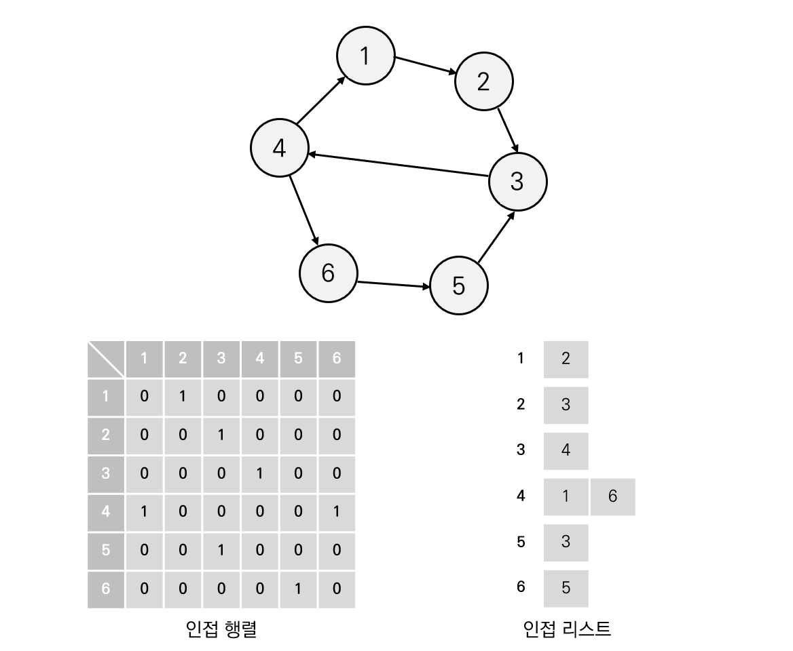
</p>


### 인접 행렬(Adjacency Matrix)
**정방 행렬을 사용**하여 그래프의 **정점 간 연결 관계를 표현**하는 방식이다. 행렬의 각 `원소 (i, j)`는 정점 `i`와 정점 `j` 사이의 간선 여부를 나타낸다. 보통 1인 경우 간선이 존재하고 0인 경우 간선이 없어 연결되어 있지 않다는 뜻을 의미한다. 간선의 수가 정점의 수에 비해 많은 그래프에 효과적이다. (간선의 수가 적은 그래프를 표현할 때에는 낭비되는 행렬의 공간이 많아져 비효율적이다.)

- 정점 수 가 `n`일때, `n*n` 크기의 행렬 필요
- 각 행과 열을 정점을 의미 / 각 원소들은 간선을 의미
- 무방향 그래프는 대칭 구조
- 가중치 그래프는 보통 가중치 값 저장

<p align="center">
   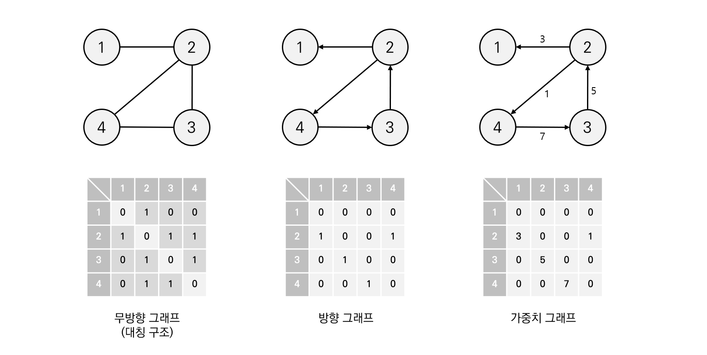
</p>

#### 장단점
- 두 정점의 간선 조회 시 `O(1)`의 시간 소요
- 특정 정점 i의 차수를 구할 때 `O(n)`의 시간 소요
    - i번째 행의 값을 모두 더하여 구할 수 있음
- 간선 수에 상관없이 무조건 n*n 크기의 배열 필요하므로 메모리 공간 낭비할 가능성 높음
- 그래프의 모든 간선의 수 알아낼 때 `O(n^2)` 소요


<details>
<summary><h4>☕ in java</h4></summary>
<div markdown="1">

```java
package dataStructure;

public class 그래프_인접행렬 {
    public static void main(String[] args) {

        GraphAdjacencyMatrix graph = new GraphAdjacencyMatrix(4);

        // 무방향 그래프(양방향 그래프) 간선 추가
        graph.addEdge(1, 2, true);
        graph.addEdge(2, 3, true);
        graph.addEdge(2, 4, true);
        graph.addEdge(3, 4, true);

        // 간선 조회
        System.out.println("Graph has edge between 1 and 2: " + graph.hasEdge(1, 2));
        System.out.println("Graph has edge between 1 and 4: " + graph.hasEdge(1, 4));
        graph.printGraph();
    }


    static class GraphAdjacencyMatrix {
        private int[][] graph;
        private int size;

        public GraphAdjacencyMatrix(int size) {
            // 편의상 +1 크기 배열 생성
            this.size = size;
            this.graph = new int[size+1][size+1];
        }

        // 간선 추가
        public void addEdge(int from, int to, boolean undirected) {
            graph[from][to] = 1;

            // 양방향 간선 추가
            if (undirected) {
                graph[to][from] = 1;
            }
        }

        // 간선 확인
        public boolean hasEdge(int from, int to) {
            return graph[from][to] == 1;
        }

        // 그래프 출력
        public void printGraph() {
            for(int i = 1; i <= size; i++) {
                for(int j = 1; j <= size; j++) {
                    System.out.print(" " + graph[i][j]);
                }
                System.out.println();
            }
        }
    }
}
```
```
Graph has edge between 1 and 2: true
Graph has edge between 1 and 4: false
 0 1 0 0
 1 0 1 1
 0 1 0 1
 0 1 1 0
 ```
</div>
</details>
<br>


### 인접 리스트(Adjacency List)
그래프의 **각 정점마다** 그 정점과 **연결된 다른 정점들의 목록을 저장**하는 방식이다. 각 정점마다 연결된 정점들을 리스트나 배열로 표현하여 그래프의 구조를 효율적으로 나타낼 수 있다. 특히, 정점 수에 비해 간선 수가 적은 그래프에 효과적이다. 

- 정점 개수만큼 리스트 필요
- 각 리스트엔 인접한 정점의 정보 저장
- 무방향 그래프의 경우 간선 추가시 각 정점의 반대 정점 리스트에도 노드 추가

아래 그림을 보면 각 정점마다 연결된 다른 정점들의 정보를 리스트 형태로 저장하고 있는데, 연결 리스트나 일반 리스트를 사용할 수 있다. 연결 리스트에 비해 일반 리스트를 사용하는 것이 구현이 용이하다. 

<p align="center">
   
</p>

#### 장단점
- 연결되어 있는 정점들의 정보(간선)만 관리하므로 메모리 사용 측면에서 효율적
- 두 정점을 연결하는 간선을 조회하거나 정점의 차수를 알기 위해선 인접 리스트를 탐생해야하므로 정점의 차수만큼 시간 필요 `O(degree(v))`

<details>
<summary><h4>☕ in java</h4></summary>
<div markdown="1">

```java
package dataStructure;
import java.util.ArrayList;

public class 그래프_인접리스트 {
    public static void main(String[] args) {
        int numNodes = 4;
        GraphAdjacencyList graph = new GraphAdjacencyList(numNodes);

        graph.addEdge(2, 1, false);
        graph.addEdge(2, 4, false);
        graph.addEdge(3, 2, false);
        graph.addEdge(4, 3, false);

        // 정점마다 연결된 정점들 확인
        for (int i = 1; i <= numNodes; i++) {
            ArrayList<Integer> neighbors = graph.getAdjacentNodes(i);
            System.out.println("Node " + i + " is adjacent to: " + neighbors);
        }
    }

    static public class GraphAdjacencyList {
        private int numNodes;
        private ArrayList<ArrayList<Integer>> adjList;

        // 생성자
        public GraphAdjacencyList(int numNodes) {
            // 그래프 정점 수만큼 리스트 생성
            // 노드 번호 1부터 시작하기 위해 편의상 + 1
            this.numNodes = numNodes + 1;
            adjList = new ArrayList<>(this.numNodes);

            // 각 노드마다 연결 정보 저장할 리스트 생성
            for (int i = 0; i <= numNodes; i++) {
                adjList.add(new ArrayList<>());
            }
        }

        // 간선 추가
        public void addEdge(int u, int v, boolean undirected) {
            adjList.get(u).add(v);

            // 무방향 그래프일 때
            if(undirected){
                adjList.get(v).add(u);
            }
        }

        public ArrayList<Integer> getAdjacentNodes(int node) {
            return adjList.get(node);
        }
    }
}
```
```
Node 1 is adjacent to: []
Node 2 is adjacent to: [1, 4]
Node 3 is adjacent to: [2]
Node 4 is adjacent to: [3]
 ```
</div>
</details>
<br>


## 트리
그래프 중 하나로 그래프의 특징처럼 정점과 간선으로 이루어져 있고 **계층적인 구조**를 가지고 있다. 하나의 루트 노드에서 시작하여 여러 개의 서브트리를 가질 수 있다. 각 노드는 다른 노드와 연결되어 있지만, **사이클이 없으며 계층 구조를 형성**한다. 또한 트리에서 임의의 **두 노드 사이엔 경로(단순 경로)가 반드시 하나** 있다.


<p align="center">
   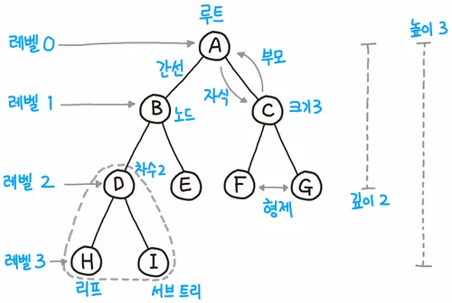
   <br>
   <small><a href="https://product.kyobobook.co.kr/detail/S000001932748">파이썬 알고리즘 인터뷰</a></small>
</p>


- 부모, 자식 계층 구조
- `V - 1 = E` : 간선 수는 노드 수 -1 개
- **노드**: 트리의 기본 단위로 각 노드는 부모와 연결되며, 0개 이상의 자식 노드를 가질 수 있음
- **루트노드**: 트리의 가장 상위에 있는 노드 
- **리프노드**: 자식이 없는 노드로 트리의 가장 하위에 위치
- **서브트리**: 트리 내의 노드와 간선들의 부분 집합
- **레벨(깊이)**: 특정 노드의 레벨은 루트 노드부터 해당 노드까지 최단 거리로 갔을 때 거리를 말함
- **높이**: 트리의 높이는 루트 노드부터 리프 노드까지 가장 긴 거리를 말함

<br>

## 이진 트리
이진트리는 **자식의 노드 수**가 **두 개 이하**인 트리를 의미한다. 

<p align="center">
   
   <br>
   <small>면접을 위한 CS 전공지식 노트</small>
</p>

#### 🌳 정 이진 트리(full binary tree)
자식 노드가 없거나 두 개인 이진 트리

#### 🌳 완전 이진 트리(complete binary tree)
왼쪽에서부터 채워져 있는 이진 트리<br> 
마지막 레벨을 제외하곤 모든 레벨이 완전히 채워져 있음<br>
마지막 레벨도 왼쪽부터 채워져 있음<br>
모든 노드가 오른쪽 자식이 있으면 왼쪽 자식 반드시 존재

#### 🌳 변질 이진 트리(degenerate binary tree)
자식 노드가 하나밖에 없는 이진 트리

#### 🌳 포화 이진 트리(perfect binary tree)
모든 노드가 꽉 차 있는 이진 트리<br>
모든 리프 노드의 높이가 같음<br>
노드의 수: $2^n - 1$ (`n`: 리프 노드 높이)

#### 🌳 균형 이진 트리(balanced binary tree)
왼쪽과 오른쪽 노드의 높이 차이가 1 이하인 이진 트리

<br>

### 이진 트리 순회 

[💡이진 트리 순회 관련 백준 문제](https://www.acmicpc.net/problem/1991)

#### 중위 순회 (in-order traversal)
`왼쪽 자식 → 자신 → 오른쪽 자식` 순서로 방문하는 방법

#### 전위 순회 (pre-order traversal)
`자신 → 왼쪽 자식 → 오른쪽 자식` 순서로 방문하는 방법

#### 후위 순회 (post-order traversal)
`왼쪽 자식 → 오른쪽 자식 → 자신` 순서로 방문하는 방법

#### 레벨 순서 순회 (level-order traversal)
BFS 방법으로 트리를 순회하는 방법으로, 레벨 순서대로 노드를 방문


<br>

## 이진 탐색 트리(BST: Binary Search Tree)
이진 트리의 일종으로, 특정 노드를 기준으로 **오른쪽 하위 트리**엔 자신의 값보다 **큰 값의 노드만** 포함하고, **왼쪽 하위 트리**엔 자신의 값보다 **작은 값의 노드**만 포함된 트리를 말한다.

이와 같은 특성이 모든 노드에게 적용되며, **이진 탐색** 기법을 활용하여 **"검색"** 을 용이하게 할 수 있다. 하지만 데이터 삽입 순서에 따라 **변질 이진 트리**와 같이 **선형적인 구조**를 갖게 된다면 **최악의 시간 복잡도**를 가지게 된다. 

<p align="center">
   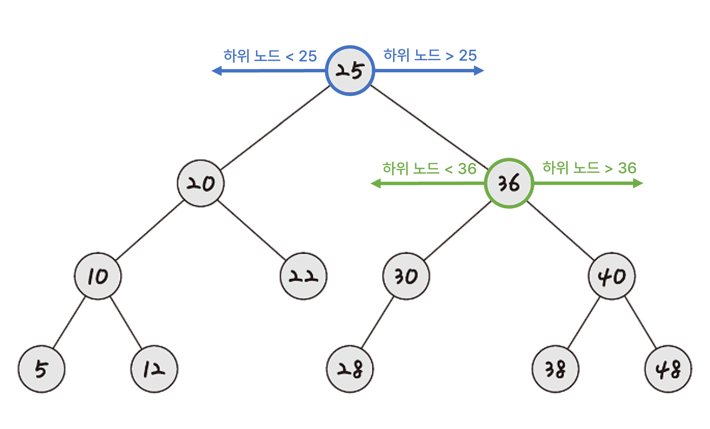
   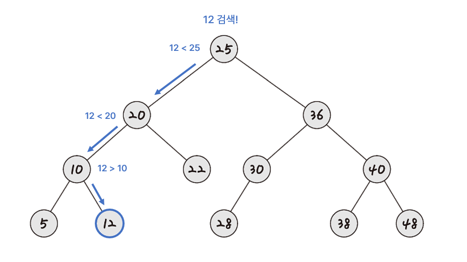
   <br>
   <small>면접을 위한 CS 전공지식 노트</small>
</p>

<p align="center">
   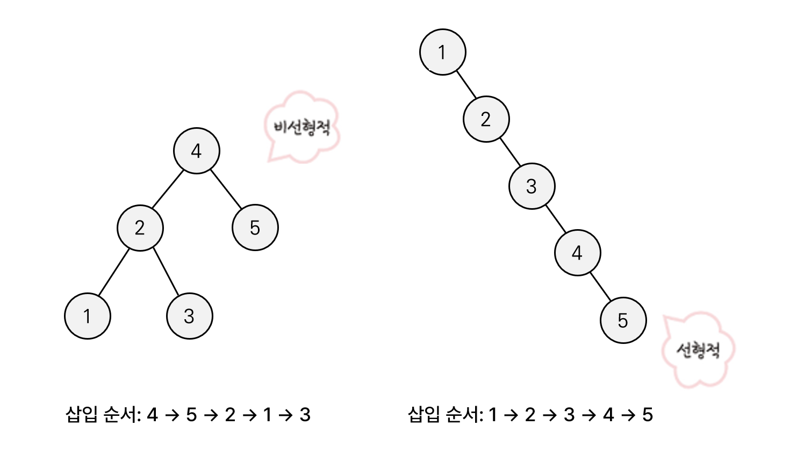
   <br>
   <small>면접을 위한 CS 전공지식 노트</small>
</p>

> **💡평균 탐색 시간**: `O(logN)` <br>
> **💡최악의 경우**: `O(N)` (트리가 편향된 경우)

<br>

## AVL 트리
`AVL` (Adelson-Velsky and Landis tree)는 선형적인 트리가 되는 것을 방지하고자 **스스로 균형을 잡는 이진 탐색 트리**를 말한다. 두 자식 **서브 트리의 높이는 항상 최대 1만큼 차이**난다는 특징이 있다. (균형 이진 트리의 일종)

데이터 삽입, 삭제 시 균형이 항상 맞도록 트리 일부를 왼쪽 혹은 오른쪽으로 회전시킨다(리밸런싱). 

<p align="center">
   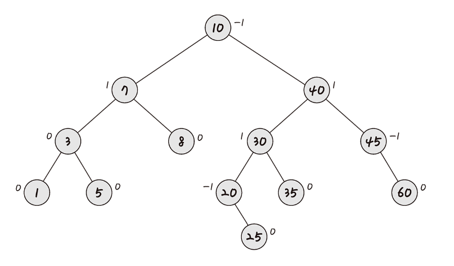
   <br>
   <small>면접을 위한 CS 전공지식 노트</small>
</p>

- 가장 처음 나온 자가 균형 이진 트리
- red-black tree보다 균형은 훨씬 잘 잡힘
- red-black tree보다 삽입, 삭제가 느림
- 서브 트리 높이 차이가 1보다 커지면 회전(리밸런싱) 통해 차이 줄임

> **💡탐색, 삽입, 삭제 시간 복잡도**: `O(logN)`

<br>

### Balance Factor(BF)
트리의 균형이 무너졌는지에 대해 판단하기 위한 지표로, 트리의 각 노드에 대해 **서브트리의 높이 차이**를 의미한다.

BF는 `-1`, `0`, `1`의 값을 가지는 경우 균형을 유지하고 있으며 이 값의 범위를 벗어나면 회전 연산을 통해 균형을 복원해야 한다. 

$BF(V) = V의 왼쪽 서브트리 높이 - V의 오른쪽 서브트리 높이$

*오른쪽에서 왼쪽 빼도 무관

<p align="center">
   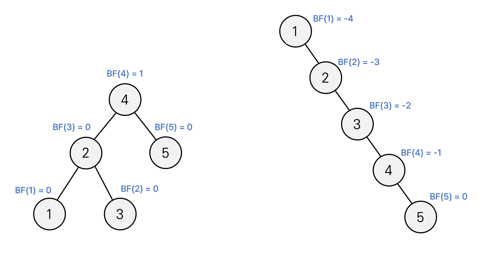
</p>

<br>

### 리밸런싱
트리가 균형을 유지하기 위한 작업으로, 특정 노드의 서브트리 높이 차가 2 이상이 되는 경우 수행된다. 

<p align="center">
   
   <br>
   <small>위의 애니메이션에선 오른쪽 서브트리에서 왼쪽 서브트리 높이를 빼 BF를 계산함</small>
   <br>
   <small>출처: <a href="https://commons.wikimedia.org/wiki/File:AVL_Tree_Example.gif">Bruno Schalch</a></small>
</p>

### 회전 동작
균형이 틀어졌을 때, 바로잡기 위한 4가지 `LL`, `RR`, `RL`, `LR` 회전 동작이 있다. 

예를 들어 한 노드가 왼쪽 자식을 가지고 있고, 그 자식 노드도 왼쪽 자식 노드를 가지고 있다. 이때 BF가 2 이상으로 불균형할 때 이 상태를 `Left-Left` 상태라고 한다. 줄여서 `LL`상태라고 부르며 이 `LL`상태를 해소하기 위한 회전 동작을 `LL`회전이라고 한다. 이름과 달리 실제로는 `Right Rotation` 즉, 우회전을 하는데 회전 동작에 이름에 속아 헷갈리지 말자. 

- `LL`상태를 해소하기 위한 회전 동작, `LL`회전
- `RR`상태를 해소하기 위한 회전 동작, `RR`회전
- `RL`상태를 해소하기 위한 회전 동작, `RL`회전
- `LR`상태를 해소하기 위한 회전 동작, `LR`회전


#### LL회전 (Left-Left 회전)
🚨주의: Left-Left 회전이라고 왼쪽으로 두번 회전하는거 아니다!!

BF가 `-1~1` 범위를 벗어난 노드를 기준으로 `왼쪽자식 → 왼쪽자식` 노드가 존재하는 경우를 `LL Case`라고 한다. 이를 해결하기 위해 `우회전`(Right Rotation)을 적용한다. 

노드 회전시 변경되는 서브트리와의 연결 또한 보기 위해 그림에 삼각형으로 서브트리를 표현했다. 

<p align="center">
   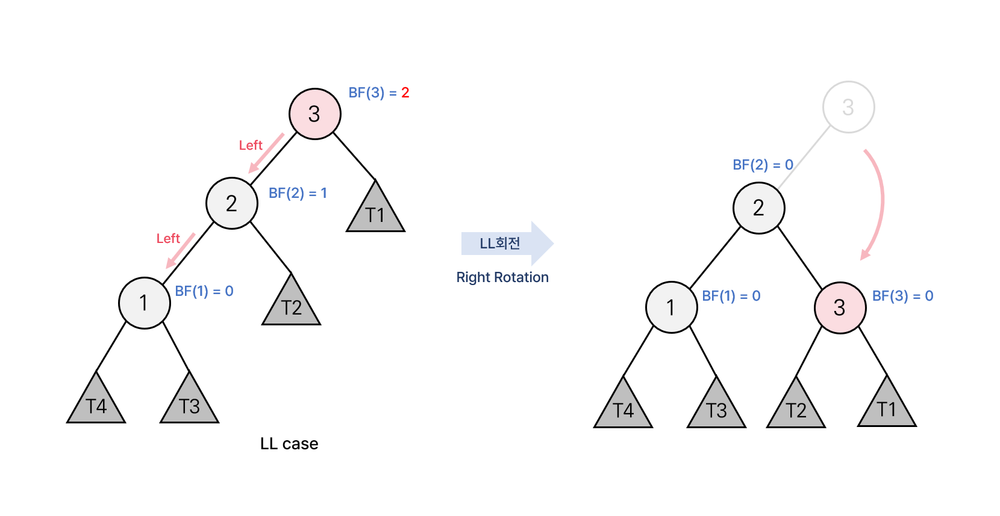
</p>

> **우회전(Right Rotation)** <br>
> 1. 기준 노드(3)를 자식 노드(2)의 오른쪽 자식 노드로 변경한다.
> 2. 기존의 자식노드(2)가 가지고 있던 서브트리(T2)를 기준 노드(3)의 왼쪽 노드로 변경한다. 

<br>

#### RR회전 (Right-Right 회전)
🚨주의: Right-Right 회전이라고 오른쪽으로 두번 회전하는거 아니다!!

BF가 `-1~1` 범위를 벗어난 노드를 기준으로 `오른쪽자식 → 오른쪽자식` 노드가 존재하는 경우를 `RR Case`라고 한다. 이를 해결하기 위해 `좌회전`(Left Rotation)을 적용한다. 

노드 회전시 변경되는 서브트리와의 연결 또한 보기 위해 그림에 삼각형으로 서브트리를 표현했다. 

<p align="center">
   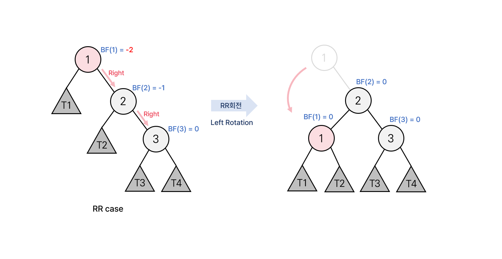
</p>

> **좌회전(Left Rotation)** <br>
> 1. 기준 노드(1)를 자식 노드(2)의 왼쪽 자식 노드로 변경한다.
> 2. 기존의 자식노드(2)가 가지고 있던 서브트리(T2)를 기준 노드(1)의 오른쪽 노드로 변경한다. 

<br>

#### RL회전 (Right-Left 회전)
🚨주의: Right-Left 회전이라고 오른쪽으로 한 번 , 왼쪽으로 한 번 회전하는거 아니다!!

BF가 `-1~1` 범위를 벗어난 노드를 기준으로 `오른쪽자식 → 왼쪽자식` 노드가 존재하는 경우를 `RL Case`라고 한다. 이를 해결하기 위해 자식 노드를 기준으로 `우회전`을 진행하고 범위를 벗어난 노드를 기준으로 `좌회전`을 적용한다. 

<p align="center">
   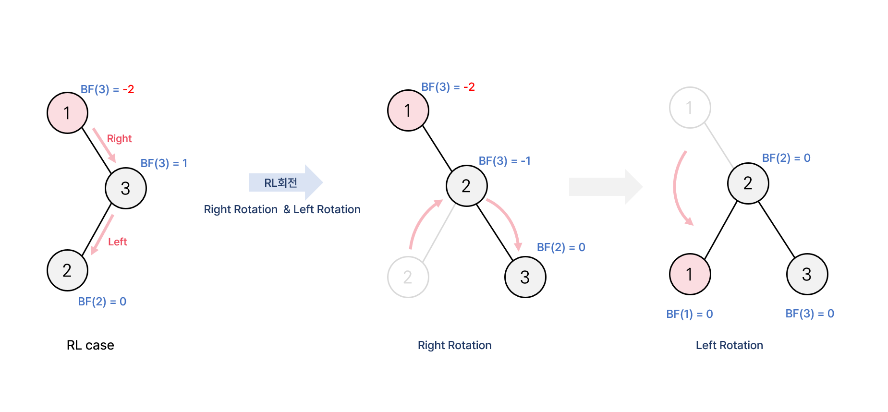
</p>

<br>

#### LR회전 (Left-Right 회전)
🚨주의: Left-Right 회전이라고 왼쪽으로 한 번 , 오른쪽으로 한 번 회전하는거 아니다!!

BF가 `-1~1` 범위를 벗어난 노드를 기준으로 `왼쪽자식 → 오른쪽자식` 노드가 존재하는 경우를 `LR Case`라고 한다. 이를 해결하기 위해 자식 노드를 기준으로 `좌회전`을 진행하고 범위를 벗어난 노드를 기준으로 `우회전`을 적용한다. 

<p align="center">
   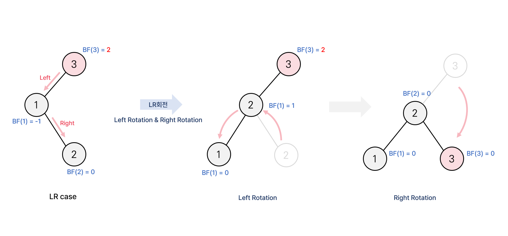
</p>

<br>

## 힙(heap)
**완전 이진 트리 기반**의 자료구조로, **최소힙**과 **최대힙** 두 가지 종류가 있으며 해당 힙에 따라 특정한 특징을 지킨 트리를 말한다. 힙에는 **어떤 값이 들어와도 규칙을 지키게 구성**되어 있다.

- 우선순위 큐 구현에 활용
- 힙 정렬에 활용
- 최솟값 또는 최댓값 빠르게 탐색

<p align="center">
   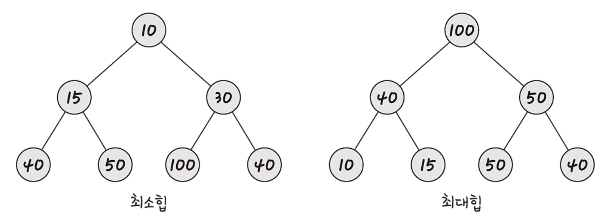
   <br>
   <small>면접을 위한 CS 전공지식 노트</small>
</p>

> 최대값(최소값) 검색: `O(1)` <br>
> 데이터 삽입, 삭제: `O(logN)`

#### 최대힙
**루트 노드**에 있는 키는 모든 자식 노드의 키 중 **가장 커**야 한다. 각 노드의 부모 노드 - 자식 노드 관계에도 이와 같은 특징이 재귀적으로 이루어져 있다.
(형제 간에는 대소관계 중요X) 

#### 최소힙
**루트 노드**에 있는 키는 모든 자식 노드의 키 중 **가장 작아야** 한다. 각 노드의 부모 노드 - 자식 노드 관계에도 이와 같은 특징이 재귀적으로 이루어져 있다. 
(형제 간에는 대소관계 중요X)

<br>

### 데이터 삽입
**[최소힙 기준]**
1. 완전 이진 트리의 특징에 따라 마지막 레벨의 가장 왼쪽에 노드를 추가한다.
2. 추가한 값이 부모 노드보다 작으면 자리를 바꾼다.
3. 2번 과정을 반복한다. 

<p align="center">
   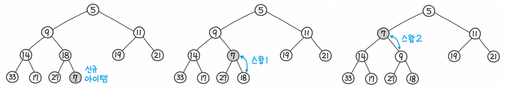
   <br>
   <small><a href="https://product.kyobobook.co.kr/detail/S000001932748">파이썬 알고리즘 인터뷰</a></small>
</p>

<br>

### 데이터 삭제
힙에서는 최댓값 혹은 최솟값이 저장된 **루트 노드만 제거**할 수 있다. 삭제 과정에서 제거된 루트 노드 자리에 다른 노드가 아닌 **마지막 노드를 삽입하는 이유**는 힙이 **완전 이진 트리**를 기반으로 하기 때문이다. 마지막 노드가 아닌 중간 노드를 루트 노드로 가져가면 그 자리가 비게 되어 완전 이진 트리 구조가 깨지게 된다. 즉, 다른 노드들의 이동이 필요하게 된다는 의미로 **마지막 노드가 루트노드로 이동해야 다른 노드들의 이동이 최소화**된다. 

**[최소힙 기준]**
1. 루트 노드 제거
2. 루트 자리에 **가장 마지막 노드** 삽입
3. 올라간 노드와 자식 노드들을 비교해 교환
    - 더 작은 자식이 하나만 있을 때: 해당 자식과 교환
    - 더 작은 자식이 둘일 때: 더 작은 자식과 교환 
    
<p align="center">
   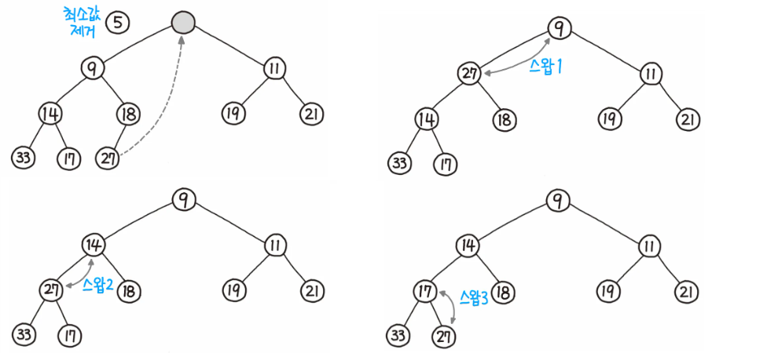
   <br>
   <small><a href="https://product.kyobobook.co.kr/detail/S000001932748">파이썬 알고리즘 인터뷰</a></small>
</p>

<br>

### 힙 트리 표현
힙은 **완전 이진 트리** 구조이기 때문에 배열로 표현하기에 **메모리 낭비 없이** 효율적인 자료구조이다. 루트노드 부터 높이 순서대로 순회하며 배열에 데이터를 저장할 수 있다. 

보통 편리성을 위해 인덱스는 `1`부터 사용하며, 아래와 같은 관계로 인덱스를 이용해 노드의 부모 자식 관계를 표현할 수 있다.

<p align="center">
   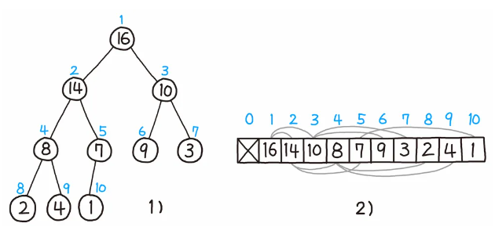
   <br>
   <small><a href="https://product.kyobobook.co.kr/detail/S000001932748">파이썬 알고리즘 인터뷰</a></small>
</p>

> **[특정 인덱스 i에 대해]** <br>
> 부모 노드 : $i/2$ <br>
> 왼쪽 자식 : $2i$ <br>
> 오른쪽 자식 : $2i+1$ 


<details>
<summary><h4>☕ in java</h4></summary>
<div markdown="1">
자바에서 Collection으로 `Heap` 자료구조가 따로 있진 않다.
하지만 `PrimaryQueue` 클래스를 활용해 구현할 수 있다.

```java
package dataStructure;
import java.util.Collections;
import java.util.PriorityQueue;

public class 힙_우선순위큐활용 {
    public static void main(String[] args) {
        // 최소 힙 생성
        PriorityQueue<Integer> minHeap = new PriorityQueue<>();
        // 최대 힙 생성
        PriorityQueue<Integer> maxHeap = new PriorityQueue<>(Collections.reverseOrder());

        // 데이터 삽입 (최소힙)
        minHeap.add(5);
        minHeap.add(2);
        minHeap.add(8);
        minHeap.add(1);
        minHeap.add(10);

        // 데이터 삽입 (최대힙)
        maxHeap.add(5);
        maxHeap.add(2);
        maxHeap.add(8);
        maxHeap.add(1);
        maxHeap.add(10);

        // 최소값 추출 및 출력
        while (!minHeap.isEmpty()) {
            System.out.println("최소값: " + minHeap.poll());
        }

        System.out.println();

        // 최소값 추출 및 출력
        while (!maxHeap.isEmpty()) {
            System.out.println("최대값: " + maxHeap.poll());
        }
    }
}

```
```
최소값: 1
최소값: 2
최소값: 5
최소값: 8
최소값: 10

최대값: 10
최대값: 8
최대값: 5
최대값: 2
최대값: 1
 ```
</div>
</details>
<br>

<br>

