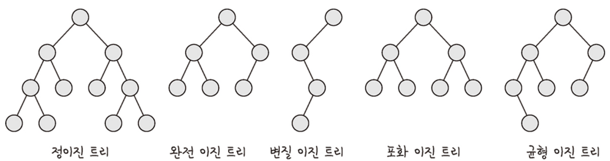
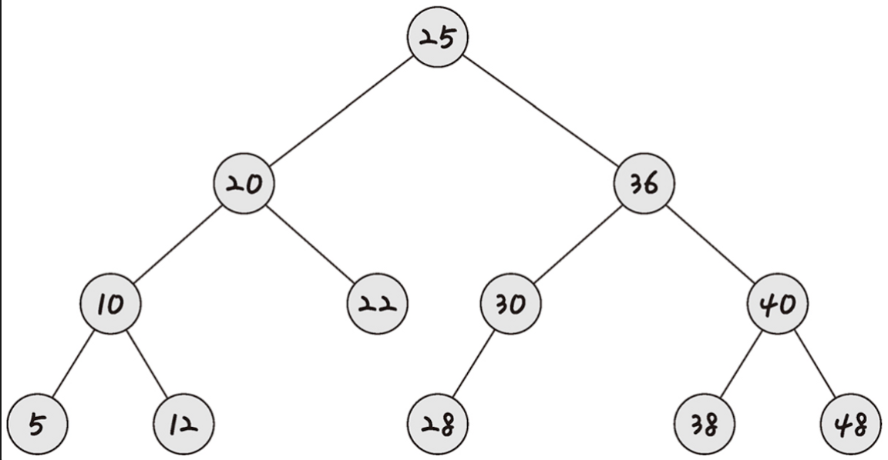
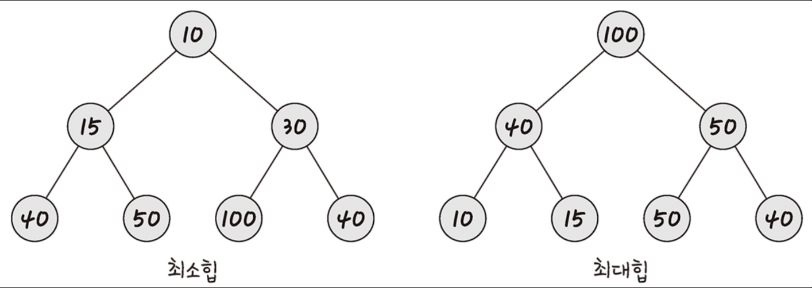
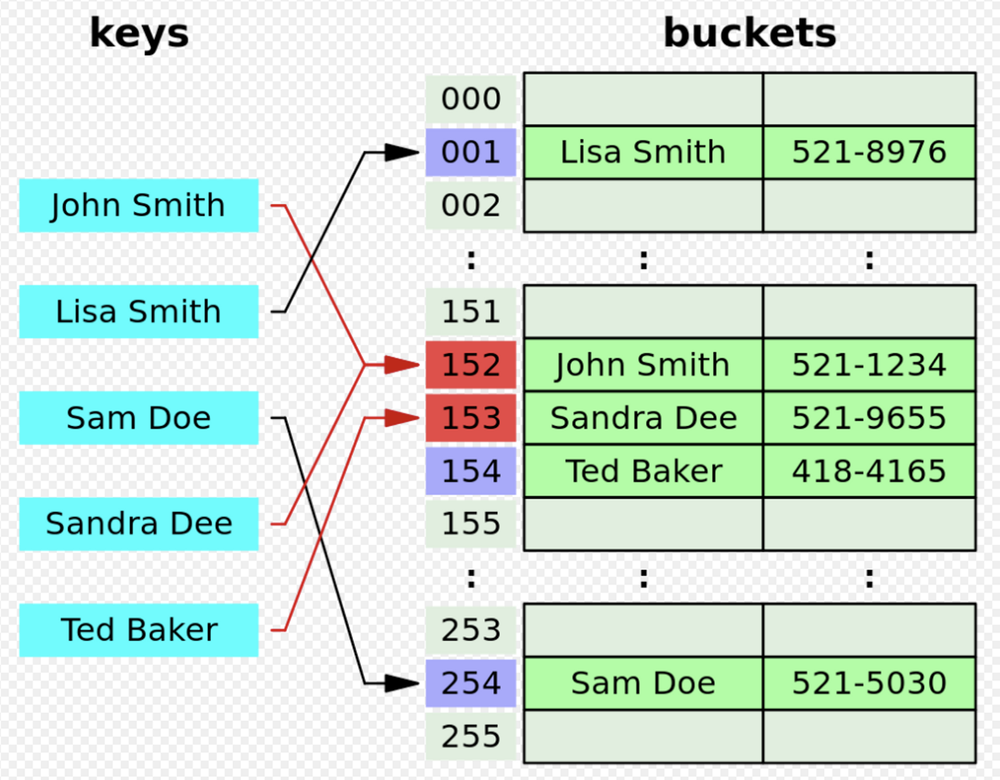
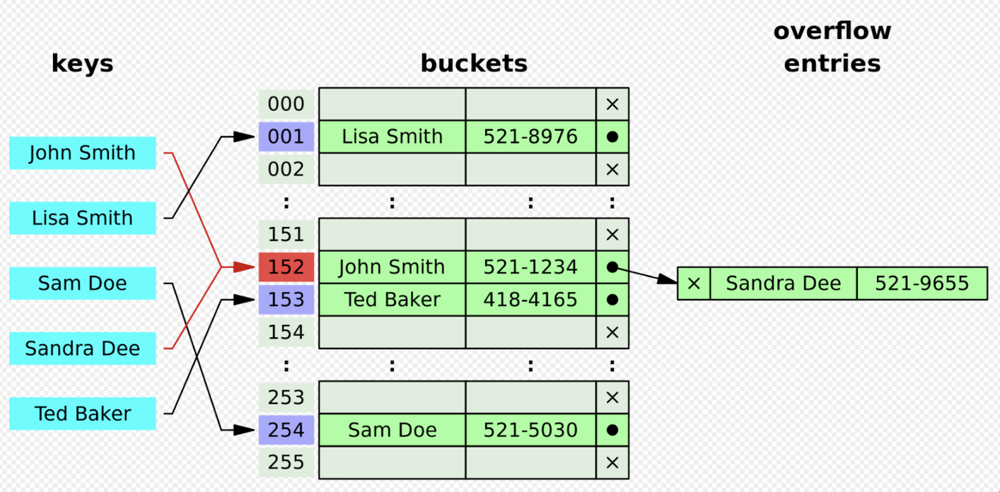

# 비선형 자료구조

일렬로 나열하지 않고 자료 순서나 관계가 복잡한 자료 구조를 말한다. 대표적으로 트리나 그래프가 있다.

  

## 그래프(Graph)

---

그래프는 정점(`Vertex`)과 정점들을 연결하는 간선(`edge`)으로 이루어진 비선형 자료구조를 말한다.

 

### 그래프 관련 용어

- `정점(Vertex):` 데이터가 저장되는 그래프의 기본원소
- `간선(Edge):` 정점간의 관계를 나타낸다.
- `차수(dgree):` 무 방향 그래프에서 하나의 정점에 인접한 정점의 수
- `진입차수(in-dgree):` 외부에서 해당 정점으로 들어오는 간선의 수
- `진출차수(out-dgree):` 정점에서 외부로 나가는 정점의 수
- `경로의 길이(path length):` 경로를 구성하는데 사용된 간선의 수
- `사이클(cycle):` 단순 경로의 시작 정점과 종료 정점이 동일한 경우

 

### 그래프의 특징

- 그래프는 네트워크 모델이다.
- 노드들 사이에 무방향/양방향 경로를 모두 가질 수 있기 때문에 2개 이상의 경로가 가능하다.
- 루트노드라는 개념이 없다.
- 부모-자식 관계라는 개념이 없다.
- 순회는 `DFS`또는 `BFS` 로 이루어진다.
- 그래프는 크게 방향/무방향 그래프가 있다.
- 간선의 유무는 그래프에 따라 다르다.

 

### 그래프의 종류

**[무방향 그래프]**

두 정점을 연결하는 간선에 방향이 없는 그래프이며 양 방향으로 이동이 가능하다.

**[방향 그래프]**

두 정점을 연결하는 간선에 방향이 존재하는 그래프로 간선의 방향으로만 이동이 가능하다.

**[가중치 그래프]**

간선에 비용 또는 가중치가 할당된 그래프로 네트워크라고 불리기도 한다. 가중치는 정점 사이의 이동거리, 이동시간, 이동비용 등을 나타낼 때 사용한다.

**[사이클 그래프]**

단순경로의 시작정점과 종료정점이 동일한 경로가 있는 그래프를 말한다. 여기서 단순경로는 경로중에서 반복 정점이 없는 경로를 말한다.

**[완전 그래프]**

그래프에 속해있는 모든 정점이 연결되어 있는 그래프를 말한다. 무방향 완전 그래프 정점의 수가 `n` 일 경우 간선의 수는 `n * (n-1) / 2` 가 된다.

 

### 그래프의 구현방법

그래프는 `인접행렬` 또는 `인접리스트` 사용해 구현할 수 있다.

 

### 인접행렬을 사용한 그래프 구현

인접행렬은 그래프의 정점과 간선의 관계를 2차원 배열을 사용해 구현하는 방법이다.

**[인접행렬을 사용한 그래프 구현의 장점]**

- 2차원 배열에 모든 정점과 간선의 정보가 담겨 있어 두 정점에 대한 연결을 조회할 때 간선의 존재여부(`graph[i][j]`)를 `O(1)`의 시간복잡도내에 확인할 수 있다.
- 정점의 차수는 `O(n)` 시간복잡도내에 확인할 수 있다.

**[인접행렬을 사용한 그래프 구현의 단점]**

- 어떤 노드에 인접한 노드들을 찾기 위해서는 모든 노드들을 순회해야 한다.
- 모든 정점에 대해 간선 정보를 입력해야 하기 때문에 인접행렬 생성시 `O(n²)` 의 시간복잡도가 소요된다.
- 항상 2차원 배열을 필요로 하는데 실제 사용하는 것 이상의 필요 이상의 공간이 낭비될 수 있다.

 

### 인접리스트를 사용한 그래프 구현

인접리스트는 그래프의 노드를 리스트로 표현하는 방식으로 각 정점에 인접한 정점을 리스트에 저장하여 정점들의 관계를 설정한다.

**[인접리스트를 사용한 그래프 구현의 장점]**

- 정점의 인접 노드를 탐색하는데 `O(n)` 시간복잡도가 소요된다. (`n`은 연결된 노드의 개수)
- 필요한만큼 공간을 공간을 사용하기 때문에 인접행렬로 구현하는 방식에 비해 공간의 낭비가 적다.

**[인접리스트를 사용한 그래프 구현의 단점]**

- 간선의 존재를 파악하기 위해 모든 정점의 리스트에 있는 모든 노드의 수를 확인해야 하므로 정점의 연결여부를 파악하는데 많은 시간이 소요된다.(정점 차수만큼 시간소요)

 

### 그래프의 탐색방법

[깊이우선탐색(DFS)]

넓게 탐색하기 전에 깊게 탐색하는 탐색 방법으로 시작정점에서 시작해서 갈 수 있는 최대한 깊이 탐색하며 더 이상 깊이 갈 곳이 없다면 이전 정점으로 돌아가 탐색을 이어가는 방식으로 그래프를 순회하는 방법이다. 주로 재귀 호출과 스택을 사용하여 구현한다. 주로 `모든 노드를 방문`하고자 하는 경우에 사용한다.

[너비우선탐색(BFS)]

깊게 탐색하기 전에 넓게 탐색하는 방법으로 시작 정점을 방문한 후, 시작 정점에 인접한 모든 정점을 방문한다. 인접한 정점을 방문한 뒤, 다시 해당 정점의 인접한 정점을 방문하며 그래프를 순회한다. 주로 큐와 반복문을 사용해 구현한다. 주로 `최단경로 혹은 임의의 경로`를 찾고 싶을 때 사용한다.

  

## 트리(Tree)

---

그래프 중 하나로 정점과 간선으로 이루어져 있으며 트리처럼 계층적인 데이터 집합의 비선형 자료구조를 말한다.

 

### 트리 관련 용어

- `노드(Node):` 데이터가 저장되는 트리의 기본원소
  - `루트노드(Root Node):` 가장 상위에 존재하는 부모가 없는 노드를 의미한다.
  - `단말노드(Leaf Node):` 자식이 없는 가장 하위에 있는 노드를 말한다.
  - `내부노드(Internal Node):` 루트노드와 단말노드 사이에 위치한 노드를 말한다.
- `노드의 레벨:` 루트노드를 기준으로 한 노드의 깊이
- `노드의 차수:` 한 노드의 자식노드의 개수
- `트리의 차수:` 트리에서 자식노드를 제일 많이 갖는 노드의 차수
- `트리의 높이:` 루트노드에서 가장 깊숙히 있는 노드의 깊이

 

### 트리의 특징

- 트리는 그래프의 한 종류이다.
- 트리는 계층모델이다.
- 트리는 방향성 있는 비순환 그래프(DAG, Directed Acylic Graphs)의 한 종류이다.
  - 사이클이 존재하지 않는다.
- 노드가 `N` 개인 트리는 항상 `N-1` 개의 간선을 갖는다.
- 한 개의 루트노드만 존재하며 모든 자식노드는 한 개의 부모 노드를 갖는다.

 

### 트리의 종류

- 이진트리
- 이진탐색트리
- 균형트리(AVL 트리, red-black 트리)
- 힙(최대힙, 최소힙)

  

## 이진트리(Binary Tree)

---

모든 노드가 2개 이하의 자식 노드를 갖는 트리를 말한다.

 

### 이진트리의 분류

- `전 이진트리(full bianry tree):` 모든 노드들의 자식노드가 `0` 또는 `2` 개인 이진트리를 의미한다.
- `완전 이진트리(full bianry tree):` 왼쪽에서부터 채워져 있는 이진 트리를 의미한다. 마지막 리프 노드를 제외하고는 모든 레벨에서 노드들이 완전히 채워져 있으며 마지막 레벨의 경우 왼쪽부터 데이터가 채워져 있어야 한다.
- `편향 이진 트리(degenerate binary tree):` 왼쪽 또는 오른쪽 서브트리만 가지는 트리로 최악의 경우에는 모든 노드를 탐색해야 하기 때문에 시간복잡도는 `O(n)` 이다.
- `포화 이진 트리(perfect binary tree):` 모든 자식노드가 가득 차 있는 이진트리를 의미한다.
- `균형 이진 트리(balanced binary tree):` 리프노드에 대해 가능한 최대의 높이 차이가 1 이하인 이진트리를 의미한다.

 

### 이진트리의 순회

트리의 순회란 트리의 각 노드를 체계적인 방법으로 탐색하는 과정을 말한다. 모든 노드를 방문해야 하며 중복방문은 불가능하다. 노드를 방문하는 순서에 따라 `전위순회`, `중위순회`, `후위순회` 로 구분된다.

- `전위순회`
  `루트노드 -> 왼쪽 서브트리 -> 오른쪽 서브트리`
- `중위순회`
  `왼쪽 서브트리 -> 루트노드 -> 오른쪽 서브트리`
- `후위순회`
  `왼쪽 서브트리 -> 오른쪽 서브트리 -> 루트노드`

  

## 이진탐색트리(BST)

---

오른쪽 서브 트리에는 부모 노드 값보다 큰 값이 들어있고 왼쪽 서브 트리에는 부모 노드 값보다 작은 값이 들어있는 트리를 말한다. 이진 탐색 트리는 이 규칙을 통해 기존에 배열이나 리스트로 구현한 방식보다 데이터를 빠르게 찾을 수 있다. 일반적인 이진 탐색 트리는 데이터를 `O(logn)` 의 시간복잡도로 찾을 수 있다. 하지만 삽입 순서에 따라 발생할 수 있는 편향 이진 트리의 경우 `O(n)` 의 시간복잡도를 가질 수 있다. 이 문제를 해결하기 위해 트리의 균형을 맞춰주는 `AVL트리`와 `레드-블랙 트리` 가 존재한다.

 

### 이진탐색트리 특징

- 탐색 작업을 효율적으로 하기 위한 트리 형태의 자료구조
- 모든 원소는 서로 다른 유일한 키를 갖는다.
- `왼쪽 서브트리 < 루트노드 < 오른쪽 서브트리` 규칙을 갖는다.
- 이진 탐색 트리의 최대값은 트리의 가장 오른쪽에 존재
- 이진 탐색 트리의 최소값은 트리의 가장 왼쪽에 존재

 

### 이진탐색 트리의 장단점

**[장점]**

- 검색/삽입/삭제가 (일반적인 경우) 빠르다.
- 삽입/삭제가 유연하다.
- 중위 순회시 오름차순의 정렬된 값을 얻을 수 있다.

**[단점]**

- 트리가 구조적으로 편향되어 있다면 삽입/삭제/검색 등 동작들의 수행 시간이 악화된다.
- 이 문제를 해결하기 위해 AVL트리, Red-Black트리가 사용된다.

 

### 이진탐색트리 시간복잡도

- 탐색/삽입/삭제의 경우
  - 일반적인 비선형적인 경우 : `O(logn)`
  - 최악의 선형적인 경우 : `O(n)`

 

## 힙(Heap)

---

완전 이진 트리의 한 종류로 여러 값들 중에서 최대값이나 최소값을 빠르게 찾아낼 수 있도록 만들어진 자료구조이다. `Heap`의 각 노드는 `key` 라는 값으로 구성되며 부모노드와 자식노드와의 관계는 다음 관계가 성립한다.

- `A` 가 부모노드, `B` 가 자식노드일 경우 `A` 의 키 값과 `B`의 키 값에는 대소관계가 주어진다.

`Heap`은 자식 노드에 따라 여러가지 종류로 구분되지만 대부분 자식 노드 2개를 갖는 `이진 힙` 을 사용하며 `우선순위 큐(Priority Queue)` 의 구현체로 이용되거나 `힙 정렬(Heap Sort)` 에 이용된다. `우선순위 큐(Priority Queue)` 가 사용되는 알고리즘으로는 최단경로를 찾는 `다익스트라(Dijkstra)` 알고리즘이 존재한다.

대소관계에는 크거나 작은 경우가 있으므로 `최대 힙`과 `최소 힙` 으로 나누어진다. 각각 키값을 기준으로 가장 위쪽에 있는 루트노드가 `최대 값`또는 `최소 값` 인 `Heap` 을 말한다. 단, 여기서 키 값은 단순히 숫자외에도 아니라 정의에 따라 복합적인 값이 될 수도 있다.

 

### 힙의 종류

- `최대 힙:` 부모 노드의 키 값이 자식 노드의 키 값보다 크거나 같은 완전 이진 트리
- `최소 힙:` 부모 노드의 키 값이 자식 노드의 키 값보다 작거나 같은 완전 이진 트리

 

### 힙의 특징

- 중복된 값을 허용한다. (이진탐색트리에서는 중복 값을 허용하지 않는다.)
- 완전 이진트리의 일종으로 트리의 높이를 `h` 라고 할 때 모든 리프 노드들은 `h` 또는 `h-1` 레벨에 있어야 한다.

 

### 힙의 시간복잡도

삽입과 삭제 모두 힙의 높이만큼 즉, 완전 이진 트리의 높이만큼 연산하는 경우가 최악의 경우이다.

- 데이터를 탐색/삽입/삭제 하는 경우 : `O(logn)`

 

> **우선순위 큐 (Priority Queue)**
> 우선순위가 높은 데이터가 우선순위가 낮은 데이터보다 먼저 제공되는 형태의 자료구조로 `Heap`을 기반으로 구현되어 있다.

  

## 해시 테이블(Hash Table)

---

배열과 해시함수를 사용해 `map` 을 구현한 자료구조이다. 해시 함수를 통해 `Hash값` 을 구해서 인덱스로 사용하여 `key` 와 `data` 를 저장하는 자료구조를 말한다. 버킷에 있는 `Hash` 값을 인덱스로 접근하기 때문에 특정 데이터의 탐색 시간 복잡도는 `O(1)` 로 탐색시 효율적이다. 하지만 해시 테이블은 해시 함수를 구하는 과정에서 중복이 발생할 수 있는데, 이를 `해시충돌(Hash Collision)` 이라고 한다.

 

### 해시테이블 시간복잡도

- 배열의 특정 위치의 데이터를 탐색하는 (일반적인) 경우 : `O(1)`
- 데이터를 삽입/삭제 하는 (일반적인) 경우 : `O(1)`

 

### 해시충돌과 적재율

해시 충돌이 발생하는 경우는 아래와 같은 두가지 경우에 발생한다.

- `key` 는 다른데 `hash` 가 같을 때.
- `key` 도 `hash` 도 다른데 `적재율` 의 결과가 같을 때.

해시 충돌을 알기 위해서는 `적재율` 에 대해 먼저 알아야 한다. `적재율`이란 해시 테이블의 크기 대비, 키의 개수를 말한다. 키의 개수를 `K` , 해시 테이블의 크기를 `N` 이라고 했을 때 `적재율`은 `K/N` 이다. 일반적인 `Direct Address Table` 은 키 값을 인덱스로 사용하는 구조이기 때문에 `적재율`이 `1` 이하이며 `적재율`이 `1` 초과시 해시 테이블의 경우 반드시 충돌이 발생하게 된다.

만약, 충돌이 발생하지 않는다고 할 경우 해시 테이블의 탐색, 삽입, 삭제 연산은 모두 `O(1)` 에 수행되지만 충돌이 발생할 경우 탐색과 삭제 연산이 최악에 `O(K)` 만큼 걸리게 된다. 이는 같은 인덱스에 모든 키 값과 데이터가 저장된 경우로 충돌이 전부 발생한 경우를 말한다. 따라서 충돌을 최대한으로 줄여서 연산 속도를 빠르게 하는것이 해시 테이블의 핵심인데 이에 중요하게 작용하는 것이 해시 함수를 구현하는 해시 알고리즘이다. 이 알고리즘이 얼마나 견고한지에 따라 충돌의 정도가 달라질 수 있다.

결론적으로 해시 테이블의 중점사항은 충돌을 완화하는 것이며 방법으로는 크게 2가지가 있다.

- `개방 주소법 (open-addressing)`
- `체이닝(chaining)`

 

### **개방 주소법(Open- addressing) - 선형탐사 방법(Linear Probing)**

개방 주소법중 선형탐사 방법은 가장 기본적인 해시충돌해결기법이다. 원래라면 해시함수로 얻은 해시값에 따라서 데이터와 키값을 저장하지만 동일한 주소에 다른 데이터가 있을 경우 다른 주소도 이용할 수 있게 하는 기법이다.

위에서 살펴본 `152` 에 중복 저장하려는 충돌에 대해서 그 다음으로 비어있는 주소인 `153`에 저장하는 것을 볼 수 있다. 이러한 원리로 탐색, 삽입, 삭제가 이루어지는데 다음과 같이 동작한다.

- `삽입:` 계산한 해시 값에 대한 인덱스가 이미 존재하는 경우 다음 인덱스로 이동하면서 비어있는 곳에 저장한다. 이렇게 비어있는 자리를 탐색하는 것을 `탐사(probing)`라고 한다.
- `탐색:` 계산한 해시 값에 대한 인덱스부터 검사하며 탐사를 해나아가는데 이 때 `"삭제"` 표시가 있는 부분은 지나간다.
- `삭제:` 탐색을 통해 해당 값을 찾고 삭제한 뒤 `"삭제"` 표시를 한다.

 

### **체이닝(Opening)**

체이닝 기법은 충돌이 발생했을 때 이를 동일한 버킷에 저장하는데 이를 연결리스트 형태로 저장하는 방법을 말한다. 아래 그림을 보면 `John Smith` 와 `Sandra Dee` 의 인덱스가 `152` 로 충돌하게 된 경우인데 이 때 `Sandra Dee` 를 `John Smith` 의 뒤에 연결함으로써 충돌을 처리하는 것을 볼 수 있다.

체이닝을 통해 해시 테이블을 구현할 경우 데이터 삽입의 경우 연결리스트에 추가하면 되기 때문에 상수 시간인 `O(1)` 의 시간복잡도가 소요된다. 하지만 탐색과 삭제의 경우 최악일 때 키 값의 개수가 `K` 개 라고하면 `O(K)` 가 걸리게 된다.

 

> 자바의 경우 해당 방식을 해시충돌 해결방법으로 사용하고 있다.

 

### 해시함수(Hash Function)

임의의 크기를 가지는 type의 데이터를 고정된 크기를 가지는 type의 데이터로 변환하는 함수이다. 해시 테이블에서는 임의의 데이터를 정수로 변환하는 함수로서 역할을 한다.

 

**[해시 테이블에서 해시함수의 역할 예시]**

`"인터스텔라" -> 해시함수 -> 430`

이때, 해시함수를 거쳐 정수값으로 변환된 `430` 값을 `Hash값` 이라고 한다.

 

### 해시 테이블 동적 크기 조정(Dynamic Resizing)

삽입이 반복되면 해시 테이블의 항목 수가 늘어나 결과적으로 부하율이 증가한다. 따라서 삽입에 실패하거나 해시성능이 급격하게 적어지는 현상이 발생할 수 있다. 따라서 해시 테이블의 크기가 동적으로 조정되고 테이블의 항목이 새 해시 테이블의 버킷으로 다시 해시된다.

> 자바의 경우 전체 크기의 75%이상 데이터가 찰 경우 전체 크기를 2배로 늘려준다.

 

### [Reference]

[[DS] 해쉬 테이블(Hash Table)이란? - 배하람의 블로그](https://baeharam.netlify.app/posts/data%20structure/hash-table)

[맵(map)과 해시 테이블(hash table) 핵심만 모아보기! 맵과 해시 테이블(a.k.a 해시 맵)을 20분간 아주아주아주 알차게 설명합니다!!](https://www.youtube.com/watch?v=ZBu_slSH5Sk)

[Hash table](https://en.wikipedia.org/wiki/Hash_table#Separate_chaining)
