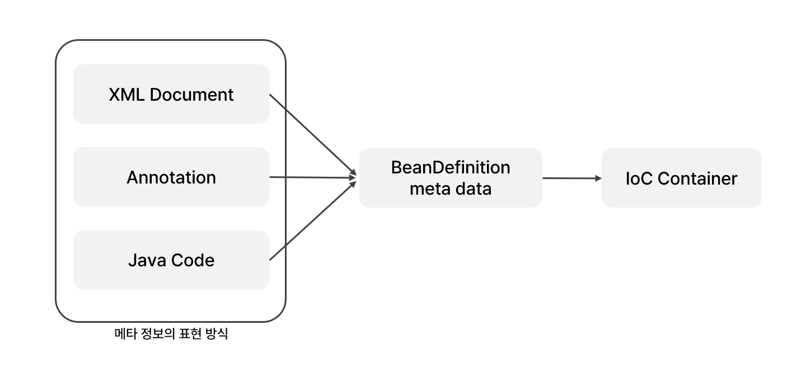
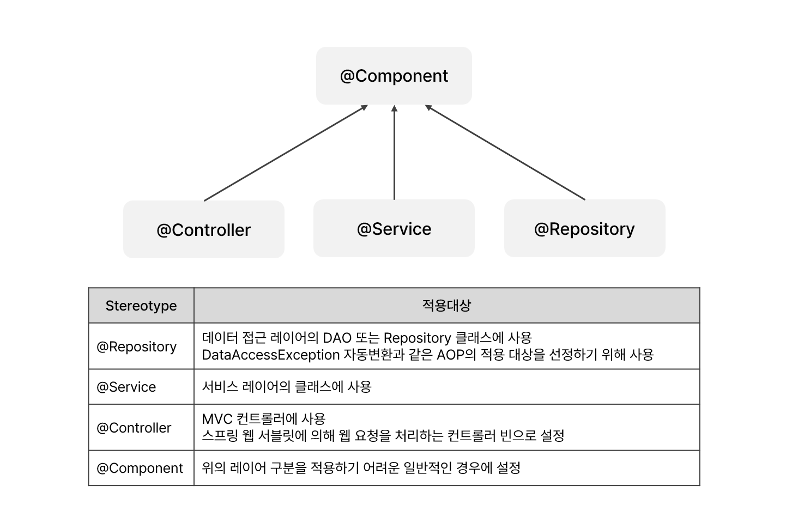
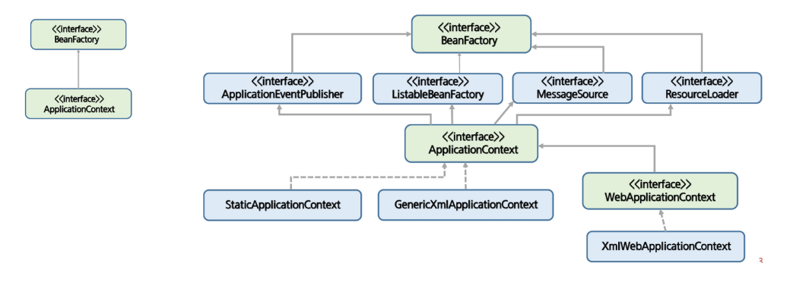
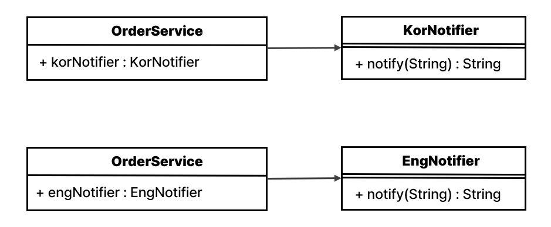
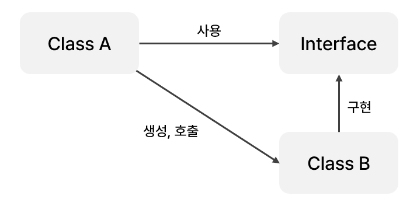
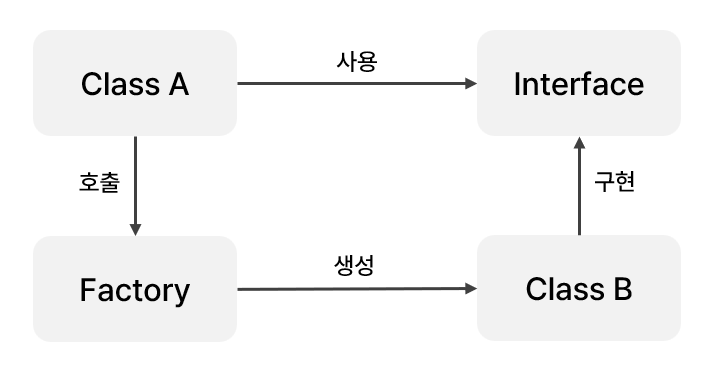
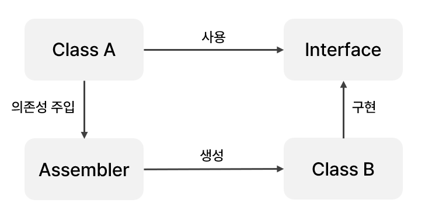

# IoC와 DI
<details>
<summary><h3>📑목차</h3></summary>
<div markdown="1">

- [Spring Framework](#spring-framework)


</div>
</details>
<br>


<p align="center">
    
</p>

## IoC (Inversion of Control: 제어의 역전)
어플리케이션 개발에서 **객체의 생명주기와 의존성 관리**를 개발자가 아닌 **스프링에게 위임**하는 개념이다. 이전에는 개발자가 직접 객체를 생성하고 관리했지만, Spring에서는 **`IoC 컨테이너`(`스프링 컨테이너`)가 객체를 생성하고 필요한 의존성을 주입**해준다. 유연하게 확장 가능한 객체를 만들어 두고 객체 간의 의존관계는 외부에서 동적으로 설정해주는 것이다. 이로 인해 코드의 **결합도가 낮아**지며(loose coupling) **유지 보수가 용이**해진다. 

**IoC**의 구체적인 구현 방법으로 `DL`(Dependency Lookup)과 `DI`(Dependency Injection)가 존재하며 `DI`가 주로 사용된다. 

<br>

### 스프링 빈 (Spring Bean)
IoC를 위해 **스프링 컨테이너(IoC 컨테이너)가 관리하는 자바 객체**를 빈(Bean)이라고 한다. 기존에 자바에서 사용하던 객체들은 Class를 생성하고 개발자가 `new` 키워드를 사용해 원하는 객체를 직접 생성 및 사용했다. 하지만 스프링에선 IoC를 통해 컨테이너가 객체를 생성하고 관리하는데, 여기서 스프링에 의해 생성되고 관리되는 자바 객체를 Bean이라고 한다. 

스프링 빈은 기본적으로 **싱글톤으로 생성**된다. 따라서 컨테이너가 **제공하는 모든 빈의 인스턴스는 항상 동일**하다. 

### 스프링 빈 설정 방식

<p align="center">
    
</p>

#### [XML 문서로 빈 설정]
XML 문서 형태로 빈의 설정 메타 정보를 기술하는 방식이다. `<bean>` 태그를 통해 세밀한 제어 및 설정이 가능하다. 

``` xml
<!-- applicationContext.xml -->
<?xml version="1.0" encoding="UTF-8"?>
<beans xmlns="http://www.springframework.org/schema/beans"...>
	...
	<!--관리할 bean-->
	<bean id="memberDao" class="com.test.MemberDaoImpl"></bean>  

	<bean id="memberService" class="com.test.MemberServiceImpl" scope="prototype">
        <property name="memberDao" ref="memberDao"/>
    </bean>
	<!-- 기본적으로 싱글톤, scope="prototype" 하면 싱글톤 x --> 
	...
</beans>
```
<br>

#### [Annotation 통해 빈 설정]
빈으로 사용될 클래스에 annotation을 부여해 자동으로 빈을 등록할 수 있다. `@Component`와 같은 **스테레오타입** 어노테이션을 사용할 클래스에 부여하면 **오브젝트 빈 스캐너**가 필요한 **빈을 스캔**하고 **자동 등록**한다. 빈 스캐너는 해당 클래스 이름의 **첫 글자를 소문자로 바꾸어 빈의 아이디로** 사용한다. annotation으로 빈을 설정할 경우 `componenet-scan`을 설정해줘야 한다.

``` xml
<!-- applicationContext.xml -->
<?xml version="1.0" encoding="UTF-8"?>
<beans xmlns="http://www.springframework.org/schema/beans"...>
    <!-- 어노테이션을 통해 빈 설정하기 위해 추가-->
    <context:component-scan base-package="com.test.*"/>
</beans>
```

> **💡스테레오타입 어노테이션(Stereotype Annotation)** <br>
> 빈 자동 등록에 사용할 수 있는 어노테이션으로 스프링은 자동으로 스테레오타입의 클래스들을 스캔하고 빈으로 등록한다. `@Component` 어노테이션은 해당 클래스를 자동으로 빈으로 등록되며 `@Repository`, `@Service`, `@Controller`의 최상위 어노테이션이다.
><p align="center">
>    
></p>


<br>


<br>

### 스프링 컨테이너 (IoC 컨테이너, DI 컨테이너)
스프링에서 객체 생성, 사용, 소멸에 해당하는 객체의 라이프사이클을 담당하는 기관이다. 라이프사이클 관리를 기본으로 어플리케이션 사용에 필요한 주요 기능을 담당한다. 서비스 객체를 사용하기 위해 팩토리 패턴, 싱글톤 패턴을 직접 구현하지 않아도 된다.

Spring에선 스프링 컨테이너로 ApplicationConext를 사용한다. ApplicationContext는 빈 팩토리(BeanFactory)를 상속받아 확장한 인터페이스이다. 

<p align="center">
    
</p>

#### `BeanFactory`
- Bean의 **등록, 생성, 조회, 반환** 관리
- `getBean( )` 메서드 정의 (생성된 객체 가져다 사용 가능)
- Bean들의 **생명주기를 관리**한다는 의미로 빈 팩토리라고 부름
- `BeanFactory`에 여러 기능을 추가한 것이 `ApplicationContext`

#### `ApplicationContext`
- BeanFactory의 기능 모두 제공
- Spring의 각종 **부가 서비스 추가 제공**
- Spring이 제공하는 `ApplicationContext` 구현체는 여러 종류 있음
- *`Context`: 메모리에 올라간 메모리 영역을 Context라고 함

<br>

## 결합도
스프링이 **객체의 의존성**을 주입해준다고 했는데, 의존성이란 객체 A가 객체 B와 의존 관계를 맺고 있는 성질을 말한다. 즉, **A가 B 타입의 클래스에 있는 멤버 변수 및 메서드를 사용하는 경우**이다. 

<p align="center">
    
</p>

이 때 B 클래스 내부의 기능이 변경되면 이를 참조하고 있는 A에게도 영향을 미친다. 따라서 **의존 관계가 강하면 결합도가 높아져** 특정 기능이 수정되었을 때 이에 의존하는 **모든 클래스를 변경해야 하는 유지 보수의 어려움이 발생**한다. 따라서 **느슨한 결합도**(Loose Coupling)를 가지도록 프로그램을 설계해야 한다.

<br>

<p align="center">
    
    <br>
    <small>강한 결합도</small>
</p>

```java
public class OrderService {
	public static void main(String[] args) {
		// 구현체 직접 생성
		KorNotifier kor = new KorNotifier();
        String notice = kor.notify("공지사항 입니다.");

        // 영어 공지로 바꾸고 싶다면 수정 필요
		// EngNotifier eng = new EngNotifier();
		// String notice = eng.notify("This is a notice.");
		
		System.out.println(greet);
	}
}
```

위의 그림과 같이 `OrderService`에서 알림 기능을 사용하는 경우를 살펴보자. `OrderService`에서 직접 `new`키워드를 사용해 `KorNotifier`를 생성하고 호출하면 강한 결합도가 발생한다. 만약 한국어 알림 서비스가 아닌 영어 알림 서비스로 전환하고 싶다면, `OrderService` 객체 내에서 코드를 수정해 `EngNotifier`로 변경해야 한다.

<br>

### 느슨한 결합도
객체간 강한 결합도를 느슨하게 만드는 다양한 방법들을 살펴보고 최종적으로 **`Spring`이 어떻게 결합도를 느슨하게 하는 지**에 대해 알아보자.


### 1️⃣ 다형성 이용
<p align="center">
    
    <br>
    <small>인터페이스 사용</small>
</p>

``` java
public class OrderService {
	public static void main(String[] args) {
		// 인터페이스 참조
		Notifier notifier = new KorNotifier();
		
        // 구현체 변경 시 수정 필요
        // Notifier notifier = new EngNotifier();

		String notice = notifier.notify("공지사항 입니다.");
		
		System.out.println(notice);
	}
}
```

A객체에서 B객체를 직접 생성 및 호출하는 것이 아니라, **인터페이스를 호출**하여 **간접적으로 B객체를 사용**하는 방법이다. 구현 클래스 교체가 용이하기 때문에 다양한 형태로 변경할 수 있다. 인터페이스대로 클래스를 구현하기 때문에 **강제성**이 생기고 **결합도는 낮아진다.**

하지만 여전히 실행 클래스에서 구현 클래스를 생성하기 때문에 구현 클래스 교체 시 클래스 수정이 필요하다.

<br>

### 2️⃣ 팩토리 패턴 사용
<p align="center">
    
    <br>
    <small>팩토리 호출 방식</small>
</p>

``` java
// 팩토리 메서드
public class NotifierFactory {
	public static Notifier getNotify(String language) {
		if(language.equals("Kor")) {
			return new KorNotifier();
		}else {
			return new EngNotifier();
		}
	}
}
```

``` java
// 변경해야 할 코드 없음
public class OrderService {
	public static void main(String[] args) {
		// 팩토리 메서드 사용
		Notifier notifier = NotifierFactory.getNotify("Kor");

		String notice = notifier.notify("공지사항 입니다.");
		
		System.out.println(notice);
	}
}
```

**팩토리 패턴**을 적용한 방식으로 **구현 클래스를 생성하고 반환해주는 팩토리 메서드**를 실행 클래스에서 호출한다. 구현체의 생성을 팩토리 메서드가 대신하기 때문에, 인터페이스의 **구현체 변경 시 팩토리 메서드만 수정**하면 된다. 즉, 실행 클래스에 영향을 미치지 않는다.

하지만 실행 클래스에서 팩토리 메서드를 호출하는 코드가 존재하는 것 자체가 **팩토리에 의존함을 의미**한다. (팩토리 메서드 수정 후 다시 컴파일 필요)

<br>

### 3️⃣ Assembler 이용 (=Spring)
<p align="center">
    
    <br>
    <small>Assembler(Spring) 이용 방식</small>
</p>

``` xml
<!-- applicationContext.xml -->
<?xml version="1.0" encoding="UTF-8"?>
<beans xmlns="http://www.springframework.org/schema/beans"...>
	...
	<!--관리할 bean-->
	<!-- KorNotifier kor = new KorNotifier(); 이랑 같은 역할 -->
	<bean id="kor" class="com.test.KorNotifier"></bean>  
	<bean id="eng" class="com.test.EngNotifier"></bean>
	<!-- 기본적으로 싱글톤, scope="prototype" 하면 싱글톤 x --> 
	...
</beans>
```

``` java
public class OrderService {
    public static void main(String[] args) {

		// Bean 등록한 XML 읽어오는 객체 
		ApplicationContext context = new ClassPathXmlApplicationContext("com/test/applicationContext.xml");

		// getBean( ) 반환값: Object -> 형변환 필요
        // 같은 객체 두 번 읽어와보자.
		Notifier notifier1 = (Notifier) context.getBean("eng");
		Notifier notifier2 = (Notifier) context.getBean("eng");

		String notice = notifier2.notify("this is a notice.");
		
		System.out.println(notice);

        // 싱글톤 패턴으로 인해 같은 주소 출력
		System.out.println(notifier1+" "+notifier2);  
	}
}
```

팩토리 패턴의 장점에 더해 **어떤 것에도 의존하지 않는 형태**이다. 여기서 어셈블러는 **스프링 컨테이너**를 말하며 IoC 호출 방식으로 객체 간의 의존 관계를 맺은 것이다. **런타임 시점에 클래스 간의 관계가 형성**되며, 기본적으로 객체 생성 시 스프링은 **싱글톤 패턴을 적용**한다.

[과정]
1. `XML`에 관리할 객체 Bean으로 등록
2. BeanFactory를 상속한 `ApplicationContext` 객체 생성 시 `XML` 읽어옴
3. `getBean()` 메서드 통해 객체 가져오기 (return type: `Object`)
4. 만약 Bean이 변경 되거나 추가된다면 XML만 수정!
    - 다시 컴파일 필요 X

<br>
<br>

## IoC 종류

### DL(Dependency Lookup: 의존성 검색)
스프링 Bean에 접근하기 위해 컨테이너가 제공하는 API를 이용하여 **객체을 Lookup(검색)**하는 방식이다. 설정파일에서 의존성에 사용할 인스턴스를 가져오는 DI와 달리 DL은 **자원을 관리하는 컨텍스트에서 의존성을 조회하여 개발자가 필요한 시점에 가져온다.**

DL을 사용하면 **객체가 직접 의존 객체를 검색하므로 객체 간 결합도가 높아진다.** 따라서 객체 간의 결합도를 낮추고 유지보수성과 테스트 용이성을 더욱 향상시키는 DI를 선호하고 권장한다.


<br>

### DI(Dependency Injection: 의존성 주입)
IoC의 구체적인 구현 방법 중 하나로, 객체가 필요로 하는 의존성을 직접 생성하는 대신 **외부(스프링 컨테이너)에서 주입받는 것**을 의미한다. 의존성은 **런타임 시점**에 결정되며, 객체가 컨테이너의 존재 여부를 알 필요가 없다. `Setter Injection`, `Constructor Injection`, `Method Injection` 방식으로 구현할 수 있으며 Spring은 생성자 주입(Constructor Injection)방식을 권장한다.

<br>

### 어노테이션을 이용한 DI
<p align="center">
    
</p>

#### `@Autowired`
어노테이션을 이용해 의존성을 주입할 때, 가장 많이 사용되는 어노테이션이다. 주입하려고 하는 **객체의 타입이 일치하는지**를 찾고 객체를 자동으로 주입한다. 동일한 타입의 빈이 여러 개일 경우 `@Qualifier(빈이름)`으로 식별한다.

<br>

#### 👉Constructor Injection (생성자를 이용한 ID)
**생성자를 통해** 객체 또는 값을 주입받는 방식이다.

``` java
@Component
public class MemberServiceImpl implements MemberService {
    
    MemberDao memberDao;
    AdminDao adminDao;

    @Autowired //생성자가 여러 개일 경우에는 하나만 사용 가능
    public MemberServiceImpl(@Qualifier("mdao") MemberDao memberDao,
                             @Qualifier("adao") AdminDao adminDao){
        super();
        this.memberDao = memberDao;
        this.adminDao = adminDao;
    }

    ...
}
```

<br>

#### 👉Setter Injection (setter 메서드를 이용한 DI)
XML 설정 파일을 이용해 Setter Injection을 하는 경우에는 직접 setter 메서드를 생성해야 하지만, **어노테이션을 이용**해서 Setter Injection을 하는 경우엔 **setter 메서드를 만들지 않고 멤버 변수에 직접 어노테이션을 정의**한다. 

``` java
@Component
public class MemberServiceImpl implements MemberService {
    
    @Autowired
    MemberDao memberDao;

    @Autowired
    @Qualifier("adao")  //동일 타입 여러 개일 경우
    AdminDao adminDao;

    public MemberServieImpl(){}

    ...
}
```

<br>

#### 👉Method Injection (일반 메서드 이용한 DI)
**일반 메서드를 통해** 객체 또는 값을 주입받는 방식이다.

``` java
@Component
public class MemberServiceImpl implements MemberService {
    
    MemberDao memberDao;
    AdminDao adminDao;

    public MemberServieImpl(){}

    @Autowired 
    public initService(@Qualifier("mdao") MemberDao memberDao,
                       @Qualifier("adao") AdminDao adminDao){
        super();
        this.memberDao = memberDao;
        this.adminDao = adminDao;
    }

    ...
}
```