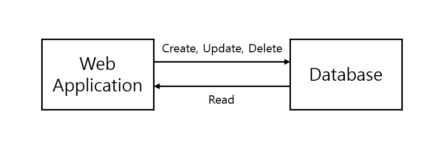
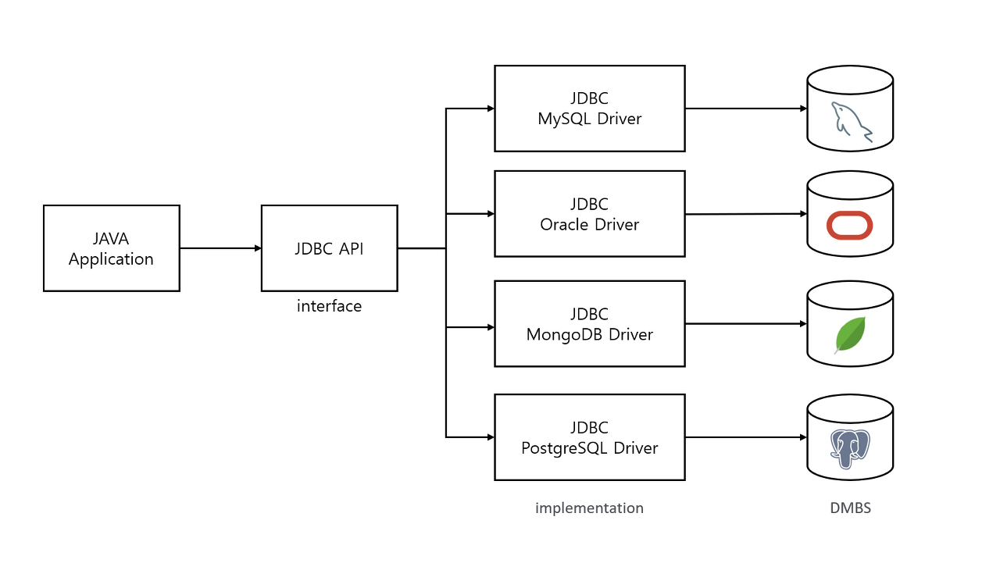
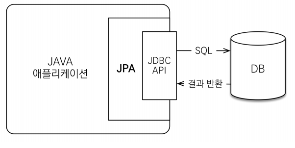

# ORM과 SQL Mapper
<details>
<summary><h3>📑목차</h3></summary>
<div markdown="1">

- [영속성(persistence)](#영속성persistence)
- [데이터베이스에 데이터 저장](#데이터베이스에-데이터-저장)
    - [1️⃣ JDBC](#1️⃣-jdbc)
    - [2️⃣ Persistence Framework](#2️⃣-persistence-framework-orm-sql-mapper)
- [JDBC](#jdbc)
    - [JDBC 사용 순서](#jdbc-사용-순서)
    - [JDBC 코드 예시 (MySQL)](#jdbc-코드-예시-mysql)
- [Persistence Framework](#persistence-framework)
    - [SQL Mapper](#sql-mapper)
    - [ORM](#orm)
- [+ 헷갈리는 용어 정리](#헷갈리는-용어-정리)
    
</div>
</details>
<br>

## 영속성(persistence)
영속성이란 데이터를 생성한 **프로그램이 종료되어도 데이터가 사라지지 않는 특성**을 말한다. 데이터가 영속성을 갖지 않는다면, 데이터는 메모리에서만 존재하기 때문에 프로그램을 종료하면 모두 날아간다. 데이터에게 영속성을 부여하려면 **파일 시스템이나 데이터베이스에 저장**해야 한다.

<p align="center">
    
</p>

<br>

## 데이터베이스에 데이터 저장

### 1️⃣ JDBC
`JDBC`(Java Database Connectivity)란 **JAVA에서 DB에 접근할 수 있도록 제공하는 API**를 말한다. JDBC는 **인터페이스**로 **DBMS의 종류에 상관없이 이용**할 수 있으며 자바에서 모든 데이터 접근의 근간이다. (아래에서 살펴볼 **모든 Persistence Framwork는 JDBC를 사용**)<br>
*순수 JDBC는 꽤나 복잡하고 번거롭다

<p align="center">
    
</p>

<br>

### 2️⃣ Persistence Framework (`ORM`, `SQL Mapper`)
영속성 프레임워크는 **JDBC를 사용하기 위한 복잡하고 번거로운 작업**없이 **간단한 작업**으로 데이터베이스와 연동할 수 있도록 하는 프레임워크를 말한다. 

즉, DB에 데이터를 저장하는 과정을 도와주고 자동화한 소프트웨어이다. 영속성 프레임워크는 **DB와 매핑하는 방식에 따라 `SQL Mapper`와 `ORM`으로 종류**가 나뉜다.

> **💡Persistence Framework 종류** <br>
> **SQL Mapper**: `Mybatis`, `Ibatis`, `JDBC Template`, …
> **ORM**: `JPA`, `Hibernate`, ...

<br>

## JDBC

#### JDBC 사용 순서
우선, 영속성 프레임워크를 살펴보기 전에 **순수 JDBC의 귀찮음**을 확인해보자. JDBC를 사용해 애플리케이션에서 데이터를 DB에 저장하고자 하면 아래와 같은 일련의 과정들이 필요하다. 물론 몇몇 기능들은 클래스화 해서 중복을 최소화할 수 있겠지만 반복 작업을 꽤나 수행해야 하는 불편함이 있다.

- JDBC 드라이버 로드
- 데이터베이스와 연결
- 쿼리 생성
- 결과 처리
- 리소스 반납

<p align="center">
    
</p>

<br>

#### JDBC 코드 예시 (MySQL)
코드로 JDBC를 사용해 **데이터를 조회**하는 기능을 간단히 구현해보았다. 사실 이 코드에는 예외처리가 하나도 되어있지 않지만, JDBC를 사용하려면 예외 처리에 꽤나 힘을 들여야 한다.
``` java
import java.sql.Connection;
import java.sql.DriverManager;
import java.sql.PreparedStatement;
import java.sql.ResultSet;

public class JDBCTest {

	private final String driverName = "com.mysql.cj.jdbc.Driver";  // 드라이버 이름
	private final String url = "jdbc:mysql://localhost:3306/스키마이름?serverTimezone=UTC";
	private final String user = "계정이름";
	private final String pass = "계정비밀번호";


	// 1. JDBC 드라이버 로드
	Class.forName(driverName);

	// 2. 데이터베이스와 연결 (Connection 객체 생성)
	Connection con = DriverManager.getConnection(url, user, pass);

	// 3. 쿼리생성
    	String sql = "SELECT * FROM table";
	Statement st = con.createStatement();   // 쿼리를 사용하기 위한 Statement 객체 생성
	ResultSet rs = st.executeQuery(sql);    // select문(쿼리) 실행
	
        // 4. 결과처리
 	while(rs.next()){
	
		System.out.print( rs.getString( "col1"));
		System.out.print( rs.getString( "col2"));
		System.out.print( rs.getString( "col3"));
		System.out.print( rs.getString( "col4"));
		
	}

	// 5. 리소스 반납(생성한 순서의 역순으로)
	rs.close();
	stmt.close();
	con.close();
}
```

<br>

## Persistence Framework
<p align="center">
    
</p>

### SQL Mapper
**객체**와 관계형 데이터베이스의 **데이터**를 **개발자가 작성한 SQL로 매핑**시켜주는 기술이다. 정확히 말하면 **SQL 쿼리의 수행 결과를 특정 객체에 매핑**해준다. 이 기술은 개발자가 SQL을 직접 작성해야 하기 때문에 SQL에 의존적이며, DBMS마다 SQL이 다르기 때문에 결국 DBMS에 종속적이다.

 <br>

### ORM(Object-Relataion Mapping)
**객체**와 관계형 데이터베이스의 **데이터**를 **자동으로 매핑**시켜주는 기술로 **객체(Java의 클래스)와 DB의 테이블이 매핑**되는 구조이다. CRUD관련 메서드를 사용하면 **자동으로 SQL이 생성**된다. 복잡한 쿼리의 경우 SQL Mapper과 함께 사용 가능하다. 자바에서 ORM 기술에 대한 **인터페이스 표준을 JPA**라고 하고, 이를 구현한 **대표적인 구현체가 Hibernate**이다. DBMS에 의존하지 않아 비즈니스 로직 설계에 더욱 집중할 수 있고 요구사항 변화에 빠른 대처가 가능하다는 장점이 있다.


---

### + 헷갈리는 용어 정리
<p align="center">
    
</p>

#### ORM
🔹객체와 DB의 테이블을 매핑시켜주는 기술 <br>
🔹ORM을 이용하면 SQL 쿼리가 아닌 메서드를 통해 데이터를 조작할 수 있음(높은 생산성)

#### JPA(Java Persistent Api)
🔹자바가 ORM 기술을 채택해 작성한 API 표준 명세<br>
🔹ORM 기술을 사용하기 위한 인터페이스들을 모아놓은 것<br>
🔹인터페이스이기 때문에 구현체 필요<br>
🔹JPA를 구현한 프레임 워크 → `Hibernate`, `EclipseLink`…

#### Hibernate
🔹JPA를 바탕으로 구현한 구현체

#### Spring JDBC
🔹Spring이 제공하는 Persistence Framework 중 하나<br>
🔹기존 JDBC에서 반복적으로 해야 하는 작업들을 대신해주고 간결한 형태의 API 사용법을 제공

#### JDBC Template
🔹Sprintg JDBC의 주요 클래스
