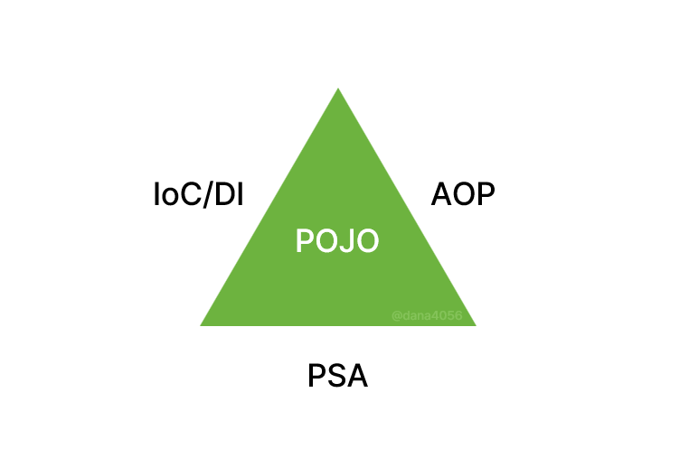
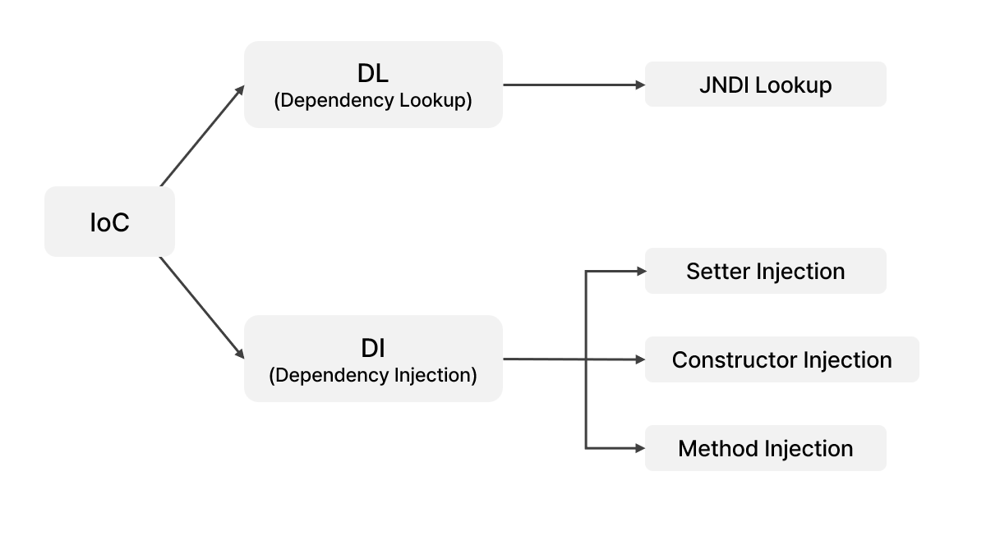
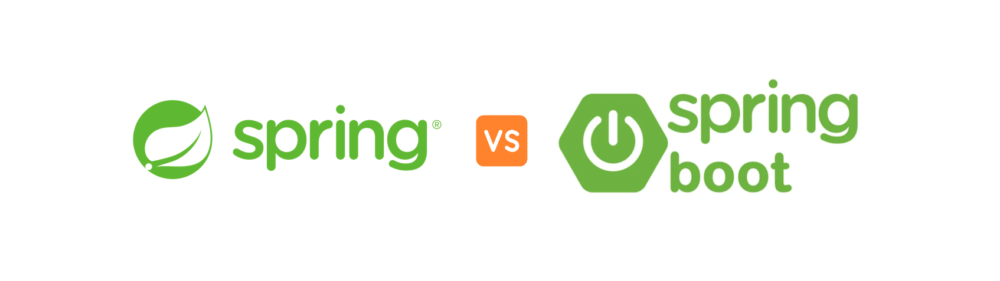

# Spring Framework

<h3>📑목차</h3>

- [Spring Framework](#spring-framework)
- [Spring framework 구조 (Spring 삼각형)](#spring-framework-구조-spring-삼각형)
    - [POJO(Plain Old Java Object)](#pojoplain-old-java-object)
    - [1️⃣ IoC / DI](#1️⃣-ioc--di)
    - [2️⃣ PSA(Portable Service Abstraction)](#2️⃣-psaportable-service-abstraction)
    - [3️⃣ AOP (Aspect Oriented Programming)](#3️⃣-aop-aspect-oriented-programming)
- [Spring vs Spring Boot](#spring-vs-spring-boot)

 

## Spring Framework
`Java` 기반의 오픈 소스 어플리케이션 프레임워크로 **엔터프라이즈급 어플리케이션을 개발하고 관리**하기 위한 다양한 기능과 도구를 제공한다. 언터프라이즈급 개발은 직역하면 기업 환경을 대상으로하는 개발을 뜻하며, **크고 복잡한 요구사항을 충족**시키기 위해 설계, 운영되는 소프트웨어 어플리케이션 개발을 말한다. 

Spring Framework가 등장하기 이전에 웹사이트가 점점 커지면서 엔터프라이즈급 서비스가 필요하게 되었고, `EJB`(Enterprise JavaBean) 개발환경이 각광받으며 어플리케이션을 쉽게 작성할 수 있게 되었다. 하지만 `EJB` 환경은 **복잡한 스펙**을 요구하기 때문에 진입장벽이 높고 **반드시 EJB 서버가 필요**했으며 컨테이너에 배포해야 했기 때문에 **개발 효율성이 저하**되는 등의 단점을 가지고 있었다. 

이런 배경으로 인해 EJB를 사용하지 않으면서 엔터프라이즈급 개발이 가능한 방법론이 요구되었고, **POJO**를 기반으로한 **경량 프레임워크**인 **Spring Framework가 등장**했다.

- 대규모 어플리케이션을 만들기 위한 모든 기능 종합적으로 제공하는 경량화된 솔루션
- JEE가 제공하는 다수 기능 지원
- DI, AOP와 같은 기능 지원
- 개발자가 복잡하고 실수하기 쉬운 low 레벨에 신경쓰지 X
- 비즈니스 로직 개발에 전념할 수 있도록 도와줌

 

## Spring framework 구조 (Spring 삼각형)
스프링은 `POJO`를 기반으로 3개의 핵심 개념(`IoC/DI`, `AOP`, `PSA`)들로 표현할 수 있다. 

    

 

### POJO(Plain Old Java Object)
**특정 프레임워크나 라이브러리에 종속적이지 않은** 객체지향 원리에 충실한 **순수한 자바 클래스로 작성된 객체**를 의미한다. Spring Framework는 POJO에 어플리케이션의 핵심 로직과 기능을 담아 설계하고 개발한다. 이를 POJO 프로그래밍이라고 하는데, Spring Framework는 **POJO 프로그래밍을 위해 `IoC/DI`, `AOP`, `PSA`를 통해 지원**한다.

스프링 이전에 EJB 환경에서 사용되던 객체는 라이브러리나 기술에 굉장히 종속적이었기 때문에 어플리케이션 요구사항 변경 시 특정 기술 사용된 부분 모두 수정해야하는 복잡함이 있었다. 따라서 EJB와 같은 특정 기술에 종속적이지 않은 POJO 프로그래밍을 지향하는 Spring Framework가 등장했다. 

#### POJO가 아닌 객체 예시
- `HttpServlet을` 상속받은 객체 (`extends HttpServlet`)
- `EntityBean`을 구현한 객체 (`implements EntityBean`)
- *굉장히 단편적인 예시이지만, 이와 같이 특정 라이브러리에 의존적인 객체는 POJO가 될 수 없음

 

#### POJO 프로그래밍 필요성
- 특정 환경, 기술에 종속적이지 않아 **재사용**이 가능하며 **확장성이 유연**함
- 저수준 레벨의 기술 및 환경에 종속적인 코드 제거로 인한 **코드 간결성** 
- **테스트하기 용이**
- **객체 지향 설계**를 자유롭게 적용할 수 있음

 

### 1️⃣ IoC / DI

    

#### 제어의 역전 (Inversion of Control)
어플리케이션 개발에서 **객체의 생명주기와 의존성 관리**를 개발자가 아닌 **스프링에게 위임**하는 개념이다. 이전에는 개발자가 직접 객체를 생성하고 관리했지만, Spring에서는 **`IoC 컨테이너`(`스프링 컨테이너`)가 객체를 생성하고 필요한 의존성을 주입**해준다. 유연하게 확장 가능한 객체를 만들어 두고 객체 간의 의존관계는 외부에서 동적으로 설정해주는 것이다. 이로 인해 코드의 **결합도가 낮아**지며(loose coupling) **유지 보수가 용이**해진다. 

**IoC**의 구체적인 구현 방법으로 `DL`(Dependency Lookup)과 `DI`(Dependency Injection)가 존재하며 `DI`가 주로 사용된다. 

 

#### 의존성 주입 (Dependency Injection)
IoC의 구체적인 구현 방법 중 하나로, 객체가 필요로 하는 의존성을 직접 생성하는 대신 외부(스프링 컨테이너)에서 주입받는 것을 의미한다. 의존성은 런타임 시점에 결정되며, 객체가 컨테이너의 존재 여부를 알 필요가 없다. `Setter Injection`, `Constructor Injection`, `Method Injection` 방식으로 구현할 수 있으며 Spring은 생성자 주입(Constructor Injection)방식을 권장한다.

 

### 2️⃣ PSA(Portable Service Abstraction)
#### 이식 가능한 서비스의 추상화
환경과 세부기술의 변경에 관계없이 **일관된 방식으로 기술에 접근**할 수 있게 해주는 설계 원칙(추상화 구조)를 말한다. 즉, 어플리케이션 개발을 위한 다양한 기능과 기술을 추상화 및 표준화하여 개발자에게 편리한 프로그래밍 모델을 제공하는 개념이다. 

스프링에서 동작할 수 있는 라이브러리들은 **POJO 원칙**을 철저히 따라 PSA 형태의 추상화가 되어있음을 의미한다. PSA가 적용된 코드라면 로직의 수정 없이 **간편하게 다른 기술로 전환**할 수 있어 기술에 종속적이지 않고 확장성이 좋다. 

PSA를 통해 트랜잭션 추상화, OXM 추상화, 데이터 액세스의 Exception 변환 기능 등의 기술적인 복잡함은 추상화를 통해 low level의 **기술 구현 부분**과 **기술을 사용**하는 인터페이스로 분리할 수 있다.

 

### 3️⃣ AOP (Aspect Oriented Programming)

#### 관점 지향 프로그래밍

**관심사의 분리**를 통해 소프트웨어의 모듈성을 향상시키는 방법이다. 어플리케이션의 핵심 로직과 관계 없는 **부가적인 관심사(공통 관심)를 분리하고 모듈화**하는 프로그래밍 기법으로 코드의 **재사용성**을 높이고 **유지보수성**을 개선할 수 있다. 

`DI`가 '의존성에 대한 주입'이라면, `AOP`는 '로직 주입' 이라고 할 수 있다.

> **공통 관심**  
> :여러 부분에서 공통적으로 사용할 수 있는 것
> ex) 로깅, 트랜잭션 관리, 보안 등
>
> **핵심 관심**  
> :비즈니스 로직 자체 

 

## Spring vs Spring Boot

    

spring Boot는 **스프링 프레임워크의 서브 프로젝트**라고 이해하면 쉽다. 스프링 프레임워크가 어플리케이션 개발을 위한 매우 다양한 기능을 제공하는데, 이를 사용하기 위해서 **개발자는 직접 설정 파일을 작성**하여 스프링 컨테이너를 구성하고, 필요한 빈 객체 등록, 호환되는 버전을 명시하는 등 복잡한 과정이 필요하다. 

이런 **복잡한 설정 과정을 생략**하여 스프링 **프레임워크를 보다 쉽게 사용**할 수 있도로 만들어진 프레임워크가 `Spring Boot`이다. 

`spring-boot-starter`라는 의존성을 제공하여, 각 라이브러리의 기능과 관련해 서로 호환되는 버전의 모듈 조합을 제공한다. 즉, 개발자가 직접 모든 관련 라이브러리들과 버전까지 관리할 필요가 없다. 예를 들어 `spring-boot-starter-web` 라이브러리를 사용하면 자동으로 톰캣관련, JSON 관련 등 필요한 다른 라이브러리들의 조합을 제공하고 버전까지 호환되도록 관리해준다.

스프링 프레임워크의 기능을 사용하기 위한 자동 설정(Auto configuration)을 지원한다. 자동설정은 어플리케이션에 추가된 라이브러리를 실행하는 데 필요한 환경설정을 알아서 찾아준다. 즉, 개발하는데 필요한 의존성을 추가하면 프레임워크가 이를 자동으로 관리해준다. 메인 코드에 존재하는 @SpringBootApplication 어노테이션 안에 있는 여러 어노테이션들에 의해 구현된다.

- `@ComponentScan`: @Component 시리즈 어노테이션이 붙은 클래스 발견해 빈으로 등록
- `@EnableAutoConfiguration`: `spring-boot-autoconfigure`패키지 안에 spring.factories 파일 ㅊ추가 (다양한 자동 설정 적용)

스프링 부트는 내장 톰캣 서버(WAS)를 제공하고, 스프링 부트의 자동 설정 기능이 톰캣에도 적용되어 특별한 설정 없이 서버를 사용할 수 있다. 또한 시스템의 스레드, 메모리, 세션 등의 요소들을 모니터링하는 스프링 부트 액추에이터라는 자체 모니터링 도구도 제공해준다.

따라서 더욱 **세밀한 제어**가 필요한 경우 `Spring`을, **빠르고 간단한 개발**이 필요한 경우엔 `Spring Boot`를 사용한다.

#### [Spring Boot]
- 의존성 관리 (spring-boot-starter-*)
- 자동 설정 (@SpringBootApplication)
- 내장 WAS (tomcat)
- 모니터링 (Spring Boot Actuator)
