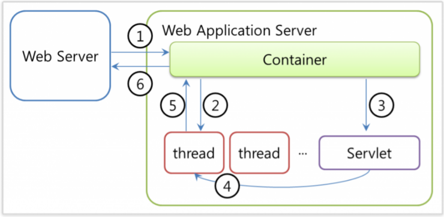

# WS와 WAS

<h3>📑목차</h3>

- [IoC](#ioc)

 

## 정적 페이지와 동적 페이지

    
     
    <small><a href="https://github.com/gyoogle/tech-interview-for-developer/blob/master/Web/Web%20Server%EC%99%80%20WAS%EC%9D%98%20%EC%B0%A8%EC%9D%B4.md">출처</a>
    </small>

### 정적 페이지 (Static Pages)
서버에 미리 저장되어 있는 파일(`HTML`, `이미지`, `Javascript 파일` 등)을 그대로 클라이언트에게 전달되는 웹 페이지를 말한다. 전달된 파일의 내용은 고정되어 있으며 요청 URL의 구조는 파일이 서버에 저장되어 있는 경로의 URL을 사용한다.

### 동적 페이지 (Dynamic Pages)
서버에 있는 데이터들을 가공처리한 후 생성되어 전달되는 웹 페이지를 말한다. 동적 페이지는 요청에 따라 서버에서 페이지의 내용을 생성하기 때문에 사용자 맞춤으로 컨텐츠를 생성할 수 있으며, 사용자의 입력에 따라 상호작용할 수 있다. 

 

## WS (Web Server)
웹 브라우저(클라이언트)로부터 HTTP 요청을 받아 **정적인 컨텐츠**(HTML, CSS, 이미지 등)를 제공하는 서버를 말한다. 따라서 동적 컨텐츠를 처리하기 위해선 WAS의 도움이 필요한다. 

**정적인 컨텐츠로만 처리 가능한 요청**은 WAS까지 요청을 넘기지 않고 **WS에서 바로 처리**한다. 

- HTTP 통신을 기반으로 웹 브라우저의 요청을 서비스
- 정적 컨텐츠 제공 
    - WS에서 바로 자원 제공
- 동적 컨텐츠 제공
    - 클라이언트의 요청을 WAS로 보냄
    - WAS의 처리 결과 클라이언트에게 전달 
- ex) `Apache Server`, `NginX` 등

 

## WAS (Web Application Server)
DB 조회 및 다양한 로직 처리가 요구되는 **동적인 컨텐츠를 제공하는 서버**를 말한다.

보통 웹 서버 기능을 내제하고 있어, WAS가 동적인 컨텐츠를 처리한다고 표현하는 일은 **WAS에 있는 웹 컨테이너가 수행**하는 것이어서 `WAS`를 `웹 컨테이너` 혹은 `서블릿 컨테이너`라고도 한다.

    
     
    <small><a href="https://github.com/gyoogle/tech-interview-for-developer/blob/master/Web/Web%20Server%EC%99%80%20WAS%EC%9D%98%20%EC%B0%A8%EC%9D%B4.md">출처</a>
    </small>

    
     
    <small><a href="💡https://makemethink.tistory.com/169">출처</a>
    </small>

- WAS = WS + 웹 컨테이너
- 비즈니스 로직 수행
- 여러 트랜잭션 관리
- 어플리케이션 실행 환경 및 DB 접속 기능 제공
- ex) Apache Tomcat, Java EE, JBoss 등

> **💡웹 컨테이너(서블릿 컨테이너)**  
> JSP, Servlet과 같은 서버 측 컴포넌트를 실행할 수 있는 소프트웨어를 말한다.

 

### 웹 컨테이너 동작 과정

    
     
    <small><a href="https://blog.naver.com/software705/220742912863">출처</a>
    </small>

1. 웹 서버 요청 전달 받음
2. web.xml 참고해 해당 서블릿의 쓰레드와 `httpServletRequest`, `httpServletResponse` 객체 생성
3. 해당 서블릿 호출
4. 2번에서 생성된 서블릿 쓰레드가 `doPost()`, `doGet()` 호출
5. 호출된 `doPost()`, `doGet()`메서드는 생성된 동적 페이지를 Response 객체에 담아 컨테이너에 전달 
6. 전달받은 Response를 HTTP Response 형태로 바꿔 웹 서버에 전달
7. 쓰레드 종료하고 2번에서 생성한 객체 소멸

 

## Servlet과 JSP
웹 클라이언트에 대한 요청에 동적으로 처리할 수 있는 기술을 말하며 기능에 대한 차이는 없고 역할의 차이만 존재한다. (하는 일 동일)

### Servlet
웹 기반 요청에 대한 동적인 처리가 가능한 하나의 자바 클래스를 말한다. Server Side에서 돌아가는 **Java 프로그램**이다. 

- 동적 처리가 가능한 Server Side에서 돌아가는 Java 프로그램
- **`Java` 코드 안에 `HTML` 코드 존재 (하나의 자바 클래스)**
- **data processing(`Controller`)**에 좋음
    - DB와 통신, 비즈니스 로직 호출, 데이터 읽고 확인하는 작업 등에 유용
- 서블릿 수정된 경우 Java 코드 컴파일 후 동적 페이지 처리하기 때문에 전체 코드 업데이트 후 다시 컴파일 및 재배포 필요

### JSP
웹 기반 요청에 대한 동적인 처리가 가능한 자바 언어 기반의 Server Side **스크립트 언어**를 말한다. Servlet을 보안한 스크립트 방식의 표준이며 Servlet의 모든 기능을 제공하며 추가적인 기능 또한 제공한다. 내부적으로 JSP 파일은 Servlet으로 자동으로 변환된다. 

- 동적 처리가 가능한 Server Side에서 돌아가는 Java 언어 기반 스크립트 언어
- **`HTML` 코드 안에 `Java` 코드가 존재**
- Servlet 기술을 보완하고 확장한 스크립트 방식
- Servlet의 모든 기능 + 추가적인 기능
- **presentation(`View`)**에 좋음
- JSP가 수정된 경우 재배포 필요 없이 WAS가 알아서 처리